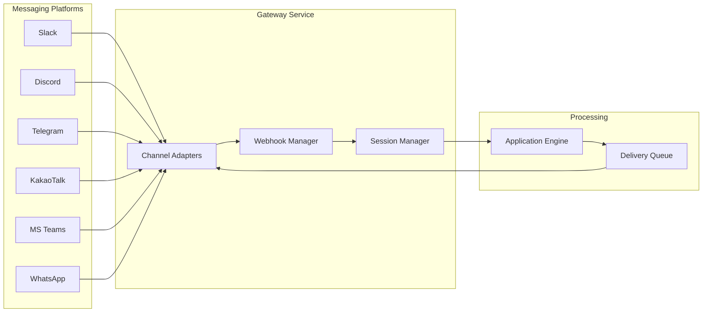

## Overview

The **Channel Application** connects your AI agents to external messaging platforms. Instead of users interacting through the Nadoo web interface, they communicate with your agent directly inside Slack, Discord, Telegram, KakaoTalk, Microsoft Teams, or WhatsApp. The Channel App handles platform-specific protocols, message formatting, and bidirectional communication -- so your agent logic remains the same regardless of the delivery channel.

## Architecture

The channel system uses an **adapter pattern** with four key components that work together to process incoming messages and deliver responses.

### Message Flow

1. **Incoming webhook** -- A user sends a message on a messaging platform. The platform delivers a webhook payload to the Nadoo gateway.
2. **Adapter normalization** -- The channel adapter converts the platform-specific message format into a standard internal format.
3. **Session mapping** -- The session manager maps the platform user and channel to a Nadoo AI conversation session.
4. **Application processing** -- The message is routed to the configured Chat or Workflow application for processing.
5. **Response formatting** -- The application's response is converted back into the platform's native format (Slack blocks, Discord embeds, Telegram HTML, etc.).
6. **Delivery queue** -- The formatted response is queued for delivery with rate limiting, retry logic, and error handling.

## Supported Channels

<CardGroup cols={3}>
  <Card title="Slack" icon="slack">
    OAuth 2.0 authentication with event subscriptions, thread replies, and interactive components.
  </Card>
  <Card title="Discord" icon="discord">
    Bot token authentication with slash commands, rich embeds, and reaction handling.
  </Card>
  <Card title="Telegram" icon="paper-plane">
    BotFather-based setup with automatic webhook registration and inline keyboards.
  </Card>
  <Card title="KakaoTalk" icon="comment">
    Skill-based integration for the Korean messaging platform with carousel cards and quick replies.
  </Card>
  <Card title="Microsoft Teams" icon="microsoft">
    Azure AD app registration with adaptive cards and messaging extensions.
  </Card>
  <Card title="WhatsApp" icon="whatsapp">
    Meta Business API with template messages, media support, and read receipts.
  </Card>
</CardGroup>

## Creating a Channel App

<Steps>
  <Step title="Create the Application">
    From the workspace dashboard, click **New Application** and select **Channel** as the type.
  </Step>
  <Step title="Select the Channel Type">
    Choose the messaging platform you want to connect to (e.g., Slack, Telegram).
  </Step>
  <Step title="Provide Platform Credentials">
    Enter the required credentials for your chosen platform:

    | Platform | Required Credentials |
    |----------|---------------------|
    | Slack | Bot Token, Signing Secret |
    | Discord | Bot Token |
    | Telegram | Bot Token (from BotFather) |
    | KakaoTalk | API Key, Skill URL |
    | Microsoft Teams | App ID, Client Secret, Tenant ID |
    | WhatsApp | Access Token, Phone Number ID |
  </Step>
  <Step title="Map to an Application">
    Select the Chat App or Workflow App that will process messages from this channel. The channel inherits all of the application's capabilities -- model configuration, knowledge bases, tools, and workflows.
  </Step>
  <Step title="Configure Webhook">
    Nadoo generates a unique webhook URL for your channel. Copy this URL and configure it in your messaging platform's settings.
  </Step>
  <Step title="Test the Connection">
    Send a test message on the messaging platform. Verify that the agent responds correctly in the channel.
  </Step>
</Steps>

## Channel Configuration

Each channel has platform-specific settings in addition to the standard application configuration.

### General Settings

| Setting | Description |
|---------|-------------|
| **Channel Type** | The messaging platform (Slack, Discord, Telegram, etc.) |
| **Application** | The Chat or Workflow App that processes messages |
| **Webhook URL** | The auto-generated URL that receives incoming webhooks |
| **Active** | Toggle to enable or disable the channel |

### Platform-Specific Settings

<Tabs>
  <Tab title="Slack">
    | Setting | Description |
    |---------|-------------|
    | **Bot Token** | OAuth token starting with `xoxb-` |
    | **Signing Secret** | Used to verify incoming webhook signatures |
    | **App ID** | Your Slack app's unique identifier |
    | **Respond in Thread** | Whether to reply in threads or the main channel |
    | **Allowed Channels** | Restrict the bot to specific channels (optional) |
  </Tab>
  <Tab title="Discord">
    | Setting | Description |
    |---------|-------------|
    | **Bot Token** | Discord bot authentication token |
    | **Application ID** | Your Discord application ID |
    | **Guild IDs** | Restrict to specific servers (optional) |
    | **Respond to DMs** | Whether to respond to direct messages |
  </Tab>
  <Tab title="Telegram">
    | Setting | Description |
    |---------|-------------|
    | **Bot Token** | Token from BotFather |
    | **Allowed Users** | Restrict to specific user IDs (optional) |
    | **Group Mode** | How the bot responds in group chats (mention-only or all messages) |
  </Tab>
  <Tab title="KakaoTalk">
    | Setting | Description |
    |---------|-------------|
    | **API Key** | KakaoTalk channel API key |
    | **Skill URL** | The callback URL registered in Kakao i Open Builder |
    | **Response Format** | Text, carousel, or custom JSON |
  </Tab>
  <Tab title="MS Teams">
    | Setting | Description |
    |---------|-------------|
    | **App ID** | Azure AD application ID |
    | **Client Secret** | Azure AD client secret |
    | **Tenant ID** | Azure AD tenant identifier |
    | **Messaging Endpoint** | The bot messaging endpoint URL |
  </Tab>
  <Tab title="WhatsApp">
    | Setting | Description |
    |---------|-------------|
    | **Access Token** | Meta Business permanent access token |
    | **Phone Number ID** | WhatsApp Business phone number identifier |
    | **Verify Token** | Webhook verification token |
    | **Business Account ID** | Meta Business account identifier |
  </Tab>
</Tabs>

## Session Management

The channel system automatically manages conversation sessions across platforms.

- **Session mapping** -- Each unique combination of platform user and channel/group maps to a persistent Nadoo AI session
- **Conversation continuity** -- Message history is maintained across interactions, enabling the agent to reference earlier context
- **Session timeout** -- Sessions can be configured to reset after a period of inactivity
- **Manual reset** -- Users can reset their session using a platform-specific command (e.g., `/reset` in Slack)

## Resilience Features

The delivery queue ensures reliable message delivery with production-grade resilience:

| Feature | Description |
|---------|-------------|
| **Rate Limiting** | Per-channel rate limiters that respect each platform's API quotas |
| **Circuit Breaker** | Stops sending to a failing platform after an error threshold, with automatic recovery |
| **Retry Logic** | Exponential backoff with jitter for transient failures (default: 3 retries) |
| **Dead Letter Queue** | Messages that fail after all retries are stored for inspection and replay |

## Monitoring

The Channel App dashboard provides visibility into message flow and delivery:

- **Message volume** -- Incoming and outgoing message counts per channel
- **Response time** -- Average time from message receipt to response delivery
- **Delivery status** -- Success, retry, and failure counts
- **Active sessions** -- Number of active conversation sessions per channel
- **Error log** -- Detailed error messages for failed deliveries

## Next Steps

<CardGroup cols={2}>
  <Card title="Messaging Channels" icon="comments" href="/channels/overview">
    Platform-specific setup guides and architecture details
  </Card>
  <Card title="Chat App" icon="comments" href="/applications/chat-app">
    Build the Chat App that powers your channel agent
  </Card>
  <Card title="Workflow App" icon="diagram-project" href="/applications/workflow-app">
    Build complex workflows to drive your channel interactions
  </Card>
  <Card title="Scheduling" icon="clock" href="/applications/scheduling">
    Automate workflow execution on a schedule
  </Card>
</CardGroup>
