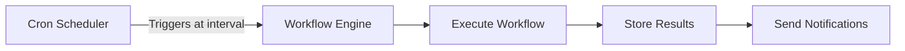

## Overview

**Scheduling** lets you run Workflow Applications automatically on a recurring basis using cron expressions. Instead of triggering workflows manually or waiting for user input, scheduled workflows execute at defined intervals -- producing reports, syncing data, sending alerts, or performing any automated task your workflow defines.

## How Scheduling Works



1. **Define a schedule** -- Attach a cron expression to a Workflow App
2. **Automatic trigger** -- The scheduler fires at the specified interval
3. **Workflow execution** -- The workflow runs with predefined input variables
4. **Results storage** -- Execution results, logs, and outputs are stored for review
5. **Optional notification** -- Configure notifications for success, failure, or both

## Creating a Schedule

<Steps>
  <Step title="Open the Workflow App">
    Navigate to the Workflow App you want to schedule from your workspace dashboard.
  </Step>
  <Step title="Go to Scheduling">
    Click the **Schedule** tab in the application settings.
  </Step>
  <Step title="Add a Schedule">
    Click **New Schedule** and configure the following:

    | Field | Required | Description |
    |-------|----------|-------------|
    | **Name** | Yes | A descriptive name for the schedule (e.g., "Daily Sales Report") |
    | **Cron Expression** | Yes | Standard cron expression defining the execution interval |
    | **Timezone** | Yes | The timezone for schedule evaluation (e.g., `Asia/Seoul`, `UTC`) |
    | **Input Variables** | No | Predefined inputs passed to the workflow at each execution |
    | **Enabled** | Yes | Toggle to activate or deactivate the schedule |
  </Step>
  <Step title="Save and Activate">
    Click **Save**. The schedule begins executing at the next matching interval.
  </Step>
</Steps>

## Cron Expression Reference

Cron expressions define when the schedule fires. Nadoo AI uses the standard 5-field cron format.

```
┌───────────── minute (0-59)
│ ┌───────────── hour (0-23)
│ │ ┌───────────── day of month (1-31)
│ │ │ ┌───────────── month (1-12)
│ │ │ │ ┌───────────── day of week (0-6, Sunday=0)
│ │ │ │ │
* * * * *
```

### Common Examples

| Expression | Description |
|-----------|-------------|
| `0 9 * * *` | Every day at 9:00 AM |
| `0 9 * * 1-5` | Weekdays at 9:00 AM |
| `*/30 * * * *` | Every 30 minutes |
| `0 */6 * * *` | Every 6 hours |
| `0 0 1 * *` | First day of each month at midnight |
| `0 8 * * 1` | Every Monday at 8:00 AM |
| `0 0 * * 0` | Every Sunday at midnight |
| `0 9,18 * * 1-5` | Weekdays at 9:00 AM and 6:00 PM |

### Cron Builder UI

For users who are not familiar with cron syntax, Nadoo AI provides a visual **Cron Builder** that lets you construct expressions through a point-and-click interface.

The Cron Builder supports:

- **Preset intervals** -- Every minute, hourly, daily, weekly, monthly
- **Custom time selection** -- Pick specific hours, minutes, and days
- **Preview** -- Shows the next 5 scheduled execution times before saving
- **Validation** -- Warns about expressions that would execute too frequently

<Tip>
  Use the Cron Builder for quick setup, then switch to the raw expression editor for advanced patterns like "every other Tuesday" or "first and third Monday of each month."
</Tip>

## Input Variables

Each scheduled execution can receive predefined input variables that the workflow uses during processing. These replace the user input that would normally come from a chat message or API call.

```json
{
  "report_type": "weekly_summary",
  "date_range": "last_7_days",
  "recipients": ["team@example.com"],
  "format": "pdf"
}
```

Variables are defined in the schedule configuration and remain constant across executions. For dynamic values (e.g., current date), use the workflow's built-in variable functions.

## Execution History

Every scheduled execution is recorded in the execution history with full details.

### History View

| Field | Description |
|-------|-------------|
| **Execution ID** | Unique identifier for the run |
| **Status** | `success`, `failed`, `running`, or `cancelled` |
| **Started At** | Timestamp when execution began |
| **Duration** | Total execution time |
| **Trigger** | `scheduled` (cron) or `manual` |
| **Output** | The workflow's final output |
| **Logs** | Node-by-node execution log with intermediate results |

### Viewing Execution Details

Click any execution in the history to see:

- **Node execution timeline** -- Visual representation of which nodes ran and in what order
- **Input/output per node** -- What each node received and produced
- **Token usage** -- LLM tokens consumed during the run
- **Error details** -- Full error message and stack trace for failed runs

## Monitoring and Alerts

### Health Dashboard

The scheduling dashboard shows:

- **Upcoming executions** -- Next scheduled runs across all workflows
- **Recent history** -- Latest executions with status indicators
- **Success rate** -- Percentage of successful runs over time
- **Average duration** -- Trend of execution times

### Failure Notifications

Configure notifications to be alerted when a scheduled execution fails:

| Channel | Description |
|---------|-------------|
| **Email** | Send failure alerts to specified email addresses |
| **Slack** | Post failure alerts to a Slack channel |
| **Webhook** | Send a POST request to a custom webhook URL |

<Warning>
  Failed scheduled executions are not automatically retried. Review the execution logs, fix the issue, and either wait for the next scheduled run or trigger a manual execution.
</Warning>

## Use Cases

<AccordionGroup>
  <Accordion title="Periodic Reports" icon="file-lines">
    Schedule a workflow that queries your database, generates an AI-powered summary, and emails it to stakeholders every morning.

    **Example:** `0 8 * * 1-5` -- Generate and send a daily business metrics report at 8:00 AM on weekdays.
  </Accordion>
  <Accordion title="Data Synchronization" icon="arrows-rotate">
    Schedule a workflow that pulls data from external APIs, processes it with AI, and updates your knowledge base.

    **Example:** `0 */4 * * *` -- Sync product catalog from an external system every 4 hours.
  </Accordion>
  <Accordion title="Automated Alerts" icon="bell">
    Schedule a workflow that monitors metrics, detects anomalies using AI, and sends alerts to your team.

    **Example:** `*/15 * * * *` -- Check system metrics every 15 minutes and alert on anomalies.
  </Accordion>
  <Accordion title="Content Generation" icon="pen">
    Schedule a workflow that generates content drafts, social media posts, or newsletter summaries on a recurring basis.

    **Example:** `0 9 * * 1` -- Generate a weekly content calendar every Monday at 9:00 AM.
  </Accordion>
  <Accordion title="Compliance Checks" icon="clipboard-check">
    Schedule a workflow that audits data, documents, or processes against compliance rules and generates reports.

    **Example:** `0 0 1 * *` -- Run a monthly compliance audit on the first of each month.
  </Accordion>
</AccordionGroup>

## Managing Schedules via API

```bash
# List all schedules for a workflow
GET /api/v1/applications/{app_id}/schedules

# Create a new schedule
POST /api/v1/applications/{app_id}/schedules
{
  "name": "Daily Report",
  "cron_expression": "0 9 * * *",
  "timezone": "Asia/Seoul",
  "input_variables": {"report_type": "daily"},
  "enabled": true
}

# Update a schedule
PUT /api/v1/applications/{app_id}/schedules/{schedule_id}

# Delete a schedule
DELETE /api/v1/applications/{app_id}/schedules/{schedule_id}

# Trigger a manual execution
POST /api/v1/applications/{app_id}/schedules/{schedule_id}/trigger
```

## Next Steps

<CardGroup cols={2}>
  <Card title="Workflow App" icon="diagram-project" href="/applications/workflow-app">
    Build the workflows that power your scheduled processes
  </Card>
  <Card title="Channel App" icon="share-nodes" href="/applications/channel-app">
    Deploy agents to messaging platforms
  </Card>
  <Card title="Real-time Streaming" icon="bolt" href="/chat/streaming">
    Monitor workflow execution with SSE events
  </Card>
  <Card title="Self-Hosting" icon="server" href="/self-hosting/overview">
    Deploy the scheduler infrastructure
  </Card>
</CardGroup>
