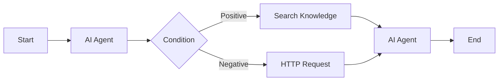

## Overview

The **Workflow Application** is the most powerful application type in Nadoo AI. Instead of a single LLM conversation, a Workflow App uses a **visual node graph** to define complex, multi-step execution flows. Nodes represent individual operations -- AI model calls, conditional branches, loops, knowledge base queries, HTTP requests, code execution -- and edges define the data flow between them.

Workflow Apps are ideal for:

- Multi-step AI agent pipelines with branching logic
- Data processing and transformation workflows
- Orchestrated multi-agent systems
- Automated business processes with AI decision-making

## How It Works

A workflow is a **directed graph** built in the visual editor. Execution begins at a **Start Node**, flows through connected nodes, and terminates when all paths reach an **End Node** or an unconnected output.



Each node processes its input, executes its operation, and passes the result to the next node(s) via edges. Variables flow through the graph, accumulating context as execution progresses.

## Node Types

Nadoo AI provides **18+ built-in node types** organized by category.

### Core Nodes

| Node | Description |
|------|-------------|
| **Start** | Entry point of every workflow. Receives user input and initial variables. |
| **End** | Terminal node that returns the final output to the user. |
| **AI Agent** | Calls an AI model with configurable system prompt, tools, and agent strategy. |
| **LLM** | Direct LLM call without agent capabilities -- simpler and faster for basic generation. |

### Logic Nodes

| Node | Description |
|------|-------------|
| **Condition** | Branches execution based on a boolean expression or comparison. |
| **Loop** | Iterates over a list, executing child nodes for each item. |
| **Switch** | Routes execution to one of multiple paths based on a value match. |
| **Merge** | Combines outputs from parallel branches into a single output. |

### Data Nodes

| Node | Description |
|------|-------------|
| **Search Knowledge** | Queries a knowledge base using vector, keyword, or hybrid search. |
| **HTTP Request** | Makes HTTP calls to external APIs with configurable method, headers, and body. |
| **Code Executor** | Runs custom Python or JavaScript code with access to workflow variables. |
| **Variable Setter** | Sets or updates a workflow variable. |
| **Template** | Renders a text template with variable interpolation using Jinja2 syntax. |

### Integration Nodes

| Node | Description |
|------|-------------|
| **Tool Call** | Invokes a registered plugin or tool. |
| **Webhook Trigger** | Starts a workflow from an incoming webhook request. |
| **Email** | Sends an email with a configurable template. |
| **Notification** | Sends a notification to a configured channel (Slack, Discord, etc.). |

### Advanced Nodes

| Node | Description |
|------|-------------|
| **Sub-Workflow** | Embeds and executes another workflow as a nested operation. |
| **Human Review** | Pauses execution and waits for human approval before continuing. |
| **Parallel** | Executes multiple branches simultaneously and waits for all to complete. |

## Building a Workflow

<Steps>
  <Step title="Create a Workflow App">
    From the workspace dashboard, click **New Application** and select **Workflow** as the type.
  </Step>
  <Step title="Open the Visual Editor">
    The workflow editor opens with a **Start Node** already placed on the canvas.
  </Step>
  <Step title="Add Nodes">
    Drag nodes from the node palette onto the canvas. Connect them by dragging from an output port to an input port.
  </Step>
  <Step title="Configure Each Node">
    Click a node to open its configuration panel. Set the model, prompt, condition expression, or other parameters specific to the node type.
  </Step>
  <Step title="Define Variables">
    Use the Variables panel to define workflow-level variables that nodes can read and write.
  </Step>
  <Step title="Test and Debug">
    Click **Run** to execute the workflow with test input. The visual editor highlights the active node and shows real-time output at each step.
  </Step>
</Steps>

## AI Agent Node

The **AI Agent** node is the most commonly used node. It wraps an LLM with an agent strategy that determines how the model reasons and uses tools.

### Agent Strategies

| Strategy | Description |
|----------|-------------|
| **Standard** | Single LLM call with optional tool use. Fastest execution. |
| **Chain of Thought (CoT)** | Model reasons step-by-step before producing a final answer. |
| **ReAct** | Interleaves reasoning and action -- the model thinks, acts (calls a tool), observes the result, and repeats. |
| **Function Calling** | Model selects and invokes tools using structured function call syntax. |
| **Reflection** | Model generates an initial response, critiques it, and refines it. |
| **Tree of Thoughts** | Explores multiple reasoning paths in parallel and selects the best outcome. |

<Info>
  **ReAct** and **Function Calling** are the most versatile strategies for workflows that involve tool use. Use **Chain of Thought** when you need transparent, step-by-step reasoning without tools.
</Info>

## Execution and Streaming

When a Workflow App executes, Nadoo AI streams progress events in real time via **Server-Sent Events (SSE)**. This allows the frontend to display which node is running, show intermediate results, and render the final output as it is generated.

### Workflow-Level Events

| Event | Description |
|-------|-------------|
| `workflow_start` | Workflow execution has begun |
| `workflow_end` | Workflow execution completed successfully |
| `workflow_error` | Workflow execution failed with an error |

### Node-Level Events

| Event | Description |
|-------|-------------|
| `node_start` | A specific node has started executing |
| `node_end` | A specific node has finished executing |
| `node_error` | A specific node encountered an error |

### Agent-Level Events

| Event | Description |
|-------|-------------|
| `agent_iteration` | An agent reasoning iteration has occurred |
| `agent_tool_call` | The agent is invoking a tool |
| `agent_tool_result` | A tool has returned a result |
| `agent_thinking` | The agent is in a thinking/reasoning phase |
| `cot_step` | A chain-of-thought reasoning step |

See [Real-time Streaming](/chat/streaming) for the full event reference with example payloads.

## Running a Workflow

### Via the Chat Interface

Workflow Apps can be used through the same chat interface as Chat Apps. The user sends a message, the workflow executes, and the final output is streamed back. Intermediate steps (node execution, tool calls, reasoning) can be displayed in an expandable execution monitor.

### Via the API

```bash
POST /api/v1/workflow/execute
{
  "application_id": "app-uuid",
  "inputs": {
    "query": "Summarize last quarter's sales report"
  },
  "stream": true
}
```

The response is an SSE stream with workflow, node, and agent events.

### Via Scheduling

Automate workflow execution on a schedule using cron expressions. See [Scheduling](/applications/scheduling) for details.

## Versioning and Publishing

Workflows support **versioning** to manage changes safely.

| Concept | Description |
|---------|-------------|
| **Draft** | The working version visible in the editor. Changes are saved automatically. |
| **Published** | The live version that serves user requests. Immutable once published. |
| **Version History** | A log of all published versions with timestamps and change descriptions. |

### Publishing a Workflow

1. Click **Publish** in the workflow editor toolbar
2. Enter a version description (e.g., "Added fallback handling for API errors")
3. The current draft becomes the new published version
4. Previous published versions remain in the version history for rollback

<Warning>
  Publishing replaces the live version immediately. Test thoroughly in the editor before publishing. You can roll back to any previous version from the version history.
</Warning>

## Best Practices

<AccordionGroup>
  <Accordion title="Start simple, then expand" icon="seedling">
    Begin with a linear flow: Start -> AI Agent -> End. Add branching, loops, and tools incrementally as you validate each step.
  </Accordion>
  <Accordion title="Use descriptive node names" icon="tag">
    Rename nodes to describe their purpose (e.g., "Classify Intent" instead of "AI Agent 1"). This makes complex workflows readable at a glance.
  </Accordion>
  <Accordion title="Handle errors at every step" icon="shield">
    Add Condition nodes after critical operations (HTTP requests, tool calls) to handle failure cases gracefully. Use the `node_error` event to surface issues to users.
  </Accordion>
  <Accordion title="Leverage sub-workflows" icon="layer-group">
    Extract reusable logic into sub-workflows. This keeps the main workflow clean and makes common patterns shareable across applications.
  </Accordion>
  <Accordion title="Test with edge cases" icon="flask">
    Use the visual debugger to step through execution with various inputs -- including empty inputs, malformed data, and adversarial prompts.
  </Accordion>
</AccordionGroup>

## Next Steps

<CardGroup cols={2}>
  <Card title="Visual Editor" icon="pen-ruler" href="/workflow/visual-editor">
    Learn the workflow editor interface and keyboard shortcuts
  </Card>
  <Card title="AI Agent Node" icon="robot" href="/workflow/nodes/ai-agent">
    Deep dive into the AI Agent node and agent strategies
  </Card>
  <Card title="Scheduling" icon="clock" href="/applications/scheduling">
    Automate workflow execution with cron schedules
  </Card>
  <Card title="Channel App" icon="share-nodes" href="/applications/channel-app">
    Deploy your workflow to messaging platforms
  </Card>
</CardGroup>
