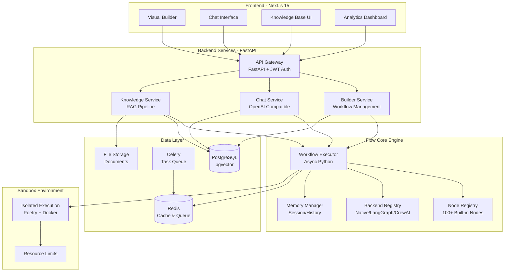
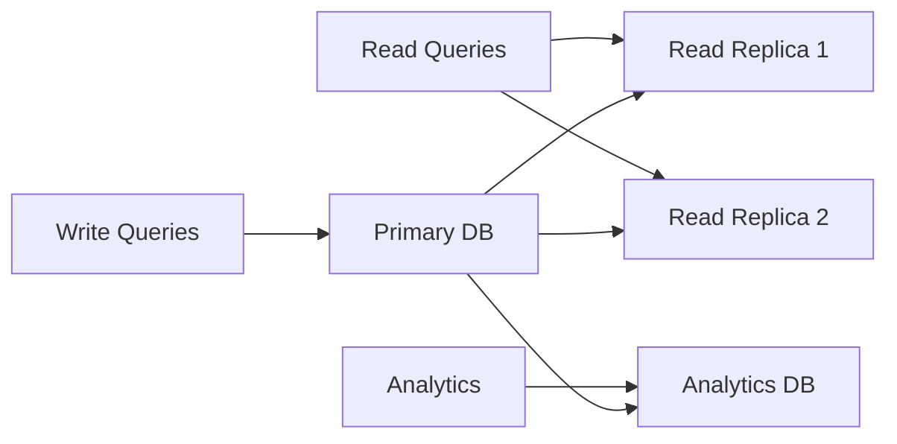
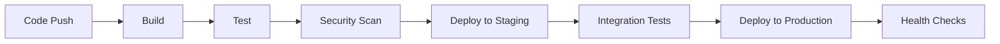

## System Architecture

Nadoo AI is built on a modular, microservices-based architecture that ensures scalability, reliability, and maintainability.

## High-Level Overview

Nadoo AI는 Builder 서비스가 Flow Core를 사용하여 AI 에이전트 구축을 가능하게 하는 웹 기반 백엔드를 제공합니다. The platform combines a visual no-code builder with a powerful Python-based workflow orchestration engine.



### Key Architecture Principles

<CardGroup cols={3}>
  <Card title="Builder + Core Integration" icon="puzzle-piece">
    Builder service provides visual UI while Flow Core handles actual workflow execution
  </Card>
  <Card title="OpenAI Compatible" icon="plug">
    Chat endpoints are OpenAI-compatible, allowing drop-in replacement
  </Card>
  <Card title="Async-First" icon="bolt">
    All operations are async using Python asyncio for maximum performance
  </Card>
</CardGroup>

## Core Components

### Flow Core Engine

The heart of Nadoo AI - handles workflow orchestration:

- **WorkflowExecutor**: Manages workflow execution lifecycle
- **NodeContext**: Maintains state for individual nodes
- **WorkflowContext**: Shared state across workflows
- **BackendRegistry**: Multi-backend support system

### Agent Runtime

Executes AI agents with:

- **Sandboxed execution environment**
- **Resource monitoring and limits**
- **Async/await support**
- **Error isolation**

### Builder Service

Powers the visual workflow builder:

- **Real-time collaboration engine**
- **Version control integration**
- **Template management**
- **Deployment pipeline**

## Data Flow

<Steps>
  <Step title="Request Ingestion">
    Client requests enter through the API Gateway
  </Step>
  <Step title="Authentication">
    Auth service validates credentials and permissions
  </Step>
  <Step title="Rate Limiting">
    Token bucket algorithm prevents abuse
  </Step>
  <Step title="Workflow Execution">
    Engine processes nodes sequentially or in parallel
  </Step>
  <Step title="Response Streaming">
    SSE or WebSocket for real-time updates
  </Step>
</Steps>

## Scalability Design

### Horizontal Scaling

- **Stateless services**: All services designed for horizontal scaling
- **Load balancing**: Round-robin with health checks
- **Auto-scaling**: Based on CPU, memory, and request metrics

### Caching Strategy

| Layer | Technology | Use Case |
|-------|------------|----------|
| CDN | CloudFlare | Static assets |
| Application | Redis | Session data, hot data |
| Database | Query cache | Frequent queries |
| Object | S3 | File storage |

### Database Architecture



## Security Architecture

### Defense in Depth

<AccordionGroup>
  <Accordion title="Network Security">
    - VPC isolation
    - Private subnets for services
    - WAF for DDoS protection
    - TLS 1.3 everywhere
  </Accordion>
  <Accordion title="Application Security">
    - Input validation
    - SQL injection prevention
    - XSS protection
    - CSRF tokens
  </Accordion>
  <Accordion title="Data Security">
    - Encryption at rest (AES-256)
    - Encryption in transit (TLS)
    - Key rotation
    - Secrets management
  </Accordion>
  <Accordion title="Access Control">
    - RBAC (Role-Based Access Control)
    - OAuth 2.0 / JWT
    - API key management
    - Audit logging
  </Accordion>
</AccordionGroup>

## Deployment Architecture

### Container Orchestration

Using Kubernetes for container management:

```yaml
apiVersion: apps/v1
kind: Deployment
metadata:
  name: nadoo-workflow-engine
spec:
  replicas: 3
  selector:
    matchLabels:
      app: workflow-engine
  template:
    spec:
      containers:
      - name: engine
        image: nadoo/workflow-engine:latest
        resources:
          requests:
            memory: "256Mi"
            cpu: "500m"
          limits:
            memory: "512Mi"
            cpu: "1000m"
```

### CI/CD Pipeline



## Monitoring & Observability

### Three Pillars

1. **Metrics**: Prometheus + Grafana
2. **Logs**: ELK Stack (Elasticsearch, Logstash, Kibana)
3. **Traces**: Jaeger for distributed tracing

### Key Metrics

- **System Metrics**: CPU, Memory, Disk, Network
- **Application Metrics**: Request rate, Error rate, Latency
- **Business Metrics**: Workflows executed, Nodes processed, API calls

## Performance Optimization

### Async Processing

All I/O operations are async:

```python
async def execute_workflow(workflow_id: str):
    # Non-blocking database query
    workflow = await db.get_workflow(workflow_id)

    # Concurrent node execution
    results = await asyncio.gather(
        *[node.execute() for node in workflow.nodes]
    )

    return results
```

### Connection Pooling

- Database: 100 connections per service
- Redis: 50 connections per service
- HTTP: Keep-alive with connection reuse

## Disaster Recovery

### Backup Strategy

- **Database**: Daily snapshots, point-in-time recovery
- **File Storage**: Cross-region replication
- **Configuration**: Git-based version control

### RTO/RPO Targets

- **RTO (Recovery Time Objective)**: 1 hour
- **RPO (Recovery Point Objective)**: 15 minutes

## Technology Stack

<Tabs>
  <Tab title="Backend">
    - **Language**: Python 3.11+
    - **Framework**: FastAPI 0.115.6
    - **Async**: asyncio + uvicorn
    - **ORM**: SQLAlchemy 2.0
    - **Validation**: Pydantic v2
    - **Task Queue**: Celery 5.4 + Flower
    - **Auth**: JWT (python-jose)
  </Tab>
  <Tab title="Frontend">
    - **Framework**: Next.js 15.5.3
    - **React**: 19.1.0
    - **Language**: TypeScript 5+
    - **State**: Zustand 5.0
    - **UI**: Tailwind CSS 3.4 + Radix UI
    - **Visual Builder**: React 19
    - **Forms**: React Hook Form 7.62
  </Tab>
  <Tab title="Flow Core">
    - **Language**: Python 3.11+
    - **Dependencies**: Only 2 (Pydantic + httpx)
    - **Architecture**: Async-first
    - **Backends**: Native, LangGraph, CrewAI, AutoGen
    - **Memory**: In-memory, Redis, PostgreSQL
    - **Document Processing**: LangChain text splitters
  </Tab>
  <Tab title="Data & Infrastructure">
    - **Primary DB**: PostgreSQL 16 + pgvector
    - **Cache**: Redis 7 Alpine
    - **Vector Store**: pgvector 0.4.1
    - **Embeddings**: OpenAI, Sentence Transformers
    - **Container**: Docker + Poetry
    - **Storage**: File system, S3-compatible
  </Tab>
</Tabs>

## Next Steps

<CardGroup cols={2}>
  <Card title="Use Cases" icon="lightbulb" href="/use-cases">
    See how the architecture supports various use cases
  </Card>
  <Card title="Getting Started" icon="rocket" href="/getting-started">
    Start building with Nadoo AI
  </Card>
</CardGroup>
