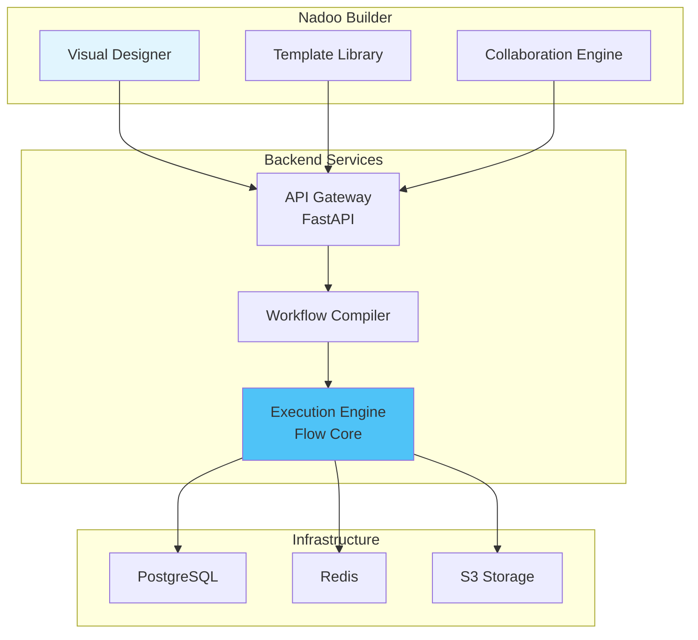

<Warning>
  **Enterprise Preview**: Nadoo Builder is currently available for enterprise customers. The source code will be organized and released publicly in the future.
</Warning>

## What is Nadoo Builder?

Nadoo Builder is a visual, no-code platform for creating AI agents and workflows. It provides an intuitive drag-and-drop interface built on top of Flow Core, enabling both technical and non-technical users to build sophisticated AI applications.

## Key Features

<CardGroup cols={2}>
  <Card title="Visual Workflow Design" icon="diagram-project">
    Drag-and-drop interface for creating complex workflows
  </Card>
  <Card title="Pre-built Templates" icon="layer-group">
    Start quickly with ready-made workflow templates
  </Card>
  <Card title="Real-time Collaboration" icon="users">
    Work together with your team in real-time
  </Card>
  <Card title="One-Click Deployment" icon="cloud-arrow-up">
    Deploy your agents instantly to production
  </Card>
</CardGroup>

## Enterprise Preview Program

### Current Status

- **Deployment Model**: On-premise and private cloud deployments
- **Target Users**: Enterprise organizations with AI automation needs
- **Support Level**: Direct support from Nadoo AI team
- **Customization**: Tailored to enterprise requirements

### How to Get Access

<Steps>
  <Step title="Contact Sales">
    Reach out to our enterprise team at enterprise@nadoo.ai
  </Step>
  <Step title="Discovery Call">
    Discuss your use cases and requirements with our solutions team
  </Step>
  <Step title="Pilot Program">
    Start with a proof of concept tailored to your needs
  </Step>
  <Step title="Full Deployment">
    Scale across your organization with our support
  </Step>
</Steps>

## Builder Architecture

The Builder platform integrates seamlessly with Flow Core:



## Core Capabilities

### 1. Visual Workflow Design

Create workflows using intuitive visual components:
- **Node Library**: Drag nodes from the sidebar
- **Connection Logic**: Connect nodes to define flow
- **Property Panels**: Configure node behavior
- **Real-time Preview**: See changes instantly

### 2. Integration with Flow Core

Every visual workflow compiles to Flow Core code:
- Visual nodes map to Flow Core nodes
- Connections become pipe operators
- Properties translate to node configuration
- Full compatibility with code-based workflows

### 3. Template System

Accelerate development with pre-built templates:
- Customer support chatbots
- Document processing pipelines
- Data analysis workflows
- Integration patterns

### 4. Collaboration Features

Work together effectively:
- Real-time multi-user editing
- Version control and history
- Comments and annotations
- Role-based access control

## Platform Components

### Frontend (Next.js + React)

- **React**: For workflow visualization
- **TypeScript**: Type-safe development
- **TailwindCSS**: Modern styling
- **WebSocket**: Real-time updates

### Backend (FastAPI + Python)

- **Workflow Compiler**: Converts visual to code
- **Execution Manager**: Orchestrates Flow Core
- **API Gateway**: RESTful and GraphQL APIs
- **Auth System**: JWT-based authentication

### Data Layer

- **PostgreSQL**: Workflow definitions and metadata
- **Redis**: Session management and caching
- **S3**: Asset and artifact storage

## Workflow Lifecycle

<Steps>
  <Step title="Design">
    Create workflow visually in the Builder
  </Step>
  <Step title="Compile">
    Convert to Flow Core workflow definition
  </Step>
  <Step title="Validate">
    Check for errors and compatibility
  </Step>
  <Step title="Deploy">
    Publish to execution environment
  </Step>
  <Step title="Monitor">
    Track execution and performance
  </Step>
</Steps>

## Example: Building a Chatbot

Here's how a simple chatbot looks in Builder vs Flow Core:

<Tabs>
  <Tab title="Visual Builder">
    ```yaml
    # Visual representation (simplified)
    nodes:
      - id: input
        type: UserInput
        position: {x: 100, y: 100}

      - id: llm
        type: LLMNode
        position: {x: 300, y: 100}
        config:
          model: gpt-4
          temperature: 0.7

      - id: output
        type: ResponseOutput
        position: {x: 500, y: 100}

    edges:
      - source: input
        target: llm
      - source: llm
        target: output
    ```
  </Tab>
  <Tab title="Generated Flow Core">
    ```python
    from nadoo_flow import ChainableNode, LLMNode, FunctionNode

    workflow = (
        FunctionNode(lambda x: {"message": x["user_input"]})
        | LLMNode(model="gpt-4", temperature=0.7)
        | FunctionNode(lambda x: {"response": x["content"]})
    )
    ```
  </Tab>
</Tabs>

## Deployment Options

### Cloud Deployment

Deploy to Public Cloud (coming soon):
- Managed infrastructure
- Auto-scaling
- Built-in monitoring
- Pay-per-use pricing

### On-Premise Deployment

Deploy in your infrastructure:
- Full data control
- Compliance ready
- Custom integration
- Enterprise support

### Hybrid Deployment

Best of both worlds:
- Sensitive data on-premise
- Compute in cloud
- Flexible architecture
- Cost optimization

## Security and Compliance

<AccordionGroup>
  <Accordion title="Data Security">
    - End-to-end encryption
    - Role-based access control
    - Audit logging
    - Data residency options
  </Accordion>
  <Accordion title="Compliance">
    - SOC 2 Type II (in progress)
    - GDPR compliant
    - HIPAA ready (roadmap)
    - ISO 27001 (roadmap)
  </Accordion>
  <Accordion title="Enterprise Features">
    - Single Sign-On (SSO)
    - LDAP/AD integration
    - Custom authentication
    - API key management
  </Accordion>
</AccordionGroup>

## Roadmap to Public Release

<Note>
  The public release timeline will be announced once the platform reaches feature completeness and stability targets.
</Note>

### Current Focus
- Enterprise customer deployments
- Core feature refinement
- Performance optimization
- Security hardening

### Upcoming Features
- Public cloud offering
- Marketplace for templates
- Advanced collaboration tools
- Mobile application

## Support and Resources

### For Enterprise Customers

- **Direct Support**: Dedicated support channel
- **Documentation**: Private documentation portal
- **Training**: Customized training sessions
- **SLA**: Enterprise service level agreement

### Community (Coming Soon)

- Public documentation
- Community forum
- Video tutorials
- Sample workflows

## Next Steps

<CardGroup cols={2}>
  <Card title="Contact Sales" icon="phone" href="mailto:enterprise@nadoo.ai">
    Reach out for enterprise access
  </Card>
  <Card title="Learn Flow Core" icon="graduation-cap" href="/flow-core/overview">
    Understand the underlying framework
  </Card>
</CardGroup>
