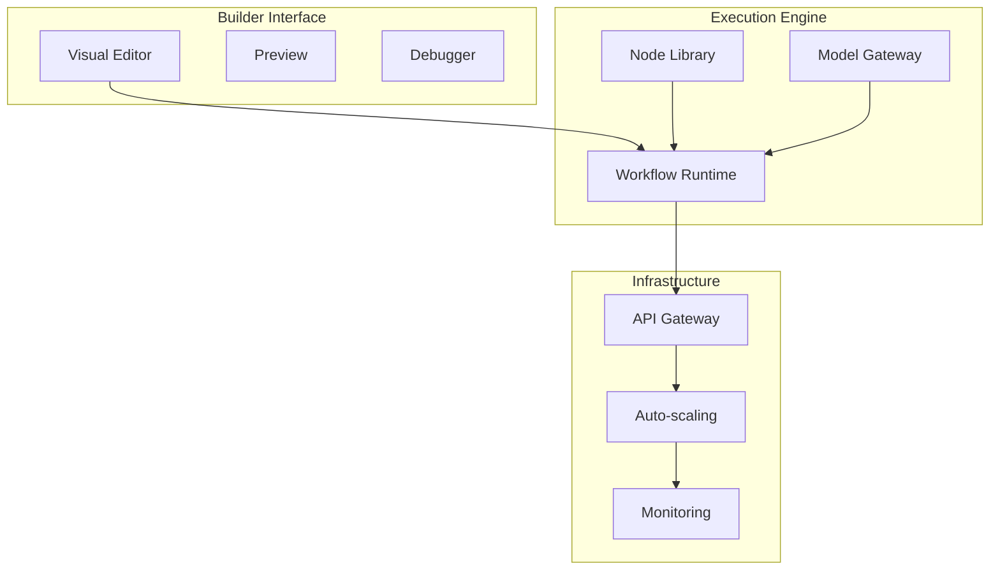

<Note>
**Enterprise Preview**: Builder is actively being deployed for enterprise customers. Source code release is being prepared. Contact contact@nadoo.ai for early access.
</Note>

## Build AI Apps in Minutes

Nadoo Builder is a **no-code platform** that empowers anyone to create production-ready AI applications through visual workflow design. Build complex RAG pipelines and AI agents with drag-and-drop simplicity - no coding required.

<CardGroup cols={3}>
  <Card title="Visual Builder" icon="palette">
    Drag-and-drop interface for building AI workflows
  </Card>
  <Card title="One-Click Deploy" icon="rocket">
    Deploy to production instantly with auto-scaling
  </Card>
  <Card title="Enterprise Ready" icon="building">
    SSO, RBAC, audit logs, and compliance built-in
  </Card>
</CardGroup>

## Why Choose Builder?

### 🚀 Speed to Market

- **4 weeks** from POC to production (vs 6+ months traditional development)
- **70% lower TCO** compared to custom development
- **100+ pre-built nodes** for immediate productivity

### 🎯 No-Code, Full Power

Build sophisticated AI applications without writing a single line of code:
- Complex RAG pipelines
- Multi-agent systems
- Document processing workflows
- Data analysis pipelines
- Customer support automation

### 🔒 Enterprise-Grade

Built for security, compliance, and scale:
- SOC 2 Type II certified
- GDPR compliant
- On-premise deployment options
- Role-based access control (RBAC)
- SSO integration
- Comprehensive audit logs

## Core Features

### Visual Workflow Builder

Create complex AI workflows with an intuitive drag-and-drop interface:

**Key Capabilities:**
- Visual node editor
- Real-time preview
- Conditional branching
- Parallel processing
- Error handling
- Debug mode

### One-Click Deployment

Deploy your AI workflows to production instantly:

- **Auto-generated REST APIs** with OpenAPI documentation
- **SDKs** for Python, JavaScript, and more
- **Auto-scaling** based on demand
- **Load balancing** and failover
- **SSL certificates** included
- **Custom domains** support

### Data Integration

Connect to any data source with built-in connectors:

<Tabs>
  <Tab title="Databases">
    - PostgreSQL
    - MySQL
    - MongoDB
    - Redis
    - Elasticsearch
    - DynamoDB
  </Tab>
  <Tab title="Vector Stores">
    - Pinecone
    - Weaviate
    - Qdrant
    - ChromaDB
    - Milvus
    - Faiss
  </Tab>
  <Tab title="Documents">
    - PDF
    - Word/Excel
    - Google Drive
    - Confluence
    - Notion
    - SharePoint
  </Tab>
  <Tab title="APIs">
    - REST APIs
    - GraphQL
    - Webhooks
    - WebSockets
    - gRPC
    - Custom integrations
  </Tab>
</Tabs>

### AI Model Support

Work with any AI model or provider:

| Provider | Models | Features |
|----------|--------|----------|
| **OpenAI** | GPT-4, GPT-3.5, DALL-E | Function calling, streaming |
| **Anthropic** | Claude 3, Claude 2 | Long context, safety |
| **Google** | Gemini, PaLM | Multimodal, code generation |
| **Open Source** | Llama, Mistral, Falcon | Self-hosted, customizable |
| **Custom** | Your fine-tuned models | Private deployment |

### Monitoring & Observability

Built-in monitoring for production AI apps:

- **Performance Metrics**: Latency, throughput, error rates
- **Cost Tracking**: Token usage, API costs, resource consumption
- **Error Monitoring**: Real-time alerts, error analysis
- **Usage Analytics**: User behavior, popular workflows
- **Custom Dashboards**: Build your own monitoring views

### Team Collaboration

Built for teams from day one:

- **Version Control**: Track changes, rollback capabilities
- **Team Workspaces**: Isolated environments for teams
- **Role-Based Access**: Granular permissions
- **Comments & Annotations**: Collaborate on workflows
- **Shared Components**: Reusable node libraries
- **Approval Workflows**: Review before deployment

## Use Cases

### Document AI

Build intelligent document processing pipelines:
- Invoice processing
- Contract analysis
- Resume screening
- Report generation
- Knowledge extraction

### Customer Support

Automate support with AI agents:
- Intelligent ticket routing
- Auto-response generation
- Sentiment analysis
- Escalation workflows
- Knowledge base search

### Data Analysis

Create AI-powered analytics:
- Natural language queries
- Automated reporting
- Anomaly detection
- Predictive analytics
- Data visualization

### Workflow Automation

Automate complex business processes:
- Approval workflows
- Data synchronization
- Content generation
- Email automation
- Integration workflows

## Platform Architecture

## Pricing Tiers

<CardGroup cols={3}>
  <Card title="Starter" icon="seedling">
    **Free**
    - 5 workflows
    - 1,000 executions/month
    - Community support
    - Public cloud only
  </Card>
  <Card title="Professional" icon="briefcase">
    **$99/month**
    - Unlimited workflows
    - 100,000 executions/month
    - Priority support
    - Custom domains
  </Card>
  <Card title="Enterprise" icon="building">
    **Custom**
    - Unlimited everything
    - On-premise deployment
    - SLA guarantees
    - Dedicated support
  </Card>
</CardGroup>

## Getting Started

<Steps>
  <Step title="Sign Up">
    Request access at [www.nadoo.ai](https://www.nadoo.ai)
  </Step>
  <Step title="Choose Template">
    Start with a pre-built template or blank canvas
  </Step>
  <Step title="Build Workflow">
    Drag and drop nodes to create your AI workflow
  </Step>
  <Step title="Test & Debug">
    Test with sample data and debug any issues
  </Step>
  <Step title="Deploy">
    One-click deploy to get your API endpoint
  </Step>
  <Step title="Integrate">
    Use the API or SDKs in your applications
  </Step>
</Steps>

## Builder vs Flow Core

| Feature | Builder | Flow Core |
|---------|---------|-----------|
| **Target Audience** | Business users, no-code teams | Developers |
| **Interface** | Visual drag-and-drop | Code-based |
| **Deployment** | One-click, managed | Self-hosted |
| **Customization** | Pre-built nodes | Full flexibility |
| **Learning Curve** | Minutes | Days |
| **Cost** | Subscription | Open source |
| **Support** | Full support | Community |

## Roadmap

### Current Status
- ✅ Enterprise deployments active
- ✅ 100+ node library completed
- ✅ Production-ready features

### Coming Soon
- 🔄 Public source release
- 🔄 Community edition
- 🔄 Mobile app support

### Future Plans
- 📋 Marketplace for nodes
- 📋 AI-powered workflow generation
- 📋 Multi-region deployment
- 📋 Desktop application
- 📋 Offline mode support

## Request Early Access

<Card title="Contact Us" icon="rocket" href="https://www.nadoo.ai">
  Get enterprise access to Nadoo Builder. Contact us to learn more.
</Card>

## Next Steps

<CardGroup cols={2}>
  <Card title="Getting Started" icon="play" href="/builder/getting-started">
    Quick start guide for Builder
  </Card>
  <Card title="Visual Editor" icon="palette" href="/builder/visual-editor">
    Learn about the visual workflow editor
  </Card>
</CardGroup>
