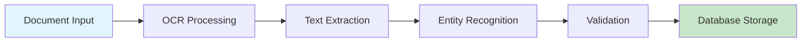

<Warning>
  **Coming Soon**: Templates are part of the Nadoo Builder platform, currently in enterprise preview.
</Warning>

## Overview

Accelerate your AI workflow development with pre-built, customizable templates designed for common business use cases.

## Template Categories

<CardGroup cols={2}>
  <Card title="Customer Service" icon="headset">
    Chatbots, support automation, ticket routing
  </Card>
  <Card title="Data Processing" icon="database">
    ETL pipelines, data validation, reporting
  </Card>
  <Card title="Content Generation" icon="pen">
    Blog posts, social media, marketing copy
  </Card>
  <Card title="Business Automation" icon="gear">
    Invoice processing, HR workflows, approvals
  </Card>
</CardGroup>

## Featured Templates

### 1. Customer Support Chatbot

**Purpose**: Intelligent customer support with escalation

**Components**:
- Intent classification
- Knowledge base search
- Response generation
- Human handoff logic

**Configuration**:
```python
template_config = {
    "name": "support_chatbot",
    "version": "1.0",
    "parameters": {
        "llm_model": "gpt-4",
        "knowledge_base": "customer_docs",
        "escalation_threshold": 0.3
    }
}
```

### 2. Document Processing Pipeline

**Purpose**: Extract and process information from documents

**Components**:
- PDF/Image OCR
- Text extraction
- Entity recognition
- Data validation
- Database storage

**Workflow Structure**:


### 3. Sales Lead Qualification

**Purpose**: Automatically qualify and route leads

**Features**:
- Lead scoring
- Enrichment from external sources
- Automated follow-up
- CRM integration

### 4. Content Generation Workflow

**Purpose**: Generate and publish content automatically

**Process Flow**:
1. Topic research
2. Content generation
3. SEO optimization
4. Image generation
5. Multi-platform publishing

## Using Templates

<Steps>
  <Step title="Browse Gallery">
    Access the template gallery in Builder
  </Step>
  <Step title="Preview Template">
    View workflow structure and components
  </Step>
  <Step title="Import Template">
    Add to your workspace with one click
  </Step>
  <Step title="Customize">
    Modify nodes and parameters for your needs
  </Step>
  <Step title="Deploy">
    Publish customized workflow to production
  </Step>
</Steps>

## Template Structure

Each template includes:

```yaml
template:
  metadata:
    name: "Customer Support Bot"
    category: "Customer Service"
    version: "1.0.0"
    author: "Nadoo AI"
    description: "Intelligent support chatbot"

  requirements:
    - openai_api_key
    - database_connection

  parameters:
    - name: response_style
      type: select
      options: ["formal", "casual", "technical"]
    - name: max_response_length
      type: number
      default: 500

  workflow:
    nodes: [...]
    connections: [...]
    variables: [...]
```

## Customization Options

### Parameter Configuration

Adjust template behavior without modifying structure:

<Tabs>
  <Tab title="Basic">
    - Model selection
    - Temperature settings
    - Response length
    - Language preferences
  </Tab>
  <Tab title="Advanced">
    - Custom prompts
    - Conditional logic
    - Integration endpoints
    - Rate limiting
  </Tab>
</Tabs>

### Node Modification

- Add/remove nodes
- Change processing logic
- Update connections
- Insert custom code

## Industry-Specific Templates

### Healthcare

- **Patient Intake**: Automate patient registration
- **Appointment Scheduling**: Smart scheduling assistant
- **Medical Record Summary**: Extract key information
- **Insurance Verification**: Validate coverage automatically

### Finance

- **Loan Application**: Process and evaluate applications
- **Fraud Detection**: Real-time transaction monitoring
- **Report Generation**: Automated financial reports
- **Customer Onboarding**: KYC/AML compliance workflows

### E-commerce

- **Product Recommendations**: Personalized suggestions
- **Inventory Management**: Stock level automation
- **Order Processing**: End-to-end order workflow
- **Review Analysis**: Sentiment and insights extraction

### Education

- **Course Creation**: Generate educational content
- **Student Assessment**: Automated grading and feedback
- **Tutoring Bot**: Personalized learning assistant
- **Enrollment Processing**: Student registration workflow

## Template Marketplace (Roadmap)

<Info>
  Community marketplace for sharing templates is planned for future release
</Info>

### Planned Features

- Community contributions
- Rating and reviews
- Version management
- Revenue sharing
- Certification program

## Creating Custom Templates

### Template Development

```python
from nadoo_flow import WorkflowTemplate

class CustomTemplate(WorkflowTemplate):
    """Custom workflow template"""

    def __init__(self):
        super().__init__(
            name="My Custom Template",
            category="Business Process",
            version="1.0.0"
        )

    def build_workflow(self, parameters):
        """Define workflow structure"""
        nodes = self.create_nodes(parameters)
        connections = self.create_connections(nodes)

        return {
            "nodes": nodes,
            "connections": connections,
            "metadata": self.metadata
        }
```

### Best Practices

<AccordionGroup>
  <Accordion title="Design Principles">
    - Keep templates focused on single use case
    - Provide sensible defaults
    - Include error handling
    - Document all parameters
  </Accordion>
  <Accordion title="Performance">
    - Optimize for common scenarios
    - Minimize external dependencies
    - Include caching where appropriate
    - Test with various data sizes
  </Accordion>
  <Accordion title="Maintainability">
    - Version templates properly
    - Include migration guides
    - Test backwards compatibility
    - Provide clear documentation
  </Accordion>
</AccordionGroup>

## Template Analytics

Track template usage and performance:

- **Usage Metrics**: Adoption and execution stats
- **Performance Data**: Execution time and success rates
- **User Feedback**: Ratings and comments
- **Version Tracking**: Update adoption rates

## Migration from Other Platforms

Import workflows from:
- Zapier
- Make (Integromat)
- n8n
- Power Automate
- Custom formats

## Support and Documentation

Each template includes:
- Quick start guide
- Parameter reference
- Troubleshooting guide
- Example configurations
- Video tutorials (coming soon)

## Next Steps

<CardGroup cols={2}>
  <Card title="Visual Editor" icon="pen-ruler" href="/builder/visual-editor">
    Learn to customize templates
  </Card>
  <Card title="Deployment" icon="rocket" href="/builder/deployment">
    Deploy templates to production
  </Card>
</CardGroup>