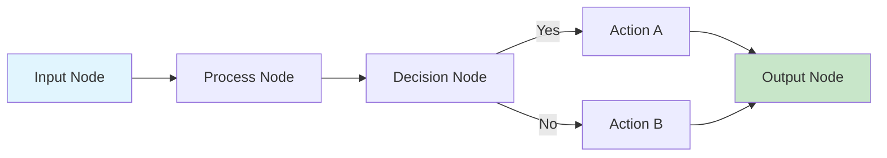

<Warning>
  **Coming Soon**: The visual editor is part of the Nadoo Builder platform, currently in enterprise preview. Public release details will be announced in the future.
</Warning>

## Overview

The Visual Editor is the heart of Nadoo Builder, providing an intuitive drag-and-drop interface for creating AI workflows without writing code.

## Core Features

### Node-Based Design

- **Drag & Drop**: Add nodes from the component library
- **Visual Connections**: Link nodes to create data flow
- **Real-time Validation**: Instant feedback on configuration
- **Property Panels**: Configure nodes through UI forms

### Workflow Canvas

## Interface Components

### 1. Component Library

<Tabs>
  <Tab title="Input/Output">
    - User Input
    - File Upload
    - API Webhook
    - Database Query
    - Response Output
  </Tab>
  <Tab title="Processing">
    - LLM Node
    - Text Processing
    - Data Transform
    - Code Execution
    - Custom Function
  </Tab>
  <Tab title="Control Flow">
    - Conditional Branch
    - Loop Iterator
    - Parallel Execution
    - Error Handler
    - Rate Limiter
  </Tab>
  <Tab title="Integrations">
    - OpenAI
    - Anthropic Claude
    - Database Connectors
    - API Calls
    - Third-party Services
  </Tab>
</Tabs>

### 2. Canvas Controls

- **Zoom**: Adjust view level (10% - 400%)
- **Pan**: Navigate large workflows
- **Grid Snap**: Align nodes to grid
- **Auto Layout**: Organize nodes automatically
- **Minimap**: Overview navigation

### 3. Property Panel

Configure node properties:
- Basic settings (name, description)
- Input/output mapping
- Advanced configuration
- Error handling rules
- Execution conditions

## Workflow Building

### Step-by-Step Process

<Steps>
  <Step title="Add Nodes">
    Drag nodes from the library to canvas
  </Step>
  <Step title="Connect Nodes">
    Draw connections between node ports
  </Step>
  <Step title="Configure Properties">
    Set node parameters in property panel
  </Step>
  <Step title="Test Workflow">
    Run test execution with sample data
  </Step>
  <Step title="Deploy">
    Publish workflow to production
  </Step>
</Steps>

## Upcoming Features

- AI-assisted workflow generation
- Natural language to workflow conversion
- Advanced analytics and insights
- Custom node development UI

## Related Resources

<CardGroup cols={2}>
  <Card title="Node Reference" icon="book" href="/builder/templates">
    Browse available node types
  </Card>
  <Card title="Best Practices" icon="lightbulb" href="/resources/best-practices">
    Learn workflow design patterns
  </Card>
</CardGroup>
