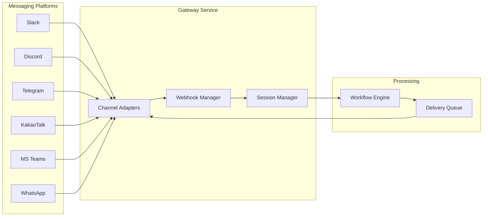

## Overview

Nadoo AI's messaging channel system lets you deploy a single AI agent workflow to **multiple messaging platforms** simultaneously. A gateway service with an adapter pattern normalizes messages from different platforms into a common format, routes them through your workflow, and delivers the response back through the originating channel.

Supported channels:

<CardGroup cols={3}>
  <Card title="Slack" icon="slack">
    OAuth-based integration with event subscriptions and interactive messages.
  </Card>
  <Card title="Discord" icon="discord">
    Bot token authentication with slash commands and rich embeds.
  </Card>
  <Card title="Telegram" icon="paper-plane">
    BotFather setup with webhook delivery and inline keyboards.
  </Card>
  <Card title="KakaoTalk" icon="comment">
    Skill-based configuration for the Korean messaging platform.
  </Card>
  <Card title="Microsoft Teams" icon="microsoft">
    Azure AD app registration with adaptive cards and messaging extensions.
  </Card>
  <Card title="WhatsApp" icon="whatsapp">
    Meta Business API with template messages and media support.
  </Card>
</CardGroup>

## Architecture

The channel system is composed of four key components that work together to process incoming messages and deliver responses.

### Channel Adapters

Each platform has a dedicated adapter that handles:

- **Inbound normalization** -- Convert platform-specific message formats (Slack blocks, Discord embeds, Telegram updates) into a standard internal format
- **Outbound formatting** -- Convert the workflow's response back into the platform's native format with rich formatting
- **Authentication** -- Manage platform-specific credentials (OAuth tokens, bot tokens, API keys)
- **Event handling** -- Process platform events such as message reactions, button clicks, and slash commands

### Webhook Manager

The webhook manager registers, validates, and routes incoming webhook payloads from each platform:

- Automatic webhook URL generation for each channel
- Signature verification to ensure requests come from the genuine platform
- Payload parsing and routing to the correct channel adapter

### Session Manager

Maps messaging platform conversations to Nadoo AI sessions:

- Each unique user + channel combination maps to a persistent session
- Conversation history is maintained across messages within a session
- Sessions can be reset manually or after a configurable timeout

### Delivery Queue

Handles outbound message delivery with resilience:

- **Rate limiting** -- Respects each platform's message rate limits
- **Circuit breaker** -- Stops sending to a platform that is returning errors, with automatic recovery
- **Retry logic** -- Exponential backoff for transient failures
- **Priority queue** -- Urgent messages (e.g., error notifications) are delivered first

## Channel Setup

<Tabs>
  <Tab title="Slack">
    ### Slack Integration

    **Authentication:** OAuth 2.0

    **Setup steps:**

    1. Create a Slack App at [api.slack.com/apps](https://api.slack.com/apps)
    2. Enable **Event Subscriptions** and set the Request URL to your Nadoo webhook endpoint
    3. Subscribe to `message.channels`, `message.im`, and `app_mention` events
    4. Add the required OAuth scopes: `chat:write`, `channels:history`, `im:history`, `users:read`
    5. Install the app to your workspace
    6. Copy the Bot Token and paste it into the Nadoo channel configuration

    **Supported features:**
    - Direct messages and channel mentions
    - Thread replies
    - Interactive buttons and menus
    - File uploads and downloads
    - Slash commands
  </Tab>
  <Tab title="Discord">
    ### Discord Integration

    **Authentication:** Bot Token

    **Setup steps:**

    1. Create a Discord Application at [discord.com/developers](https://discord.com/developers/applications)
    2. Create a Bot under the application and copy the Bot Token
    3. Enable **Message Content Intent** under Privileged Gateway Intents
    4. Generate an invite URL with `bot` and `applications.commands` scopes
    5. Invite the bot to your server
    6. Paste the Bot Token into the Nadoo channel configuration

    **Supported features:**
    - Channel messages and DMs
    - Slash commands with autocomplete
    - Rich embeds with custom formatting
    - Reactions and buttons
    - Voice channel integration (via STT/TTS nodes)
  </Tab>
  <Tab title="Telegram">
    ### Telegram Integration

    **Authentication:** Bot Token via BotFather

    **Setup steps:**

    1. Message [@BotFather](https://t.me/BotFather) on Telegram
    2. Send `/newbot` and follow the prompts to create your bot
    3. Copy the Bot Token provided by BotFather
    4. Paste the token into the Nadoo channel configuration -- the webhook is registered automatically
    5. Optionally set bot commands with `/setcommands`

    **Supported features:**
    - Private and group chat messages
    - Inline keyboards and reply keyboards
    - Photo, document, and voice message processing
    - Location and contact sharing
    - Bot commands
  </Tab>
  <Tab title="KakaoTalk">
    ### KakaoTalk Integration

    **Authentication:** Skill Configuration

    **Setup steps:**

    1. Create a KakaoTalk Channel at [business.kakao.com](https://business.kakao.com)
    2. Register a Chatbot in the Kakao i Open Builder
    3. Create a Skill and set the callback URL to your Nadoo webhook endpoint
    4. Map the Skill to your desired Scenario blocks
    5. Enter the API key in the Nadoo channel configuration

    **Supported features:**
    - Text responses and carousel cards
    - Quick reply buttons
    - Image and link cards
    - Custom JSON skill responses
  </Tab>
  <Tab title="Microsoft Teams">
    ### Microsoft Teams Integration

    **Authentication:** Azure AD App

    **Setup steps:**

    1. Register an application in [Azure Active Directory](https://portal.azure.com/#blade/Microsoft_AAD_RegisteredApps)
    2. Add the Microsoft Graph `ChannelMessage.Send` and `ChatMessage.Send` permissions
    3. Create a Bot Channel Registration and link it to your Azure AD app
    4. Set the messaging endpoint to your Nadoo webhook URL
    5. Install the app in your Teams organization via the Teams Admin Center
    6. Enter the App ID and Client Secret in the Nadoo channel configuration

    **Supported features:**
    - Channel and personal chat messages
    - Adaptive Cards with rich formatting
    - Messaging extensions
    - Task modules (dialogs)
    - File attachments
  </Tab>
  <Tab title="WhatsApp">
    ### WhatsApp Integration

    **Authentication:** Meta Business API

    **Setup steps:**

    1. Create a Meta Business Account and a WhatsApp Business App at [developers.facebook.com](https://developers.facebook.com)
    2. Set up a phone number for your WhatsApp Business Account
    3. Generate a permanent access token
    4. Configure the webhook URL and subscribe to `messages` events
    5. Enter the access token and phone number ID in the Nadoo channel configuration

    **Supported features:**
    - Text messages and template messages
    - Image, video, and document sharing
    - Interactive list and button messages
    - Location messages
    - Read receipts and typing indicators
  </Tab>
</Tabs>

## Resilience Features

The channel system is built with production-grade resilience patterns:

| Feature | Description |
|---|---|
| **Rate Limiting** | Per-channel rate limiters that respect each platform's API quotas (e.g., Slack: 1 msg/sec per channel) |
| **Circuit Breaker** | Automatically stops sending to a failing platform after a configurable error threshold, with periodic health checks to resume |
| **Retry Logic** | Exponential backoff with jitter for transient failures (default: 3 retries, base delay 1s) |
| **Session Mapping** | Stateful conversation tracking that survives gateway restarts via Redis-backed session storage |
| **Dead Letter Queue** | Messages that fail after all retries are stored for manual inspection and replay |

## Next Steps

<CardGroup cols={2}>
  <Card title="Workflow Engine" icon="diagram-project" href="/workflow/overview">
    Build the workflows that power your channel agents
  </Card>
  <Card title="AI Agent Node" icon="robot" href="/workflow/nodes/ai-agent">
    Configure the LLM node at the heart of your agent
  </Card>
  <Card title="Knowledge Base" icon="book" href="/knowledge/overview">
    Add RAG capabilities so your agent can answer from your documents
  </Card>
  <Card title="Visual Editor" icon="pen-ruler" href="/workflow/visual-editor">
    Design workflows with the drag-and-drop editor
  </Card>
</CardGroup>
