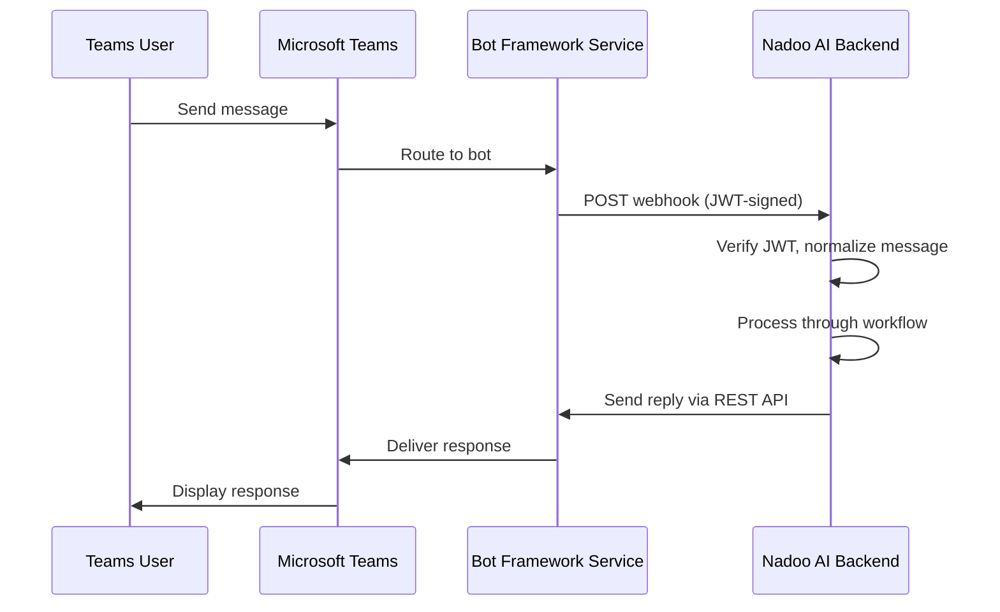

## Overview

The Microsoft Teams integration uses the **Bot Framework** to connect your AI agents to Teams channels, group chats, and direct messages. The adapter handles OAuth authentication, JWT-verified webhooks, and Teams-specific message formatting.

<Info>
  **Requirements:** A Microsoft Azure account with a Bot Framework registration and Teams app manifest.
</Info>

---

## Architecture



---

## Setup

<Steps>
  <Step title="Register a Bot in Azure">
    1. Go to the [Azure Portal](https://portal.azure.com)
    2. Navigate to **Azure Bot** and create a new bot resource
    3. Choose **Multi Tenant** for the bot type
    4. Note the **App ID** and generate an **App Password** (client secret)
  </Step>
  <Step title="Configure the Bot Endpoint">
    Set the messaging endpoint to your Nadoo AI webhook URL:

    ```
    https://your-domain.com/api/v1/channel-webhooks/teams/{channel_id}
    ```
  </Step>
  <Step title="Create a Teams App Manifest">
    Create a Teams app package with the bot's App ID:

    ```json
    {
      "bots": [
        {
          "botId": "YOUR_APP_ID",
          "scopes": ["personal", "team", "groupChat"],
          "supportsFiles": false
        }
      ]
    }
    ```

    Upload the app package to your Teams organization via the Teams Admin Center.
  </Step>
  <Step title="Configure in Nadoo AI">
    In the Nadoo AI platform, navigate to **Workspace Settings > Channels** and create a new Teams channel with these credentials:

    | Field | Description |
    |-------|-------------|
    | **App ID** | The Bot Framework Application ID |
    | **App Password** | The client secret from Azure |
    | **Tenant ID** | Your Azure AD tenant ID (or `botframework.com` for multi-tenant) |

    Link the channel to your target application (AI agent).
  </Step>
</Steps>

---

## Credentials

The Teams adapter requires the following credentials in `ChannelConfig`:

```python
credentials = {
    "app_id": "your-bot-app-id",
    "app_password": "your-bot-client-secret",
    "tenant_id": "your-azure-tenant-id"  # defaults to "botframework.com"
}
```

The adapter authenticates outbound messages by obtaining an OAuth token from the Bot Framework token service:

```
POST https://login.microsoftonline.com/{tenant}/oauth2/v2.0/token
scope=https://api.botframework.com/.default
```

Tokens are cached and refreshed automatically.

---

## Message Features

<AccordionGroup>
  <Accordion title="Supported content types" icon="message">
    | Type | Inbound | Outbound |
    |------|---------|----------|
    | Plain text | Yes | Yes |
    | Rich text (HTML) | Yes | Yes |
    | Images | Yes | Yes |
    | File attachments | Yes | No |
    | Adaptive Cards | No | Planned |
  </Accordion>
  <Accordion title="Conversation scopes" icon="users">
    - **Personal** -- Direct 1:1 messages with the bot
    - **Team channel** -- Messages in a Teams channel where the bot is installed
    - **Group chat** -- Messages in group conversations where the bot is added
  </Accordion>
  <Accordion title="Thread support" icon="comments">
    The adapter preserves conversation context using the Bot Framework's `conversationId` and `activityId`, enabling threaded replies in Teams channels.
  </Accordion>
</AccordionGroup>

---

## Webhook Security

Inbound webhooks from the Bot Framework are **JWT-verified**. The adapter validates the token signature against Microsoft's public keys to ensure authenticity before processing any message.

<Warning>
  Always deploy behind HTTPS. The Bot Framework will reject webhook endpoints that use plain HTTP.
</Warning>

---

## Next Steps

<CardGroup cols={2}>
  <Card title="Channels Overview" icon="comments" href="/channels/overview">
    Learn about the channel system architecture
  </Card>
  <Card title="Webhooks" icon="webhook" href="/channels/webhooks">
    Custom webhook integrations
  </Card>
</CardGroup>
