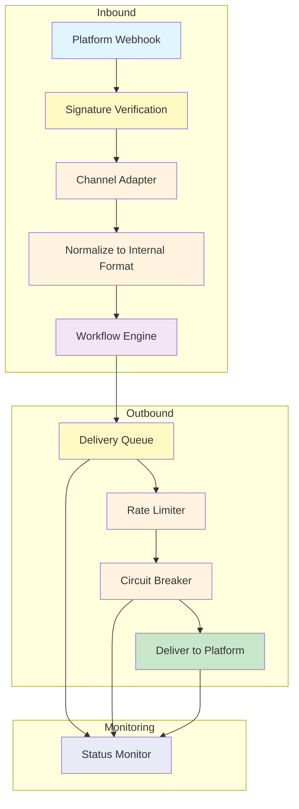
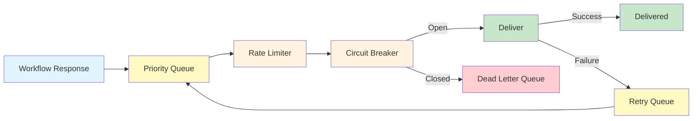
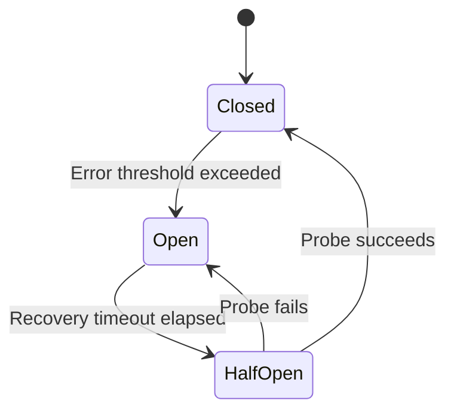

## Overview

Webhooks are the communication backbone of Nadoo AI's multi-channel messaging system. Every incoming message from Slack, Discord, Telegram, KakaoTalk, and other platforms arrives through a webhook endpoint. Outgoing responses are delivered through a managed delivery queue with retry logic and circuit breakers for reliability.

## Architecture



## Webhook Endpoint

All incoming webhooks are received at a single, channel-type-parameterized endpoint:

```
POST /api/v1/webhooks/handle/{channel_type}
```

| Channel Type | Endpoint |
|---|---|
| Slack | `POST /api/v1/webhooks/handle/slack` |
| Discord | `POST /api/v1/webhooks/handle/discord` |
| Telegram | `POST /api/v1/webhooks/handle/telegram` |
| KakaoTalk | `POST /api/v1/webhooks/handle/kakaotalk` |
| Microsoft Teams | `POST /api/v1/webhooks/handle/teams` |
| WhatsApp | `POST /api/v1/webhooks/handle/whatsapp` |
| Custom | `POST /api/v1/webhooks/handle/custom` |

### Request Processing

When a webhook request arrives:

1. **Route** -- The `{channel_type}` parameter determines which adapter handles the request.
2. **Verify** -- The request signature is validated using the channel's configured secret.
3. **Parse** -- The adapter extracts the message content, sender information, and metadata.
4. **Normalize** -- The platform-specific payload is converted into Nadoo AI's internal message format.
5. **Process** -- The normalized message is routed to the configured workflow.
6. **Respond** -- The workflow output is queued for delivery back to the originating platform.

## Webhook Verification Flow

Each platform uses a different mechanism to verify that webhook requests are authentic. Nadoo AI handles all verification automatically.

<Tabs>
  <Tab title="Slack">
    **Method:** HMAC-SHA256 signature verification

    1. Slack sends the `X-Slack-Signature` and `X-Slack-Request-Timestamp` headers with each request.
    2. Nadoo AI computes `HMAC-SHA256(signing_secret, "v0:{timestamp}:{body}")`.
    3. The computed signature is compared against the header value.
    4. Requests older than 5 minutes are rejected to prevent replay attacks.
  </Tab>
  <Tab title="Discord">
    **Method:** Ed25519 signature verification

    1. Discord sends the `X-Signature-Ed25519` and `X-Signature-Timestamp` headers.
    2. Nadoo AI verifies the signature using the application's public key.
    3. Invalid signatures are rejected with a 401 response.
  </Tab>
  <Tab title="Telegram">
    **Method:** Secret token header

    1. During webhook registration, Nadoo AI sets a `secret_token` with the Telegram API.
    2. Telegram includes this token in the `X-Telegram-Bot-Api-Secret-Token` header.
    3. The header value is compared against the stored secret.
  </Tab>
  <Tab title="KakaoTalk">
    **Method:** API key validation

    1. Kakao i Open Builder sends the skill request to the configured callback URL.
    2. Nadoo AI validates the request origin and API key.
    3. Requests from unregistered sources are rejected.
  </Tab>
  <Tab title="WhatsApp">
    **Method:** HMAC-SHA256 signature verification

    1. Meta sends the `X-Hub-Signature-256` header with each webhook payload.
    2. Nadoo AI computes `HMAC-SHA256(app_secret, body)` and compares it to the header.
    3. Webhook verification challenges (GET requests with `hub.verify_token`) are handled automatically.
  </Tab>
</Tabs>

## Delivery Queue

Outbound messages are not sent directly to platforms. Instead, they are placed in a **delivery queue** that handles rate limiting, retries, and failure recovery.

### Queue Architecture



### Priority Levels

Messages in the queue are processed by priority:

| Priority | Description | Examples |
|---|---|---|
| **High** | Error notifications, system alerts | Workflow failure notifications, rate limit warnings |
| **Normal** | Standard user responses | Bot replies to user messages |
| **Low** | Batch operations, background notifications | Scheduled reports, bulk updates |

### Retry Logic

When a delivery attempt fails, the message is placed in the retry queue with **exponential backoff and jitter**.

| Attempt | Base Delay | Max Delay | Description |
|---|---|---|---|
| 1st retry | 1 second | -- | Immediate retry for transient network errors |
| 2nd retry | 2 seconds | -- | Short wait |
| 3rd retry | 4 seconds | -- | Medium wait |
| 4th retry | 8 seconds | 30 seconds | Capped at max delay |
| 5th retry (final) | 16 seconds | 30 seconds | Last attempt before dead letter queue |

**Jitter** is added to each delay to prevent thundering herd problems when multiple messages are retrying simultaneously.

```
actual_delay = base_delay * (2 ^ attempt) * (0.5 + random(0, 0.5))
```

After all retry attempts are exhausted, the message is moved to the **Dead Letter Queue** for manual inspection and replay.

### Configuration

```json
{
  "delivery": {
    "max_retries": 5,
    "base_delay_seconds": 1,
    "max_delay_seconds": 30,
    "jitter": true
  }
}
```

## Circuit Breaker

The circuit breaker prevents the delivery queue from repeatedly sending messages to a platform that is experiencing an outage. This protects both the Nadoo AI backend and the external platform from excessive failed requests.

### States



| State | Behavior |
|---|---|
| **Closed** | Normal operation. Messages are delivered to the platform. Errors are counted. |
| **Open** | The platform is considered unhealthy. Messages are routed to the dead letter queue instead of being sent. No delivery attempts are made. |
| **Half-Open** | After a recovery timeout, a single probe message is sent to test if the platform has recovered. If successful, the circuit closes. If the probe fails, the circuit reopens. |

### Configuration

```json
{
  "circuit_breaker": {
    "error_threshold": 5,
    "error_window_seconds": 60,
    "recovery_timeout_seconds": 30,
    "probe_interval_seconds": 10
  }
}
```

| Parameter | Default | Description |
|---|---|---|
| `error_threshold` | 5 | Number of consecutive errors before the circuit opens |
| `error_window_seconds` | 60 | Time window for counting errors |
| `recovery_timeout_seconds` | 30 | Time to wait before sending a probe in the half-open state |
| `probe_interval_seconds` | 10 | Interval between probe attempts in the half-open state |

## Status Monitoring

Monitor the health and delivery status of your webhooks through the monitoring API.

### Webhook Status

```bash
curl -X GET \
  "https://your-instance.example.com/api/v1/webhooks/status/{webhook_id}" \
  -H "Authorization: Bearer YOUR_API_KEY"
```

**Response:**

```json
{
  "webhook_id": "wh_abc123",
  "channel_type": "slack",
  "status": "active",
  "circuit_breaker_state": "closed",
  "stats": {
    "messages_delivered": 1542,
    "messages_failed": 3,
    "messages_in_queue": 0,
    "messages_in_dead_letter": 1,
    "avg_delivery_time_ms": 245,
    "last_delivery_at": "2026-03-09T10:30:00Z",
    "last_error_at": "2026-03-08T14:22:00Z",
    "last_error_message": "Rate limit exceeded (429)"
  },
  "rate_limit": {
    "requests_per_second": 1,
    "current_usage": 0.3
  }
}
```

### List All Webhooks

```bash
curl -X GET \
  "https://your-instance.example.com/api/v1/webhooks/status" \
  -H "Authorization: Bearer YOUR_API_KEY"
```

### Dead Letter Queue

Inspect and replay messages that failed all delivery attempts.

**List dead letter messages:**

```bash
curl -X GET \
  "https://your-instance.example.com/api/v1/webhooks/{webhook_id}/dead-letters" \
  -H "Authorization: Bearer YOUR_API_KEY"
```

**Replay a dead letter message:**

```bash
curl -X POST \
  "https://your-instance.example.com/api/v1/webhooks/{webhook_id}/dead-letters/{message_id}/replay" \
  -H "Authorization: Bearer YOUR_API_KEY"
```

**Replay all dead letters for a webhook:**

```bash
curl -X POST \
  "https://your-instance.example.com/api/v1/webhooks/{webhook_id}/dead-letters/replay-all" \
  -H "Authorization: Bearer YOUR_API_KEY"
```

## Best Practices

<AccordionGroup>
  <Accordion title="Use HTTPS with valid certificates" icon="lock">
    All webhook endpoints must be served over HTTPS with a valid SSL/TLS certificate. Self-signed certificates are not accepted by most messaging platforms. Use Let's Encrypt for free certificates or your organization's certificate authority.
  </Accordion>
  <Accordion title="Monitor circuit breaker state" icon="heart-pulse">
    Set up alerts for when a circuit breaker transitions to the **Open** state. This indicates a platform outage or configuration issue that needs attention. The status monitoring API provides the current state for each webhook.
  </Accordion>
  <Accordion title="Review dead letter queues regularly" icon="inbox">
    Messages in the dead letter queue represent failed communications. Review them regularly to identify patterns (e.g., recurring errors for a specific channel) and replay messages after resolving the underlying issue.
  </Accordion>
  <Accordion title="Configure appropriate rate limits" icon="gauge-high">
    Each platform has its own rate limits. Nadoo AI's delivery queue respects these automatically, but you can configure additional application-level rate limits to stay well below platform quotas during peak traffic.
  </Accordion>
  <Accordion title="Keep webhook secrets secure" icon="key">
    Store signing secrets, bot tokens, and API keys in the Nadoo AI platform's encrypted credential store. Do not hard-code secrets in configuration files or expose them in logs.
  </Accordion>
</AccordionGroup>

## Next Steps

<CardGroup cols={2}>
  <Card title="Channels Overview" icon="comments" href="/channels/overview">
    Multi-channel messaging architecture and adapter pattern
  </Card>
  <Card title="Slack" icon="slack" href="/channels/slack">
    Set up the Slack integration
  </Card>
  <Card title="Discord" icon="discord" href="/channels/discord">
    Set up the Discord integration
  </Card>
  <Card title="Self-Hosting" icon="server" href="/self-hosting/overview">
    Deploy Nadoo AI with proper HTTPS and webhook configuration
  </Card>
</CardGroup>
