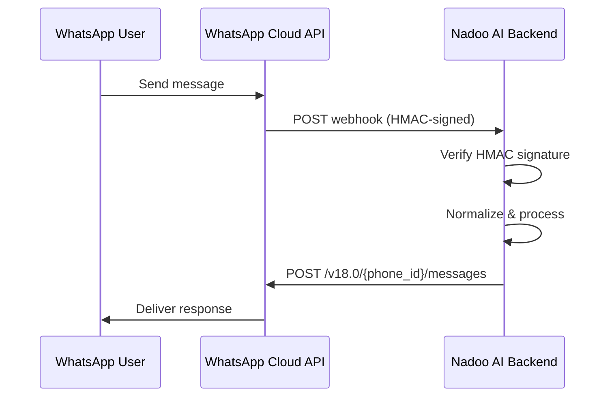

## Overview

The WhatsApp integration uses the **WhatsApp Cloud API** (Meta Business Platform) to send and receive messages. The adapter handles HMAC signature verification for inbound webhooks and supports text, images, and media messages.

<Info>
  **Requirements:** A Meta Business account with WhatsApp Business API access and a verified phone number.
</Info>

---

## Architecture



---

## Setup

<Steps>
  <Step title="Create a Meta App">
    1. Go to [Meta for Developers](https://developers.facebook.com)
    2. Create a new app and add the **WhatsApp** product
    3. Generate a permanent access token (or use a system user token)
    4. Note the **Phone Number ID** from the WhatsApp settings
  </Step>
  <Step title="Configure the Webhook">
    Set the webhook callback URL to:

    ```
    https://your-domain.com/api/v1/channel-webhooks/whatsapp/{channel_id}
    ```

    Subscribe to the `messages` webhook field. Set a **Verify Token** that matches your Nadoo AI configuration.
  </Step>
  <Step title="Configure in Nadoo AI">
    In the Nadoo AI platform, navigate to **Workspace Settings > Channels** and create a new WhatsApp channel:

    | Field | Description |
    |-------|-------------|
    | **Access Token** | Permanent token from the Meta Business Platform |
    | **Phone Number ID** | The WhatsApp Business phone number ID |
    | **App Secret** | Meta app secret for webhook HMAC verification |

    Link the channel to your target application.
  </Step>
</Steps>

---

## Credentials

The WhatsApp adapter requires the following credentials:

```python
credentials = {
    "access_token": "your-whatsapp-access-token",
    "phone_number_id": "your-phone-number-id",
    "app_secret": "your-meta-app-secret"  # for HMAC verification
}
```

---

## Webhook Security

Inbound messages are verified using **HMAC-SHA256** signature validation. The adapter computes:

```
HMAC-SHA256(app_secret, request_body)
```

and compares it against the `X-Hub-Signature-256` header sent by the WhatsApp Cloud API.

<Warning>
  The `app_secret` must be the same secret from your Meta app's settings. Without it, webhook signature verification will fail and messages will be rejected.
</Warning>

---

## Message Features

<AccordionGroup>
  <Accordion title="Supported content types" icon="message">
    | Type | Inbound | Outbound |
    |------|---------|----------|
    | Plain text | Yes | Yes |
    | Images | Yes | Yes |
    | Documents | Yes | Planned |
    | Audio | Yes | Planned |
    | Video | Yes | Planned |
    | Location | Yes | No |
    | Contacts | Yes | No |
  </Accordion>
  <Accordion title="Message templates" icon="file-lines">
    WhatsApp requires pre-approved **message templates** for initiating conversations (outside the 24-hour session window). Within the 24-hour window after a user message, you can send free-form replies.
  </Accordion>
  <Accordion title="Media handling" icon="image">
    Media attachments (images, documents, audio, video) are received as WhatsApp media IDs. The normalizer downloads the media content and includes it as `MediaAttachment` objects in the inbound message.
  </Accordion>
</AccordionGroup>

---

## API Base URL

The adapter communicates with the WhatsApp Cloud API at:

```
https://graph.facebook.com/v18.0/{phone_number_id}/messages
```

Outbound messages are sent as POST requests with the access token in the Authorization header.

---

## Next Steps

<CardGroup cols={2}>
  <Card title="Channels Overview" icon="comments" href="/channels/overview">
    Learn about the channel system architecture
  </Card>
  <Card title="Webhooks" icon="webhook" href="/channels/webhooks">
    Custom webhook integrations
  </Card>
</CardGroup>
