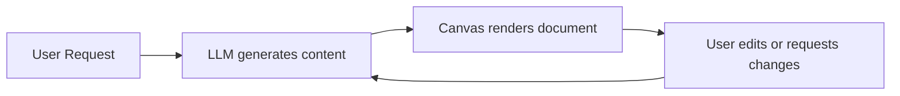

## Overview

The **Canvas** is a rich content editing surface embedded within the Nadoo AI chat interface. While standard chat produces ephemeral text messages, the Canvas lets users and agents collaboratively create, edit, and refine persistent documents, code snippets, structured artifacts, and other rich content -- all without leaving the conversation.

## When to Use Canvas

Canvas is designed for tasks where the output is a **document or artifact** rather than a conversational answer:

- **Document drafting** -- Reports, emails, proposals, meeting notes
- **Code generation** -- Scripts, configurations, templates with syntax highlighting
- **Structured outputs** -- Tables, JSON schemas, structured data
- **Iterative refinement** -- Edit and revise content through conversation turns
- **Content review** -- Highlight sections, leave comments, request changes

## How Canvas Works



1. The user requests a document or artifact in the chat (e.g., "Write a project proposal for the new mobile app")
2. The agent generates the content and opens it in the Canvas panel
3. The user can directly edit the content in the Canvas or request changes through chat
4. The agent applies revisions while preserving the document structure
5. The final document can be exported or saved

## Canvas Interface

The Canvas appears as a side panel next to the chat, providing a split-view experience:

| Area | Description |
|------|-------------|
| **Chat Panel** | Standard chat interface for conversation with the agent |
| **Canvas Panel** | Rich content editor displaying the current document or artifact |
| **Toolbar** | Formatting controls, export options, and version navigation |

### DocumentCanvas Component

The `DocumentCanvas` component renders the rich content editor with support for:

- **Rich text formatting** -- Headings, bold, italic, lists, links, blockquotes
- **Code blocks** -- Syntax-highlighted code with language detection
- **Tables** -- Structured data with row/column editing
- **Markdown rendering** -- Full Markdown support with live preview
- **Direct editing** -- Click anywhere in the document to edit inline

### DocumentToolbar Component

The `DocumentToolbar` provides controls for managing Canvas content:

| Action | Description |
|--------|-------------|
| **Copy** | Copy the full document content to clipboard |
| **Export** | Download as Markdown, PDF, or plain text |
| **Version History** | Browse and restore previous versions of the document |
| **Full Screen** | Expand the Canvas to full screen for focused editing |
| **Close** | Close the Canvas and return to chat-only view |

## Using Canvas in Chat

Canvas integrates naturally into the chat flow. When the agent produces content that benefits from a document view, it automatically opens in the Canvas.

### Creating a Canvas Document

Ask the agent to create a document:

```
User: Write a technical specification for our user authentication system

Agent: [Opens Canvas with the generated specification document]
```

### Editing with Chat Commands

Request specific edits through the chat while viewing the document:

```
User: Make the introduction more concise
User: Add a section about OAuth 2.0 flow
User: Rewrite bullet point 3 to be more technical
User: Replace the table with a Mermaid diagram
```

The agent applies changes to the Canvas document while explaining what was modified in the chat.

### Direct Editing

Click anywhere in the Canvas to edit the content directly. Your manual edits are preserved when the agent makes subsequent changes through chat.

## Canvas API

The Canvas API provides programmatic access to canvas documents for integration with external systems and custom workflows.

### Create a Canvas

```bash
POST /api/v1/canvas
Content-Type: application/json

{
  "session_id": "session-uuid",
  "title": "Project Proposal",
  "content": "# Project Proposal\n\nInitial draft...",
  "content_type": "markdown"
}
```

**Response:**

```json
{
  "id": "canvas-uuid",
  "session_id": "session-uuid",
  "title": "Project Proposal",
  "content": "# Project Proposal\n\nInitial draft...",
  "content_type": "markdown",
  "version": 1,
  "created_at": "2026-03-09T10:00:00Z",
  "updated_at": "2026-03-09T10:00:00Z"
}
```

### Get a Canvas

```bash
GET /api/v1/canvas/{canvas_id}
```

Returns the current version of the canvas document with full content and metadata.

### Update a Canvas

```bash
PUT /api/v1/canvas/{canvas_id}
Content-Type: application/json

{
  "content": "# Project Proposal\n\nRevised content with new sections...",
  "title": "Project Proposal v2"
}
```

Each update creates a new version in the version history. Previous versions are retained and can be retrieved.

### List Canvas Documents

```bash
GET /api/v1/canvas?session_id=session-uuid
```

Returns all canvas documents associated with a chat session.

### Get Version History

```bash
GET /api/v1/canvas/{canvas_id}/versions
```

Returns the version history for a canvas document, allowing you to view or restore any previous version.

## Content Types

Canvas supports multiple content types, each with tailored rendering:

| Content Type | Description | Features |
|-------------|-------------|----------|
| `markdown` | Markdown documents | Rich rendering, headings, lists, tables, links |
| `code` | Source code files | Syntax highlighting, line numbers, language detection |
| `html` | HTML content | Rendered HTML preview with source toggle |
| `json` | JSON data | Formatted display with collapsible sections |
| `text` | Plain text | Simple text editing without formatting |

## Canvas in Workflows

Canvas documents can be created and updated by **Workflow Apps** using the Canvas nodes:

- **Create Canvas Node** -- Generate a new document during workflow execution
- **Update Canvas Node** -- Modify an existing canvas document
- **Read Canvas Node** -- Retrieve canvas content for processing by subsequent nodes

This enables workflows that produce polished documents as their output -- such as report generation pipelines that create, populate, and format a Canvas document through multiple AI-powered steps.

## Best Practices

<AccordionGroup>
  <Accordion title="Use Canvas for long-form content" icon="file-lines">
    Activate Canvas when the expected output is more than a few paragraphs. Short answers are better served by standard chat messages.
  </Accordion>
  <Accordion title="Iterate through conversation" icon="arrows-rotate">
    Instead of rewriting entire documents manually, describe the changes you want in chat. The agent can make targeted edits while preserving the document's structure.
  </Accordion>
  <Accordion title="Export early and often" icon="download">
    Use the Export function to save snapshots of your document. While version history is maintained, exporting gives you a local copy you can share or archive.
  </Accordion>
  <Accordion title="Combine with knowledge base" icon="book-open">
    When drafting documents that reference your organization's data, make sure the Chat App has relevant knowledge bases attached. The agent can pull facts and figures directly into the Canvas.
  </Accordion>
</AccordionGroup>

## Next Steps

<CardGroup cols={2}>
  <Card title="Chat App" icon="comments" href="/applications/chat-app">
    Build a Chat App with Canvas support
  </Card>
  <Card title="Real-time Streaming" icon="bolt" href="/chat/streaming">
    Understand SSE events that drive Canvas updates
  </Card>
  <Card title="Chat Overview" icon="message" href="/chat/overview">
    Full chat system reference including memory and analytics
  </Card>
  <Card title="Workflow App" icon="diagram-project" href="/applications/workflow-app">
    Create workflows that produce Canvas documents
  </Card>
</CardGroup>
