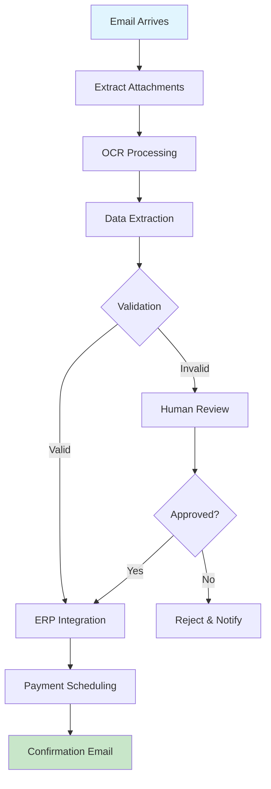

<Warning>
  **Coming Soon**: This example demonstrates Nadoo Builder capabilities, currently available in enterprise preview.
</Warning>

## Overview

Automate repetitive business processes using Nadoo Builder's visual workflow designer. This example shows how to build an invoice processing automation system.

## Invoice Processing Workflow



## Visual Workflow Configuration

### 1. Email Trigger

Configure email monitoring:

```yaml
trigger_type: EmailMonitor
configuration:
  name: "Invoice Email Watcher"
  email_account: invoices@company.com
  filters:
    subject_contains: "Invoice"
    from_domain:
      - vendor1.com
      - vendor2.com
  attachments:
    required: true
    types: [pdf, png, jpg]
  schedule:
    check_interval: 5m
    active_hours: "business_hours"
```

### 2. Document Processing

Extract data from invoices:

```yaml
node_type: DocumentOCR
configuration:
  name: "OCR Processor"
  provider: google_vision
  language: en
  output_format: structured
  extract:
    - text
    - tables
    - key_value_pairs

---

node_type: DataExtractor
configuration:
  name: "Invoice Data Extractor"
  model: gpt-4
  extraction_schema:
    invoice_number: string
    invoice_date: date
    due_date: date
    vendor_name: string
    vendor_id: string
    line_items:
      - description: string
        quantity: number
        unit_price: number
        total: number
    subtotal: number
    tax: number
    total_amount: number
  validation:
    required_fields:
      - invoice_number
      - vendor_name
      - total_amount
```

### 3. Validation Logic

Validate extracted data:

```yaml
node_type: ValidationNode
configuration:
  name: "Invoice Validator"
  rules:
    - field: total_amount
      condition: "value > 0"
      error: "Total must be positive"

    - field: invoice_number
      condition: "not exists in database"
      error: "Duplicate invoice"

    - field: vendor_id
      condition: "exists in vendor_list"
      error: "Unknown vendor"

    - field: calculated_total
      condition: "abs(calculated - extracted) < 0.01"
      error: "Calculation mismatch"

  thresholds:
    auto_approve_limit: 1000
    require_approval_above: 5000
```

### 4. ERP Integration

Send to accounting system:

```yaml
node_type: APICall
configuration:
  name: "ERP Integration"
  endpoint: "${ERP_API_URL}/invoices"
  method: POST
  authentication:
    type: oauth2
    token: "${ERP_ACCESS_TOKEN}"
  payload_mapping:
    vendor_id: "{{vendor_id}}"
    invoice_number: "{{invoice_number}}"
    amount: "{{total_amount}}"
    due_date: "{{due_date}}"
    line_items: "{{line_items}}"
  retry:
    max_attempts: 3
    backoff: exponential
  error_handling:
    on_failure: "escalate_to_human"
```

## Code Implementation

Flow Core equivalent:

```python
from nadoo_flow import (
    ChainableNode,
    LLMNode,
    FunctionNode,
    ConditionalNode,
    APICallNode
)
import asyncio
from typing import Dict, List

class InvoiceProcessor:
    def __init__(self):
        self.ocr_node = DocumentOCRNode(provider="google_vision")
        self.extractor = DataExtractorNode(model="gpt-4")
        self.validator = ValidationNode()
        self.erp_client = ERPIntegration()

    async def process_invoice(self, email_data: Dict) -> Dict:
        """Process invoice from email"""

        # Extract PDF attachment
        pdf_data = self._extract_attachment(email_data)

        # OCR processing
        ocr_result = await self.ocr_node.execute({
            "file": pdf_data,
            "format": "structured"
        })

        # Extract invoice data
        extracted = await self.extractor.execute({
            "text": ocr_result["text"],
            "schema": self._get_invoice_schema()
        })

        # Validate
        validation_result = await self.validator.execute(extracted)

        if not validation_result["valid"]:
            # Send for human review
            return await self._request_human_review(
                extracted,
                validation_result["errors"]
            )

        # Check amount threshold
        if extracted["total_amount"] > 5000:
            # Requires approval
            approval = await self._request_approval(extracted)
            if not approval["approved"]:
                return {"status": "rejected", "reason": "Not approved"}

        # Submit to ERP
        erp_result = await self.erp_client.create_invoice(extracted)

        # Schedule payment
        payment = await self._schedule_payment(
            erp_result["invoice_id"],
            extracted["due_date"]
        )

        # Send confirmation
        await self._send_confirmation(email_data["from"], extracted)

        return {
            "status": "processed",
            "invoice_id": erp_result["invoice_id"],
            "payment_scheduled": payment["scheduled_date"]
        }

    def _extract_attachment(self, email_data: Dict) -> bytes:
        """Extract PDF from email"""
        for attachment in email_data["attachments"]:
            if attachment["type"] == "application/pdf":
                return attachment["data"]
        raise ValueError("No PDF attachment found")

    def _get_invoice_schema(self) -> Dict:
        """Invoice extraction schema"""
        return {
            "invoice_number": "string",
            "invoice_date": "date",
            "vendor_name": "string",
            "total_amount": "number",
            "line_items": "array"
        }

    async def _request_human_review(
        self,
        data: Dict,
        errors: List[str]
    ) -> Dict:
        """Send for manual review"""
        print(f"Human review required: {errors}")
        # In production: send to review queue
        return {"status": "pending_review", "errors": errors}

    async def _request_approval(self, data: Dict) -> Dict:
        """Request approval for high-value invoice"""
        print(f"Approval required for ${data['total_amount']}")
        # In production: send approval request
        return {"approved": True}

    async def _schedule_payment(
        self,
        invoice_id: str,
        due_date: str
    ) -> Dict:
        """Schedule payment"""
        return {
            "scheduled": True,
            "scheduled_date": due_date,
            "invoice_id": invoice_id
        }

    async def _send_confirmation(
        self,
        recipient: str,
        data: Dict
    ):
        """Send confirmation email"""
        print(f"Sending confirmation to {recipient}")
        # Send email
        pass
```

## Advanced Automation Examples

### Purchase Order Automation

```yaml
workflow_name: Purchase Order Processing
trigger: FormSubmission

nodes:
  - name: Validate Request
    type: ValidationNode
    rules:
      - budget_check
      - approval_required
      - vendor_validation

  - name: Multi-Level Approval
    type: ApprovalChain
    approvers:
      - level: manager
        condition: "amount > 1000"
      - level: director
        condition: "amount > 10000"
      - level: cfo
        condition: "amount > 50000"
    timeout: 48h

  - name: Create PO
    type: ERPIntegration
    action: create_purchase_order

  - name: Notify Vendor
    type: EmailNode
    template: po_notification
```

### Customer Onboarding

```yaml
workflow_name: Customer Onboarding
trigger: SignupComplete

nodes:
  - name: KYC Verification
    type: ExternalAPI
    provider: identity_verification
    checks:
      - identity_document
      - address_proof
      - sanctions_screening

  - name: Credit Check
    type: APICall
    endpoint: credit_bureau_api
    fallback: manual_review

  - name: Account Creation
    type: DatabaseNode
    action: create_account
    tables:
      - customers
      - accounts
      - permissions

  - name: Welcome Email
    type: EmailSequence
    templates:
      - welcome_immediate
      - tutorial_day_1
      - tips_day_3
      - survey_day_7
```

### Support Ticket Routing

```yaml
workflow_name: Support Ticket Router
trigger: TicketCreated

nodes:
  - name: Classify Issue
    type: LLMNode
    model: gpt-4
    categories:
      - technical
      - billing
      - feature_request
      - bug_report

  - name: Check Severity
    type: RuleEngine
    rules:
      - keywords: ["down", "broken", "critical"]
        severity: high
      - keywords: ["slow", "issue", "problem"]
        severity: medium
      - default:
        severity: low

  - name: Auto-Resolve
    type: KnowledgeBase
    action: search_solutions
    auto_reply: true
    confidence_threshold: 0.9

  - name: Route to Team
    type: ConditionalRouter
    routes:
      technical_high: tech_team_urgent
      technical_medium: tech_team_normal
      billing: billing_team
      feature_request: product_team
```

## Integration Patterns

### Salesforce Integration

```yaml
integration:
  type: Salesforce
  configuration:
    instance_url: "${SALESFORCE_URL}"
    client_id: "${SF_CLIENT_ID}"
    client_secret: "${SF_CLIENT_SECRET}"

  actions:
    - name: Create Lead
      object: Lead
      fields:
        FirstName: "{{first_name}}"
        LastName: "{{last_name}}"
        Company: "{{company}}"
        Email: "{{email}}"
        LeadSource: "Website"

    - name: Update Opportunity
      object: Opportunity
      match_field: ExternalId__c
      fields:
        Stage: "{{stage}}"
        Amount: "{{amount}}"
```

### Slack Notifications

```yaml
integration:
  type: Slack
  configuration:
    webhook_url: "${SLACK_WEBHOOK}"

  notifications:
    - event: high_value_transaction
      channel: "#finance"
      message: |
        New high-value transaction detected
        Amount: ${{amount}}
        Customer: {{customer_name}}

    - event: error_occurred
      channel: "#alerts"
      priority: urgent
      message: "Workflow error: {{error_message}}"
```

### Database Operations

```yaml
integration:
  type: PostgreSQL
  configuration:
    connection: "${DATABASE_URL}"

  operations:
    - name: Insert Customer
      query: |
        INSERT INTO customers (name, email, created_at)
        VALUES ($1, $2, NOW())
        RETURNING id
      params:
        - "{{customer_name}}"
        - "{{customer_email}}"

    - name: Update Status
      query: |
        UPDATE orders
        SET status = $1, updated_at = NOW()
        WHERE order_id = $2
      params:
        - "{{new_status}}"
        - "{{order_id}}"
```

## Scheduling and Triggers

### Time-Based Triggers

```yaml
schedules:
  - name: Daily Report
    cron: "0 9 * * 1-5"  # 9 AM weekdays
    workflow: generate_daily_report
    timezone: America/New_York

  - name: Weekly Cleanup
    cron: "0 0 * * 0"  # Midnight Sunday
    workflow: cleanup_old_data

  - name: Monthly Billing
    cron: "0 0 1 * *"  # 1st of month
    workflow: process_monthly_billing
```

### Event-Based Triggers

```yaml
triggers:
  - type: Webhook
    path: /webhooks/orders
    method: POST
    workflow: process_order
    authentication:
      type: hmac
      secret: "${WEBHOOK_SECRET}"

  - type: FileUpload
    storage: s3
    bucket: uploads
    path: /invoices/*
    workflow: process_invoice

  - type: DatabaseChange
    database: main
    table: customers
    operation: INSERT
    workflow: onboard_customer
```

## Error Handling

### Retry Logic

```yaml
error_handling:
  retry:
    max_attempts: 3
    backoff:
      type: exponential
      initial_delay: 1s
      max_delay: 60s
      multiplier: 2

  on_failure:
    - notify:
        channel: slack
        webhook: "${ALERT_WEBHOOK}"
    - fallback:
        workflow: manual_processing
    - log:
        level: error
        destination: cloudwatch
```

### Circuit Breaker

```yaml
circuit_breaker:
  failure_threshold: 5
  timeout: 60s
  half_open_timeout: 30s
  on_open:
    - switch_to_backup
    - send_alert
```

## Monitoring and Analytics

### Workflow Metrics

```yaml
monitoring:
  metrics:
    - execution_time
    - success_rate
    - error_rate
    - throughput

  custom_metrics:
    - name: invoices_processed
      type: counter
      labels: [vendor, status]

    - name: processing_duration
      type: histogram
      buckets: [0.1, 0.5, 1, 5, 10]

  dashboards:
    - name: Invoice Processing
      panels:
        - type: timeseries
          metric: invoices_processed
        - type: gauge
          metric: success_rate
        - type: heatmap
          metric: processing_duration
```

## Best Practices

<AccordionGroup>
  <Accordion title="Workflow Design">
    - Break complex processes into smaller workflows
    - Use subflows for reusable components
    - Implement proper error boundaries
    - Document business logic clearly
  </Accordion>
  <Accordion title="Data Handling">
    - Validate inputs early
    - Use schema validation
    - Sanitize sensitive data
    - Implement data retention policies
  </Accordion>
  <Accordion title="Performance">
    - Use parallel processing where possible
    - Implement caching for repeated operations
    - Set appropriate timeouts
    - Monitor resource usage
  </Accordion>
  <Accordion title="Security">
    - Use environment variables for secrets
    - Implement least-privilege access
    - Audit all automated actions
    - Encrypt sensitive data
  </Accordion>
</AccordionGroup>

## Next Steps

<CardGroup cols={2}>
  <Card title="Integration Example" icon="plug" href="/examples/builder/integration">
    Connect external systems
  </Card>
  <Card title="Deployment Guide" icon="rocket" href="/builder/deployment">
    Deploy to production
  </Card>
</CardGroup>