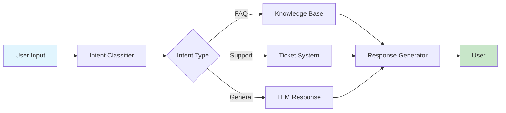

<Warning>
  **Coming Soon**: This example demonstrates Nadoo Builder capabilities, currently available in enterprise preview.
</Warning>

## Overview

Learn how to build a production-ready chatbot using Nadoo Builder's visual interface. This example covers conversation management, intent detection, and knowledge base integration.

## Chatbot Architecture



## Visual Workflow Design

### Step 1: Input Node

Configure the user input node in Builder:

```yaml
node_type: UserInput
configuration:
  name: "User Message"
  input_type: text
  validation:
    required: true
    max_length: 1000
  metadata:
    track_user_id: true
    timestamp: true
```

### Step 2: Intent Classification

Add intent classification node:

```yaml
node_type: LLMNode
configuration:
  name: "Intent Classifier"
  model: gpt-3.5-turbo
  temperature: 0.1
  system_prompt: |
    Classify user intent into one of:
    - faq: Frequently asked questions
    - support: Technical support request
    - sales: Sales inquiry
    - general: General conversation

    Respond with only the intent category.
  output_format: text
```

### Step 3: Conditional Routing

Create branches based on intent:

```yaml
node_type: Conditional
configuration:
  name: "Route by Intent"
  conditions:
    - condition: "intent == 'faq'"
      next_node: "knowledge_base"
    - condition: "intent == 'support'"
      next_node: "create_ticket"
    - condition: "intent == 'sales'"
      next_node: "sales_handler"
    - condition: "intent == 'general'"
      next_node: "general_chat"
  default: "general_chat"
```

### Step 4: Knowledge Base Search

Configure knowledge base retrieval:

```yaml
node_type: VectorSearch
configuration:
  name: "FAQ Search"
  index_name: "faq_index"
  top_k: 3
  similarity_threshold: 0.7
  fields:
    - question
    - answer
    - category
```

### Step 5: Response Generation

Generate final response:

```yaml
node_type: LLMNode
configuration:
  name: "Response Generator"
  model: gpt-4
  temperature: 0.7
  system_prompt: |
    You are a helpful customer service assistant.
    Use the provided context to answer questions.
    Be friendly and concise.
  context_sources:
    - knowledge_base
    - conversation_history
  max_tokens: 500
```

## Code Equivalent

The visual workflow compiles to this Flow Core code:

```python
from nadoo_flow import (
    ChainableNode,
    LLMNode,
    ConditionalNode,
    VectorSearchNode,
    FunctionNode
)

class ChatbotWorkflow:
    def __init__(self):
        # Intent classification
        self.intent_classifier = LLMNode(
            model="gpt-3.5-turbo",
            temperature=0.1,
            system_prompt="""Classify user intent into:
            - faq, support, sales, general"""
        )

        # Knowledge base
        self.kb_search = VectorSearchNode(
            index_name="faq_index",
            top_k=3
        )

        # Response generation
        self.response_gen = LLMNode(
            model="gpt-4",
            temperature=0.7,
            system_prompt="Helpful customer service assistant"
        )

    async def process_message(self, user_input: str, user_id: str):
        # Classify intent
        intent_result = await self.intent_classifier.execute({
            "message": user_input
        })
        intent = intent_result["content"].strip().lower()

        # Route based on intent
        if intent == "faq":
            # Search knowledge base
            kb_results = await self.kb_search.execute({
                "query": user_input
            })

            # Generate response with context
            response = await self.response_gen.execute({
                "user_message": user_input,
                "context": kb_results["results"]
            })

        elif intent == "support":
            # Create support ticket
            response = await self._create_support_ticket(user_input, user_id)

        elif intent == "sales":
            # Route to sales
            response = await self._handle_sales_inquiry(user_input, user_id)

        else:
            # General conversation
            response = await self.response_gen.execute({
                "message": user_input
            })

        return {
            "response": response["content"],
            "intent": intent,
            "user_id": user_id
        }

    async def _create_support_ticket(self, message: str, user_id: str):
        # Ticket creation logic
        return {"content": "Support ticket created. We'll be in touch soon."}

    async def _handle_sales_inquiry(self, message: str, user_id: str):
        # Sales routing logic
        return {"content": "Connecting you with our sales team..."}
```

## Advanced Features

### Conversation Memory

Add context awareness:

```yaml
node_type: ConversationMemory
configuration:
  name: "Chat History"
  max_turns: 10
  include_metadata: true
  summary_threshold: 20
  storage:
    type: redis
    ttl: 3600
```

Generated code:

```python
from nadoo_flow import ConversationMemoryNode

memory = ConversationMemoryNode(
    max_turns=10,
    storage_backend="redis"
)

# Store conversation
await memory.add_turn(
    user_id="user123",
    role="user",
    content=user_input
)

# Get context
history = await memory.get_history(user_id="user123")
```

### Multi-Language Support

Add translation nodes:

```yaml
node_type: LanguageDetector
configuration:
  name: "Detect Language"
  supported_languages:
    - en
    - ko
    - ja
    - zh
  default: en

---

node_type: Translator
configuration:
  name: "Translate Input"
  target_language: en
  provider: google_translate

---

node_type: Translator
configuration:
  name: "Translate Output"
  source_language: en
  target_language: auto  # Detect from input
  provider: google_translate
```

### Sentiment Analysis

Add emotion detection:

```yaml
node_type: SentimentAnalysis
configuration:
  name: "Emotion Detector"
  model: sentiment-analysis-v1
  output_format: structured
  fields:
    - sentiment: [positive, negative, neutral]
    - emotion: [joy, anger, sadness, fear, surprise]
    - confidence: float
  actions:
    - condition: "sentiment == 'negative' and confidence > 0.8"
      action: "escalate_to_human"
```

### Escalation Logic

Handle complex cases:

```yaml
node_type: EscalationHandler
configuration:
  name: "Human Escalation"
  triggers:
    - negative_sentiment: 0.8
    - unresolved_after: 3
    - explicit_request: true
  notification:
    channel: slack
    webhook: "https://hooks.slack.com/..."
  handoff_message: "Connecting you with a human agent..."
```

## Integration Examples

### Slack Integration

```yaml
node_type: SlackIntegration
configuration:
  name: "Slack Connector"
  bot_token: "${SLACK_BOT_TOKEN}"
  channels:
    - general
    - support
  event_types:
    - message
    - app_mention
  response_mode: thread
```

### WhatsApp Business

```yaml
node_type: WhatsAppBusiness
configuration:
  name: "WhatsApp Bot"
  phone_number_id: "${WHATSAPP_PHONE_ID}"
  access_token: "${WHATSAPP_TOKEN}"
  features:
    - text_messages: true
    - media_messages: true
    - interactive_buttons: true
    - templates: true
```

### Web Widget

```yaml
node_type: WebChatWidget
configuration:
  name: "Website Chat"
  appearance:
    theme: light
    primary_color: "#4fc3f7"
    position: bottom-right
  features:
    - file_upload: true
    - typing_indicator: true
    - read_receipts: true
    - emoji_support: true
  rate_limiting:
    messages_per_minute: 10
```

## Testing the Chatbot

### Test Cases in Builder

```yaml
test_scenarios:
  - name: "FAQ Query"
    input:
      message: "What are your business hours?"
      user_id: "test_user_1"
    expected:
      intent: faq
      response_contains: "hours"

  - name: "Support Request"
    input:
      message: "I can't log into my account"
      user_id: "test_user_2"
    expected:
      intent: support
      ticket_created: true

  - name: "General Chat"
    input:
      message: "Hello, how are you?"
      user_id: "test_user_3"
    expected:
      intent: general
      sentiment: positive
```

### Performance Monitoring

```yaml
monitoring:
  metrics:
    - response_time_p95
    - intent_classification_accuracy
    - user_satisfaction_score
    - escalation_rate
  alerts:
    - condition: "response_time_p95 > 2000"
      severity: warning
    - condition: "escalation_rate > 0.3"
      severity: critical
  dashboards:
    - chatbot_performance
    - user_engagement
```

## Deployment

### Production Configuration

```yaml
deployment:
  environment: production
  scaling:
    min_instances: 2
    max_instances: 10
    target_cpu: 70
  resources:
    memory: 2Gi
    cpu: 1000m
  rate_limiting:
    requests_per_second: 100
    burst: 200
```

### API Endpoint

Once deployed, your chatbot is available at:

```bash
POST https://nadoo.ai/api/v1/chat/completions

{
  "messages": [
    {"role": "user", "content": "Hello"}
  ],
  "user_id": "user123",
  "stream": false
}
```

Response:

```json
{
  "id": "chat-abc123",
  "choices": [{
    "message": {
      "role": "assistant",
      "content": "Hello! How can I help you today?"
    },
    "intent": "general",
    "confidence": 0.95
  }],
  "metadata": {
    "response_time_ms": 247,
    "nodes_executed": 5
  }
}
```

## Best Practices

<AccordionGroup>
  <Accordion title="Intent Design">
    - Keep intents focused and distinct
    - Provide clear training examples
    - Use fallback intents for unclear cases
    - Regularly review misclassifications
  </Accordion>
  <Accordion title="Response Quality">
    - Write clear system prompts
    - Use knowledge base for consistency
    - Implement tone guidelines
    - A/B test different prompts
  </Accordion>
  <Accordion title="User Experience">
    - Provide quick acknowledgments
    - Use typing indicators
    - Handle errors gracefully
    - Offer clear escalation paths
  </Accordion>
  <Accordion title="Maintenance">
    - Monitor conversation metrics
    - Update knowledge base regularly
    - Collect user feedback
    - Version control workflows
  </Accordion>
</AccordionGroup>

## Next Steps

<CardGroup cols={2}>
  <Card title="Automation Example" icon="gear" href="/examples/builder/automation">
    Build business process automation
  </Card>
  <Card title="Integration Example" icon="plug" href="/examples/builder/integration">
    Connect external systems
  </Card>
</CardGroup>