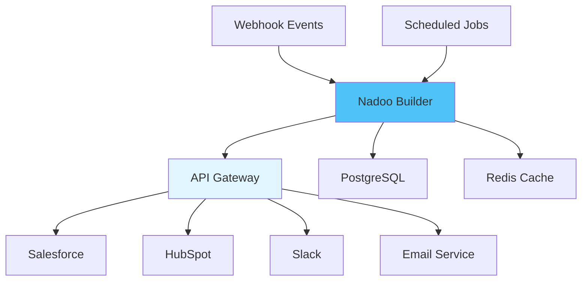

<Warning>
  **Coming Soon**: This example demonstrates Nadoo Builder capabilities, currently available in enterprise preview.
</Warning>

## Overview

Learn how to connect Nadoo Builder workflows with external systems, APIs, and third-party services. This example demonstrates building a comprehensive CRM integration workflow.

## CRM Integration Architecture



## Integration Patterns

### 1. REST API Integration

Configure external API calls:

```yaml
node_type: RestAPI
configuration:
  name: "Salesforce API"
  base_url: "https://api.salesforce.com/v1"
  authentication:
    type: oauth2
    token_url: "https://login.salesforce.com/services/oauth2/token"
    client_id: "${SF_CLIENT_ID}"
    client_secret: "${SF_CLIENT_SECRET}"

  endpoints:
    create_lead:
      method: POST
      path: "/sobjects/Lead"
      headers:
        Content-Type: "application/json"
      body:
        FirstName: "{{first_name}}"
        LastName: "{{last_name}}"
        Company: "{{company}}"
        Email: "{{email}}"

    get_account:
      method: GET
      path: "/sobjects/Account/{{account_id}}"
      cache:
        ttl: 300
        key: "account:{{account_id}}"

  error_handling:
    retry:
      max_attempts: 3
      status_codes: [429, 500, 502, 503]
    fallback:
      on_error: log_and_continue
```

### 2. GraphQL Integration

Connect to GraphQL APIs:

```yaml
node_type: GraphQL
configuration:
  name: "GitHub API"
  endpoint: "https://api.github.com/graphql"
  authentication:
    type: bearer
    token: "${GITHUB_TOKEN}"

  queries:
    get_repository:
      query: |
        query GetRepo($owner: String!, $name: String!) {
          repository(owner: $owner, name: $name) {
            name
            description
            stargazerCount
            forkCount
            issues(first: 10, states: OPEN) {
              totalCount
              nodes {
                title
                createdAt
              }
            }
          }
        }
      variables:
        owner: "{{repo_owner}}"
        name: "{{repo_name}}"

    create_issue:
      mutation: |
        mutation CreateIssue($repoId: ID!, $title: String!, $body: String!) {
          createIssue(input: {
            repositoryId: $repoId,
            title: $title,
            body: $body
          }) {
            issue {
              id
              number
              url
            }
          }
        }
```

### 3. Webhook Integration

Receive and process webhooks:

```yaml
trigger_type: Webhook
configuration:
  name: "Stripe Webhook Handler"
  path: /webhooks/stripe
  method: POST
  authentication:
    type: hmac
    header: Stripe-Signature
    secret: "${STRIPE_WEBHOOK_SECRET}"
    algorithm: sha256

  event_handlers:
    payment_intent.succeeded:
      workflow: process_payment_success

    payment_intent.failed:
      workflow: handle_payment_failure

    customer.subscription.created:
      workflow: provision_subscription

    customer.subscription.deleted:
      workflow: cancel_subscription

  response:
    success:
      status: 200
      body: {"received": true}
    error:
      status: 400
      body: {"error": "{{error_message}}"}
```

## Flow Core Implementation

```python
from nadoo_flow import ChainableNode, APICallNode, WebhookNode
import httpx
from typing import Dict, Any

class CRMIntegration:
    """Integrate multiple CRM systems"""

    def __init__(self):
        self.salesforce = SalesforceClient()
        self.hubspot = HubSpotClient()
        self.slack = SlackClient()

    async def sync_contact(self, contact_data: Dict) -> Dict:
        """Sync contact across systems"""

        # Create/update in Salesforce
        sf_result = await self.salesforce.upsert_contact(contact_data)

        # Sync to HubSpot
        hs_result = await self.hubspot.create_or_update_contact({
            "email": contact_data["email"],
            "firstname": contact_data["first_name"],
            "lastname": contact_data["last_name"],
            "company": contact_data["company"]
        })

        # Notify team
        await self.slack.send_message(
            channel="#sales",
            text=f"New contact synced: {contact_data['email']}"
        )

        return {
            "salesforce_id": sf_result["id"],
            "hubspot_id": hs_result["vid"],
            "status": "synced"
        }

class SalesforceClient:
    """Salesforce API client"""

    def __init__(self):
        self.base_url = "https://api.salesforce.com/v1"
        self.token = None

    async def authenticate(self):
        """Get OAuth token"""
        async with httpx.AsyncClient() as client:
            response = await client.post(
                "https://login.salesforce.com/services/oauth2/token",
                data={
                    "grant_type": "client_credentials",
                    "client_id": os.getenv("SF_CLIENT_ID"),
                    "client_secret": os.getenv("SF_CLIENT_SECRET")
                }
            )
            self.token = response.json()["access_token"]

    async def upsert_contact(self, data: Dict) -> Dict:
        """Create or update contact"""
        if not self.token:
            await self.authenticate()

        async with httpx.AsyncClient() as client:
            # Check if exists
            search_response = await client.get(
                f"{self.base_url}/query",
                params={"q": f"SELECT Id FROM Contact WHERE Email='{data['email']}'"},
                headers={"Authorization": f"Bearer {self.token}"}
            )

            existing = search_response.json().get("records", [])

            if existing:
                # Update existing
                contact_id = existing[0]["Id"]
                response = await client.patch(
                    f"{self.base_url}/sobjects/Contact/{contact_id}",
                    json=data,
                    headers={"Authorization": f"Bearer {self.token}"}
                )
            else:
                # Create new
                response = await client.post(
                    f"{self.base_url}/sobjects/Contact",
                    json=data,
                    headers={"Authorization": f"Bearer {self.token}"}
                )

            return response.json()

class HubSpotClient:
    """HubSpot API client"""

    def __init__(self):
        self.api_key = os.getenv("HUBSPOT_API_KEY")
        self.base_url = "https://api.hubapi.com"

    async def create_or_update_contact(self, data: Dict) -> Dict:
        """Create or update contact in HubSpot"""
        async with httpx.AsyncClient() as client:
            response = await client.post(
                f"{self.base_url}/contacts/v1/contact/createOrUpdate/email/{data['email']}",
                json={"properties": [
                    {"property": k, "value": v}
                    for k, v in data.items() if k != "email"
                ]},
                params={"hapikey": self.api_key}
            )
            return response.json()

    async def create_deal(self, deal_data: Dict) -> Dict:
        """Create deal in HubSpot"""
        async with httpx.AsyncClient() as client:
            response = await client.post(
                f"{self.base_url}/deals/v1/deal",
                json={
                    "properties": [
                        {"name": k, "value": v}
                        for k, v in deal_data.items()
                    ]
                },
                params={"hapikey": self.api_key}
            )
            return response.json()

class SlackClient:
    """Slack integration"""

    def __init__(self):
        self.webhook_url = os.getenv("SLACK_WEBHOOK_URL")

    async def send_message(self, channel: str, text: str) -> Dict:
        """Send message to Slack"""
        async with httpx.AsyncClient() as client:
            response = await client.post(
                self.webhook_url,
                json={
                    "channel": channel,
                    "text": text,
                    "username": "Nadoo Bot"
                }
            )
            return {"status": "sent"}
```

## Advanced Integration Scenarios

### Multi-System Data Sync

```yaml
workflow_name: Contact Data Sync
trigger: ContactUpdated

nodes:
  - name: Detect Changes
    type: ChangeDetection
    compare_fields:
      - email
      - name
      - company
      - phone

  - name: Update Salesforce
    type: ConditionalNode
    condition: "changes.length > 0"
    true_path:
      - type: SalesforceAPI
        action: update_contact

  - name: Update HubSpot
    type: ConditionalNode
    condition: "changes.length > 0"
    true_path:
      - type: HubSpotAPI
        action: update_contact

  - name: Update Internal DB
    type: DatabaseNode
    action: update
    table: contacts

  - name: Audit Log
    type: AuditLogger
    log_changes: true
    notify_on_conflicts: true
```

### Event-Driven Integration

```yaml
workflow_name: Order Processing Pipeline
trigger: OrderCreated

nodes:
  - name: Validate Order
    type: ValidationNode
    rules:
      - inventory_available
      - customer_verified
      - payment_authorized

  - name: Create in ERP
    type: SAPIntegration
    action: create_sales_order

  - name: Update CRM
    type: ParallelNode
    execute:
      - SalesforceAPI:
          action: create_opportunity
      - HubSpotAPI:
          action: create_deal

  - name: Notify Fulfillment
    type: APICall
    endpoint: warehouse_system
    action: create_fulfillment_order

  - name: Send Confirmations
    type: ParallelNode
    execute:
      - EmailNode:
          template: order_confirmation
          to: "{{customer_email}}"
      - SlackNode:
          channel: "#orders"
          message: "New order: {{order_id}}"
```

### Real-Time Data Enrichment

```yaml
workflow_name: Lead Enrichment
trigger: LeadCaptured

nodes:
  - name: Enrich from Clearbit
    type: RestAPI
    endpoint: "https://person.clearbit.com/v2/combined/find"
    params:
      email: "{{email}}"
    auth:
      type: bearer
      token: "${CLEARBIT_API_KEY}"

  - name: Company Lookup
    type: RestAPI
    endpoint: "https://company.clearbit.com/v2/companies/find"
    params:
      domain: "{{email_domain}}"

  - name: Social Profiles
    type: ParallelNode
    execute:
      - LinkedInAPI:
          action: find_profile
      - TwitterAPI:
          action: lookup_user

  - name: Score Lead
    type: LLMNode
    model: gpt-4
    prompt: |
      Based on this data, score the lead quality (1-10):
      {{enriched_data}}

  - name: Route to Sales
    type: ConditionalRouter
    conditions:
      - score >= 8: "hot_leads_queue"
      - score >= 5: "warm_leads_queue"
      - default: "cold_leads_queue"
```

## Database Integration

### PostgreSQL Operations

```yaml
integration:
  type: PostgreSQL
  configuration:
    connection_string: "${DATABASE_URL}"
    pool_size: 10
    ssl_mode: require

  operations:
    - name: Create Customer Record
      query: |
        INSERT INTO customers (
          email, name, company, created_at
        ) VALUES ($1, $2, $3, NOW())
        ON CONFLICT (email)
        DO UPDATE SET
          name = EXCLUDED.name,
          company = EXCLUDED.company,
          updated_at = NOW()
        RETURNING id
      params:
        - "{{email}}"
        - "{{name}}"
        - "{{company}}"

    - name: Get Customer Data
      query: |
        SELECT c.*,
               COUNT(o.id) as order_count,
               SUM(o.total) as lifetime_value
        FROM customers c
        LEFT JOIN orders o ON c.id = o.customer_id
        WHERE c.email = $1
        GROUP BY c.id
      params:
        - "{{email}}"
      cache:
        ttl: 60
```

### MongoDB Operations

```yaml
integration:
  type: MongoDB
  configuration:
    connection_string: "${MONGO_URL}"
    database: nadoo_data

  collections:
    events:
      operations:
        insert:
          document:
            event_type: "{{type}}"
            user_id: "{{user_id}}"
            data: "{{data}}"
            timestamp: "{{now}}"

        find:
          filter:
            user_id: "{{user_id}}"
            timestamp:
              $gte: "{{start_date}}"
              $lte: "{{end_date}}"
          sort:
            timestamp: -1
          limit: 100
```

## Message Queue Integration

### RabbitMQ

```yaml
integration:
  type: RabbitMQ
  configuration:
    host: "${RABBITMQ_HOST}"
    port: 5672
    username: "${RABBITMQ_USER}"
    password: "${RABBITMQ_PASS}"

  queues:
    - name: order_processing
      durable: true
      consumer:
        prefetch_count: 10
        workflow: process_order

    - name: email_notifications
      durable: true
      consumer:
        prefetch_count: 50
        workflow: send_email

  publishers:
    - exchange: events
      routing_key: "order.created"
      message:
        type: "order_created"
        data: "{{order_data}}"
```

### Kafka

```yaml
integration:
  type: Kafka
  configuration:
    bootstrap_servers: "${KAFKA_BROKERS}"
    security_protocol: SASL_SSL
    sasl_mechanism: PLAIN
    sasl_username: "${KAFKA_USER}"
    sasl_password: "${KAFKA_PASS}"

  topics:
    - name: user_events
      consumer:
        group_id: nadoo_processors
        auto_offset_reset: earliest
        workflow: process_user_event

    - name: analytics
      producer:
        key: "{{user_id}}"
        value: "{{event_data}}"
        headers:
          source: nadoo_builder
```

## Cloud Service Integration

### AWS Services

```yaml
aws_integrations:
  - service: S3
    operations:
      upload:
        bucket: "${S3_BUCKET}"
        key: "uploads/{{filename}}"
        body: "{{file_data}}"
        acl: private

      download:
        bucket: "${S3_BUCKET}"
        key: "{{file_key}}"

  - service: SNS
    operations:
      publish:
        topic_arn: "${SNS_TOPIC_ARN}"
        message: "{{message}}"
        subject: "{{subject}}"

  - service: SQS
    operations:
      send_message:
        queue_url: "${SQS_QUEUE_URL}"
        message_body: "{{message}}"
        delay_seconds: 0
```

### Google Cloud

```yaml
gcp_integrations:
  - service: CloudStorage
    operations:
      upload:
        bucket: "${GCS_BUCKET}"
        filename: "{{filename}}"
        content: "{{data}}"

  - service: PubSub
    operations:
      publish:
        topic: "projects/{{project}}/topics/{{topic}}"
        data: "{{message}}"
        attributes:
          source: nadoo
```

## Authentication Patterns

### OAuth 2.0

```yaml
authentication:
  type: oauth2
  flow: authorization_code
  authorization_url: "https://provider.com/oauth/authorize"
  token_url: "https://provider.com/oauth/token"
  client_id: "${OAUTH_CLIENT_ID}"
  client_secret: "${OAUTH_CLIENT_SECRET}"
  scopes:
    - read:user
    - write:data
  redirect_uri: "https://nadoo.ai/oauth/callback"
```

### API Key

```yaml
authentication:
  type: api_key
  location: header
  name: X-API-Key
  value: "${API_KEY}"
```

### JWT

```yaml
authentication:
  type: jwt
  secret: "${JWT_SECRET}"
  algorithm: HS256
  claims:
    iss: nadoo_builder
    exp: "{{timestamp + 3600}}"
```

## Error Handling and Retries

```yaml
error_handling:
  retry_policy:
    max_attempts: 3
    backoff:
      type: exponential
      initial_delay: 1s
      max_delay: 30s
      multiplier: 2
    retry_on:
      - network_error
      - timeout
      - status_code: [429, 500, 502, 503]

  circuit_breaker:
    failure_threshold: 5
    success_threshold: 2
    timeout: 60s

  fallback:
    on_failure: use_cache
    cache_ttl: 300
```

## Best Practices

<AccordionGroup>
  <Accordion title="API Management">
    - Use connection pooling for better performance
    - Implement rate limiting and backoff
    - Cache responses when appropriate
    - Version your API integrations
  </Accordion>
  <Accordion title="Security">
    - Never hardcode credentials
    - Use environment variables for secrets
    - Rotate API keys regularly
    - Implement proper authentication
  </Accordion>
  <Accordion title="Reliability">
    - Implement retry logic with exponential backoff
    - Use circuit breakers for external services
    - Handle partial failures gracefully
    - Monitor integration health
  </Accordion>
  <Accordion title="Data Consistency">
    - Use idempotent operations
    - Implement proper transaction handling
    - Keep audit logs of all integrations
    - Plan for data reconciliation
  </Accordion>
</AccordionGroup>

## Next Steps

<CardGroup cols={2}>
  <Card title="Chatbot Example" icon="robot" href="/examples/builder/chatbot">
    Build intelligent chatbots
  </Card>
  <Card title="API Reference" icon="code" href="/api/overview">
    Explore API documentation
  </Card>
</CardGroup>