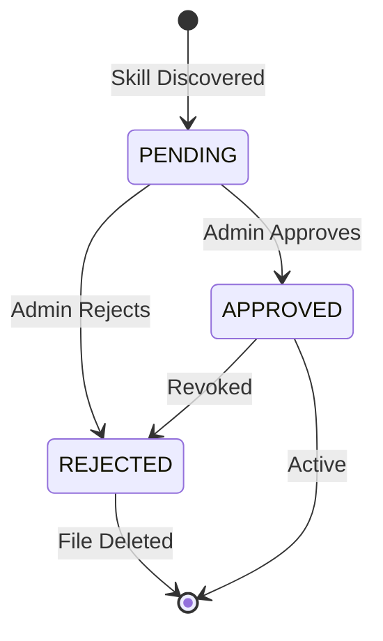

## Overview

A skill is a self-contained unit of functionality defined by a `SKILL.md` manifest file. The manifest declares metadata, input/output schemas, required permissions, and execution instructions. Once registered and approved, skills become available as tools that AI agents can invoke during workflow execution.

<Info>
  Skills use a markdown-first approach. You define the entire skill -- including its contract and behavior -- in a single `SKILL.md` file. No SDK installation or boilerplate code is required.
</Info>

## SKILL.md Manifest Format

Every skill starts with a `SKILL.md` file placed at the root of a directory or Git repository. The file consists of YAML front matter followed by structured markdown sections.

### Full Example

```markdown
---
name: pr-reviewer
description: Reviews pull request diffs and provides structured feedback
version: 1.2.0
author: your-org
tags: [code-review, automation, devops]
---

## Input Schema

| Parameter  | Type    | Required | Description                                  |
|------------|---------|----------|----------------------------------------------|
| diff       | string  | yes      | The unified diff content of the pull request |
| language   | string  | no       | Primary programming language (default: auto) |
| max_issues | integer | no       | Maximum issues to report (default: 10)       |

## Output Schema

| Field    | Type    | Description                                |
|----------|---------|--------------------------------------------|
| summary  | string  | One-paragraph summary of the review        |
| issues   | array   | List of issues with severity and line      |
| approved | boolean | Whether the PR passes review               |

## Permissions

- `llm:invoke` -- Invoke LLM models for code analysis

## Instructions

Review the provided pull request diff for bugs, security vulnerabilities,
performance issues, and readability concerns. Return structured feedback.
```

### Front Matter Reference

The YAML front matter block defines the skill's identity and metadata.

| Field | Required | Description |
|-------|----------|-------------|
| `name` | Yes | Unique identifier (2-100 chars, alphanumeric + hyphens/underscores/dots) |
| `description` | Yes | Human-readable summary shown to agents and admins (max 1000 chars) |
| `version` | Yes | Semantic version (e.g., `1.0.0`); multiple versions can coexist |
| `author` | No | Author or organization name |
| `tags` | No | List of categories for search and filtering |

<Warning>
  The `name` field must not contain path separators (`/`, `\`) or `..` sequences. This restriction prevents path-traversal attacks in the storage layer.
</Warning>

### Manifest Sections

<AccordionGroup>
  <Accordion title="Input Schema">
    Defines the parameters your skill accepts. Each row maps to a JSON Schema property. The `Required` column determines whether the parameter is mandatory.

    Supported types: `string`, `integer`, `number`, `boolean`, `array`, `object`.

    When an AI agent invokes the skill, these parameters are validated and passed as keyword arguments.
  </Accordion>

  <Accordion title="Output Schema">
    Describes the structure of the skill's return value. This helps agents understand and process the result. The output is serialized as JSON when returned to the calling workflow.
  </Accordion>

  <Accordion title="Permissions">
    Declares the platform resources your skill requires. During execution, the worker validates these against the workspace's allowed permissions. If any permission is missing, execution is denied.

    Common permissions:
    - `llm:invoke` -- Call LLM models
    - `network` -- Make outbound HTTP requests
    - `file_read` -- Read files from allowed paths
    - `file_write` -- Write files to allowed paths
    - `storage:read` -- Access workspace storage
    - `shell` -- Execute shell commands
  </Accordion>

  <Accordion title="Instructions">
    Free-form markdown that describes how the skill should behave. For prompt-based skills, this section acts as the system prompt. For code-based skills, it documents the execution logic found in the entry point file.
  </Accordion>
</AccordionGroup>

## Registering Skills

Skills are loaded into a workspace through **Skill Sources**. A source points to a Git repository or a local directory and handles synchronization automatically.

<Tabs>
  <Tab title="Git Repository">
    Register a Git repository containing one or more skills:

    ```bash
    # Via API
    curl -X POST /api/v1/{workspace_id}/skill-sources \
      -H "Authorization: Bearer $TOKEN" \
      -d '{
        "name": "team-skills",
        "description": "Shared team skill repository",
        "source_type": "git_repo",
        "git_url": "https://github.com/your-org/skills.git",
        "git_branch": "main",
        "git_auth_type": "token",
        "sync_interval_minutes": 60,
        "require_approval": true
      }'
    ```

    The platform clones the repository, discovers all `SKILL.md` files, and indexes them. Skills from new sources enter `PENDING` status by default.

    **Authentication options:**

    | Auth Type | Description |
    |-----------|-------------|
    | `none` | Public repositories |
    | `token` | Personal access token or deploy token |
    | `ssh_key` | SSH key-based authentication |
  </Tab>

  <Tab title="Local Path">
    Register a local directory for development and testing:

    ```bash
    curl -X POST /api/v1/{workspace_id}/skill-sources \
      -H "Authorization: Bearer $TOKEN" \
      -d '{
        "name": "dev-skills",
        "description": "Local development skills",
        "source_type": "local_path",
        "local_path": "/opt/nadoo/skills/custom",
        "sync_interval_minutes": 5,
        "require_approval": false,
        "trusted": true
      }'
    ```

    <Warning>
      Local path sources bypass network-based isolation. Use Git repository sources for production deployments.
    </Warning>
  </Tab>

  <Tab title="Direct Upload">
    Upload a single `SKILL.md` file directly via the API using `POST /api/v1/{workspace_id}/skills/upload` with the `skill_md` field containing the full markdown content. Uploaded skills are associated with an auto-created source and enter `PENDING` review status.
  </Tab>
</Tabs>

## Review and Approval

After registration, skills go through a review workflow before they become available to agents.



- **PENDING**: Skill is indexed but not yet available. Admins can inspect the manifest, permissions, and source code.
- **APPROVED**: Skill is saved to storage (`skills/{workspace_id}/{name}/SKILL.md`) and available for execution.
- **REJECTED**: Skill file is removed from storage and the skill cannot be used.

<Info>
  Trusted sources (where `trusted: true`) can be configured to auto-approve skills, skipping the manual review step. Use this only for repositories you fully control.
</Info>

### Approving via API

```bash
# Approve a skill
curl -X PUT /api/v1/{workspace_id}/skills/{skill_id}/approve \
  -H "Authorization: Bearer $TOKEN" \
  -d '{"note": "Reviewed -- permissions are appropriate."}'

# Reject a skill
curl -X PUT /api/v1/{workspace_id}/skills/{skill_id}/reject \
  -H "Authorization: Bearer $TOKEN" \
  -d '{"note": "Requires network permission without justification."}'
```

## Tutorial: Create Your First Skill

Follow these steps to create, register, and use a skill from scratch.

<Steps>
  <Step title="Create the SKILL.md file">
    Create a new directory and add a `SKILL.md` manifest:

    ```markdown
    ---
    name: word-counter
    description: Counts words, sentences, and characters in text
    version: 1.0.0
    author: my-team
    tags:
      - text-analysis
      - utility
    ---

    ## Input Schema

    | Parameter | Type   | Required | Description          |
    |-----------|--------|----------|----------------------|
    | text      | string | yes      | The text to analyze  |

    ## Output Schema

    | Field      | Type    | Description              |
    |------------|---------|--------------------------|
    | words      | integer | Total word count         |
    | sentences  | integer | Total sentence count     |
    | characters | integer | Total character count    |

    ## Permissions

    (No permissions required)

    ## Instructions

    Count the words, sentences, and characters in the provided text.
    Return the counts as structured data.
    ```
  </Step>

  <Step title="Add an entry point (optional)">
    For code-based skills, add a `skill.py` alongside the manifest. The worker passes parameters as JSON via stdin and reads JSON from stdout:

    ```python
    import json, re, sys

    def main(text: str) -> dict:
        return {
            "words": len(text.split()),
            "sentences": len(re.split(r'[.!?]+', text.strip())),
            "characters": len(text),
        }

    if __name__ == "__main__":
        params = json.loads(sys.stdin.read())
        print(json.dumps(main(**params)))
    ```
  </Step>

  <Step title="Push to a Git repository">
    ```bash
    git init && git add . && git commit -m "Add word-counter skill"
    git remote add origin https://github.com/your-org/word-counter-skill.git
    git push -u origin main
    ```
  </Step>

  <Step title="Register the skill source">
    Add the repository as a skill source in your workspace via the UI (**Workspace Settings > Skills > Add Source**) or the API. The platform clones the repo and discovers the `SKILL.md`.
  </Step>

  <Step title="Approve and use">
    Review the discovered skill in the admin panel. Once approved, the skill appears as `skill:word-counter` in AI agent tool lists and can be invoked from any workflow node.
  </Step>
</Steps>

## How Skills Become Agent Tools

When a workflow runs an AI Agent node, the platform loads all approved skills for the workspace and converts them into LangChain `StructuredTool` instances. Each skill is exposed to the LLM as a callable tool named `skill:{name}`.

```
Skill (DB)                    StructuredTool (LangChain)
--------------------          ----------------------------
name: "word-counter"    -->   name: "skill:word-counter"
input_schema: {...}     -->   args_schema: WordCounterInput
description: "..."      -->   description: "..."
```

The agent decides when to call the tool based on the user's request. When invoked, the `SkillWorkerService` executes the skill in an isolated environment and returns the result to the agent.

## Next Steps

<CardGroup cols={2}>
  <Card title="Skill Worker" icon="server" href="/extend/skills/skill-worker">
    Learn how skills execute in isolated worker environments
  </Card>
  <Card title="Skills Overview" icon="wand-magic-sparkles" href="/extend/skills/overview">
    Return to the skills system overview
  </Card>
</CardGroup>
