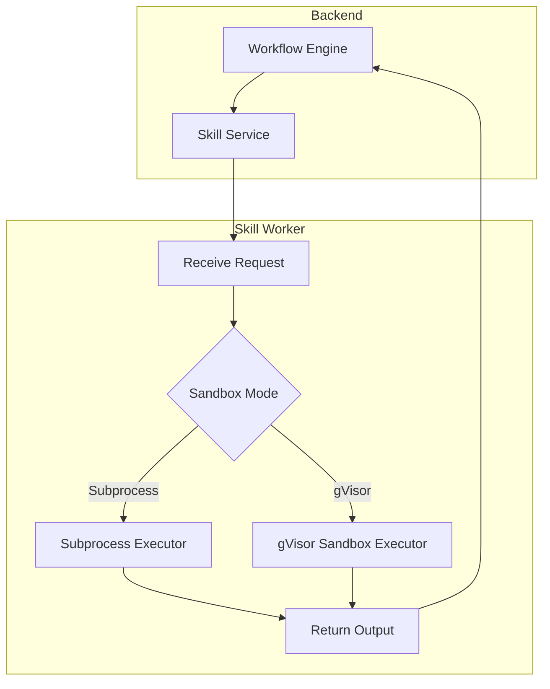

## What are Skills?

Skills are **reusable, executable units** that extend the capabilities of your AI agents. Each skill is defined by a `SKILL.md` file that declares its name, description, input/output schema, and permission requirements. Skills can be loaded from Git repositories or local paths, and they execute in isolated workers to ensure safety and reliability.

<Info>
  Skills are the recommended way to share and distribute reusable agent capabilities across teams, projects, and the broader Nadoo community.
</Info>

## Skills vs. Plugins

While both Skills and Plugins extend the platform, they serve different use cases and follow different development models.

| Feature | Skills | Plugins |
|---------|--------|---------|
| **Definition format** | Markdown-based (`SKILL.md`) | Python SDK with decorator API |
| **Source** | Git repositories, local paths | Python packages (`pip install`) |
| **Execution** | Isolated skill worker (subprocess / gVisor sandbox) | In-process within the backend |
| **Distribution** | Git URL or local directory | PyPI or private registry |
| **Development overhead** | Low -- write a `SKILL.md` and supporting scripts | Medium -- implement `NadooPlugin` class |
| **Best for** | Shareable automations, prompt-based tasks, scripted operations | Deep platform integrations, API connectors, custom tools |

<CardGroup cols={2}>
  <Card title="Plugin SDK" icon="puzzle-piece" href="/extend/plugin-sdk/overview">
    Build plugins with the Python SDK for deep platform integration
  </Card>
  <Card title="Official Plugins" icon="box-open" href="/extend/plugins/overview">
    Browse pre-built plugins maintained by the Nadoo team
  </Card>
</CardGroup>

## Skill Lifecycle

Every skill goes through a defined lifecycle from registration to execution.

<Steps>
  <Step title="Registration">
    A workspace admin registers a skill by providing a Git repository URL or local file path. The platform clones the repository and reads the `SKILL.md` manifest.
  </Step>
  <Step title="Review">
    The skill's declared permissions, input/output schema, and description are presented for review. Admins can inspect the skill's source code before approving.
  </Step>
  <Step title="Approval">
    Once reviewed, the admin approves the skill. It becomes available for use in workflows and by AI agents within the workspace.
  </Step>
  <Step title="Execution">
    When an agent or workflow invokes the skill, the **Skill Worker** launches it in an isolated environment (subprocess or gVisor sandbox), passes the declared inputs, and returns the outputs.
  </Step>
</Steps>


## Skill Sources

Skills can be loaded from two types of sources.

### Git Repositories

Point to any Git repository containing a `SKILL.md` at the root. The platform clones the repo and keeps it synchronized.

```
https://github.com/your-org/your-skill.git
https://github.com/your-org/your-skill.git#branch-name
https://github.com/your-org/your-skill.git#v1.2.0
```

<Info>
  You can pin a specific branch, tag, or commit hash by appending `#ref` to the Git URL.
</Info>

### Local Paths

During development, you can register a skill from a local directory on the server filesystem.

```
/path/to/your/skill-directory
```

<Warning>
  Local path sources are intended for development and testing only. Use Git repository sources for production deployments.
</Warning>

## SKILL.md Format

Every skill is defined by a `SKILL.md` file at the root of its directory or repository. This file uses a structured Markdown format with YAML front matter.

```markdown
---
name: summarize-document
description: Summarizes a document using an LLM with configurable detail level
version: 1.0.0
author: your-org
---

## Input Schema

| Parameter | Type   | Required | Description                          |
|-----------|--------|----------|--------------------------------------|
| document  | string | yes      | The full text of the document        |
| level     | string | no       | Detail level: brief, standard, detailed (default: standard) |

## Output Schema

| Field   | Type   | Description                  |
|---------|--------|------------------------------|
| summary | string | The generated summary        |
| tokens  | number | Token count of the summary   |

## Permissions

- `llm:invoke` -- Requires access to invoke LLM models
- `storage:read` -- Requires read access to workspace storage

## Instructions

Summarize the provided document according to the requested detail level.
For "brief" level, produce 2-3 sentences.
For "standard" level, produce a paragraph.
For "detailed" level, produce a multi-paragraph summary preserving key details.
```

### Front Matter Fields

| Field | Required | Description |
|-------|----------|-------------|
| `name` | Yes | Unique identifier for the skill (kebab-case) |
| `description` | Yes | Human-readable description of what the skill does |
| `version` | Yes | Semantic version number |
| `author` | No | Author or organization name |

### Sections

- **Input Schema** -- Defines the parameters the skill accepts, including types and whether they are required
- **Output Schema** -- Defines the structure of the skill's return value
- **Permissions** -- Declares what platform resources the skill needs access to (LLM, knowledge base, storage, network)
- **Instructions** -- The execution instructions or prompt template for the skill

## Skill Worker

The Skill Worker is a separate service responsible for executing skills in isolation. This architecture ensures that skills cannot interfere with the main platform or with each other.

<CardGroup cols={2}>
  <Card title="Subprocess Mode" icon="terminal">
    **Default mode.** Each skill execution runs in a separate OS subprocess with resource limits (CPU time, memory, file system access).
  </Card>
  <Card title="gVisor Sandbox" icon="shield-halved">
    **Production mode.** Skills run inside a gVisor sandbox for stronger isolation with syscall filtering, network restrictions, and filesystem containment.
  </Card>
</CardGroup>

### Execution Flow



### Worker Configuration

The skill worker connects to Redis for task queuing and communicates with the backend via internal API.

| Setting | Environment Variable | Default | Description |
|---------|---------------------|---------|-------------|
| Sandbox mode | `SKILL_SANDBOX_MODE` | `subprocess` | `subprocess` or `gvisor` |
| Max execution time | `SKILL_MAX_EXECUTION_TIME` | `30` | Maximum seconds per execution |
| Max memory | `SKILL_MAX_MEMORY_MB` | `256` | Maximum memory in MB |
| Worker concurrency | `SKILL_WORKER_CONCURRENCY` | `4` | Number of concurrent skill executions |

## Managing Skills

### Register a Skill

Navigate to **Workspace Settings > Skills** and provide the Git repository URL or local path.

### View Registered Skills

All approved skills appear in the skills list with their name, description, version, source, and status.

### Use a Skill in a Workflow

Add a **Skill Node** to your workflow graph and select the skill from the dropdown. Map the node's inputs to the skill's input schema.

### Update a Skill

For Git-based skills, trigger a re-sync to pull the latest changes from the repository. The updated `SKILL.md` is re-parsed and changes take effect immediately.

## Next Steps

<CardGroup cols={2}>
  <Card title="Plugin SDK" icon="puzzle-piece" href="/extend/plugin-sdk/overview">
    Build deeper integrations with the Python Plugin SDK
  </Card>
  <Card title="Workflow Engine" icon="diagram-project" href="/workflow/overview">
    Learn how to use skills within visual workflows
  </Card>
  <Card title="Self-Hosting" icon="server" href="/self-hosting/overview">
    Configure skill worker deployment settings
  </Card>
  <Card title="API Reference" icon="code" href="/api/overview">
    Manage skills programmatically via the REST API
  </Card>
</CardGroup>
