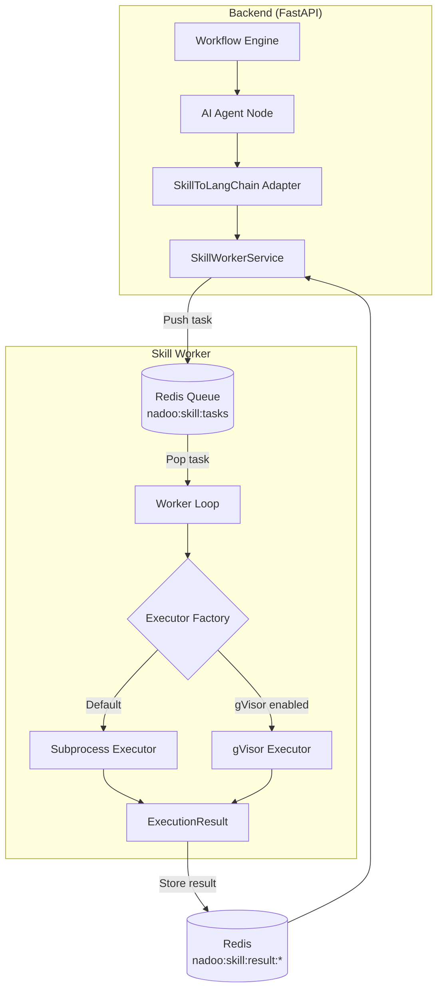
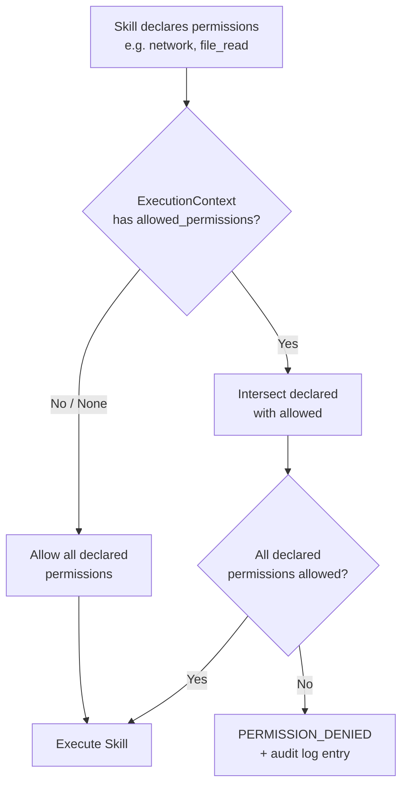

## Overview

The Skill Worker is a standalone service that executes skills in isolated environments. It runs separately from the main backend, ensuring that skill code cannot interfere with the platform or other tenants. The worker listens for tasks on a Redis queue, executes them using a configurable executor, and returns results.

<Info>
  In development, the Skill Worker runs as part of the backend process. For production, deploy it as a separate container with its own scaling policy.
</Info>

## Architecture

The Skill Worker sits between the backend API and the actual skill execution environment. When a workflow invokes a skill, the backend's `SkillWorkerService` dispatches a task to the worker via Redis. The worker picks up the task, runs it in a sandbox, and posts the result back.



### Key Components

| Component | Responsibility |
|-----------|---------------|
| **SkillWorkerService** | Backend service that validates permissions, resolves skill paths, and dispatches execution tasks |
| **Redis Queue** | Task queue (`nadoo:skill:tasks`) decoupling the backend from worker processes |
| **Executor Factory** | Selects the appropriate executor based on configuration and system capabilities |
| **SubprocessExecutor** | Default executor using OS-level process isolation with resource limits |
| **GVisorExecutor** | Production-grade executor with kernel-level sandboxing via gVisor's `runsc` |

## Execution Flow

When an AI agent invokes a skill, the following sequence occurs:

<Steps>
  <Step title="Validation">
    The `SkillWorkerService` verifies the skill is `APPROVED`, validates that all declared permissions are allowed by the execution context, and resolves the skill's filesystem path.
  </Step>
  <Step title="Concurrency Control">
    A per-workspace semaphore limits concurrent executions to 10 by default. If the workspace is at capacity, the request waits up to 30 seconds before returning a `RESOURCE_LIMIT` error.
  </Step>
  <Step title="Task Dispatch">
    The task (skill path, entry point, parameters, permissions) is pushed to the Redis queue `nadoo:skill:tasks`.
  </Step>
  <Step title="Executor Selection">
    The worker pops the task and routes it to the configured executor -- `SubprocessExecutor` by default, or `GVisorExecutor` when gVisor is enabled and the `runsc` binary is available.
  </Step>
  <Step title="Isolated Execution">
    The executor runs the skill's entry point (default: `skill.py`) in a sandboxed environment with enforced resource limits (memory, CPU, timeout). Parameters are passed via stdin as JSON.
  </Step>
  <Step title="Result Return">
    The `ExecutionResult` is serialized and stored in Redis with a 1-hour TTL at the key `nadoo:skill:result:{task_id}`. The backend reads this result and returns it to the calling agent.
  </Step>
</Steps>

## Executor Types

The worker supports two executor implementations with different isolation guarantees.

<AccordionGroup>
  <Accordion title="Subprocess Executor (Default)">
    Uses Python's `subprocess` module to run skills in a separate OS process.

    **Isolation features:**
    - Separate process with its own memory space
    - Configurable memory limit (`RLIMIT_AS`)
    - CPU time limit enforcement
    - Execution timeout with automatic kill
    - Restricted filesystem access via `allowed_paths`
    - Network access controlled by permission flag

    **Requirements:** None -- works on any system with Python installed.

    **Best for:** Development, testing, and environments where gVisor is not available.
  </Accordion>

  <Accordion title="gVisor Executor (Production)">
    Uses Google's [gVisor](https://gvisor.dev/) runtime (`runsc`) to execute skills inside a user-space kernel sandbox.

    **Isolation features:**
    - Syscall filtering -- only allows a safe subset of system calls
    - Network namespace isolation -- skills cannot reach the host network unless explicitly allowed
    - Filesystem containment -- skills see only their own directory
    - Memory and CPU cgroup enforcement
    - Kernel-level separation from the host OS

    **Requirements:** The `runsc` binary must be installed and accessible on the worker host.

    **Best for:** Production deployments handling untrusted or community-contributed skills.
  </Accordion>
</AccordionGroup>

## ExecutionResult

Every skill execution produces an `ExecutionResult` with the following fields:

```python
@dataclass
class ExecutionResult:
    status: ExecutionStatus       # success | error | timeout | permission_denied | resource_limit
    output: Any = None            # Skill output (dict, string, etc.)
    error: str | None = None      # Error message if execution failed
    stdout: str = ""              # Captured standard output
    stderr: str = ""              # Captured standard error
    exit_code: int | None = None  # Process exit code
    execution_time_ms: int = 0    # Total execution time in milliseconds
    started_at: datetime = None   # Timestamp when execution started
    finished_at: datetime = None  # Timestamp when execution completed
    memory_used_mb: float = None  # Peak memory usage in MB
```

The `ExecutionStatus` enum covers five possible outcomes:

| Status | Description |
|--------|-------------|
| `SUCCESS` | Skill completed normally, output is available |
| `ERROR` | Skill raised an exception or returned a non-zero exit code |
| `TIMEOUT` | Execution exceeded the configured timeout |
| `PERMISSION_DENIED` | Required permissions were not allowed by the execution context |
| `RESOURCE_LIMIT` | Memory, CPU, or concurrency limits were exceeded |

## Permission Enforcement

The worker enforces a two-level permission model before executing any skill.



1. **Skill-level**: Each skill declares its required permissions in the `SKILL.md` manifest (e.g., `network`, `file_read`, `shell`).
2. **Context-level**: The `ExecutionContext` may specify `allowed_permissions` to restrict what a particular invocation can do. If set to `None`, all declared permissions are allowed.

If any required permission is not in the allowed set, the execution is blocked and an audit log entry is created.

## Configuration Reference

All configuration is managed through environment variables with the `NADOO_` prefix.

| Variable | Default | Description |
|----------|---------|-------------|
| `NADOO_WORKER_ID` | `worker-1` | Unique identifier for this worker instance |
| `NADOO_SKILL_WORKER_TIMEOUT` | `300` | Max execution time per skill (seconds) |
| `NADOO_SKILL_WORKER_MAX_MEMORY_MB` | `512` | Max memory per execution (MB) |
| `NADOO_SKILL_WORKER_MAX_CPU_PERCENT` | `100` | Max CPU usage percentage |
| `NADOO_SKILL_WORKER_NETWORK_ENABLED` | `false` | Allow outbound network (requires `network` permission) |
| `NADOO_SKILL_WORKER_GVISOR_ENABLED` | `false` | Use gVisor sandbox instead of subprocess |
| `NADOO_REDIS_HOST` | `localhost` | Redis server hostname |
| `NADOO_REDIS_PORT` | `6379` | Redis server port |
| `NADOO_REDIS_PASSWORD` | -- | Redis password (optional) |
| `NADOO_REDIS_DB` | `0` | Redis database number |
| `NADOO_BACKEND_URL` | `http://localhost:8000` | Backend API URL for skill registry |
| `NADOO_BACKEND_API_KEY` | -- | API key for backend authentication |
| `NADOO_SKILL_CACHE_DIR` | System temp dir | Cache directory for cloned Git repos |
| `NADOO_SKILL_WORKER_TEMP_DIR` | System temp dir | Temp directory for execution artifacts |

## Deployment

### Docker

```bash
# Build the standard worker image
docker build -t nadoo-skill-worker .

# Build with gVisor support
docker build --build-arg ENABLE_GVISOR=1 -t nadoo-skill-worker:gvisor .

# Run the worker
docker run \
  -e NADOO_REDIS_HOST=redis \
  -e NADOO_WORKER_ID=worker-1 \
  -e NADOO_SKILL_WORKER_MAX_MEMORY_MB=1024 \
  -e NADOO_SKILL_WORKER_TIMEOUT=120 \
  nadoo-skill-worker
```

### Docker Compose

```yaml
services:
  skill-worker:
    build: ./packages/skill-worker
    environment:
      NADOO_WORKER_ID: worker-1
      NADOO_REDIS_HOST: redis
      NADOO_SKILL_WORKER_GVISOR_ENABLED: "false"
      NADOO_SKILL_WORKER_TIMEOUT: "300"
      NADOO_SKILL_WORKER_MAX_MEMORY_MB: "512"
      NADOO_BACKEND_URL: http://backend:8000
    depends_on:
      - redis
      - backend
```

### Scaling

The worker is stateless and horizontally scalable. Each instance pulls tasks from the same Redis queue, so adding more workers increases throughput linearly.

<AccordionGroup>
  <Accordion title="Scaling on Kubernetes">
    Deploy workers as a Kubernetes Deployment. Use Horizontal Pod Autoscaler (HPA) to scale based on Redis queue depth or CPU utilization.

    For gVisor isolation, configure the pods with the `gvisor` RuntimeClass:

    ```yaml
    spec:
      runtimeClassName: gvisor
      containers:
        - name: skill-worker
          image: nadoo-skill-worker:gvisor
          env:
            - name: NADOO_SKILL_WORKER_GVISOR_ENABLED
              value: "true"
    ```
  </Accordion>

  <Accordion title="Scaling on AWS Fargate">
    Run workers as Fargate tasks behind an ECS Service with auto-scaling policies. Fargate provides built-in task isolation via Firecracker microVMs, adding another layer of security even in subprocess mode.
  </Accordion>

  <Accordion title="Concurrency Limits">
    The backend enforces a per-workspace concurrency limit (default: 10 concurrent executions). This prevents any single workspace from monopolizing worker capacity. The limit is configurable via `SkillWorkerService.MAX_CONCURRENT_PER_WORKSPACE`.

    If a workspace hits its limit, additional requests wait up to 30 seconds before returning a `RESOURCE_LIMIT` error.
  </Accordion>
</AccordionGroup>

## Monitoring

The worker exposes status information through `worker.get_status()`:

```json
{
  "worker_id": "worker-1",
  "executor_type": "subprocess",
  "gvisor_enabled": false,
  "available_executors": ["subprocess"],
  "config": {
    "timeout_seconds": 300,
    "max_memory_mb": 512,
    "max_cpu_percent": 100,
    "network_enabled": false
  }
}
```

All skill executions are recorded in the **Skill Audit Log** with event types `SKILL_EXECUTED` and `SKILL_EXECUTION_FAILED`, including execution time, error details, and the triggering user/workflow context.

## Next Steps

<CardGroup cols={2}>
  <Card title="Creating Skills" icon="hammer" href="/extend/skills/creating-skills">
    Learn how to write SKILL.md manifests and register skills
  </Card>
  <Card title="Skills Overview" icon="wand-magic-sparkles" href="/extend/skills/overview">
    Return to the skills system overview
  </Card>
</CardGroup>
