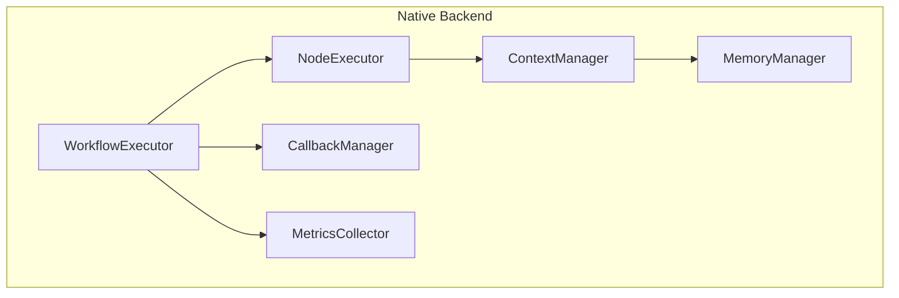

## Overview

The Native backend is Flow Core's default execution engine, providing high-performance workflow execution with full feature support.

## Features

### Core Capabilities

- **Full Async Support**: Built on Python's asyncio for concurrent execution
- **Type Safety**: Pydantic v2 integration for runtime validation
- **Minimal Dependencies**: Only Pydantic and typing-extensions required
- **Streaming**: Real-time event streaming and token-by-token output
- **Memory Management**: Built-in conversation and entity memory
- **Resilience**: Retry, fallback, and circuit breaker patterns
- **Observability**: Comprehensive callbacks and metrics

## Installation

The native backend is included with Flow Core:

```bash
pip install nadoo-flow-core
```

No additional dependencies required!

## Basic Usage

```python
from nadoo_flow import WorkflowExecutor, create_workflow

# Create workflow
workflow = create_workflow({
    "id": "example",
    "nodes": [...],
    "edges": [...]
})

# Execute with native backend (default)
executor = WorkflowExecutor()
result = await executor.execute(workflow, {"input": "data"})
```

## Configuration

### Execution Configuration

```python
from nadoo_flow import ExecutionConfig, WorkflowExecutor

config = ExecutionConfig(
    # Parallel execution
    max_parallel_nodes=10,

    # Timeouts
    timeout_seconds=300,
    node_timeout=30,

    # Resilience
    retry_failed_nodes=True,
    max_retries=3,
    retry_delay=1.0,

    # Checkpointing
    enable_checkpoints=True,
    checkpoint_interval=5,

    # Tracing
    trace_execution=True,
    collect_metrics=True
)

executor = WorkflowExecutor(config)
```

### Memory Configuration

```python
from nadoo_flow.memory import ConversationMemory

# Configure memory
memory = ConversationMemory(
    max_messages=100,
    summarize_after=50,
    window_size=10
)

# Attach to workflow
workflow_context = WorkflowContext("workflow_1")
workflow_context.memory = memory
```

## Execution Strategies

### Sequential Execution

```python
from nadoo_flow import SequentialExecutor

executor = SequentialExecutor()
result = await executor.execute(workflow, input_data)
```

### Parallel Execution

```python
from nadoo_flow import ParallelExecutor

executor = ParallelExecutor(max_workers=10)
result = await executor.execute(workflow, input_data)
```

### Conditional Execution

```python
from nadoo_flow import ConditionalExecutor

executor = ConditionalExecutor()
result = await executor.execute(workflow, input_data)
```

## Performance Optimization

### Caching

```python
# Enable caching
config = ExecutionConfig(
    enable_cache=True,
    cache_ttl=3600,
    cache_size=1000
)
```

### Connection Pooling

```python
# Configure connection pools
config = ExecutionConfig(
    db_pool_size=20,
    http_pool_size=100,
    redis_pool_size=50
)
```

### Async Optimization

```python
# Optimize async execution
config = ExecutionConfig(
    event_loop_policy="uvloop",  # Use uvloop for better performance
    max_concurrent_tasks=50,
    batch_size=100
)
```

## Native Backend Architecture

### Component Overview



### Execution Flow

1. **Workflow Parsing**: Convert DSL to execution graph
2. **Context Initialization**: Create workflow and node contexts
3. **Node Execution**: Execute nodes based on strategy
4. **State Management**: Update contexts and memory
5. **Result Aggregation**: Combine outputs and metrics

## Advanced Features

### Checkpointing

```python
class CheckpointedExecutor(WorkflowExecutor):
    """Executor with checkpointing support"""

    async def execute(self, workflow, input_data):
        # Enable checkpointing
        self.config.enable_checkpoints = True

        # Set checkpoint storage
        self.checkpoint_store = FileCheckpointStore("/tmp/checkpoints")

        # Execute with automatic checkpointing
        return await super().execute(workflow, input_data)

    async def resume_from_checkpoint(self, checkpoint_id):
        """Resume execution from checkpoint"""
        checkpoint = await self.checkpoint_store.load(checkpoint_id)
        return await self.continue_execution(checkpoint)
```

### Custom Node Types

```python
# Register custom node types with native backend
from nadoo_flow.backends.native import NodeRegistry

@NodeRegistry.register("custom_type")
class CustomNode(BaseNode):
    async def execute(self, node_context, workflow_context):
        # Custom execution logic
        return NodeResult(success=True)
```

### Execution Hooks

```python
class HookedExecutor(WorkflowExecutor):
    """Executor with lifecycle hooks"""

    async def pre_workflow_hook(self, workflow, input_data):
        """Called before workflow execution"""
        logger.info(f"Starting workflow {workflow.id}")

    async def post_node_hook(self, node, result):
        """Called after each node"""
        logger.info(f"Node {node.id} completed: {result.success}")

    async def post_workflow_hook(self, workflow, result):
        """Called after workflow completion"""
        logger.info(f"Workflow {workflow.id} finished")
```

## Monitoring and Debugging

### Execution Tracing

```python
# Enable detailed tracing
config = ExecutionConfig(
    trace_execution=True,
    trace_level="DEBUG",
    trace_output="workflow_trace.json"
)

executor = WorkflowExecutor(config)
result = await executor.execute(workflow, input_data)

# Access trace
trace = result.execution_trace
print(f"Total duration: {trace.duration}ms")
print(f"Node timings: {trace.node_timings}")
```

### Metrics Collection

```python
from nadoo_flow.metrics import MetricsCollector

# Configure metrics
metrics = MetricsCollector()
executor = WorkflowExecutor(metrics_collector=metrics)

# Execute
result = await executor.execute(workflow, input_data)

# Get metrics
stats = metrics.get_statistics()
print(f"Average node execution: {stats['avg_node_time']}ms")
print(f"Total workflows: {stats['total_workflows']}")
```

### Debug Mode

```python
# Enable debug mode
config = ExecutionConfig(
    debug_mode=True,
    break_on_error=True,
    verbose_logging=True
)

# Debug execution
async with DebugExecutor(config) as executor:
    result = await executor.execute(workflow, input_data)

    # Inspect state at any point
    state = executor.get_current_state()
    print(f"Current node: {state.current_node}")
    print(f"Context: {state.context}")
```

## Error Handling

### Error Recovery

```python
# Configure error handling
config = ExecutionConfig(
    on_error="continue",  # continue, stop, retry
    error_handler=custom_error_handler,
    max_errors=5
)
```

### Error Reporting

```python
class ErrorReportingExecutor(WorkflowExecutor):
    async def handle_error(self, error, node, context):
        """Custom error handling"""
        # Log error
        logger.error(f"Error in {node.id}: {error}")

        # Report to monitoring
        await self.report_to_sentry(error, node, context)

        # Attempt recovery
        if self.can_recover(error):
            return await self.recover(node, context)

        raise error
```

## Performance Benchmarks

### Execution Speed

| Workflow Size | Sequential (ms) | Parallel (ms) | Speedup |
|---------------|-----------------|---------------|---------|
| 10 nodes | 100 | 30 | 3.3x |
| 50 nodes | 500 | 120 | 4.2x |
| 100 nodes | 1000 | 200 | 5.0x |
| 500 nodes | 5000 | 800 | 6.3x |

### Memory Usage

| Feature | Memory Overhead |
|---------|----------------|
| Base executor | ~10MB |
| Per node | ~100KB |
| With caching | +20MB |
| With tracing | +5MB |
| With metrics | +2MB |

## Comparison with Other Backends

| Feature | Native | LangGraph | CrewAI |
|---------|--------|-----------|--------|
| Performance | ⭐⭐⭐⭐⭐ | ⭐⭐⭐ | ⭐⭐⭐ |
| Memory Usage | ⭐⭐⭐⭐⭐ | ⭐⭐⭐ | ⭐⭐⭐ |
| Feature Set | ⭐⭐⭐⭐⭐ | ⭐⭐⭐⭐ | ⭐⭐⭐ |
| Ecosystem | ⭐⭐⭐ | ⭐⭐⭐⭐⭐ | ⭐⭐⭐⭐ |
| Learning Curve | ⭐⭐⭐⭐ | ⭐⭐ | ⭐⭐⭐ |

## Best Practices

<AccordionGroup>
  <Accordion title="Use Async Properly">
    Always use `await` with async operations. Don't block the event loop.
  </Accordion>
  <Accordion title="Configure Timeouts">
    Set appropriate timeouts to prevent hanging workflows.
  </Accordion>
  <Accordion title="Enable Monitoring">
    Always enable metrics and tracing in production.
  </Accordion>
  <Accordion title="Handle Errors Gracefully">
    Implement proper error handling and recovery strategies.
  </Accordion>
  <Accordion title="Optimize for Your Use Case">
    Tune configuration based on your specific workflow patterns.
  </Accordion>
</AccordionGroup>

## Troubleshooting

### Common Issues

**High Memory Usage**
- Enable memory limits
- Use streaming for large data
- Clear contexts after execution

**Slow Execution**
- Enable parallel execution
- Use caching for repeated operations
- Optimize node implementations

**Connection Errors**
- Configure connection pools
- Implement retry logic
- Use circuit breakers

## Next Steps

<CardGroup cols={2}>
  <Card title="Custom Backends" icon="wrench" href="/flow-core/backends/custom">
    Create your own backend
  </Card>
  <Card title="Performance" icon="gauge" href="/flow-core/advanced/performance">
    Optimize workflow performance
  </Card>
</CardGroup>