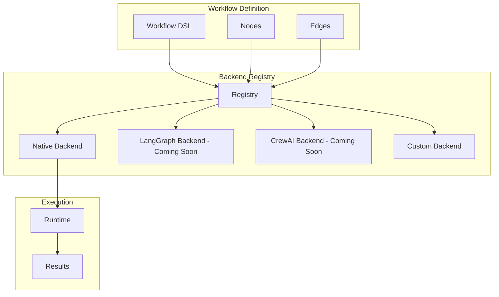

## Overview

Flow Core's multi-backend architecture allows you to swap execution engines while maintaining the same workflow definitions. This provides flexibility to choose the best backend for your use case.

<Warning>
Currently only the native backend is implemented. LangGraph, CrewAI, and A2A backends are planned for future releases.
</Warning>

## Backend Architecture



## Available Backends

### Native Backend (Available)

The default Flow Core execution engine:

```python
from nadoo_flow.backends import BackendRegistry

# Use native backend (default)
backend = BackendRegistry.create("native")
workflow = backend.create_workflow(config)
result = await workflow.run(input_data)
```

**Features:**
- Full async/await support
- Built-in resilience patterns
- Streaming capabilities
- Memory management
- Native Python execution

### LangGraph Backend (Coming Soon)

Integration with LangChain's LangGraph:

```python
# Future implementation
backend = BackendRegistry.create("langgraph")
workflow = backend.create_workflow(config)
```

**Planned Features:**
- LangChain ecosystem integration
- LCEL compatibility
- LangSmith tracing
- Built-in agent tools

### CrewAI Backend (Coming Soon)

Integration with CrewAI framework:

```python
# Future implementation
backend = BackendRegistry.create("crewai")
workflow = backend.create_workflow(config)
```

**Planned Features:**
- Multi-agent orchestration
- Role-based agents
- Task delegation
- Crew collaboration

### A2A Backend (Coming Soon)

Agent-to-Agent communication backend:

```python
# Future implementation
backend = BackendRegistry.create("a2a")
workflow = backend.create_workflow(config)
```

**Planned Features:**
- Inter-agent messaging
- Distributed execution
- Agent discovery
- Protocol negotiation

## Backend Protocol

All backends implement the same protocol:

```python
from typing import Protocol

class IBackend(Protocol):
    """Backend protocol interface"""

    async def create_workflow(self, config: dict) -> IWorkflow:
        """Create workflow from configuration"""
        ...

    async def execute(
        self,
        workflow: IWorkflow,
        input_data: dict
    ) -> ExecutionResult:
        """Execute workflow"""
        ...

    async def validate(self, workflow: IWorkflow) -> bool:
        """Validate workflow"""
        ...
```

## Backend Selection

### Choosing a Backend

| Backend | Use Case | Performance | Ecosystem |
|---------|----------|-------------|-----------|
| **Native** | General purpose, production | High | Flow Core |
| **LangGraph** | LLM workflows | Medium | LangChain |
| **CrewAI** | Multi-agent systems | Medium | CrewAI |
| **A2A** | Distributed agents | Variable | Custom |

### Configuration

```python
# Backend-specific configuration
config = {
    "backend": "native",
    "backend_config": {
        "max_parallel": 10,
        "timeout": 300,
        "retry_strategy": "exponential"
    }
}

backend = BackendRegistry.create(
    config["backend"],
    **config["backend_config"]
)
```

## Backend Registry

### Registration

```python
from nadoo_flow.backends import BackendRegistry

# Register custom backend
BackendRegistry.register(
    name="custom",
    backend_class=CustomBackend
)

# List available backends
backends = BackendRegistry.list_backends()
print(backends)  # ["native", "custom"]
```

### Discovery

```python
# Get backend information
info = BackendRegistry.get_info("native")
print(info)
# {
#     "name": "native",
#     "version": "0.1.0",
#     "features": ["async", "streaming", "memory"],
#     "status": "stable"
# }
```

## Creating Custom Backends

### Backend Implementation

```python
from nadoo_flow.backends import BaseBackend

class CustomBackend(BaseBackend):
    """Custom backend implementation"""

    def __init__(self, config=None):
        super().__init__(config)
        self.engine = CustomEngine()

    async def create_workflow(self, config: dict):
        """Create workflow using custom engine"""
        return CustomWorkflow(config, self.engine)

    async def execute(self, workflow, input_data):
        """Execute using custom engine"""
        return await self.engine.run(workflow, input_data)

    async def validate(self, workflow):
        """Validate workflow for custom engine"""
        return self.engine.validate(workflow)
```

### Workflow Adapter

```python
class CustomWorkflow:
    """Adapt Flow Core workflow to custom engine"""

    def __init__(self, config, engine):
        self.config = config
        self.engine = engine
        self.nodes = self._convert_nodes(config["nodes"])

    def _convert_nodes(self, nodes):
        """Convert Flow Core nodes to engine format"""
        converted = []
        for node in nodes:
            converted.append(self._adapt_node(node))
        return converted

    async def run(self, input_data):
        """Execute workflow"""
        return await self.engine.execute(
            self.nodes,
            input_data
        )
```

## Backend Compatibility

### Feature Matrix

| Feature | Native | LangGraph | CrewAI | A2A |
|---------|--------|-----------|--------|-----|
| Async Execution | ✅ | 🔄 | 🔄 | 🔄 |
| Streaming | ✅ | 🔄 | 🔄 | 🔄 |
| Memory | ✅ | 🔄 | 🔄 | 🔄 |
| Parallel | ✅ | 🔄 | 🔄 | 🔄 |
| Callbacks | ✅ | 🔄 | 🔄 | 🔄 |
| Resilience | ✅ | 🔄 | 🔄 | 🔄 |

✅ Available | 🔄 Planned | ❌ Not Supported

### Migration Between Backends

```python
# Workflow definition remains the same
workflow_config = {
    "nodes": [...],
    "edges": [...],
    "config": {...}
}

# Switch backends without changing workflow
native_backend = BackendRegistry.create("native")
native_result = await native_backend.execute(workflow_config, data)

# Future: Same workflow, different backend
# langgraph_backend = BackendRegistry.create("langgraph")
# langgraph_result = await langgraph_backend.execute(workflow_config, data)
```

## Performance Comparison

### Benchmark Results

```python
# Benchmark different backends
async def benchmark_backends(workflow, input_data):
    results = {}

    for backend_name in BackendRegistry.list_backends():
        backend = BackendRegistry.create(backend_name)

        start = time.time()
        result = await backend.execute(workflow, input_data)
        duration = time.time() - start

        results[backend_name] = {
            "duration": duration,
            "success": result.success,
            "memory_used": get_memory_usage()
        }

    return results
```

## Configuration Examples

### Native Backend Config

```python
native_config = {
    "backend": "native",
    "execution": {
        "max_parallel_nodes": 10,
        "timeout_seconds": 300,
        "retry_failed_nodes": True,
        "enable_checkpoints": True
    },
    "memory": {
        "type": "conversation",
        "max_messages": 100
    },
    "streaming": {
        "enabled": True,
        "buffer_size": 100
    }
}
```

### Future Backend Configs

```python
# LangGraph configuration (planned)
langgraph_config = {
    "backend": "langgraph",
    "llm": {
        "model": "gpt-4",
        "temperature": 0.7
    },
    "tools": ["search", "calculator"],
    "memory": "conversation_buffer"
}

# CrewAI configuration (planned)
crewai_config = {
    "backend": "crewai",
    "agents": [
        {"role": "researcher", "goal": "find information"},
        {"role": "writer", "goal": "create content"}
    ],
    "process": "sequential"
}
```

## Best Practices

<AccordionGroup>
  <Accordion title="Start with Native">
    Begin development with the native backend for full feature support and migrate later if needed.
  </Accordion>
  <Accordion title="Abstract Backend Details">
    Write backend-agnostic workflows using the common protocol interface.
  </Accordion>
  <Accordion title="Test Across Backends">
    When multiple backends are available, test your workflows across them.
  </Accordion>
  <Accordion title="Monitor Performance">
    Different backends have different performance characteristics - monitor and optimize.
  </Accordion>
</AccordionGroup>

## Roadmap

### Q1 2024
- ✅ Native backend stabilization
- 🔄 LangGraph backend development

### Q2 2024
- 🔄 CrewAI backend integration
- 🔄 Backend benchmarking suite

### Q3 2024
- 🔄 A2A backend prototype
- 🔄 Distributed execution support

## Next Steps

<CardGroup cols={2}>
  <Card title="Native Backend" icon="bolt" href="/flow-core/backends/native">
    Learn about the native backend
  </Card>
  <Card title="Custom Backends" icon="wrench" href="/flow-core/backends/custom">
    Create your own backend
  </Card>
</CardGroup>