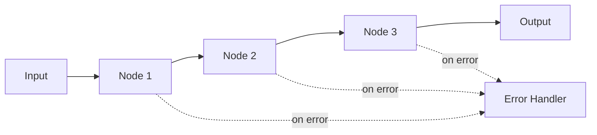

## Overview

Chaining is Flow Core's elegant API for composing nodes into workflows using the pipe operator (`|`). This creates readable, maintainable workflow definitions.

## The Pipe Operator

Flow Core uses Python's `__or__` method to enable intuitive chaining:

```python
# Simple chain
workflow = NodeA() | NodeB() | NodeC()

# Equivalent to
workflow = NodeChain([NodeA(), NodeB(), NodeC()])
```

## ChainableNode Base Class

All chainable nodes inherit from `ChainableNode`:

```python
from nadoo_flow import ChainableNode, NodeResult

class MyNode(ChainableNode):
    """A node that can be chained with others"""

    async def execute(self, node_context, workflow_context):
        # Process input
        data = node_context.input_data
        result = await self.process(data)

        # Return output for next node
        return NodeResult(
            success=True,
            output=result
        )
```

## Creating Chains

### Basic Chaining

```python
from nadoo_flow import ChainableNode, NodeResult

class UppercaseNode(ChainableNode):
    async def execute(self, node_context, workflow_context):
        text = node_context.input_data.get("text", "")
        return NodeResult(
            success=True,
            output={"text": text.upper()}
        )

class ReverseNode(ChainableNode):
    async def execute(self, node_context, workflow_context):
        text = node_context.input_data.get("text", "")
        return NodeResult(
            success=True,
            output={"text": text[::-1]}
        )

# Create a chain
chain = UppercaseNode() | ReverseNode()

# Execute
result = await chain.run({"text": "hello"})
print(result)  # {'text': 'OLLEH'}
```

### Dynamic Chain Building

```python
def build_processing_chain(steps):
    """Dynamically build a chain from configuration"""
    chain = None

    for step in steps:
        node = create_node_from_config(step)
        if chain is None:
            chain = node
        else:
            chain = chain | node

    return chain

# Usage
config = [
    {"type": "validate", "schema": user_schema},
    {"type": "transform", "mapping": field_mapping},
    {"type": "save", "database": "users"}
]

workflow = build_processing_chain(config)
```

## NodeChain Class

The `NodeChain` class manages execution of chained nodes:

```python
from nadoo_flow import NodeChain

# Create from list
chain = NodeChain([
    ValidationNode(),
    ProcessingNode(),
    OutputNode()
])

# Or using pipe operator
chain = ValidationNode() | ProcessingNode() | OutputNode()

# Both create the same workflow
```

### Chain Execution Flow



## Data Flow in Chains

### Automatic Data Passing

Output from one node becomes input for the next:

```python
class AddNode(ChainableNode):
    def __init__(self, value):
        self.value = value
        super().__init__()

    async def execute(self, node_context, workflow_context):
        num = node_context.input_data.get("number", 0)
        return NodeResult(
            success=True,
            output={"number": num + self.value}
        )

# Chain arithmetic operations
chain = (
    AddNode(5)      # Add 5
    | AddNode(10)   # Add 10
    | AddNode(-3)   # Subtract 3
)

result = await chain.run({"number": 100})
print(result)  # {'number': 112}
```

### Data Transformation

```python
class DataPipeline(ChainableNode):
    """Transform data through the pipeline"""

    async def execute(self, node_context, workflow_context):
        data = node_context.input_data

        # Transform specific fields
        if "user" in data:
            data["user"] = data["user"].lower()

        # Add metadata
        data["processed_at"] = datetime.now()

        return NodeResult(success=True, output=data)
```

## Advanced Chaining Patterns

### Conditional Chains

```python
from nadoo_flow import ConditionalNode

class RouterNode(ChainableNode):
    """Route to different chains based on condition"""

    def __init__(self):
        super().__init__()
        self.high_value_chain = PremiumProcessor() | NotifyManager()
        self.normal_chain = StandardProcessor() | Archive()

    async def execute(self, node_context, workflow_context):
        value = node_context.input_data.get("value", 0)

        if value > 1000:
            return await self.high_value_chain.execute(
                node_context, workflow_context
            )
        else:
            return await self.normal_chain.execute(
                node_context, workflow_context
            )
```

### Branching Chains

```python
# Create branches
main_chain = InputNode() | ValidationNode()

# Branch A
branch_a = main_chain | ProcessorA() | OutputA()

# Branch B
branch_b = main_chain | ProcessorB() | OutputB()

# Execute different branches based on conditions
if condition_a:
    result = await branch_a.run(data)
else:
    result = await branch_b.run(data)
```

### Nested Chains

```python
class ComplexWorkflow(ChainableNode):
    def __init__(self):
        super().__init__()

        # Sub-chain for validation
        self.validation_chain = (
            SchemaValidator()
            | BusinessRuleValidator()
            | DataCleaner()
        )

        # Sub-chain for processing
        self.processing_chain = (
            Transformer()
            | Enricher()
            | Calculator()
        )

    async def execute(self, node_context, workflow_context):
        # Run validation chain
        validation_result = await self.validation_chain.run(
            node_context.input_data
        )

        if not validation_result.get("valid"):
            return NodeResult(
                success=False,
                error="Validation failed"
            )

        # Run processing chain
        process_result = await self.processing_chain.run(
            validation_result
        )

        return NodeResult(
            success=True,
            output=process_result
        )
```

## FunctionNode for Quick Chains

Wrap functions as nodes for rapid prototyping:

```python
from nadoo_flow import FunctionNode

# Define processing functions
def clean_text(data):
    return {"text": data["text"].strip().lower()}

def tokenize(data):
    return {"tokens": data["text"].split()}

def count_words(data):
    return {"count": len(data["tokens"])}

# Create chain from functions
text_pipeline = (
    FunctionNode(clean_text)
    | FunctionNode(tokenize)
    | FunctionNode(count_words)
)

# Execute
result = await text_pipeline.run({"text": "  Hello World  "})
print(result)  # {'count': 2}
```

## Error Handling in Chains

### Chain-Level Error Handling

```python
class SafeChain:
    def __init__(self, chain):
        self.chain = chain

    async def run(self, input_data):
        try:
            return await self.chain.run(input_data)
        except Exception as e:
            logger.error(f"Chain execution failed: {e}")
            return {
                "success": False,
                "error": str(e),
                "partial_result": None
            }

# Usage
safe_workflow = SafeChain(
    RiskyNode() | ProcessNode() | OutputNode()
)
```

### Node-Level Error Propagation

```python
class RobustNode(ChainableNode):
    async def execute(self, node_context, workflow_context):
        try:
            result = await self.risky_operation()
            return NodeResult(success=True, output=result)
        except ValueError as e:
            # Stop chain execution
            return NodeResult(
                success=False,
                error=f"Validation error: {e}"
            )
        except Exception as e:
            # Log but continue
            logger.warning(f"Non-critical error: {e}")
            return NodeResult(
                success=True,
                output=node_context.input_data
            )
```

## Chain Inspection and Debugging

### Logging Chain Execution

```python
class LoggingChain(NodeChain):
    async def execute(self, node_context, workflow_context):
        logger.info(f"Starting chain with {len(self.nodes)} nodes")

        for i, node in enumerate(self.nodes):
            logger.debug(f"Executing node {i}: {node.__class__.__name__}")
            result = await node.execute(node_context, workflow_context)
            logger.debug(f"Node {i} result: {result.success}")

            if not result.success:
                logger.error(f"Chain failed at node {i}")
                return result

        logger.info("Chain completed successfully")
        return result
```

### Chain Visualization

```python
def visualize_chain(chain):
    """Generate a text representation of the chain"""
    if isinstance(chain, NodeChain):
        nodes = chain.nodes
    else:
        nodes = [chain]

    visualization = []
    for i, node in enumerate(nodes):
        node_name = node.__class__.__name__
        if i > 0:
            visualization.append("  ↓")
        visualization.append(f"[{node_name}]")

    return "\n".join(visualization)

# Usage
chain = InputNode() | ProcessNode() | OutputNode()
print(visualize_chain(chain))
# [InputNode]
#   ↓
# [ProcessNode]
#   ↓
# [OutputNode]
```

## Performance Optimization

### Lazy Evaluation

```python
class LazyChain(ChainableNode):
    """Only execute nodes when needed"""

    def __init__(self, *nodes):
        self.nodes = nodes
        super().__init__()

    async def execute(self, node_context, workflow_context):
        for node in self.nodes:
            # Check if we need to continue
            if self.should_stop(node_context):
                break

            result = await node.execute(node_context, workflow_context)
            node_context.input_data = result.output

        return NodeResult(
            success=True,
            output=node_context.input_data
        )
```

### Parallel Chain Segments

```python
from nadoo_flow import ParallelNode

# Sequential start
chain_start = InputNode() | ValidationNode()

# Parallel processing
parallel_segment = ParallelNode([
    EnrichmentNode(),
    ScoringNode(),
    ClassificationNode()
])

# Sequential end
chain_end = AggregationNode() | OutputNode()

# Complete workflow
workflow = chain_start | parallel_segment | chain_end
```

## Best Practices

<AccordionGroup>
  <Accordion title="Keep Chains Simple">
    Each chain should have a clear, single purpose. Complex logic should be broken into sub-chains.
  </Accordion>
  <Accordion title="Use Type Hints">
    ```python
    class TypedNode(ChainableNode):
        async def execute(
            self,
            node_context: NodeContext,
            workflow_context: WorkflowContext
        ) -> NodeResult:
            return NodeResult(success=True)
    ```
  </Accordion>
  <Accordion title="Document Chain Purpose">
    ```python
    # User registration chain:
    # 1. Validate input
    # 2. Check uniqueness
    # 3. Hash password
    # 4. Save to database
    # 5. Send welcome email
    registration_chain = (
        ValidationNode()
        | UniquenessCheck()
        | PasswordHasher()
        | DatabaseSaver()
        | EmailSender()
    )
    ```
  </Accordion>
  <Accordion title="Test Chains Independently">
    ```python
    async def test_processing_chain():
        chain = ProcessingNode() | OutputNode()
        result = await chain.run(test_data)
        assert result["success"] == True
    ```
  </Accordion>
</AccordionGroup>

## Common Patterns

### ETL Pipeline

```python
etl_chain = (
    ExtractNode(source="database")
    | TransformNode(rules=transformation_rules)
    | LoadNode(destination="warehouse")
)
```

### Validation Pipeline

```python
validation_chain = (
    SchemaValidator(schema=user_schema)
    | BusinessRuleValidator(rules=business_rules)
    | Sanitizer()
    | Normalizer()
)
```

### Processing Pipeline

```python
processing_chain = (
    Parser()
    | Tokenizer()
    | Analyzer()
    | Scorer()
    | Classifier()
)
```

## Next Steps

<CardGroup cols={2}>
  <Card title="Context" icon="database" href="/flow-core/core/context">
    Learn about workflow and node contexts
  </Card>
  <Card title="Parallel Execution" icon="timeline" href="/flow-core/advanced/parallel">
    Execute nodes concurrently
  </Card>
</CardGroup>