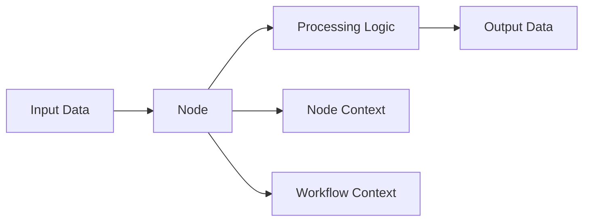

## What are Nodes?

Nodes are the fundamental building blocks of Nadoo Flow Core workflows. Each node represents a single unit of computation that processes input and produces output.

## Node Architecture



## Node Interface

All nodes implement the `IStepNode` interface:

```python
from abc import ABC, abstractmethod

class IStepNode(ABC):
    """Abstract interface for all workflow nodes"""

    @abstractmethod
    async def execute(
        self,
        node_context: NodeContext,
        workflow_context: WorkflowContext
    ) -> NodeResult:
        """Execute the node's logic"""
        pass

    @abstractmethod
    async def validate(self) -> bool:
        """Validate node configuration"""
        pass

    async def pre_execute(self, node_context, workflow_context):
        """Hook called before execution"""
        pass

    async def post_execute(self, node_context, workflow_context):
        """Hook called after execution"""
        pass
```

## Node Types

### Predefined Node Types

Nadoo Flow Core provides common node types via `CommonNodeTypes`:

| Type | Purpose | Example Use Case |
|------|---------|------------------|
| `START` | Workflow entry point | Initialize workflow |
| `END` | Workflow termination | Cleanup and return |
| `CONDITION` | Conditional branching | If/else logic |
| `PARALLEL` | Parallel execution | Concurrent tasks |
| `LOOP` | Iteration | Process lists |
| `AI_AGENT` | AI model interaction | LLM calls |
| `LLM` | Language model | Text generation |
| `TOOL` | External tool | API calls |
| `DATABASE` | Data operations | CRUD operations |
| `PYTHON` | Python code | Custom logic |
| `CUSTOM` | User-defined | Anything |

### Custom Node Types

You can define any string as a node type:

```python
class EmailNode(BaseNode):
    def __init__(self):
        super().__init__(
            node_id="email_1",
            node_type="email_sender",  # Custom type
            name="Email Notification"
        )
```

## Creating Custom Nodes

### Basic Node Implementation

```python
from nadoo_flow import BaseNode, NodeResult

class GreetingNode(BaseNode):
    """Simple node that generates a greeting"""

    def __init__(self, greeting_style="formal"):
        super().__init__(
            node_id="greeting_node",
            node_type=CommonNodeTypes.CUSTOM,
            name="Greeting Generator",
            config={"style": greeting_style}
        )

    async def execute(self, node_context, workflow_context):
        # Get input
        name = node_context.input_data.get("name", "Guest")
        style = self.config.get("style", "formal")

        # Process
        if style == "formal":
            greeting = f"Dear {name},"
        else:
            greeting = f"Hey {name}!"

        # Return result
        return NodeResult(
            success=True,
            output={"greeting": greeting},
            metadata={"style": style}
        )

    async def validate(self) -> bool:
        """Ensure configuration is valid"""
        valid_styles = ["formal", "casual"]
        return self.config.get("style") in valid_styles
```

### Chainable Node

For nodes that support the pipe operator:

```python
from nadoo_flow import ChainableNode, NodeResult

class UppercaseNode(ChainableNode):
    """Transform text to uppercase"""

    async def execute(self, node_context, workflow_context):
        text = node_context.input_data.get("text", "")

        return NodeResult(
            success=True,
            output={"text": text.upper()}
        )

# Usage with chaining
chain = UppercaseNode() | ReverseNode() | OutputNode()
```

## Node Context

Each node has its own context for execution:

```python
class NodeContext:
    """Execution context for individual nodes"""

    def __init__(self, node_id: str):
        self.node_id = node_id
        self.status = NodeStatus.PENDING
        self.input_data: Dict[str, Any] = {}
        self.output_data: Dict[str, Any] = {}
        self.error: Optional[str] = None
        self.start_time: Optional[datetime] = None
        self.end_time: Optional[datetime] = None
        self.metadata: Dict[str, Any] = {}
        self.variables: Dict[str, Any] = {}
```

### Using Node Context

```python
async def execute(self, node_context, workflow_context):
    # Access input
    data = node_context.get_input()

    # Store variables
    node_context.set_variable("processed_count", 10)

    # Set output
    node_context.set_output({"result": "success"})

    # Access execution info
    duration = node_context.end_time - node_context.start_time
```

## Node Result

Nodes return a `NodeResult` object:

```python
@dataclass
class NodeResult:
    success: bool
    output: Dict[str, Any] = field(default_factory=dict)
    error: Optional[str] = None
    next_node_id: Optional[str] = None
    conditional_next: Optional[Dict[str, str]] = None
    metadata: Dict[str, Any] = field(default_factory=dict)
```

### Result Examples

```python
# Simple success
return NodeResult(
    success=True,
    output={"message": "Task completed"}
)

# With error
return NodeResult(
    success=False,
    error="Connection timeout",
    output={}
)

# Conditional routing
return NodeResult(
    success=True,
    output={"score": 85},
    conditional_next={
        "high": "premium_path",
        "medium": "standard_path",
        "low": "basic_path"
    }
)
```

## Node Lifecycle

<Steps>
  <Step title="Initialization">
    Node is created with configuration
  </Step>
  <Step title="Validation">
    `validate()` ensures configuration is correct
  </Step>
  <Step title="Pre-execution">
    `pre_execute()` hook for setup
  </Step>
  <Step title="Execution">
    `execute()` performs main logic
  </Step>
  <Step title="Post-execution">
    `post_execute()` hook for cleanup
  </Step>
</Steps>

## Advanced Node Features

### Async Operations

All nodes support async operations:

```python
class APINode(BaseNode):
    async def execute(self, node_context, workflow_context):
        # Async HTTP call
        async with aiohttp.ClientSession() as session:
            async with session.get(self.config["url"]) as response:
                data = await response.json()

        return NodeResult(success=True, output=data)
```

### Error Handling

Proper error handling in nodes:

```python
async def execute(self, node_context, workflow_context):
    try:
        result = await self.process_data()
        return NodeResult(success=True, output=result)
    except ValidationError as e:
        return NodeResult(
            success=False,
            error=f"Validation failed: {e}",
            output={}
        )
    except Exception as e:
        logger.error(f"Unexpected error in {self.node_id}: {e}")
        return NodeResult(
            success=False,
            error=str(e),
            output={}
        )
```

### Node Composition

Nodes can be composed from other nodes:

```python
class CompositeNode(BaseNode):
    def __init__(self):
        super().__init__(
            node_id="composite",
            node_type="composite",
            name="Composite Node"
        )
        self.sub_nodes = [
            ValidationNode(),
            ProcessingNode(),
            OutputNode()
        ]

    async def execute(self, node_context, workflow_context):
        current_input = node_context.input_data

        for node in self.sub_nodes:
            sub_context = NodeContext(node.node_id)
            sub_context.input_data = current_input

            result = await node.execute(sub_context, workflow_context)
            if not result.success:
                return result

            current_input = result.output

        return NodeResult(success=True, output=current_input)
```

## Built-in Helper Nodes

### FunctionNode

Wrap any function as a node:

```python
from nadoo_flow import FunctionNode

# Sync function
def process(data):
    return {"result": data["value"] * 2}

node = FunctionNode(process)

# Async function
async def async_process(data):
    await asyncio.sleep(1)
    return {"result": data["value"] * 2}

async_node = FunctionNode(async_process)
```

### PassthroughNode

Identity node for debugging:

```python
from nadoo_flow import PassthroughNode

# Insert in chain for debugging
chain = (
    InputNode()
    | PassthroughNode()  # Inspect data here
    | ProcessNode()
    | PassthroughNode()  # And here
    | OutputNode()
)
```

## Best Practices

<AccordionGroup>
  <Accordion title="Single Responsibility">
    Each node should do one thing well. Complex logic should be split into multiple nodes.
  </Accordion>
  <Accordion title="Input Validation">
    Always validate input data in the execute method:
    ```python
    if "required_field" not in node_context.input_data:
        return NodeResult(
            success=False,
            error="Missing required field: required_field"
        )
    ```
  </Accordion>
  <Accordion title="Immutability">
    Don't modify input data directly:
    ```python
    # Good
    output = {**input_data, "new_field": value}

    # Bad
    input_data["new_field"] = value  # Modifies original
    ```
  </Accordion>
  <Accordion title="Resource Cleanup">
    Use post_execute for cleanup:
    ```python
    async def post_execute(self, node_context, workflow_context):
        if hasattr(self, "connection"):
            await self.connection.close()
    ```
  </Accordion>
</AccordionGroup>

## Next Steps

<CardGroup cols={2}>
  <Card title="Chaining" icon="link" href="/flow-core/core/chaining">
    Learn to compose nodes with the pipe operator
  </Card>
  <Card title="Context" icon="database" href="/flow-core/core/context">
    Understand workflow and node contexts
  </Card>
</CardGroup>