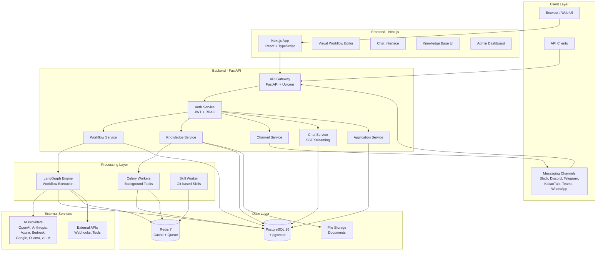

## System Architecture

Nadoo AI is a full-stack platform built as a monorepo with a **Next.js frontend**, **FastAPI backend**, **LangGraph workflow engine**, and supporting infrastructure services. The architecture is designed for async-first processing, horizontal scalability, and extensibility.

## High-Level Architecture



## Component Details

### Next.js Frontend

The frontend is a Next.js application built with React and TypeScript. It provides the primary user interface for all platform interactions.

| Component | Technology | Purpose |
|-----------|-----------|---------|
| Visual Workflow Editor | React + Canvas API | Drag-and-drop graph editor for building workflows |
| Chat Interface | React + SSE | Real-time conversational UI with streaming responses |
| Knowledge Base UI | React | Document upload, management, and search testing |
| Admin Dashboard | React | Workspace management, user roles, API keys, analytics |
| State Management | Zustand | Client-side state management |
| UI Framework | Tailwind CSS + Radix UI | Component library and styling |

### FastAPI Backend

The backend is a FastAPI server running on Uvicorn with async request handling. It serves as the API gateway for all platform operations.

| Service | Responsibility |
|---------|---------------|
| **Auth Service** | JWT-based authentication, RBAC authorization, API key management |
| **Workflow Service** | CRUD operations for workflows, triggers LangGraph execution |
| **Knowledge Service** | Document ingestion, chunking, embedding, and hybrid search |
| **Channel Service** | Manages messaging platform integrations and webhook routing |
| **Chat Service** | Handles conversation sessions, message history, and SSE streaming |
| **Application Service** | Application lifecycle management across Chat, Workflow, and Channel types |

### LangGraph Engine

The workflow execution engine is built on LangGraph, a framework for building stateful, multi-step AI applications as graphs.

<Info>
  LangGraph provides the runtime for executing workflow graphs with support for cycles (loops), conditional branching, parallel execution, and persistent state management. Each workflow defined in the visual editor is compiled into a LangGraph graph at execution time.
</Info>

**Key capabilities:**
- Executes directed graphs with nodes and conditional edges
- Maintains execution state across multi-step workflows
- Supports 6 AI agent strategies: Standard, Chain of Thought (CoT), ReAct, Function Calling, Reflection, Tree of Thoughts
- Handles streaming output via Server-Sent Events
- Integrates with 12+ AI model providers through a unified interface

### Celery Workers

Background task processing is handled by Celery with Redis as the message broker.

**Common background tasks:**
- Document chunking and embedding generation for knowledge bases
- Large file processing and format conversion
- Scheduled workflow execution
- Channel webhook processing
- Analytics aggregation

### Skill Worker

A dedicated service that executes Skills imported from Git repositories in an isolated environment.

**Execution flow:**
1. Skill is imported from a Git repository (clone/pull)
2. Dependencies are installed in an isolated environment
3. Skill execution requests are received via Redis queue
4. Results are returned to the calling workflow

### PostgreSQL + pgvector

PostgreSQL serves as the primary data store with the pgvector extension enabling vector similarity search.

**Stored data:**
- Workspaces, users, and RBAC permissions
- Applications, workflows, and node configurations
- Knowledge base documents and text chunks
- Vector embeddings (via pgvector) for semantic search
- Chat sessions and message history
- Channel configurations and credentials
- Celery task results

<Info>
  pgvector enables storing and querying high-dimensional vector embeddings directly in PostgreSQL, eliminating the need for a separate vector database. Combined with BM25 full-text search indexes, this powers the hybrid retrieval pipeline.
</Info>

### Redis

Redis handles caching, session management, and message brokering.

**Uses:**
- Celery message broker and result backend
- Workflow execution state caching
- Session data and rate limiting
- Real-time pub/sub for streaming responses
- Skill Worker task queue

## Data Flow

A typical request flows through the system as follows:

<Steps>
  <Step title="User Request">
    A user sends a message through the web chat interface, a messaging channel (e.g., Slack), or a direct API call. The request reaches the FastAPI backend.
  </Step>
  <Step title="Authentication and Routing">
    The Auth Service validates the JWT token or API key, checks RBAC permissions, and routes the request to the appropriate service (Workflow, Chat, or Channel).
  </Step>
  <Step title="Workflow Execution">
    The Workflow Service loads the application's workflow graph and passes it to the LangGraph Engine for execution. The engine processes nodes sequentially, following edges and conditional branches.
  </Step>
  <Step title="Node Processing">
    Each node in the workflow executes its specific operation:
    - **Search Knowledge** queries PostgreSQL (pgvector + BM25) for relevant document chunks
    - **AI Agent** calls an AI provider (OpenAI, Anthropic, etc.) with the assembled prompt and context
    - **Condition** evaluates logic and determines the next branch
    - **HTTP Request** calls external APIs
    - **Code Executor** runs custom code in a sandboxed environment
  </Step>
  <Step title="Response Streaming">
    As the AI Agent node generates output, tokens are streamed back to the client via Server-Sent Events (SSE). The complete response is persisted to the chat session history in PostgreSQL.
  </Step>
  <Step title="Channel Delivery">
    If the request originated from a messaging channel, the Channel Service formats the response according to the platform's requirements (Slack blocks, Discord embeds, etc.) and sends it back to the user.
  </Step>
</Steps>

## Monorepo Structure

The codebase is organized as a monorepo with the following top-level structure:

| Directory | Description | Technology |
|-----------|-------------|------------|
| `packages/backend/` | FastAPI server with all backend services, API routes, models, and business logic | Python 3.11+, FastAPI, SQLAlchemy, Alembic |
| `packages/frontend/` | Next.js web application with the visual editor, chat UI, and admin dashboard | Next.js, React, TypeScript, Tailwind CSS |
| `packages/nadoo-plugin-sdk/` | Python SDK for building custom plugins that extend the platform | Python, Pydantic |
| `packages/official-plugins/` | 6 official plugins included with the platform (Calculator, Web Search, etc.) | Python (Plugin SDK) |
| `packages/skill-worker/` | Service for executing Skills imported from Git repositories | Python |
| `infrastructure/` | Docker Compose configurations, Dockerfiles, and deployment scripts | Docker, Docker Compose |

### Backend Package Structure

```
packages/backend/
├── src/
│   ├── api/              # FastAPI route handlers
│   ├── models/           # SQLAlchemy ORM models
│   ├── services/         # Business logic layer
│   ├── workflow/         # LangGraph workflow engine
│   │   ├── nodes/        # Node type implementations
│   │   └── strategies/   # AI agent strategy implementations
│   ├── knowledge/        # RAG pipeline (chunking, embedding, search)
│   ├── channels/         # Messaging platform integrations
│   └── core/             # Shared utilities, auth, config
├── migrations/           # Alembic database migrations
├── tests/                # Test suite
└── alembic.ini           # Alembic configuration
```

### Frontend Package Structure

```
packages/frontend/
├── src/
│   ├── app/              # Next.js App Router pages
│   ├── components/       # React components
│   │   ├── workflow/     # Visual workflow editor components
│   │   ├── chat/         # Chat interface components
│   │   └── knowledge/    # Knowledge base UI components
│   ├── stores/           # Zustand state stores
│   ├── hooks/            # Custom React hooks
│   ├── lib/              # Utility functions and API client
│   └── types/            # TypeScript type definitions
├── public/               # Static assets
└── next.config.js        # Next.js configuration
```

## Key Architectural Decisions

<AccordionGroup>
  <Accordion title="Async-First with FastAPI" icon="bolt">
    The backend is built entirely on async Python using FastAPI and Uvicorn. All I/O operations -- database queries, AI provider calls, external API requests -- use `async`/`await` for non-blocking execution. This enables high throughput with minimal resource consumption.

    ```python
    @router.post("/chat/messages")
    async def create_message(request: MessageRequest):
        # Non-blocking database query
        session = await chat_service.get_session(request.session_id)

        # Non-blocking AI provider call with streaming
        async for chunk in workflow_engine.execute_stream(session, request.message):
            yield chunk
    ```
  </Accordion>

  <Accordion title="LangGraph for Workflow Execution" icon="diagram-project">
    Workflows are executed using LangGraph rather than a custom execution engine. LangGraph provides battle-tested support for:

    - **Cycles and loops** -- Essential for iterative AI reasoning (e.g., ReAct loops)
    - **Conditional branching** -- Route execution based on AI output or custom conditions
    - **State management** -- Maintain and update state across workflow steps
    - **Streaming** -- Stream intermediate results during execution
    - **Checkpointing** -- Resume workflows from saved state

    This decision reduces the complexity of the custom workflow engine while leveraging a well-maintained open-source foundation.
  </Accordion>

  <Accordion title="Pluggable Vector Store" icon="database">
    Vector storage uses a **pluggable factory pattern** (`VectorStoreFactory`) supporting multiple backends:
    - **pgvector** (default) -- PostgreSQL extension, no additional infrastructure
    - **Milvus** -- High-performance distributed vector database (planned)
    - **Qdrant** -- Cloud-native vector search engine (planned)

    **Why pgvector as default:**
    - **Operational simplicity** -- One database to manage instead of two
    - **Transactional consistency** -- Vector data participates in the same transactions as relational data
    - **Hybrid search** -- Combine vector similarity with SQL filtering and BM25 full-text search in a single query
    - **Distance metrics** -- Cosine, Euclidean, Dot Product supported
    - **Sufficient scale** -- HNSW and IVFFlat indexes handle millions of vectors

    **Embedding providers** (9+): OpenAI, HuggingFace, Local, Azure OpenAI, AWS Bedrock, Google AI Studio, Google Vertex AI, vLLM, Ollama
  </Accordion>

  <Accordion title="Celery for Background Tasks" icon="clock">
    Long-running operations (document processing, embedding generation, scheduled tasks) are offloaded to Celery workers with Redis as the broker.

    **Why Celery:**
    - Mature and battle-tested task queue for Python
    - Supports task retries, rate limiting, and priority queues
    - Redis broker is already part of the infrastructure
    - Flower dashboard for monitoring worker health and task status
    - Scales horizontally by adding more workers
  </Accordion>

  <Accordion title="Monorepo with Submodules" icon="folder-tree">
    The project uses a monorepo structure with Git submodules for the Plugin SDK and official plugins.

    **Benefits:**
    - **Unified development** -- Frontend, backend, and plugins in one repository
    - **Atomic changes** -- Cross-package changes in a single commit
    - **Shared tooling** -- Common linting, testing, and CI/CD configuration
    - **Independent versioning** -- Plugin SDK and plugins can be versioned separately via submodules
  </Accordion>

  <Accordion title="Multi-Tenant Workspace Isolation" icon="building">
    Multi-tenancy is implemented at the application level using workspace-scoped database queries rather than separate databases per tenant.

    **How it works:**
    - Every database table includes a `workspace_id` foreign key
    - All queries are automatically filtered by the authenticated user's workspace
    - RBAC rules are evaluated per-workspace
    - API keys and credentials are encrypted and scoped to workspaces
    - This approach balances isolation with operational simplicity
  </Accordion>
</AccordionGroup>

## Technology Stack Summary

<Tabs>
  <Tab title="Backend">
    | Technology | Version | Purpose |
    |-----------|---------|---------|
    | Python | 3.11+ | Primary backend language |
    | FastAPI | 0.115+ | Web framework and API server |
    | Uvicorn | Latest | ASGI server |
    | SQLAlchemy | 2.0 | ORM and database toolkit |
    | Alembic | Latest | Database migrations |
    | Pydantic | v2 | Data validation and serialization |
    | Celery | 5.4 | Background task queue |
    | LangGraph | Latest | Workflow execution engine |
    | python-jose | Latest | JWT authentication |
  </Tab>
  <Tab title="Frontend">
    | Technology | Version | Purpose |
    |-----------|---------|---------|
    | Next.js | 15+ | React framework with App Router |
    | React | 19 | UI component library |
    | TypeScript | 5+ | Type-safe JavaScript |
    | Zustand | 5.0 | State management |
    | Tailwind CSS | 3.4 | Utility-first CSS framework |
    | Radix UI | Latest | Accessible UI primitives |
    | React Hook Form | 7.62 | Form handling |
  </Tab>
  <Tab title="Infrastructure">
    | Technology | Version | Purpose |
    |-----------|---------|---------|
    | PostgreSQL | 16 | Primary database |
    | pgvector | 0.4+ | Vector similarity search extension |
    | Redis | 7 | Cache, message broker, session store |
    | Docker | Latest | Containerization |
    | Docker Compose | Latest | Local orchestration |
  </Tab>
  <Tab title="AI and ML">
    | Technology | Purpose |
    |-----------|---------|
    | LangGraph | Workflow graph execution |
    | LangChain | Text splitting, document loaders |
    | OpenAI SDK | OpenAI and Azure OpenAI integration |
    | Anthropic SDK | Claude model integration |
    | Boto3 | AWS Bedrock integration |
    | Sentence Transformers | Local embedding models |
  </Tab>
</Tabs>

## Deployment Architecture

The platform supports multiple deployment models:

<CardGroup cols={2}>
  <Card title="Local Development" icon="laptop-code">
    Run everything locally with `npm run start`. Docker Compose manages PostgreSQL and Redis, while the backend and frontend run as development servers with hot reload.
  </Card>
  <Card title="Docker Compose (Production)" icon="docker">
    Deploy all services as Docker containers with production configurations, persistent volumes, and environment-based settings.
  </Card>
  <Card title="Kubernetes" icon="dharmachakra">
    Deploy to Kubernetes with Helm charts for horizontal scaling, rolling updates, and health monitoring.
  </Card>
  <Card title="Cloud Platforms" icon="cloud">
    Deploy to AWS, GCP, or Azure using container services (ECS, Cloud Run, AKS) with managed database instances.
  </Card>
</CardGroup>

## Next Steps

<CardGroup cols={3}>
  <Card
    title="Quick Start"
    icon="play"
    href="/getting-started/quickstart"
  >
    Get the platform running locally
  </Card>
  <Card
    title="Workflow Engine"
    icon="diagram-project"
    href="/workflow/overview"
  >
    Deep dive into the workflow execution engine
  </Card>
  <Card
    title="Self-Hosting"
    icon="server"
    href="/self-hosting/overview"
  >
    Deploy to your own infrastructure
  </Card>
</CardGroup>
