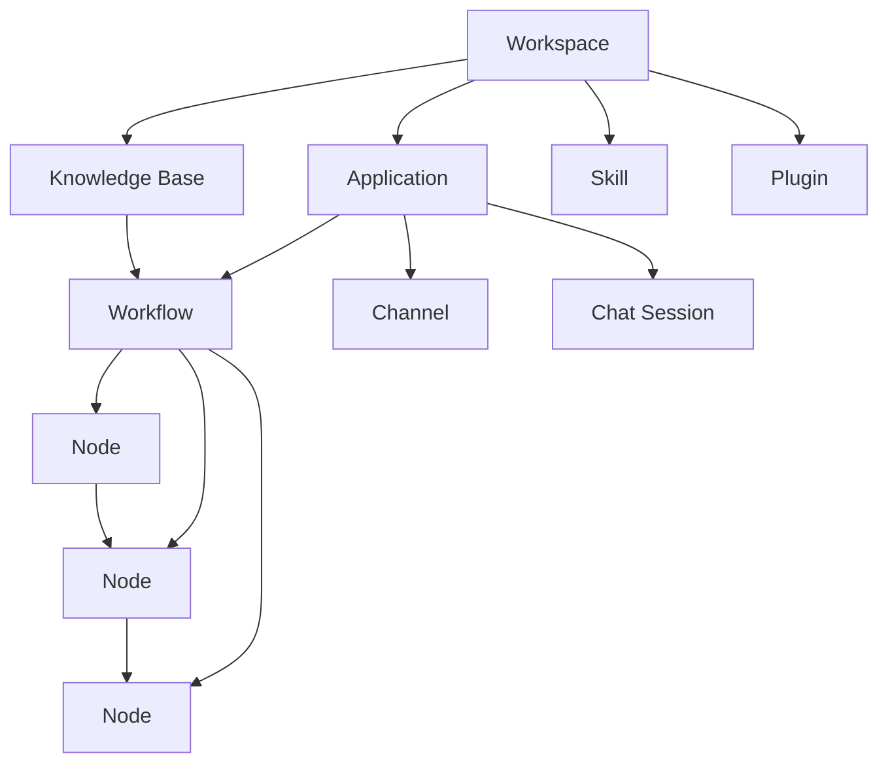
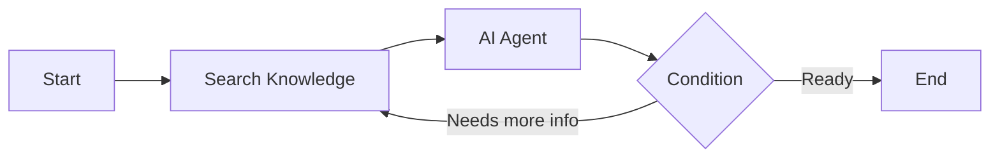

## Domain Model Overview

Nadoo AI is organized around a clear hierarchy of domain objects. Understanding these concepts is essential for building effective AI agents on the platform.

## Workspace

A **Workspace** is the top-level isolation unit in Nadoo AI. It provides multi-tenant separation, ensuring that all resources -- applications, knowledge bases, models, API keys, and team members -- are scoped to a single workspace.

<Info>
  Think of a workspace as an organization or team boundary. Each workspace has its own set of users, roles, and permissions managed through Role-Based Access Control (RBAC).
</Info>

**Key properties:**
- Contains all applications, knowledge bases, and configurations
- Manages team members with role assignments (Admin, Editor, Viewer)
- Stores AI provider API keys scoped to the workspace
- Provides usage analytics and audit logs

## Application

An **Application** is an AI agent instance that lives inside a workspace. Each application represents a distinct agent with its own configuration, workflow, and deployment target.

<CardGroup cols={3}>
  <Card title="Chat" icon="message">
    A conversational agent with a built-in chat interface. Users interact through the platform's web UI with streaming responses and conversation history.
  </Card>
  <Card title="Workflow" icon="diagram-project">
    A visual workflow application that processes inputs through a graph of connected nodes. Best for complex multi-step reasoning and automation tasks.
  </Card>
  <Card title="Channel" icon="share-nodes">
    An agent deployed to an external messaging platform such as Slack, Discord, Telegram, KakaoTalk, Teams, or WhatsApp.
  </Card>
</CardGroup>

**Key properties:**
- Belongs to exactly one workspace
- Has a type (Chat, Workflow, or Channel)
- Contains one or more workflows that define its behavior
- Maintains configuration for the AI model, system prompt, and parameters
- Tracks usage metrics and conversation history

## Knowledge Base

A **Knowledge Base** is a document store with vector search capabilities, enabling Retrieval-Augmented Generation (RAG). When an AI agent needs to answer questions based on your organization's data, it queries the knowledge base to retrieve relevant context.

<Info>
  The Knowledge Base uses a **hybrid search** approach combining dense vector similarity (pgvector by default, with Milvus/Qdrant via pluggable VectorStore) with sparse keyword matching (BM25). Embeddings are generated by configurable providers (OpenAI, HuggingFace, Azure, Bedrock, Google, Ollama, Local, etc.). An optional reranking step further improves relevance.
</Info>

**How it works:**
1. **Ingest** -- Upload documents (PDF, DOCX, TXT, Markdown) into the knowledge base
2. **Chunk** -- Documents are automatically split into manageable text chunks
3. **Embed** -- Each chunk is converted to a vector embedding using the configured embedding model
4. **Index** -- Chunks are stored in the vector store (pgvector default) for semantic search and indexed for BM25 keyword search
5. **Retrieve** -- At query time, hybrid search combines vector similarity and keyword relevance to find the best matching chunks
6. **Rerank** -- An optional reranking model re-scores the results for improved accuracy

**Key properties:**
- Belongs to a workspace and can be shared across multiple applications
- Supports multiple document formats
- Configurable chunking strategy (chunk size, overlap)
- Configurable embedding model
- Connected to workflows via the **Search Knowledge** node

## Workflow

A **Workflow** is a visual graph of connected nodes that defines how an AI agent processes inputs and generates outputs. Built on top of LangGraph, workflows enable complex multi-step reasoning with branching, looping, and parallel execution.

**Key properties:**
- Defined as a directed graph with nodes and edges
- Supports sequential, conditional, and parallel execution paths
- Can reference knowledge bases for RAG
- Executes on the LangGraph engine with state management
- Version-controlled with draft and published states

## Node

A **Node** is the fundamental processing unit within a workflow. Each node performs a specific operation -- from calling an AI model to searching a knowledge base to executing custom code. Nodes are connected by edges that define the data flow.

Nadoo AI provides **18+ built-in node types**:

<CardGroup cols={2}>
  <Card title="AI Agent" icon="robot">
    The primary reasoning node. Calls an AI model with a prompt, system instructions, and optional tool access. Supports 6 agent strategies: Standard, Chain of Thought (CoT), ReAct, Function Calling, Reflection, and Tree of Thoughts.
  </Card>
  <Card title="Search Knowledge" icon="magnifying-glass">
    Queries a knowledge base using hybrid search (vector + BM25) and returns relevant document chunks as context for downstream nodes.
  </Card>
  <Card title="Condition" icon="code-branch">
    Evaluates a condition and routes execution to different branches based on the result. Enables if/else logic in workflows.
  </Card>
  <Card title="Loop" icon="arrows-rotate">
    Iterates over a collection or repeats execution until a condition is met. Useful for processing lists or retry logic.
  </Card>
  <Card title="HTTP Request" icon="globe">
    Makes HTTP calls to external APIs. Supports GET, POST, PUT, DELETE with configurable headers, body, and authentication.
  </Card>
  <Card title="Code Executor" icon="code">
    Executes custom Python or JavaScript code within a sandboxed environment. Useful for data transformation and custom logic.
  </Card>
  <Card title="Variable Aggregator" icon="object-group">
    Combines outputs from multiple upstream nodes into a single data structure for use by downstream nodes.
  </Card>
  <Card title="Template" icon="file-code">
    Renders a text template with variable substitution using data from upstream nodes. Useful for formatting prompts and responses.
  </Card>
</CardGroup>

<Info>
  Additional node types include: Start, End, Answer, Question Classifier, Intent Router, Parameter Extractor, Tool Node, Sub-workflow, Delay, and more. See the [Workflow Engine documentation](/workflow/overview) for the complete list.
</Info>

## Chat Session

A **Chat Session** is a conversation thread between a user and an AI application. Each session maintains its own conversation history and memory, enabling multi-turn interactions with context awareness.

**Key properties:**
- Belongs to an application
- Maintains ordered message history (user messages, assistant responses, system messages)
- Supports streaming responses via Server-Sent Events (SSE)
- Configurable memory window (how many previous messages are included as context)
- Can include multimodal inputs (text, images, files)

## Channel

A **Channel** is an integration with an external messaging platform. Channels bridge your AI applications to the communication tools your users already use, handling platform-specific authentication, message formatting, and webhook management.

<CardGroup cols={3}>
  <Card title="Slack" icon="slack">
    Bot integration with support for slash commands, thread replies, and rich message formatting.
  </Card>
  <Card title="Discord" icon="discord">
    Bot with channel messages, direct messages, and embed support.
  </Card>
  <Card title="Telegram" icon="paper-plane">
    Bot API integration with inline keyboards and rich media support.
  </Card>
  <Card title="KakaoTalk" icon="comment">
    Channel and chatbot integration for the Korean messaging platform.
  </Card>
  <Card title="Microsoft Teams" icon="microsoft">
    Bot Framework integration with adaptive cards and channel support.
  </Card>
  <Card title="WhatsApp" icon="whatsapp">
    Business API integration with template messages and media support.
  </Card>
</CardGroup>

**Key properties:**
- Links an external messaging platform to an application
- Manages platform-specific credentials and webhook URLs
- Handles message format conversion between the platform and the workflow engine
- Supports bidirectional communication (receive messages from users, send responses back)

## Skill

A **Skill** is a reusable, executable unit that can be imported from a Git repository and used within workflows. Skills allow you to share and reuse complex capabilities across applications and teams.

**Key properties:**
- Imported from Git repositories (public or private)
- Executed by the dedicated Skill Worker service
- Can be parameterized and configured per workflow
- Version-controlled via Git tags and branches
- Sandboxed execution for security

<Info>
  Skills differ from plugins in that they are standalone executable units loaded from external repositories, while plugins are Python packages that extend the platform's core functionality through the Plugin SDK.
</Info>

## Plugin

A **Plugin** is an extension module built using the Nadoo AI Plugin SDK. Plugins add custom tools, integrations, and capabilities to the platform that can be invoked by AI Agent nodes during workflow execution.

**Key properties:**
- Built with the Python Plugin SDK (`nadoo-plugin-sdk`)
- Access to platform APIs: LLM Client, Knowledge Client, Tools Client, Storage Client
- Decorator-based API for defining tool functions
- Registered with the platform and available to all workflows in a workspace
- 6 official plugins included out of the box (Calculator, Web Search, and more)

**Plugin vs Skill:**

| Aspect | Plugin | Skill |
|--------|--------|-------|
| **Source** | Python package (Plugin SDK) | Git repository |
| **Execution** | In-process with the backend | Isolated Skill Worker service |
| **Access** | Full platform API (LLM, Knowledge, Storage) | Sandboxed with limited access |
| **Use case** | Custom tools and integrations | Reusable standalone capabilities |

## How Concepts Connect

Here is a typical flow showing how these concepts work together:

<Steps>
  <Step title="Workspace Setup">
    An admin creates a **Workspace** and invites team members with appropriate RBAC roles. They configure AI provider API keys in the workspace settings.
  </Step>
  <Step title="Knowledge Base Creation">
    A team member creates a **Knowledge Base** and uploads company documents. The platform processes, chunks, and indexes the documents for hybrid search.
  </Step>
  <Step title="Application and Workflow">
    A developer creates an **Application** (Workflow type) and builds a **Workflow** using the visual editor. The workflow contains nodes: Start, Search Knowledge, AI Agent (with ReAct strategy), and End.
  </Step>
  <Step title="Channel Deployment">
    The application is connected to a **Channel** (e.g., Slack) so employees can interact with the agent directly in their messaging platform.
  </Step>
  <Step title="Conversation">
    A user sends a message in Slack. The **Channel** routes it to the application, which executes the **Workflow**. The Search Knowledge node retrieves relevant context from the **Knowledge Base**, the AI Agent generates a response, and the result is sent back through the **Channel** to the user in a **Chat Session**.
  </Step>
</Steps>

## Next Steps

<CardGroup cols={3}>
  <Card
    title="Architecture"
    icon="sitemap"
    href="/getting-started/architecture"
  >
    Understand the technical architecture, components, and data flow
  </Card>
  <Card
    title="Workflow Engine"
    icon="diagram-project"
    href="/workflow/overview"
  >
    Learn how to build workflows with the visual editor
  </Card>
  <Card
    title="Knowledge Base"
    icon="book-open"
    href="/knowledge/overview"
  >
    Set up document ingestion and RAG for your agents
  </Card>
</CardGroup>
