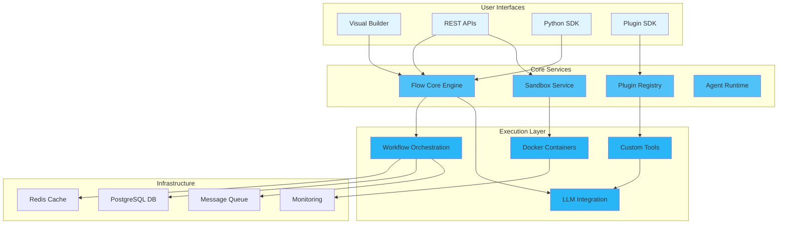

<Hero>
  
  
</Hero>

## The Complete AI Agent Platform

**Nadoo AI** is an open-source platform that empowers developers and enterprises to build, deploy, and manage intelligent AI agents. From low-level workflow orchestration to secure code execution and visual no-code builders, we provide the complete stack for AI automation.

<CardGroup cols={2}>
  <Card
    title="Flow Core"
    icon="cube"
    href="/flow-core/overview"
  >
    **Python Framework**

    Type-safe workflow orchestration with resilience, caching, and multi-backend support
  </Card>
  <Card
    title="Plugin SDK"
    icon="puzzle-piece"
    href="/plugin-sdk/overview"
  >
    **Extend & Customize**

    Build custom tools with access to LLMs, knowledge bases, and storage
  </Card>
  <Card
    title="Sandbox"
    icon="shield"
    href="/sandbox/overview"
  >
    **Secure Execution**

    Execute code in 12+ languages within isolated Docker containers
  </Card>
  <Card
    title="Builder Platform"
    icon="palette"
    href="/builder/overview"
  >
    **Visual Interface**

    No-code workflow designer for creating AI agents without coding
  </Card>
</CardGroup>

## Why Nadoo AI?

<AccordionGroup>
  <Accordion title="Full-Stack Solution" icon="stack">
    **From Code to No-Code**

    - **Flow Core**: Low-level framework for developers who need full control
    - **Builder**: Visual interface for business users and rapid prototyping
    - **APIs**: RESTful and GraphQL APIs for integration
    - **SDKs**: Client libraries for major programming languages
  </Accordion>
  <Accordion title="Production Ready" icon="rocket">
    **Built for Scale**

    - Handle thousands of concurrent workflows
    - Distributed execution across multiple nodes
    - Built-in monitoring and observability
    - Enterprise security and compliance
  </Accordion>
  <Accordion title="Extensible Architecture" icon="puzzle-piece">
    **Adapt to Your Needs**

    - Protocol-based backend system (extensible for LangGraph, CrewAI, etc.)
    - Plugin SDK for custom tools and integrations
    - Integration with 100+ external services
    - Custom node and agent development
  </Accordion>
  <Accordion title="Open Source" icon="heart">
    **Community Driven**

    - Active community of contributors
    - Transparent development process
    - No vendor lock-in
    - Open development on GitHub
  </Accordion>
</AccordionGroup>

## Platform Components

### Flow Core
Production-ready Python workflow orchestration framework with enterprise features.

<Info>
  **Perfect for:** Python developers, ML engineers, and teams building custom AI solutions
</Info>

Key Features:
- **Type-safe** with Pydantic v2
- **Async-first** architecture for high performance
- **Resilience**: Retry policies with exponential backoff, fallback strategies
- **Caching**: Response caching with Redis support
- **Rate Limiting**: Token bucket algorithm for API protection
- **Memory Management**: Dual-layer storage (Redis + Database)
- **Multi-backend**: Protocol-based architecture for extensibility

[Explore Flow Core →](/flow-core/overview)

### Plugin SDK
Build custom tools and extend Nadoo AI with your own functionality.

<Info>
  **Perfect for:** Developers creating custom integrations and domain-specific tools
</Info>

Key Features:
- **LLM Client**: Invoke language models directly
- **Knowledge Client**: Search knowledge bases with semantic search
- **Tools Client**: Call other tools and chain functionality
- **Storage Client**: Persist data with TTL support
- Simple decorator-based API

[Explore Plugin SDK →](/plugin-sdk/overview)

### Sandbox
Secure code execution service supporting 12+ programming languages.

<Info>
  **Perfect for:** Code playgrounds, automated testing, AI coding assistants, educational platforms
</Info>

Key Features:
- **Multi-language**: Python, JavaScript, TypeScript, Java, Go, Rust, C++, C#, Ruby, PHP, SQL, Bash
- **Container Isolation**: Each execution in separate Docker container
- **Resource Limits**: CPU, memory, timeout controls
- **Async Execution**: Background tasks with status polling
- **Batch API**: Execute multiple snippets in one request

[Explore Sandbox →](/sandbox/overview)

### Builder Platform (Coming Soon)
Visual workflow designer for creating AI agents without code.

<Warning>
  **Status:** Currently in private beta. The Builder platform is under active development and not yet publicly available.
</Warning>

Planned Features:
- Drag-and-drop interface
- Pre-built templates
- Real-time collaboration
- One-click deployment
- Version control

### Integrations
Connect with your existing tools and services.

<Tabs>
  <Tab title="AI Models">
    - OpenAI GPT-4
    - Anthropic Claude
    - Google Gemini
    - Local LLMs (Ollama, LlamaCpp)
    - Custom models
  </Tab>
  <Tab title="Data Sources">
    - Databases (PostgreSQL, MySQL, MongoDB)
    - Vector stores (Pinecone, Weaviate, Qdrant)
    - Cloud storage (S3, GCS, Azure)
    - APIs and webhooks
  </Tab>
  <Tab title="Tools">
    - Slack, Discord, Teams
    - GitHub, GitLab
    - Jira, Linear
    - Google Workspace
    - Custom tools
  </Tab>
</Tabs>

## Use Cases

<CardGroup cols={2}>
  <Card
    title="Customer Support Automation"
    icon="headset"
  >
    Build intelligent chatbots that understand context, access knowledge bases, and escalate to humans when needed.
  </Card>
  <Card
    title="AI Code Execution"
    icon="code"
  >
    Power AI coding assistants, online code editors, and automated testing platforms with secure multi-language execution.
  </Card>
  <Card
    title="Document Processing"
    icon="file-alt"
  >
    Extract, analyze, and process documents with AI-powered workflows that handle PDFs, emails, and forms.
  </Card>
  <Card
    title="Custom Tool Development"
    icon="screwdriver-wrench"
  >
    Create domain-specific tools with Plugin SDK that integrate with your existing systems and workflows.
  </Card>
  <Card
    title="Data Analysis & Reporting"
    icon="chart-line"
  >
    Create agents that analyze data, generate insights, and produce automated reports on schedule or demand.
  </Card>
  <Card
    title="DevOps Automation"
    icon="server"
  >
    Automate deployment pipelines, monitor systems, and respond to incidents with intelligent agents.
  </Card>
</CardGroup>

## Quick Start Paths

Choose your journey based on your role and needs:

<Tabs>
  <Tab title="Workflow Developer">
    <Steps>
      <Step title="Install Flow Core">
        ```bash
        pip install nadoo-flow-core
        ```
      </Step>
      <Step title="Build First Workflow">
        Follow our [quickstart guide](/flow-core/quickstart)
      </Step>
      <Step title="Add Production Features">
        Learn about [resilience](/api/flow-core/resilience), [caching](/api/flow-core/caching), and [rate limiting](/api/flow-core/rate_limiting)
      </Step>
    </Steps>
  </Tab>
  <Tab title="Plugin Developer">
    <Steps>
      <Step title="Install Plugin SDK">
        ```bash
        pip install nadoo-plugin-sdk
        ```
      </Step>
      <Step title="Create Your First Plugin">
        Follow our [Plugin SDK guide](/plugin-sdk/overview)
      </Step>
      <Step title="Publish to Registry">
        Share your plugin with the community
      </Step>
    </Steps>
  </Tab>
  <Tab title="Code Execution">
    <Steps>
      <Step title="Start Sandbox Service">
        ```bash
        docker-compose up -d
        ```
      </Step>
      <Step title="Execute Your First Code">
        Follow our [Sandbox quickstart](/sandbox/quickstart)
      </Step>
      <Step title="Integrate with Your App">
        Use the [Sandbox API](/api/sandbox/execute) in your application
      </Step>
    </Steps>
  </Tab>
  <Tab title="Enterprise">
    <Steps>
      <Step title="Schedule Demo">
        [Contact our team](mailto:enterprise@nadoo.ai) for a personalized demo
      </Step>
      <Step title="Pilot Program">
        Start with a proof of concept in your environment
      </Step>
      <Step title="Full Deployment">
        Roll out with our professional services team
      </Step>
    </Steps>
  </Tab>
</Tabs>

## Architecture Overview




## Community & Support

<CardGroup cols={2}>
  <Card title="GitHub" icon="github" href="https://github.com/nadoo-ai">
    Star us on GitHub and contribute
  </Card>
  <Card title="Discord" icon="discord" href="https://discord.gg/9gCsxSn6">
    Join our developer community
  </Card>
</CardGroup>

## Ready to Build?

<CardGroup cols={2}>
  <Card
    title="Build Workflows"
    icon="cube"
    href="/flow-core/overview"
  >
    Start with Flow Core Python framework
  </Card>
  <Card
    title="Create Plugins"
    icon="puzzle-piece"
    href="/plugin-sdk/overview"
  >
    Extend Nadoo with custom tools using Plugin SDK
  </Card>
  <Card
    title="Execute Code Securely"
    icon="shield"
    href="/sandbox/overview"
  >
    Run multi-language code in isolated containers
  </Card>
  <Card
    title="Visual Builder"
    icon="palette"
    href="/builder/overview"
  >
    Design AI agents without coding (Coming Soon)
  </Card>
</CardGroup>

<Note>
  **Latest Update:** v0.1.0 (beta) includes Flow Core with resilience patterns, Plugin SDK, and Sandbox service. Visual Builder coming in v1.0.
</Note>

---

<sub>
Built with love by the Nadoo AI team and contributors worldwide.
</sub>