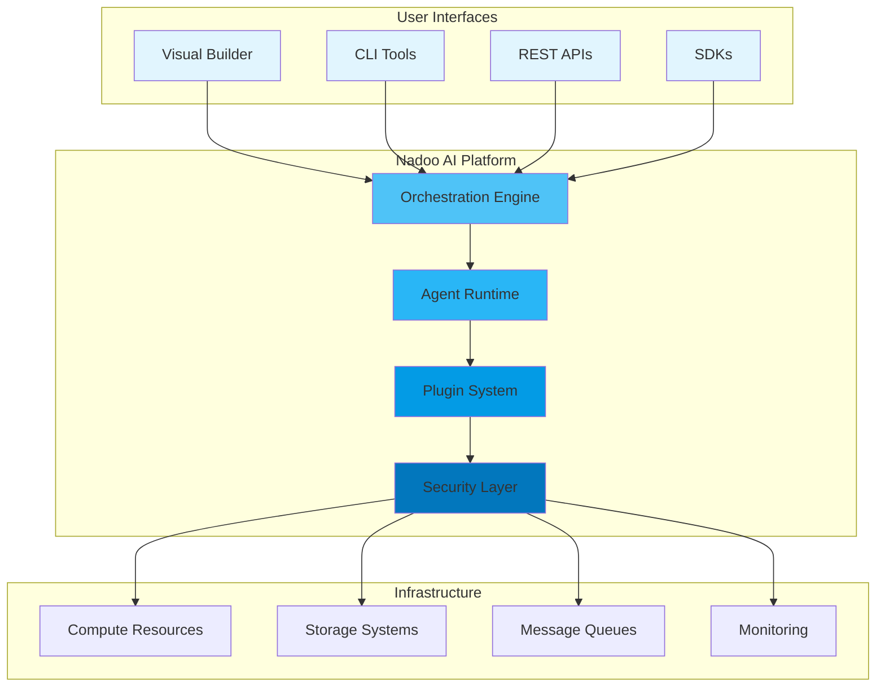

<Hero>
  
  
</Hero>

## The Complete AI Agent Platform

**Nadoo AI** is an open-source platform that empowers developers and enterprises to build, deploy, and manage intelligent AI agents. From low-level workflow orchestration to visual no-code builders, we provide the complete stack for AI automation.

<CardGroup cols={3}>
  <Card
    title="Flow Core"
    icon="code"
    href="/flow-core/overview"
  >
    **For Developers**

    Type-safe workflow orchestration framework with minimal dependencies
  </Card>
  <Card
    title="Builder Platform"
    icon="palette"
    href="/builder/overview"
  >
    **For Everyone**

    Visual no-code interface for creating AI workflows and agents
  </Card>
  <Card
    title="Enterprise Ready"
    icon="building"
    href="/architecture"
  >
    **For Organizations**

    Production-grade infrastructure with security, scalability, and compliance
  </Card>
</CardGroup>

## Why Nadoo AI?

<AccordionGroup>
  <Accordion title="Full-Stack Solution" icon="stack">
    **From Code to No-Code**

    - **Flow Core**: Low-level framework for developers who need full control
    - **Builder**: Visual interface for business users and rapid prototyping
    - **APIs**: RESTful and GraphQL APIs for integration
    - **SDKs**: Client libraries for major programming languages
  </Accordion>
  <Accordion title="Production Ready" icon="rocket">
    **Built for Scale**

    - Handle thousands of concurrent workflows
    - Distributed execution across multiple nodes
    - Built-in monitoring and observability
    - Enterprise security and compliance
  </Accordion>
  <Accordion title="Extensible Architecture" icon="puzzle-piece">
    **Adapt to Your Needs**

    - Multi-backend support (Native, LangGraph, CrewAI, AutoGen)
    - Plugin system for custom components
    - Integration with 100+ external services
    - Custom node and agent development
  </Accordion>
  <Accordion title="Open Source" icon="heart">
    **Community Driven**

    - Active community of contributors
    - Transparent development process
    - No vendor lock-in
    - Open development on GitHub
  </Accordion>
</AccordionGroup>

## Platform Components

### Flow Core
The foundation - a flexible workflow orchestration framework designed for developers.

<Info>
  **Perfect for:** Python developers, ML engineers, and teams building custom AI solutions
</Info>

Key Features:
- Type-safe with Pydantic v2
- Async-first architecture
- Minimal dependencies (only 2!)
- Multi-backend support
- Production-ready patterns

[Explore Flow Core →](/flow-core/overview)

### Builder Platform (Coming Soon)
Visual workflow designer for creating AI agents without code.

<Warning>
  **Status:** Currently in private beta. The Builder platform is under active development and not yet publicly available.
</Warning>

Planned Features:
- Drag-and-drop interface
- Pre-built templates
- Real-time collaboration
- One-click deployment
- Version control

### Integrations
Connect with your existing tools and services.

<Tabs>
  <Tab title="AI Models">
    - OpenAI GPT-4
    - Anthropic Claude
    - Google Gemini
    - Local LLMs (Ollama, LlamaCpp)
    - Custom models
  </Tab>
  <Tab title="Data Sources">
    - Databases (PostgreSQL, MySQL, MongoDB)
    - Vector stores (Pinecone, Weaviate, Qdrant)
    - Cloud storage (S3, GCS, Azure)
    - APIs and webhooks
  </Tab>
  <Tab title="Tools">
    - Slack, Discord, Teams
    - GitHub, GitLab
    - Jira, Linear
    - Google Workspace
    - Custom tools
  </Tab>
</Tabs>

## Use Cases

<CardGroup cols={2}>
  <Card
    title="Customer Support Automation"
    icon="headset"
  >
    Build intelligent chatbots that understand context, access knowledge bases, and escalate to humans when needed.
  </Card>
  <Card
    title="Document Processing"
    icon="file-alt"
  >
    Extract, analyze, and process documents with AI-powered workflows that handle PDFs, emails, and forms.
  </Card>
  <Card
    title="Data Analysis & Reporting"
    icon="chart-line"
  >
    Create agents that analyze data, generate insights, and produce automated reports on schedule or demand.
  </Card>
  <Card
    title="DevOps Automation"
    icon="server"
  >
    Automate deployment pipelines, monitor systems, and respond to incidents with intelligent agents.
  </Card>
</CardGroup>

## Quick Start Paths

Choose your journey based on your role and needs:

<Tabs>
  <Tab title="Developer">
    <Steps>
      <Step title="Install Flow Core">
        ```bash
        pip install nadoo-flow-core
        ```
      </Step>
      <Step title="Build First Workflow">
        Follow our [quickstart guide](/flow-core/quickstart)
      </Step>
      <Step title="Deploy to Production">
        Learn about [deployment options](/deployment)
      </Step>
    </Steps>
  </Tab>
  <Tab title="Enterprise">
    <Steps>
      <Step title="Schedule Demo">
        [Contact our team](mailto:enterprise@nadoo.ai) for a personalized demo
      </Step>
      <Step title="Pilot Program">
        Start with a proof of concept in your environment
      </Step>
      <Step title="Full Deployment">
        Roll out with our professional services team
      </Step>
    </Steps>
  </Tab>
</Tabs>

## Architecture Overview




## Community & Support

<CardGroup cols={2}>
  <Card title="GitHub" icon="github" href="https://github.com/nadoo-ai">
    Star us on GitHub and contribute
  </Card>
  <Card title="Discord" icon="discord" href="https://discord.gg/9gCsxSn6">
    Join our developer community
  </Card>
</CardGroup>

## Ready to Build?

<CardGroup cols={2}>
  <Card
    title="Start with Flow Core"
    icon="terminal"
    href="/flow-core/overview"
  >
    Build custom workflows with our Python framework
  </Card>
  <Card
    title="Try the Builder"
    icon="magic-wand-sparkles"
    href="/builder/getting-started"
  >
    Create AI agents visually without code
  </Card>
</CardGroup>

<Note>
  **Coming Soon:** Version 1.0 with multi-backend support, visual builder, and enterprise features is currently in development.
</Note>

---

<sub>
Built with love by the Nadoo AI team and contributors worldwide.
</sub>