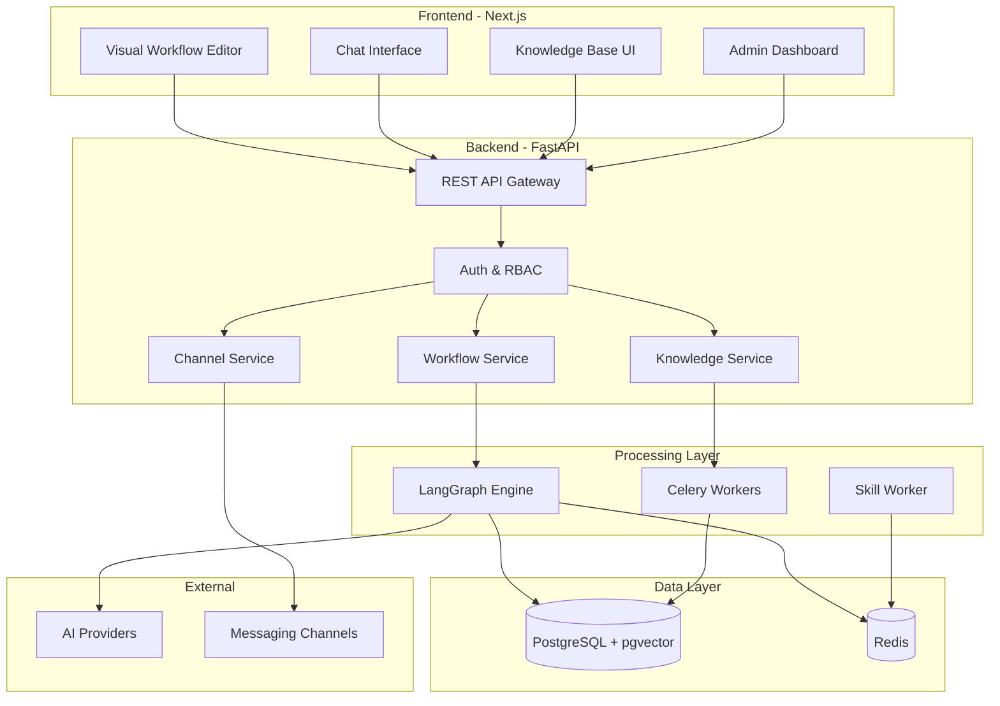

<Hero>
  
  
</Hero>

## Build Intelligent AI Agents, Visually

**Nadoo AI** is an open-source AI Agent Builder Platform that lets you design, deploy, and manage production-ready AI agents through a visual workflow engine. Connect 12+ AI model providers, build RAG-powered knowledge bases, and deliver agents across Slack, Discord, Telegram, KakaoTalk, Teams, and WhatsApp -- all from a single platform.

<CardGroup cols={3}>
  <Card
    title="Workflow Engine"
    icon="diagram-project"
    href="/workflow/overview"
  >
    **Visual Graph Builder**

    LangGraph-based workflow engine with 18+ node types and 6 AI agent strategies including CoT, ReAct, and Tree of Thoughts
  </Card>
  <Card
    title="Knowledge Base"
    icon="book-open"
    href="/knowledge/overview"
  >
    **RAG with Hybrid Search**

    Document ingestion with pgvector embeddings, BM25 keyword search, hybrid retrieval, and reranking for accurate responses
  </Card>
  <Card
    title="AI Models"
    icon="microchip-ai"
    href="/models/overview"
  >
    **12+ Providers**

    OpenAI, Anthropic, Azure OpenAI, AWS Bedrock, Google Vertex AI, Ollama, vLLM, and more with unified API
  </Card>
  <Card
    title="Multi-Channel"
    icon="comments"
    href="/channels/overview"
  >
    **6+ Messaging Platforms**

    Deploy agents to Slack, Discord, Telegram, KakaoTalk, Microsoft Teams, and WhatsApp
  </Card>
  <Card
    title="Extensibility"
    icon="puzzle-piece"
    href="/extend/plugin-sdk/overview"
  >
    **Plugin SDK + Skills**

    Build custom plugins with the Plugin SDK, import reusable Skills from Git repositories, and extend the platform
  </Card>
</CardGroup>

## Why Nadoo AI?

<AccordionGroup>
  <Accordion title="Full-Stack AI Platform" icon="layer-group">
    **Everything You Need in One Platform**

    - **Visual Workflow Engine**: Design complex AI agent logic with a drag-and-drop graph editor
    - **Knowledge Base with RAG**: Ingest documents, build vector indexes, and power agents with retrieval-augmented generation
    - **Multi-Channel Messaging**: Deliver agents across 6+ messaging platforms without custom integration code
    - **Chat Interface**: Built-in chat UI with streaming responses, multimodal input, and conversation memory
  </Accordion>
  <Accordion title="Production Ready" icon="rocket">
    **Built for Real Workloads**

    - **Multi-tenancy**: Workspace-based isolation with role-based access control (RBAC)
    - **Async-first**: FastAPI backend with async processing for high throughput
    - **Background Tasks**: Celery workers for document processing, embedding generation, and long-running operations
    - **API Key Management**: Secure credential storage for AI providers and external services
    - **Docker Deployment**: One-command setup with Docker Compose for local and production environments
  </Accordion>
  <Accordion title="Extensible Architecture" icon="puzzle-piece">
    **Adapt and Extend**

    - **Plugin SDK**: Python SDK for building custom tools that integrate with LLMs, knowledge bases, and storage
    - **Skills System**: Import and execute reusable skills from Git repositories
    - **18+ Node Types**: AI Agent, Condition, Loop, Search Knowledge, HTTP Request, Code Executor, and more
    - **6 Agent Strategies**: Standard, Chain of Thought, ReAct, Function Calling, Reflection, Tree of Thoughts
  </Accordion>
  <Accordion title="Open Source" icon="heart">
    **Community-Driven Development**

    - Fully open-source under permissive license
    - Active community on GitHub and Discord
    - No vendor lock-in -- self-host on your own infrastructure
    - Transparent roadmap and contribution process
  </Accordion>
</AccordionGroup>

## Platform Components

### Workflow Engine
The core of Nadoo AI -- a LangGraph-based visual workflow engine where you connect nodes to build AI agent logic. Each workflow is a directed graph that processes user inputs through chains of AI reasoning, knowledge retrieval, conditional branching, and external tool calls.

<Info>
  **Perfect for:** Teams building complex AI agents that require multi-step reasoning, tool use, and conditional logic
</Info>

### Knowledge Base
Ingest documents (PDF, DOCX, TXT, Markdown) into a vector store powered by PostgreSQL with pgvector. The RAG pipeline supports hybrid search combining dense vector similarity with BM25 keyword matching, plus optional reranking for improved relevance.

<Info>
  **Perfect for:** Organizations that need AI agents grounded in their own documents and data
</Info>

### Multi-Channel Messaging
Connect your AI agents to the messaging platforms your users already use. Each channel integration handles authentication, message formatting, and bidirectional communication.

<Tabs>
  <Tab title="Supported Channels">
    - **Slack** -- Bot integration with slash commands and thread support
    - **Discord** -- Bot with channel and DM support
    - **Telegram** -- Bot API integration
    - **KakaoTalk** -- Channel and chatbot integration
    - **Microsoft Teams** -- Bot Framework integration
    - **WhatsApp** -- Business API integration
  </Tab>
  <Tab title="AI Model Providers">
    - **OpenAI** -- GPT-4o, GPT-4, GPT-3.5
    - **Anthropic** -- Claude 4, Claude 3.5 Sonnet
    - **Azure OpenAI** -- Enterprise OpenAI deployments
    - **AWS Bedrock** -- Claude, Titan, and more
    - **Google Vertex AI** -- Gemini models
    - **Ollama** -- Local open-source models
    - **vLLM** -- High-throughput inference server
    - **Custom endpoints** -- Any OpenAI-compatible API
  </Tab>
  <Tab title="Knowledge Sources">
    - PDF documents
    - Microsoft Word (DOCX)
    - Plain text and Markdown
    - Web page scraping
    - Custom data loaders via plugins
  </Tab>
</Tabs>

### Knowledge Graphs
Build structured knowledge representations using RDF/OWL ontologies. Query with SPARQL and enable multi-hop reasoning across connected entities for complex question answering.

### Plugin SDK and Skills
Extend the platform with custom Python plugins that access LLMs, knowledge bases, tools, and storage. The Skills system lets you import reusable executable units from Git repositories.

## Architecture Overview


```mermaid
graph TB
    subgraph "Frontend - Next.js"
        A[Visual Workflow Editor]
        B[Chat Interface]
        C[Knowledge Base UI]
        D[Admin Dashboard]
    end

    subgraph "Backend - FastAPI"
        E[REST API Gateway]
        F[Auth & RBAC]
        G[Workflow Service]
        H[Knowledge Service]
        I[Channel Service]
    end

    subgraph "Processing Layer"
        J[LangGraph Engine]
        K[Celery Workers]
        L[Skill Worker]
    end

    subgraph "Data Layer"
        M[(PostgreSQL + pgvector)]
        N[(Redis)]
    end

    subgraph "External"
        O[AI Providers]
        P[Messaging Channels]
    end

    A --> E
    B --> E
    C --> E
    D --> E

    E --> F
    F --> G
    F --> H
    F --> I

    G --> J
    H --> K
    I --> P

    J --> O
    J --> M
    J --> N

    K --> M
    L --> N
```

## Quick Start Paths

Choose your path based on how you want to use Nadoo AI:

<Tabs>
  <Tab title="Platform User">
    Get the full platform running locally with Docker.
    <Steps>
      <Step title="Clone and Start">
        ```bash
        git clone https://github.com/nadoo/nadoo-ai-agent-builder.git
        cd nadoo-ai-agent-builder
        git submodule update --init --recursive
        npm run start
        ```
      </Step>
      <Step title="Open the Platform">
        - Frontend: [http://localhost:3000](http://localhost:3000)
        - Backend API: [http://localhost:8000](http://localhost:8000)
        - API Docs: [http://localhost:8000/api/docs](http://localhost:8000/api/docs)
      </Step>
      <Step title="Build Your First Agent">
        Create a workspace, build a workflow, and test it in the chat interface.

        [Follow the Quick Start guide](/getting-started/quickstart)
      </Step>
    </Steps>
  </Tab>
  <Tab title="Workflow Developer">
    <Steps>
      <Step title="Start the Platform">
        Follow the Platform User steps above to get the platform running locally
      </Step>
      <Step title="Learn Workflow Concepts">
        Understand [nodes, edges, and agent strategies](/getting-started/concepts)
      </Step>
      <Step title="Build Custom Workflows">
        Use the visual editor to create workflows with 18+ node types

        [Explore the Workflow Engine](/workflow/overview)
      </Step>
    </Steps>
  </Tab>
  <Tab title="Plugin Developer">
    <Steps>
      <Step title="Install Plugin SDK">
        ```bash
        pip install nadoo-plugin-sdk
        ```
      </Step>
      <Step title="Create Your First Plugin">
        Build a custom tool with access to LLMs, knowledge bases, and storage

        [Plugin SDK Guide](/extend/plugin-sdk/overview)
      </Step>
      <Step title="Register and Test">
        Register your plugin with the platform and test it in workflows
      </Step>
    </Steps>
  </Tab>
  <Tab title="Enterprise">
    <Steps>
      <Step title="Review Architecture">
        Understand the [platform architecture](/getting-started/architecture) and deployment model
      </Step>
      <Step title="Self-Host Deployment">
        Deploy with Docker Compose or Kubernetes on your infrastructure

        [Self-Hosting Guide](/self-hosting/overview)
      </Step>
      <Step title="Contact Us">
        [Reach out to our team](mailto:enterprise@nadoo.ai) for enterprise support and customization
      </Step>
    </Steps>
  </Tab>
</Tabs>

## Use Cases

<CardGroup cols={2}>
  <Card
    title="Customer Support Automation"
    icon="headset"
  >
    Build AI agents that answer questions from your knowledge base, handle multi-turn conversations, and escalate to humans when needed -- deployed across Slack, Teams, or your website.
  </Card>
  <Card
    title="Internal Knowledge Assistant"
    icon="magnifying-glass"
  >
    Ingest company documents into the Knowledge Base and let employees query policies, procedures, and technical documentation through natural language chat.
  </Card>
  <Card
    title="Multi-Channel Chatbot"
    icon="comments"
  >
    Design a single AI workflow and deploy it simultaneously to Slack, Discord, Telegram, KakaoTalk, and WhatsApp with channel-specific formatting.
  </Card>
  <Card
    title="Document Processing Pipeline"
    icon="file-lines"
  >
    Build workflows that ingest documents, extract structured data with AI, validate results, and route to downstream systems.
  </Card>
  <Card
    title="AI-Powered Data Analysis"
    icon="chart-line"
  >
    Create agents that query databases, analyze data, generate visualizations, and produce reports using Code Executor and AI Agent nodes.
  </Card>
  <Card
    title="Workflow Automation"
    icon="gears"
  >
    Chain together HTTP Request, Condition, and AI Agent nodes to automate complex business processes with intelligent decision-making.
  </Card>
</CardGroup>

## Community and Support

<CardGroup cols={2}>
  <Card title="GitHub" icon="github" href="https://github.com/nadoo-ai">
    Star the repository and contribute to the project
  </Card>
  <Card title="Discord" icon="discord" href="https://discord.gg/9gCsxSn6">
    Join the developer community for questions and discussions
  </Card>
</CardGroup>

## Ready to Build?

<CardGroup cols={3}>
  <Card
    title="Quick Start"
    icon="play"
    href="/getting-started/quickstart"
  >
    Get the platform running in 5 minutes
  </Card>
  <Card
    title="Core Concepts"
    icon="lightbulb"
    href="/getting-started/concepts"
  >
    Understand the domain model and key abstractions
  </Card>
  <Card
    title="Architecture"
    icon="sitemap"
    href="/getting-started/architecture"
  >
    Explore the technical architecture and system design
  </Card>
</CardGroup>

<Note>
  **Current Version:** v0.5.0 -- Nadoo AI Agent Builder Platform includes the visual workflow engine with 18+ node types, Knowledge Base with RAG, 12+ AI provider integrations, multi-channel messaging, Plugin SDK, and Skills system.
</Note>

---

<sub>
Built with care by the Nadoo AI team and contributors worldwide.
</sub>
