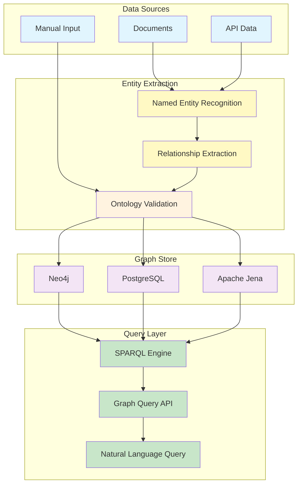
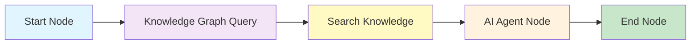

## Overview

Knowledge graphs provide a **structured representation** of entities and the relationships between them. While the [Knowledge Base](/knowledge/overview) stores unstructured text for semantic retrieval, knowledge graphs organize information as nodes (entities) and edges (relationships), enabling precise traversal, reasoning, and complex question answering that text search alone cannot achieve.

## Why Knowledge Graphs?

<Tabs>
  <Tab title="vs. Vector Search">
    | Capability | Vector Search | Knowledge Graphs |
    |---|---|---|
    | Finding similar content | Excellent | Not designed for this |
    | Answering "What is X?" | Good | Good |
    | Answering "How is X related to Y?" | Limited | Excellent |
    | Multi-hop traversal | Requires multi-hop RAG | Native graph traversal |
    | Temporal reasoning | Difficult | Supported with temporal properties |
    | Data consistency | Approximate (embedding similarity) | Exact (structured relationships) |

    Knowledge graphs and vector search are complementary. Use vector search for open-ended natural language questions and knowledge graphs for structured relationship queries.
  </Tab>
  <Tab title="Use Cases">
    - **Complex Q&A:** "Which products depend on the authentication service?" -- requires traversing dependency relationships
    - **Entity relationships:** "Show me all engineers who worked on Project Alpha" -- requires joining person and project entities
    - **Temporal reasoning:** "What changed in our security policy between Q1 and Q3 2025?" -- requires temporal relationship traversal
    - **Compliance mapping:** "Which regulations apply to our payment processing service?" -- requires mapping entities to regulatory frameworks
    - **Impact analysis:** "If we deprecate API v2, which downstream services are affected?" -- requires dependency graph traversal
  </Tab>
</Tabs>

## Core Concepts

### Entities

Entities are the nodes in a knowledge graph. Each entity has a type, a unique identifier, and a set of properties.

```json
{
  "id": "entity_auth_service",
  "type": "Service",
  "properties": {
    "name": "Authentication Service",
    "team": "Platform Security",
    "language": "Python",
    "created_date": "2024-03-15"
  }
}
```

### Relationships

Relationships are the directed edges that connect entities. Each relationship has a type, a source entity, a target entity, and optional properties.

```json
{
  "type": "DEPENDS_ON",
  "source": "entity_auth_service",
  "target": "entity_postgres_db",
  "properties": {
    "dependency_type": "runtime",
    "since": "2024-03-15"
  }
}
```

### Ontology

An ontology defines the schema of a knowledge graph: what entity types exist, what relationship types are allowed, and what properties each can have. Nadoo AI supports **RDF/OWL** ontologies for formal schema definition.

[Learn more about ontology management](/knowledge-graphs/ontology)

## Architecture



## Graph Stores

Nadoo AI supports three graph store backends, selectable based on your infrastructure and scale requirements.

### Neo4j

A native graph database optimized for traversal-heavy workloads.

- **Best for:** Complex graph queries with deep traversals (5+ hops)
- **Query language:** Cypher (native) + SPARQL (via adapter)
- **Scale:** Billions of nodes and relationships
- **Deployment:** Self-hosted or Neo4j AuraDB

```json
{
  "graph_store": {
    "provider": "neo4j",
    "uri": "bolt://localhost:7687",
    "username": "neo4j",
    "password": "your-password"
  }
}
```

### PostgreSQL

Uses PostgreSQL with graph query extensions. Shares the same database instance as the rest of the platform.

- **Best for:** Smaller graphs where operational simplicity is a priority
- **Query language:** SPARQL (via query translation)
- **Scale:** Millions of nodes and relationships
- **Deployment:** Uses the existing platform PostgreSQL instance

```json
{
  "graph_store": {
    "provider": "postgresql",
    "connection": "default"
  }
}
```

### Apache Jena

A Java-based RDF framework with full SPARQL 1.1 support and OWL reasoning.

- **Best for:** Deployments that require standards-compliant RDF/OWL reasoning
- **Query language:** SPARQL 1.1 (native)
- **Scale:** Hundreds of millions of triples
- **Deployment:** Self-hosted TDB2 or Fuseki server

```json
{
  "graph_store": {
    "provider": "jena",
    "endpoint": "http://localhost:3030/dataset"
  }
}
```

## Entity Extraction from Documents

Knowledge graphs can be populated automatically by extracting entities and relationships from your uploaded documents.

### Extraction Pipeline

<Steps>
  <Step title="Named Entity Recognition">
    An NLP model identifies entities in the document text: people, organizations, services, products, locations, dates, and custom entity types defined in your ontology.
  </Step>
  <Step title="Relationship Extraction">
    A second model (or the same LLM in a single pass) identifies relationships between detected entities. For example, from *"The Platform Security team built the Authentication Service in March 2024"*, the system extracts:

    - Entity: `Platform Security` (Team)
    - Entity: `Authentication Service` (Service)
    - Relationship: `Platform Security` --BUILT--> `Authentication Service`
    - Property: `date: 2024-03`
  </Step>
  <Step title="Ontology Validation">
    Extracted entities and relationships are validated against the knowledge graph's ontology. Invalid types or relationships are flagged for manual review.
  </Step>
  <Step title="Graph Insertion">
    Validated entities and relationships are inserted into the graph store. Duplicate entities are merged using configurable identity resolution rules.
  </Step>
</Steps>

### Configuration

```json
{
  "entity_extraction": {
    "enabled": true,
    "model": "gpt-4o",
    "entity_types": ["Person", "Team", "Service", "Product", "Technology"],
    "relationship_types": ["BUILT", "MANAGES", "DEPENDS_ON", "USES", "MEMBER_OF"],
    "auto_validate": true
  }
}
```

## Querying Knowledge Graphs

### SPARQL

The primary query language for Nadoo AI knowledge graphs. SPARQL provides powerful pattern matching, filtering, and aggregation over graph data.

```sparql
SELECT ?service ?team WHERE {
  ?service a :Service .
  ?team a :Team .
  ?team :BUILT ?service .
  ?service :language "Python" .
}
```

[Learn more about SPARQL queries](/knowledge-graphs/sparql)

### Natural Language Queries

For AI agent workflows, the knowledge graph can be queried using natural language. The platform translates the user's question into a SPARQL query, executes it, and returns the results.

```
User: "Which services does the Platform Security team manage?"

Generated SPARQL:
SELECT ?service WHERE {
  :PlatformSecurity :MANAGES ?service .
  ?service a :Service .
}

Result: Authentication Service, Key Management Service, SSO Gateway
```

### Integration with Workflows

Add a **Knowledge Graph Query** node to your workflow to incorporate graph-based reasoning:



This pattern uses the knowledge graph for structured lookups and the knowledge base for contextual retrieval, combining both in the AI agent's prompt.

## Next Steps

<CardGroup cols={2}>
  <Card title="SPARQL Queries" icon="code" href="/knowledge-graphs/sparql">
    Write and execute SPARQL queries against your knowledge graph
  </Card>
  <Card title="Ontology Management" icon="sitemap" href="/knowledge-graphs/ontology">
    Define entity types, relationships, and validation rules
  </Card>
  <Card title="Knowledge Base" icon="book" href="/knowledge/overview">
    Unstructured document retrieval with RAG
  </Card>
  <Card title="Contextual Retrieval" icon="brain" href="/knowledge/contextual-retrieval">
    Advanced retrieval strategies that complement graph-based reasoning
  </Card>
</CardGroup>
