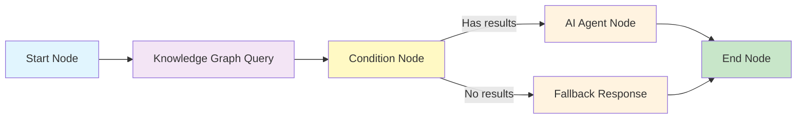

## Overview

SPARQL (SPARQL Protocol and RDF Query Language) is the standard query language for knowledge graphs built on RDF data. In Nadoo AI, SPARQL is the primary way to query, filter, and aggregate data across entities and relationships in your knowledge graphs.

## API Endpoints

### Execute a Query

```bash
curl -X POST \
  "https://your-instance.example.com/api/v1/sparql/query" \
  -H "Authorization: Bearer YOUR_API_KEY" \
  -H "Content-Type: application/json" \
  -d '{
    "query": "SELECT ?name WHERE { ?s a :Service . ?s :name ?name }",
    "dataset": "workspace_default",
    "format": "json"
  }'
```

**Request parameters:**

| Parameter | Type | Required | Description |
|---|---|---|---|
| `query` | String | Yes | The SPARQL query to execute |
| `dataset` | String | No | Target dataset/graph. Defaults to the workspace's default graph. |
| `format` | String | No | Response format: `json` (default), `csv`, `xml` |
| `timeout` | Integer | No | Query timeout in milliseconds (default: 30000) |

### List Available Datasets

```bash
curl -X GET \
  "https://your-instance.example.com/api/v1/sparql/datasets" \
  -H "Authorization: Bearer YOUR_API_KEY"
```

**Response:**

```json
{
  "datasets": [
    {
      "name": "workspace_default",
      "description": "Default knowledge graph for the workspace",
      "triple_count": 15420,
      "entity_count": 3210,
      "last_updated": "2026-03-09T08:00:00Z"
    },
    {
      "name": "product_catalog",
      "description": "Product and service dependency graph",
      "triple_count": 8750,
      "entity_count": 1205,
      "last_updated": "2026-03-08T14:30:00Z"
    }
  ]
}
```

## SPARQL Query Basics

### SELECT Queries

Retrieve specific data by matching patterns in the graph.

```sparql
PREFIX nadoo: <http://nadoo.ai/ontology#>

SELECT ?service ?team ?language
WHERE {
  ?service a nadoo:Service .
  ?service nadoo:name ?serviceName .
  ?service nadoo:language ?language .
  ?team nadoo:BUILT ?service .
  ?team a nadoo:Team .
}
ORDER BY ?serviceName
LIMIT 10
```

**Response:**

```json
{
  "results": {
    "bindings": [
      {
        "service": { "value": "entity_auth_service" },
        "team": { "value": "entity_platform_security" },
        "language": { "value": "Python" }
      },
      {
        "service": { "value": "entity_api_gateway" },
        "team": { "value": "entity_platform_infra" },
        "language": { "value": "Go" }
      }
    ]
  }
}
```

### ASK Queries

Check whether a pattern exists in the graph. Returns `true` or `false`.

```sparql
PREFIX nadoo: <http://nadoo.ai/ontology#>

ASK {
  ?service a nadoo:Service .
  ?service nadoo:name "Authentication Service" .
  ?service nadoo:language "Python" .
}
```

### CONSTRUCT Queries

Build a new RDF graph from matched patterns. Useful for extracting subgraphs.

```sparql
PREFIX nadoo: <http://nadoo.ai/ontology#>

CONSTRUCT {
  ?service nadoo:name ?name .
  ?service nadoo:DEPENDS_ON ?dependency .
}
WHERE {
  ?service a nadoo:Service .
  ?service nadoo:name ?name .
  ?service nadoo:DEPENDS_ON ?dependency .
  ?service nadoo:team "Platform Security" .
}
```

## Example Queries

### Find All Entities of a Type

Retrieve all services registered in the knowledge graph.

```sparql
PREFIX nadoo: <http://nadoo.ai/ontology#>

SELECT ?name ?language ?team
WHERE {
  ?service a nadoo:Service .
  ?service nadoo:name ?name .
  OPTIONAL { ?service nadoo:language ?language }
  OPTIONAL {
    ?team nadoo:BUILT ?service .
    ?team nadoo:name ?teamName .
  }
}
ORDER BY ?name
```

### Traverse Relationships

Find all downstream dependencies of a given service (one hop).

```sparql
PREFIX nadoo: <http://nadoo.ai/ontology#>

SELECT ?dependency ?depType
WHERE {
  ?service nadoo:name "Authentication Service" .
  ?service nadoo:DEPENDS_ON ?dep .
  ?dep nadoo:name ?dependency .
  ?dep a ?depType .
}
```

### Multi-Hop Traversal

Find all transitive dependencies (up to 3 hops deep) using property paths.

```sparql
PREFIX nadoo: <http://nadoo.ai/ontology#>

SELECT ?name (COUNT(?mid) AS ?depth)
WHERE {
  ?service nadoo:name "API Gateway" .
  ?service nadoo:DEPENDS_ON+ ?dep .
  ?dep nadoo:name ?name .
  OPTIONAL { ?service nadoo:DEPENDS_ON ?mid . ?mid nadoo:DEPENDS_ON* ?dep }
}
GROUP BY ?name
ORDER BY ?depth
```

### Aggregate Data

Count the number of services per team.

```sparql
PREFIX nadoo: <http://nadoo.ai/ontology#>

SELECT ?teamName (COUNT(?service) AS ?serviceCount)
WHERE {
  ?team a nadoo:Team .
  ?team nadoo:name ?teamName .
  ?team nadoo:BUILT ?service .
  ?service a nadoo:Service .
}
GROUP BY ?teamName
ORDER BY DESC(?serviceCount)
```

### Filter with Conditions

Find services created after a specific date that use Python.

```sparql
PREFIX nadoo: <http://nadoo.ai/ontology#>
PREFIX xsd: <http://www.w3.org/2001/XMLSchema#>

SELECT ?name ?createdDate
WHERE {
  ?service a nadoo:Service .
  ?service nadoo:name ?name .
  ?service nadoo:language "Python" .
  ?service nadoo:created_date ?createdDate .
  FILTER (?createdDate > "2025-01-01"^^xsd:date)
}
ORDER BY DESC(?createdDate)
```

### Find Shortest Path

Find the shortest dependency path between two services.

```sparql
PREFIX nadoo: <http://nadoo.ai/ontology#>

SELECT ?intermediate
WHERE {
  ?source nadoo:name "API Gateway" .
  ?target nadoo:name "PostgreSQL" .
  ?source nadoo:DEPENDS_ON* ?intermediate .
  ?intermediate nadoo:DEPENDS_ON* ?target .
  ?intermediate nadoo:name ?name .
  FILTER (?intermediate != ?source && ?intermediate != ?target)
}
```

## Integration with Workflow Nodes

SPARQL queries can be executed from within a Nadoo AI workflow using the **Knowledge Graph Query** node.

### Node Configuration

| Field | Description |
|---|---|
| **Query** | The SPARQL query to execute. Supports variable interpolation from the workflow context. |
| **Dataset** | The target knowledge graph dataset. |
| **Output Variable** | The workflow variable to store query results in. |

### Variable Interpolation

Use `{{variable_name}}` syntax to inject workflow variables into SPARQL queries:

```sparql
PREFIX nadoo: <http://nadoo.ai/ontology#>

SELECT ?dependency ?depType
WHERE {
  ?service nadoo:name "{{user_input.service_name}}" .
  ?service nadoo:DEPENDS_ON ?dep .
  ?dep nadoo:name ?dependency .
  ?dep a ?depType .
}
```

The `{{user_input.service_name}}` is replaced at runtime with the value from the workflow context.

### Example Workflow



## Query Best Practices

<AccordionGroup>
  <Accordion title="Use PREFIX declarations" icon="tag">
    Always declare prefixes at the top of your queries for readability. Avoid using full URIs in the query body.

    ```sparql
    -- Good
    PREFIX nadoo: <http://nadoo.ai/ontology#>
    SELECT ?name WHERE { ?s nadoo:name ?name }

    -- Avoid
    SELECT ?name WHERE { ?s <http://nadoo.ai/ontology#name> ?name }
    ```
  </Accordion>
  <Accordion title="Use OPTIONAL for nullable properties" icon="circle-question">
    Wrap optional properties in `OPTIONAL {}` blocks so that entities missing those properties are still returned.

    ```sparql
    SELECT ?name ?email
    WHERE {
      ?person a nadoo:Person .
      ?person nadoo:name ?name .
      OPTIONAL { ?person nadoo:email ?email }
    }
    ```
  </Accordion>
  <Accordion title="Limit results for performance" icon="gauge-high">
    Always use `LIMIT` for exploratory queries, especially on large graphs. Unbounded queries can be slow and return excessive data.

    ```sparql
    SELECT ?s ?p ?o
    WHERE { ?s ?p ?o }
    LIMIT 100
    ```
  </Accordion>
  <Accordion title="Use FILTER for precise conditions" icon="filter">
    SPARQL `FILTER` supports regex, comparison operators, and boolean logic for precise data selection.

    ```sparql
    FILTER (regex(?name, "^Auth", "i"))
    FILTER (?count > 5)
    FILTER (?date >= "2025-01-01"^^xsd:date && ?date < "2026-01-01"^^xsd:date)
    ```
  </Accordion>
</AccordionGroup>

## Next Steps

<CardGroup cols={2}>
  <Card title="Knowledge Graphs Overview" icon="diagram-project" href="/knowledge-graphs/overview">
    Understand the knowledge graph architecture and graph stores
  </Card>
  <Card title="Ontology Management" icon="sitemap" href="/knowledge-graphs/ontology">
    Define the schema for your knowledge graph
  </Card>
  <Card title="Knowledge Base" icon="book" href="/knowledge/overview">
    Complement graph queries with vector-based document retrieval
  </Card>
  <Card title="Workflow Engine" icon="diagram-project" href="/workflow/overview">
    Build workflows that combine graph queries with AI reasoning
  </Card>
</CardGroup>
