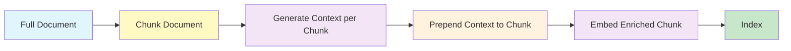
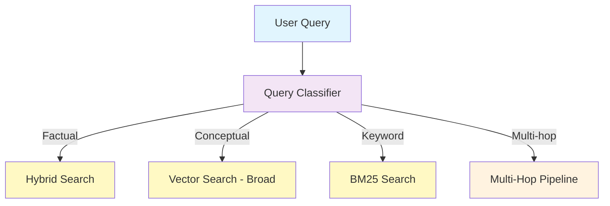
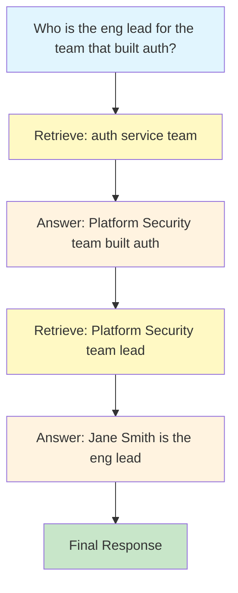

## Overview

Contextual retrieval is a collection of advanced strategies that go beyond standard semantic search to significantly improve the quality and relevance of retrieved documents. These techniques address the core limitation of basic RAG: individual chunks lose their surrounding context when isolated from the original document.

Nadoo AI provides four key contextual retrieval capabilities:

1. **Contextual chunk enrichment** -- Adds document-level context to each chunk before embedding
2. **Cross-encoder reranking** -- Re-scores retrieved chunks with a more accurate model
3. **Query classification** -- Routes queries to the optimal search strategy
4. **Multi-hop reasoning** -- Chains multiple retrieval steps for complex questions

## Contextual Chunk Enrichment

Standard chunking splits a document into segments and embeds each independently. The problem: a chunk like *"The rate is 3.5% for the first year"* loses critical context about *which* rate and *which* product is being discussed.

The contextual retrieval service solves this by prepending a brief, AI-generated context summary to each chunk before embedding.

### How It Works



<Steps>
  <Step title="Chunk the document">
    The document is split into chunks using the configured chunking strategy (default: 1000 characters with 200-character overlap).
  </Step>
  <Step title="Generate context for each chunk">
    An LLM is given the full document (or a surrounding window) and the specific chunk, then asked to generate a concise context statement. For example:

    **Chunk:** *"The rate is 3.5% for the first year and increases to 4.2% thereafter."*

    **Generated context:** *"This chunk is from the Mortgage Products section of the 2026 Consumer Lending Guide, specifically describing the introductory rate for the HomeFlex variable-rate mortgage."*
  </Step>
  <Step title="Prepend context to chunk">
    The context is prepended to the chunk text before embedding:

    *"[Context: This chunk describes the introductory rate for the HomeFlex variable-rate mortgage from the 2026 Consumer Lending Guide.] The rate is 3.5% for the first year and increases to 4.2% thereafter."*
  </Step>
  <Step title="Embed and index">
    The enriched chunk is embedded and indexed. The embedding now captures both the specific content and its broader document context.
  </Step>
</Steps>

### Configuration

Enable contextual retrieval when creating or updating a knowledge base:

```json
{
  "contextual_retrieval": {
    "enabled": true,
    "context_model": "gpt-4o-mini",
    "context_max_tokens": 100,
    "window_size": 5000
  }
}
```

| Parameter | Default | Description |
|---|---|---|
| `enabled` | `false` | Enable contextual chunk enrichment |
| `context_model` | `gpt-4o-mini` | LLM used to generate context summaries |
| `context_max_tokens` | 100 | Maximum token length for each context summary |
| `window_size` | 5000 | Character window of surrounding document text provided to the context generator |

<Info>
  Contextual enrichment adds processing time and LLM cost during document ingestion. The additional cost is a one-time expense per document and significantly improves retrieval accuracy for ambiguous or context-dependent content.
</Info>

## Cross-Encoder Reranking

Initial retrieval (whether vector, BM25, or hybrid) uses fast but approximate scoring. Cross-encoder reranking applies a more powerful model that evaluates each query-chunk pair jointly, producing much more accurate relevance scores.

### How It Works

1. **Initial retrieval** returns a broad candidate set (e.g., `top_k: 20`)
2. Each candidate chunk is paired with the original query and scored by a **cross-encoder model**
3. Results are re-sorted by the cross-encoder scores
4. Only the top `rerank_top_k` results (e.g., 3-5) are passed to the LLM

### Why Cross-Encoders Are More Accurate

| Aspect | Bi-Encoder (Vector Search) | Cross-Encoder (Reranking) |
|---|---|---|
| **Input** | Query and document embedded independently | Query and document processed together |
| **Interaction** | No cross-attention between query and document | Full cross-attention captures fine-grained relevance |
| **Speed** | Fast -- can search millions of vectors | Slow -- must score each pair individually |
| **Accuracy** | Good approximate relevance | High-precision relevance scoring |

This is why reranking is used as a second stage: vector search is fast enough to search the full index, and the cross-encoder is accurate enough to precisely rank the shortlisted candidates.

### Configuration

```json
{
  "retrieval": {
    "top_k": 20,
    "reranking": true,
    "rerank_model": "cohere-rerank-v3",
    "rerank_top_k": 5
  }
}
```

| Parameter | Default | Description |
|---|---|---|
| `reranking` | `false` | Enable cross-encoder reranking |
| `rerank_model` | -- | Model to use for reranking (e.g., `cohere-rerank-v3`, `bge-reranker-large`) |
| `rerank_top_k` | 3 | Number of chunks to keep after reranking |

<Tip>
  Set the initial `top_k` to 3-5x the `rerank_top_k`. For example, retrieve 20 candidates and rerank to the top 5. This gives the reranker a large enough pool to find the best matches.
</Tip>

## Query Classification

Not all queries benefit from the same retrieval strategy. Query classification analyzes the incoming query and routes it to the most appropriate search method.

### Query Types and Routing

| Query Type | Example | Routing Strategy |
|---|---|---|
| **Factual** | "What is the maximum file upload size?" | Hybrid search with high `score_threshold` |
| **Conceptual** | "Explain how the authentication system works" | Vector search with larger `top_k` for broader context |
| **Keyword** | "Error ERR-4021 troubleshooting" | BM25-weighted hybrid search |
| **Comparative** | "What are the differences between HNSW and IVFFlat?" | Multi-source vector search across relevant sections |
| **Multi-hop** | "Which team manages the service that handles authentication?" | Multi-hop reasoning pipeline |

### How It Works



The query classifier uses a lightweight LLM call or a fine-tuned classification model to categorize the query. Based on the category, the system selects the optimal search configuration (mode, weights, top_k, score_threshold) without requiring the user to specify these parameters.

### Configuration

```json
{
  "query_classification": {
    "enabled": true,
    "classifier_model": "gpt-4o-mini",
    "fallback_strategy": "hybrid"
  }
}
```

## Multi-Hop Reasoning

Some questions require information that is spread across multiple documents or sections. Multi-hop reasoning addresses this by chaining multiple retrieval steps.

### Example

**Question:** *"Who is the engineering lead for the team that built the authentication service?"*

This question requires two pieces of information:
1. Which team built the authentication service
2. Who is the engineering lead of that team

### How It Works



<Steps>
  <Step title="Initial retrieval">
    Retrieve context for the original question. The initial results may provide partial information.
  </Step>
  <Step title="Sub-question generation">
    The LLM identifies what additional information is needed and generates follow-up sub-questions.
  </Step>
  <Step title="Follow-up retrieval">
    Each sub-question triggers a new retrieval step against the knowledge base.
  </Step>
  <Step title="Synthesis">
    All retrieved information is combined, and the LLM produces a comprehensive answer that addresses the original question.
  </Step>
</Steps>

### Configuration

```json
{
  "multi_hop": {
    "enabled": true,
    "max_hops": 3,
    "sub_question_model": "gpt-4o-mini"
  }
}
```

| Parameter | Default | Description |
|---|---|---|
| `max_hops` | 3 | Maximum number of retrieval iterations |
| `sub_question_model` | Same as agent model | LLM used to generate sub-questions |

<Warning>
  Multi-hop reasoning increases latency and token usage proportional to the number of hops. Use it selectively for complex questions that genuinely require information from multiple sources.
</Warning>

## Combining Strategies

These contextual retrieval features can be combined for maximum effectiveness:

```json
{
  "contextual_retrieval": {
    "enabled": true
  },
  "retrieval": {
    "search_mode": "hybrid",
    "top_k": 20,
    "reranking": true,
    "rerank_top_k": 5
  },
  "query_classification": {
    "enabled": true
  },
  "multi_hop": {
    "enabled": true,
    "max_hops": 3
  }
}
```

**Processing order:**
1. Query classification determines the search strategy
2. The selected search mode retrieves candidates from contextually enriched chunks
3. Cross-encoder reranking narrows to the top results
4. If multi-hop is triggered, steps 2-3 repeat for each sub-question
5. All context is assembled and passed to the LLM

## When to Use Each Strategy

| Strategy | Added Latency | Added Cost | Best For |
|---|---|---|---|
| **Contextual enrichment** | At ingestion only | Moderate (LLM calls per chunk) | Ambiguous content, documents with dense cross-references |
| **Reranking** | 200-500ms per query | Low (reranker API call) | All production deployments where accuracy matters |
| **Query classification** | 100-200ms per query | Low (lightweight LLM call) | Knowledge bases with diverse query types |
| **Multi-hop reasoning** | 1-5s per query | High (multiple LLM + retrieval calls) | Complex questions requiring information synthesis |

## Next Steps

<CardGroup cols={2}>
  <Card title="RAG Pipeline" icon="arrows-turn-to-dots" href="/knowledge/rag-pipeline">
    Understand the full end-to-end RAG flow
  </Card>
  <Card title="Vector Search" icon="magnifying-glass" href="/knowledge/vector-search">
    Deep dive into embedding-based similarity search
  </Card>
  <Card title="Hybrid Search" icon="code-merge" href="/knowledge/hybrid-search">
    How vector and keyword search are combined
  </Card>
  <Card title="Knowledge Graphs" icon="diagram-project" href="/knowledge-graphs/overview">
    Structured knowledge representation for entity-based reasoning
  </Card>
</CardGroup>
