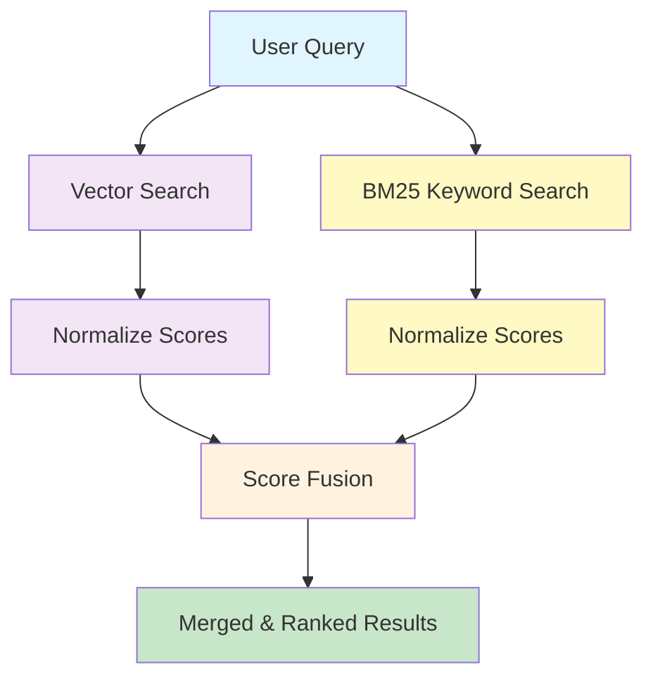

## Overview

Hybrid search combines two complementary retrieval strategies -- **vector similarity search** and **BM25 keyword matching** -- to deliver results that are both semantically relevant and lexically precise. It is the **recommended default** search mode for most Nadoo AI knowledge base use cases.

## Why Hybrid Search?

Vector search and keyword search each have strengths and blind spots. Hybrid search combines them to cover both.

| Scenario | Vector Search | BM25 Keyword Search | Hybrid |
|---|---|---|---|
| "How do I reset my password?" | Finds semantically similar content about account recovery | Matches documents containing "reset" and "password" | Finds both exact matches and paraphrased content |
| "Error code ERR-4021" | May miss because the code has no semantic meaning | Finds exact matches for the error code string | Catches the error code and related troubleshooting context |
| "What are the benefits of our health plan?" | Finds conceptually related content about employee benefits | May miss documents that use "medical insurance" instead of "health plan" | Covers both the exact phrasing and semantic equivalents |

<Info>
  **Rule of thumb:** Use hybrid search unless you have a specific reason to use only one mode. It consistently outperforms either mode alone across diverse query types.
</Info>

## How It Works

Hybrid search runs both retrieval strategies in parallel, normalizes their scores, and merges the results using a weighted combination.



<Steps>
  <Step title="Parallel retrieval">
    The query is sent to both the vector search engine and the BM25 keyword search engine simultaneously. Each returns its own ranked list of matching chunks.
  </Step>
  <Step title="Score normalization">
    Raw scores from each engine are normalized to a 0-1 range. This is necessary because vector similarity scores and BM25 scores are on different scales.
  </Step>
  <Step title="Score fusion">
    Normalized scores are combined using **Reciprocal Rank Fusion (RRF)**, weighted by the configured `vector_weight` and `bm25_weight` parameters. Chunks that appear in both result sets receive a boost.

    ```
    final_score = (vector_weight * normalized_vector_score)
                + (bm25_weight * normalized_bm25_score)
    ```
  </Step>
  <Step title="Merge and rank">
    Results are deduplicated (chunks appearing in both lists are merged), sorted by final score, and the top `top_k` results are returned.
  </Step>
</Steps>

## Vector Search Component

The vector search side of hybrid retrieval works identically to standalone [vector search](/knowledge/vector-search):

- The query is embedded using the knowledge base's configured embedding model
- The query vector is compared against indexed chunk vectors using the configured distance metric (default: cosine)
- Results are ranked by similarity score

## BM25 Keyword Component

BM25 (Best Matching 25) is a probabilistic information retrieval algorithm that scores documents based on term frequency and inverse document frequency.

**How BM25 scores documents:**

1. **Term Frequency (TF):** How often the query terms appear in the document. More occurrences increase the score, with diminishing returns.
2. **Inverse Document Frequency (IDF):** Rare terms across the corpus are weighted more heavily than common terms.
3. **Document Length Normalization:** Longer documents are penalized slightly to prevent them from dominating results simply because they contain more text.

**Strengths of BM25:**
- Excellent for exact term matching (product codes, error messages, proper nouns)
- Fast computation without requiring embedding models
- No sensitivity to embedding model quality

**Limitations of BM25:**
- Cannot match synonyms or paraphrases
- Does not understand semantic meaning
- Language-dependent tokenization

## When to Use Hybrid vs. Pure Vector Search

<Tabs>
  <Tab title="Use Hybrid Search">
    Hybrid search is recommended when:

    - Your knowledge base contains a mix of natural language and technical content
    - Users may search with exact terms (codes, IDs, proper nouns) or natural language
    - You want consistent performance across diverse query types
    - Documents contain domain-specific terminology that needs exact matching

    ```json
    {
      "search_mode": "hybrid",
      "top_k": 5,
      "vector_weight": 0.7,
      "bm25_weight": 0.3
    }
    ```
  </Tab>
  <Tab title="Use Pure Vector Search">
    Pure vector search may be preferable when:

    - All queries are natural language questions with no technical identifiers
    - Your embedding model is domain-tuned and highly accurate
    - Documents are homogeneous in style and vocabulary
    - You prioritize semantic understanding over exact term matching

    ```json
    {
      "search_mode": "vector",
      "top_k": 5,
      "score_threshold": 0.7
    }
    ```
  </Tab>
  <Tab title="Use Pure BM25 Search">
    Pure BM25 search may be preferable when:

    - Queries are primarily keyword-based (e.g., searching for product codes or error messages)
    - The embedding model is not well suited to your domain
    - You need the fastest possible retrieval with no embedding computation

    ```json
    {
      "search_mode": "bm25",
      "top_k": 5
    }
    ```
  </Tab>
</Tabs>

## Configuration

### Search Parameters

| Parameter | Default | Description |
|---|---|---|
| `search_mode` | `hybrid` | Search strategy: `vector`, `bm25`, or `hybrid` |
| `top_k` | 5 | Number of results to return |
| `score_threshold` | 0.5 | Minimum combined score (0.0 to 1.0) to include a result |
| `vector_weight` | 0.7 | Weight applied to vector similarity scores in the fusion step |
| `bm25_weight` | 0.3 | Weight applied to BM25 keyword scores in the fusion step |

<Tip>
  The `vector_weight` and `bm25_weight` do not need to sum to 1.0, but keeping them normalized makes it easier to reason about relative importance. A 0.7/0.3 split favoring vector search is a strong default for most content types.
</Tip>

### Full Configuration Example

```json
{
  "query": "What is the refund policy for enterprise customers?",
  "search_mode": "hybrid",
  "top_k": 10,
  "score_threshold": 0.5,
  "vector_weight": 0.7,
  "bm25_weight": 0.3,
  "filters": {
    "department": "sales",
    "tags": ["policy"]
  }
}
```

### Response

```json
{
  "results": [
    {
      "chunk_id": "chk_101",
      "content": "Enterprise customers are eligible for a full refund within 30 days of purchase...",
      "score": 0.91,
      "vector_score": 0.89,
      "bm25_score": 0.95,
      "metadata": {
        "document_id": "doc_policies",
        "filename": "refund-policy.pdf",
        "heading": "Enterprise Refund Terms"
      }
    },
    {
      "chunk_id": "chk_102",
      "content": "All refund requests must be submitted through the account manager...",
      "score": 0.83,
      "vector_score": 0.85,
      "bm25_score": 0.78,
      "metadata": {
        "document_id": "doc_policies",
        "filename": "refund-policy.pdf",
        "heading": "Refund Process"
      }
    }
  ],
  "total": 2,
  "search_mode": "hybrid"
}
```

## Tuning Weights

The balance between vector and BM25 weights depends on your content and query patterns.

| Scenario | Recommended Weights | Reasoning |
|---|---|---|
| General knowledge base | `vector: 0.7, bm25: 0.3` | Most queries are natural language; keyword matching provides a safety net |
| Technical documentation | `vector: 0.5, bm25: 0.5` | Equal weight because technical terms need exact matching alongside conceptual search |
| Legal/compliance documents | `vector: 0.6, bm25: 0.4` | Specific legal terms matter, but semantic understanding is still important |
| FAQ/support articles | `vector: 0.8, bm25: 0.2` | Questions are varied in phrasing; semantic matching dominates |
| Code documentation | `vector: 0.4, bm25: 0.6` | Function names, class names, and identifiers need exact matching |

<Info>
  These are starting points. Monitor search quality with real user queries and adjust weights based on retrieval accuracy.
</Info>

## Next Steps

<CardGroup cols={2}>
  <Card title="Vector Search" icon="magnifying-glass" href="/knowledge/vector-search">
    Deep dive into the vector similarity search component
  </Card>
  <Card title="RAG Pipeline" icon="arrows-turn-to-dots" href="/knowledge/rag-pipeline">
    See how hybrid search fits into the full retrieval-augmented generation flow
  </Card>
  <Card title="Contextual Retrieval" icon="brain" href="/knowledge/contextual-retrieval">
    Advanced retrieval strategies including reranking and query classification
  </Card>
  <Card title="Documents" icon="file-lines" href="/knowledge/documents">
    Upload and manage the documents that power hybrid search
  </Card>
</CardGroup>
