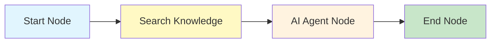
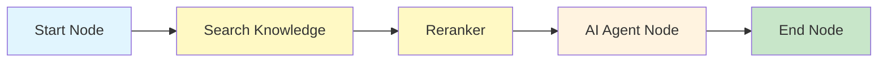

## Overview

The Nadoo AI Knowledge Base provides a complete **Retrieval-Augmented Generation (RAG)** pipeline that connects your documents to your AI agent workflows. Instead of relying solely on what a language model was trained on, you can ground its responses in your own data -- company documents, product manuals, research papers, or any text corpus.

The pipeline has four stages: **Document Processing**, **Vector Storage**, **Retrieval**, and **Integration**.

## RAG Pipeline

<Steps>
  <Step title="Document Processing">
    Upload files and convert them into searchable chunks.

    1. **Upload** -- Drag and drop files or provide URLs
    2. **Parse** -- Extract text from PDF, DOCX, TXT, Markdown, Excel, and web pages
    3. **Chunk** -- Split documents into overlapping segments (default: 1000 characters with 200-character overlap)
    4. **Extract metadata** -- Capture titles, headings, page numbers, and custom metadata for filtering
  </Step>
  <Step title="Vector Storage">
    Generate embeddings and store them for fast similarity search.

    1. **Generate embeddings** -- Convert each chunk into a vector using a configurable embedding model (OpenAI, HuggingFace, Azure, Bedrock, Google, vLLM, Ollama, Local)
    2. **Store in vector database** -- Persist vectors via pluggable VectorStore (pgvector default, Milvus/Qdrant planned). Distance metrics: cosine, euclidean, dot product
    3. **Index** -- Build HNSW or IVFFlat indexes for approximate nearest neighbor search at scale
  </Step>
  <Step title="Retrieval">
    Find the most relevant chunks for a given query.

    1. **Query embedding** -- Convert the user's question into a vector using the same embedding model
    2. **Similarity search** -- Find the closest vectors in the index
    3. **Rerank** -- Optionally re-score results with a cross-encoder reranker for higher precision
    4. **Context assembly** -- Combine the top chunks into a context window, respecting token limits
  </Step>
  <Step title="Integration">
    Inject retrieved context into your AI agent's prompt.

    1. **Prompt injection** -- Insert retrieved chunks into the system prompt or user message
    2. **Citation tracking** -- Record which documents contributed to the response for transparency
    3. **Feedback loop** -- Use user feedback to improve retrieval quality over time
  </Step>
</Steps>

## Supported Document Formats

| Format | Extensions | Notes |
|---|---|---|
| PDF | `.pdf` | OCR support for scanned documents |
| Microsoft Word | `.docx`, `.doc` | Preserves heading structure |
| Plain Text | `.txt` | Direct ingestion |
| Markdown | `.md`, `.mdx` | Preserves heading hierarchy |
| Excel | `.xlsx`, `.xls` | Each sheet processed separately |
| Web Pages | URL | Fetches and parses HTML content |

## Search Modes

The knowledge base supports three search modes that you can configure per query or per knowledge base.

<Tabs>
  <Tab title="Vector Search">
    **Semantic similarity** -- Finds documents whose meaning is closest to the query, even if the exact words differ.

    Uses cosine similarity on embedding vectors. Best for natural language questions where the user's phrasing may not match the document's exact wording.

    ```json
    {
      "search_mode": "vector",
      "top_k": 5,
      "score_threshold": 0.7
    }
    ```
  </Tab>
  <Tab title="BM25 (Keyword)">
    **Lexical matching** -- Finds documents containing the same terms as the query, weighted by term frequency and inverse document frequency.

    Best for precise keyword lookups, product codes, or technical terms that must match exactly.

    ```json
    {
      "search_mode": "bm25",
      "top_k": 5
    }
    ```
  </Tab>
  <Tab title="Hybrid">
    **Vector + BM25 combined** -- Runs both search methods in parallel, normalizes the scores, and merges the results using Reciprocal Rank Fusion (RRF).

    This is the **recommended default** for most use cases, as it combines the strengths of both approaches.

    ```json
    {
      "search_mode": "hybrid",
      "top_k": 5,
      "vector_weight": 0.7,
      "bm25_weight": 0.3,
      "score_threshold": 0.5
    }
    ```
  </Tab>
</Tabs>

## Configuration

### Embedding Model

Choose the embedding model used to generate vectors. The model must be consistent between indexing and querying.

```json
{
  "embedding": {
    "model": "text-embedding-3-small",
    "dimensions": 1536,
    "provider": "openai"
  }
}
```

<Info>
  Embedding providers include **OpenAI**, **HuggingFace**, **Local models**, **Azure OpenAI**, **AWS Bedrock**, **Google AI Studio**, **Google Vertex AI**, **vLLM**, and **Ollama**. The embedding model is set at the knowledge base level and applies to all documents within it.
</Info>

### Chunking

Control how documents are split into segments.

| Parameter | Default | Description |
|---|---|---|
| `chunk_size` | 1000 | Maximum number of characters per chunk |
| `chunk_overlap` | 200 | Number of overlapping characters between consecutive chunks |
| `separator` | `\n\n` | Primary split boundary (falls back to sentence/word boundaries) |

```json
{
  "chunking": {
    "chunk_size": 1000,
    "chunk_overlap": 200,
    "separator": "\n\n"
  }
}
```

### Retrieval Settings

Fine-tune how documents are fetched at query time.

| Parameter | Default | Description |
|---|---|---|
| `top_k` | 5 | Number of chunks to retrieve |
| `score_threshold` | 0.5 | Minimum similarity score (0.0 to 1.0) |
| `reranking` | false | Enable cross-encoder reranking for higher precision |
| `rerank_model` | -- | Model to use for reranking (e.g., `cohere-rerank-v3`) |
| `rerank_top_k` | 3 | Number of chunks to keep after reranking |

```json
{
  "retrieval": {
    "top_k": 10,
    "score_threshold": 0.5,
    "reranking": true,
    "rerank_model": "cohere-rerank-v3",
    "rerank_top_k": 3
  }
}
```

## Advanced Features

### Contextual Retrieval

Enhance each chunk with a brief AI-generated summary of its context within the full document. This improves retrieval accuracy by embedding each chunk with awareness of its surrounding content.

### Knowledge Graphs

Extract entities and relationships from documents to build a knowledge graph. This enables graph-based queries that traverse relationships rather than relying solely on text similarity.

### Multi-Hop Reasoning

For complex questions that require information from multiple documents, multi-hop reasoning chains together several retrieval steps:

1. Retrieve initial context for the question
2. Identify follow-up sub-questions based on the initial context
3. Retrieve additional context for each sub-question
4. Synthesize all retrieved information into a comprehensive answer

## Using Knowledge in Workflows

To use a knowledge base in your workflow, add a **Search Knowledge Node** before the **AI Agent Node**:



The Search Knowledge Node retrieves relevant chunks and passes them to the AI Agent Node as context. You can optionally add a **Reranker Node** between them for improved precision:



## Next Steps

<CardGroup cols={2}>
  <Card title="AI Agent Node" icon="robot" href="/workflow/nodes/ai-agent">
    Configure the LLM node that consumes retrieved context
  </Card>
  <Card title="Workflow Engine" icon="diagram-project" href="/workflow/overview">
    Learn about the overall workflow execution model
  </Card>
  <Card title="Visual Editor" icon="pen-ruler" href="/workflow/visual-editor">
    Build RAG workflows in the drag-and-drop editor
  </Card>
  <Card title="Messaging Channels" icon="comments" href="/channels/overview">
    Deploy your RAG agent to Slack, Discord, and more
  </Card>
</CardGroup>
