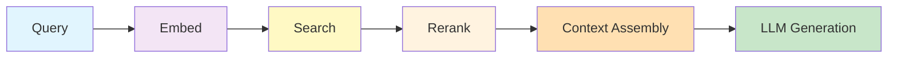
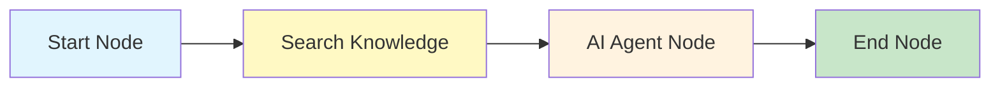
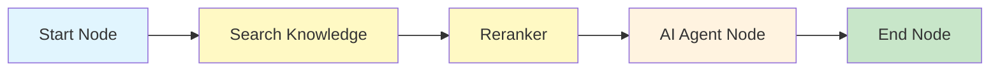
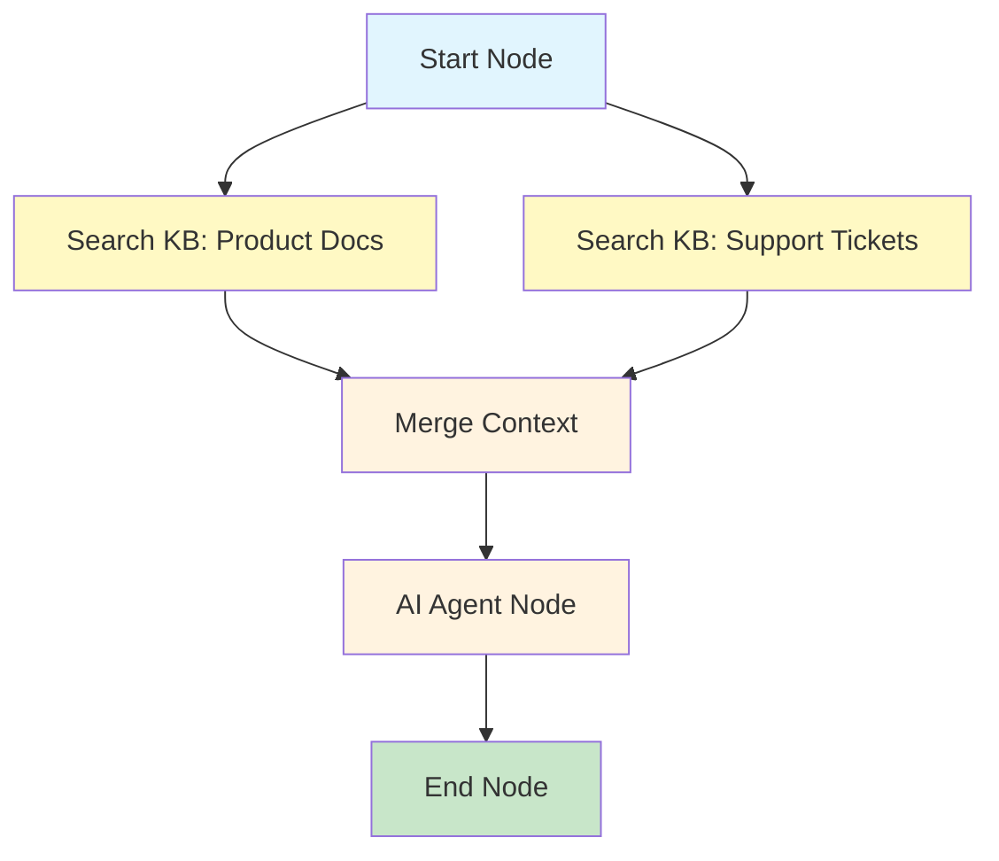

## Overview

Retrieval-Augmented Generation (RAG) is the pattern at the heart of the Nadoo AI Knowledge Base. Instead of relying solely on what an LLM was trained on, RAG retrieves relevant information from your documents and injects it into the prompt, grounding the response in your own data. This eliminates hallucination for questions that your documents can answer.

## End-to-End RAG Flow

The RAG pipeline consists of six stages, from the user's query to the final grounded response.



<Steps>
  <Step title="Query">
    The user sends a natural language question through the chat interface, API, or a messaging channel. The query enters the workflow at the Start Node and is routed to the Search Knowledge Node.
  </Step>
  <Step title="Embed">
    The query text is converted into a vector using the same embedding model configured for the knowledge base. This places the query in the same vector space as the indexed document chunks.
  </Step>
  <Step title="Search">
    The query vector (and optionally the raw query text for BM25) is used to retrieve the most relevant chunks from the knowledge base. The search mode -- vector, BM25, or hybrid -- determines how results are fetched and scored.

    [Learn about search modes](/knowledge/hybrid-search)
  </Step>
  <Step title="Rerank">
    Optionally, retrieved chunks are re-scored using a cross-encoder reranking model. The reranker evaluates each chunk in the context of the original query and produces a more accurate relevance score. This step is especially valuable when the initial retrieval returns a large candidate set.
  </Step>
  <Step title="Context Assembly">
    The top-ranked chunks are assembled into a context block that will be injected into the LLM prompt. The assembly process:

    - Orders chunks by relevance score (highest first)
    - Adds source metadata (document name, page number, heading) for citation
    - Truncates or selects chunks to fit within the LLM's context window
    - Deduplicates overlapping content from adjacent chunks
  </Step>
  <Step title="LLM Generation">
    The assembled context is injected into the system prompt or user message, and the LLM generates a response grounded in the retrieved information. The prompt instructs the model to answer based on the provided context and cite its sources.
  </Step>
</Steps>

## Integration with Workflows

In the Nadoo AI workflow engine, the RAG pipeline is implemented through a combination of nodes. The most common pattern connects a **Search Knowledge Node** to an **AI Agent Node**.

### Basic RAG Workflow



The Search Knowledge Node handles stages 2-4 (embed, search, rerank) and passes the assembled context to the AI Agent Node, which handles stage 6 (LLM generation).

### RAG Workflow with Reranking

For higher precision, add an explicit reranking step:



### Multi-Source RAG Workflow

Query multiple knowledge bases in parallel for comprehensive coverage:



## Context Injection Strategies

The way retrieved context is presented to the LLM affects response quality. Nadoo AI supports several injection strategies.

<Tabs>
  <Tab title="System Prompt Injection">
    Inject the retrieved context into the system prompt. This approach treats the context as authoritative background information.

    ```
    System: You are a helpful assistant. Answer the user's question based
    on the following context. If the context does not contain the answer,
    say so.

    Context:
    ---
    [Document: auth-architecture.md, Section: Token Lifecycle]
    The authentication system uses short-lived access tokens (15 minutes)
    paired with longer-lived refresh tokens (7 days)...
    ---
    [Document: auth-architecture.md, Section: Refresh Token Rotation]
    Refresh tokens are rotated on each use...
    ---

    User: How does token refresh work?
    ```

    **Best for:** Most use cases. Keeps context separate from the user's message.
  </Tab>
  <Tab title="User Message Injection">
    Append the context directly to the user's message. Some models respond better when context appears in the user turn.

    ```
    User: How does token refresh work?

    Here is relevant context from the knowledge base:
    ---
    [Document: auth-architecture.md, Section: Token Lifecycle]
    The authentication system uses short-lived access tokens...
    ---
    ```

    **Best for:** Models that are instruction-tuned to process user-provided context.
  </Tab>
  <Tab title="Structured Context">
    Present context as a structured list with explicit metadata labels.

    ```
    System: Answer based on the provided sources. Cite sources by number.

    Sources:
    [1] auth-architecture.md > Token Lifecycle (Page 3)
    The authentication system uses short-lived access tokens (15 minutes)...

    [2] auth-architecture.md > Refresh Token Rotation (Page 4)
    Refresh tokens are rotated on each use...

    User: How does token refresh work?
    ```

    **Best for:** When you need the LLM to produce numbered citations in its response.
  </Tab>
</Tabs>

## Citation Tracking

Nadoo AI tracks which documents and chunks contributed to each response. This provides transparency and allows users to verify the source of information.

### How Citations Work

1. Each chunk passed to the LLM carries metadata: document ID, filename, heading, and page number.
2. The prompt instructs the LLM to reference sources in its response.
3. The platform records the mapping between the response and the source chunks.
4. Citations are returned in the API response and displayed in the chat UI.

### Citation Response Format

```json
{
  "response": "Access tokens expire after 15 minutes. When expired, the client uses the refresh token to obtain a new access token [1]. Refresh tokens are rotated on each use for security [2].",
  "citations": [
    {
      "index": 1,
      "document_id": "doc_abc123",
      "filename": "auth-architecture.md",
      "heading": "Token Lifecycle",
      "page_number": 3,
      "chunk_id": "chk_001"
    },
    {
      "index": 2,
      "document_id": "doc_abc123",
      "filename": "auth-architecture.md",
      "heading": "Refresh Token Rotation",
      "page_number": 4,
      "chunk_id": "chk_002"
    }
  ]
}
```

## Best Practices

<AccordionGroup>
  <Accordion title="Chunk size and overlap" icon="scissors">
    - **Chunk size** controls the granularity of retrieval. Smaller chunks (300-500 chars) are better for precise fact retrieval. Larger chunks (1000-2000 chars) provide more context per result.
    - **Chunk overlap** (default: 200 chars) ensures that information near chunk boundaries is not lost. Higher overlap produces more chunks but improves boundary coverage.
    - Start with the defaults (1000/200) and adjust based on retrieval quality.
  </Accordion>
  <Accordion title="Embedding model selection" icon="microchip">
    - **General purpose:** `text-embedding-3-small` (OpenAI) is an excellent default.
    - **Higher quality:** `text-embedding-3-large` (OpenAI) for improved retrieval accuracy at higher cost.
    - **Domain-specific:** Fine-tuned HuggingFace models for specialized content (medical, legal, scientific).
    - **Multilingual:** `multilingual-e5-large` for knowledge bases with content in multiple languages.
    - **Self-hosted:** Ollama or local models when data cannot leave your infrastructure.
  </Accordion>
  <Accordion title="Search mode selection" icon="magnifying-glass">
    - Use **hybrid search** as the default. It handles the widest range of query types.
    - Switch to **vector-only** if all queries are natural language and your embedding model is domain-tuned.
    - Switch to **BM25-only** for keyword-heavy queries like error codes or product identifiers.
  </Accordion>
  <Accordion title="Reranking for precision" icon="ranking-star">
    - Enable reranking when retrieval quality matters more than latency.
    - Set a higher initial `top_k` (e.g., 20) and let the reranker narrow to `rerank_top_k` (e.g., 3-5).
    - Cross-encoder rerankers are slower but significantly more accurate than bi-encoder similarity.
  </Accordion>
  <Accordion title="Context window management" icon="window-maximize">
    - Be aware of the LLM's context window size. Injecting too many chunks wastes tokens on less relevant content.
    - Prioritize quality over quantity: 3-5 highly relevant chunks typically outperform 15-20 marginally relevant ones.
    - Use reranking to ensure only the best chunks make it into the context.
  </Accordion>
</AccordionGroup>

## Monitoring and Debugging

### Common Issues

| Symptom | Likely Cause | Fix |
|---|---|---|
| Responses ignore relevant documents | Chunks are not being retrieved -- check `score_threshold` | Lower `score_threshold` or increase `top_k` |
| Responses cite irrelevant content | `top_k` is too high or `score_threshold` is too low | Increase `score_threshold` or enable reranking |
| "I don't have information about that" | Document is not indexed (check status) or query is out of scope | Verify document status is `indexed`; expand knowledge base |
| Responses are generic despite context | Context injection may not be reaching the LLM | Check that the Search Knowledge Node output is connected to the AI Agent Node input |

## Next Steps

<CardGroup cols={2}>
  <Card title="Contextual Retrieval" icon="brain" href="/knowledge/contextual-retrieval">
    Advanced retrieval strategies including query classification and multi-hop reasoning
  </Card>
  <Card title="Vector Search" icon="magnifying-glass" href="/knowledge/vector-search">
    Deep dive into embedding-based similarity search
  </Card>
  <Card title="Hybrid Search" icon="code-merge" href="/knowledge/hybrid-search">
    How vector and keyword search are combined
  </Card>
  <Card title="Documents" icon="file-lines" href="/knowledge/documents">
    Upload and manage the documents that feed the RAG pipeline
  </Card>
</CardGroup>
