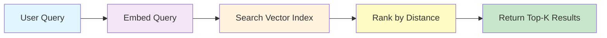

## Overview

Vector search is the core retrieval mechanism in the Nadoo AI Knowledge Base. It finds documents by **semantic similarity** -- matching the meaning of a query against the meaning of stored chunks, even when the exact words differ. This is what enables your AI agents to answer natural language questions using your own documents.

## How Vector Similarity Search Works

Vector search operates in three steps: embed the query, search the index, and rank results by distance.



<Steps>
  <Step title="Embed the query">
    The user's query is converted into a vector (a list of floating-point numbers) using the same embedding model that was used to index the documents. This ensures the query lives in the same vector space as the stored chunks.
  </Step>
  <Step title="Search the vector index">
    The query vector is compared against all indexed chunk vectors using an approximate nearest neighbor (ANN) algorithm. The vector store returns the closest matches based on the configured distance metric.
  </Step>
  <Step title="Rank and filter">
    Results are ranked by similarity score. Chunks below the `score_threshold` are discarded. The top `top_k` results are returned with their content, metadata, and scores.
  </Step>
</Steps>

## Embedding Providers

Nadoo AI supports multiple embedding providers through a pluggable architecture. The embedding model is configured at the knowledge base level and must remain consistent between indexing and querying.

| Provider | Example Models | Dimensions | Notes |
|---|---|---|---|
| **OpenAI** | `text-embedding-3-small`, `text-embedding-3-large` | 1536 / 3072 | Most widely used. Excellent general-purpose performance. |
| **HuggingFace** | `sentence-transformers/all-MiniLM-L6-v2` | 384 | Open-source models. Run locally or via HuggingFace Inference API. |
| **Local** | Custom ONNX or PyTorch models | Varies | Self-hosted models for air-gapped or privacy-sensitive deployments. |
| **Azure OpenAI** | `text-embedding-ada-002` (Azure deployment) | 1536 | Enterprise OpenAI through Azure with data residency controls. |
| **AWS Bedrock** | `amazon.titan-embed-text-v1` | 1536 | AWS-managed embeddings with Bedrock integration. |
| **Google** | `text-embedding-004` | 768 | Google AI Studio and Vertex AI embedding models. |
| **vLLM** | Any embedding model served by vLLM | Varies | High-throughput embedding via vLLM inference server. |
| **Ollama** | `nomic-embed-text`, `mxbai-embed-large` | 768 / 1024 | Local embedding models running through Ollama. |

### Configuration Example

```json
{
  "embedding": {
    "provider": "openai",
    "model": "text-embedding-3-small",
    "dimensions": 1536,
    "batch_size": 100
  }
}
```

<Warning>
  Changing the embedding model after documents have been indexed requires reprocessing all documents. Vectors from different models are not compatible -- they exist in different vector spaces.
</Warning>

## Vector Store

Nadoo AI uses a pluggable vector store architecture through the `VectorStoreFactory`. This abstraction allows you to swap the underlying storage engine without changing your application code.

### pgvector (Default)

The default vector store uses **pgvector**, a PostgreSQL extension for vector similarity search. It runs inside the same PostgreSQL instance used by the rest of the platform, simplifying deployment and operations.

**Advantages:**
- No additional infrastructure required
- Transactional consistency with other application data
- Supports metadata filtering alongside vector search
- Production-proven at moderate scale (millions of vectors)

### Planned Providers

| Provider | Status | Use Case |
|---|---|---|
| **Milvus** | Planned | High-scale deployments with billions of vectors |
| **Qdrant** | Planned | Specialized vector database with advanced filtering |

<Info>
  The `VectorStoreFactory` selects the vector store implementation based on your configuration. To use pgvector (the default), no additional setup is needed beyond the standard PostgreSQL deployment.
</Info>

## Distance Metrics

The distance metric determines how similarity between vectors is calculated. Different metrics are suited to different embedding models.

| Metric | Description | When to Use |
|---|---|---|
| **Cosine** | Measures the angle between two vectors, normalized for magnitude. Score range: 0 to 1 (higher is more similar). | **Default and recommended.** Works with most embedding models. Insensitive to vector length. |
| **Euclidean** | Measures the straight-line distance between two vectors. Lower values indicate higher similarity. | Use when vector magnitude carries meaningful information. |
| **Dot Product** | Computes the inner product of two vectors. Higher values indicate higher similarity. | Use with models that produce normalized vectors where dot product equals cosine similarity. |

### Configuration

```json
{
  "vector_store": {
    "provider": "pgvector",
    "distance_metric": "cosine"
  }
}
```

## Index Types

Vector indexes accelerate search by avoiding brute-force comparison against every stored vector. Nadoo AI supports two index types through pgvector.

### HNSW (Hierarchical Navigable Small World)

HNSW builds a multi-layer graph of vectors that allows fast approximate nearest neighbor search.

- **Build time:** Slower to build than IVFFlat
- **Query speed:** Faster queries, especially for high-dimensional vectors
- **Accuracy:** Higher recall at the same speed compared to IVFFlat
- **Memory:** Uses more memory than IVFFlat

**Best for:** Production workloads where query speed and accuracy are priorities.

```sql
-- Created automatically by Nadoo AI
CREATE INDEX ON chunks USING hnsw (embedding vector_cosine_ops)
  WITH (m = 16, ef_construction = 64);
```

### IVFFlat (Inverted File with Flat Compression)

IVFFlat partitions vectors into clusters and searches only the most relevant clusters at query time.

- **Build time:** Faster to build than HNSW
- **Query speed:** Good, but depends on the number of probes
- **Accuracy:** Depends on the `nprobe` setting -- more probes means higher accuracy but slower queries
- **Memory:** Uses less memory than HNSW

**Best for:** Large datasets where memory efficiency matters, or when you need fast index rebuilds.

```sql
-- Created automatically by Nadoo AI
CREATE INDEX ON chunks USING ivfflat (embedding vector_cosine_ops)
  WITH (lists = 100);
```

<Tip>
  For most deployments, **HNSW** is the recommended index type. It provides better query performance and higher recall without requiring parameter tuning.
</Tip>

## Search Configuration

Configure vector search behavior through these parameters.

| Parameter | Default | Description |
|---|---|---|
| `top_k` | 5 | Number of nearest chunks to return |
| `score_threshold` | 0.5 | Minimum similarity score (0.0 to 1.0). Chunks below this score are excluded. |
| `distance_metric` | `cosine` | Distance function: `cosine`, `euclidean`, or `dot_product` |

### Example Query

```json
{
  "query": "How does the authentication system handle token refresh?",
  "search_mode": "vector",
  "top_k": 5,
  "score_threshold": 0.7
}
```

### Response

```json
{
  "results": [
    {
      "chunk_id": "chk_001",
      "content": "The authentication system uses short-lived access tokens (15 minutes) paired with longer-lived refresh tokens (7 days). When an access token expires...",
      "score": 0.92,
      "metadata": {
        "document_id": "doc_abc123",
        "filename": "auth-architecture.md",
        "heading": "Token Lifecycle",
        "page_number": null
      }
    },
    {
      "chunk_id": "chk_002",
      "content": "Refresh tokens are rotated on each use. The server issues a new refresh token and invalidates the previous one...",
      "score": 0.87,
      "metadata": {
        "document_id": "doc_abc123",
        "filename": "auth-architecture.md",
        "heading": "Refresh Token Rotation",
        "page_number": null
      }
    }
  ],
  "total": 2,
  "search_mode": "vector"
}
```

## Performance Tuning

<AccordionGroup>
  <Accordion title="Choosing the right embedding model" icon="microchip">
    - **General purpose:** `text-embedding-3-small` (OpenAI) offers a strong balance of quality and cost.
    - **Higher accuracy:** `text-embedding-3-large` (OpenAI) or fine-tuned HuggingFace models for domain-specific content.
    - **Cost-sensitive / air-gapped:** Local models via Ollama or ONNX reduce dependency on external APIs.
    - **Multilingual:** Models like `multilingual-e5-large` perform well across languages.
  </Accordion>
  <Accordion title="Tuning top_k and score_threshold" icon="sliders">
    - Start with `top_k: 5` and `score_threshold: 0.5` as a baseline.
    - If responses include irrelevant content, raise `score_threshold` to 0.7 or higher.
    - If responses miss relevant content, lower `score_threshold` or increase `top_k`.
    - For reranking pipelines, set a higher `top_k` (e.g., 20) for the initial retrieval and let the reranker narrow it down.
  </Accordion>
  <Accordion title="Index selection" icon="database">
    - Use **HNSW** for most workloads -- it provides the best query performance.
    - Use **IVFFlat** if you have memory constraints or need frequent index rebuilds (e.g., during rapid document ingestion).
    - For datasets under 100,000 vectors, index type has minimal impact on query speed.
  </Accordion>
</AccordionGroup>

## Next Steps

<CardGroup cols={2}>
  <Card title="Hybrid Search" icon="code-merge" href="/knowledge/hybrid-search">
    Combine vector and keyword search for improved retrieval
  </Card>
  <Card title="RAG Pipeline" icon="arrows-turn-to-dots" href="/knowledge/rag-pipeline">
    See how vector search fits into the full RAG flow
  </Card>
  <Card title="Contextual Retrieval" icon="brain" href="/knowledge/contextual-retrieval">
    Advanced retrieval strategies beyond basic similarity search
  </Card>
  <Card title="Documents" icon="file-lines" href="/knowledge/documents">
    Upload and manage documents in your knowledge base
  </Card>
</CardGroup>
