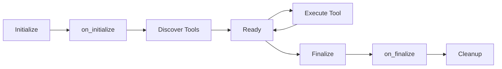

## What is Nadoo Plugin SDK?

Nadoo Plugin SDK is the official Python SDK for developing custom plugins for Nadoo AI Platform. It enables you to extend Nadoo's capabilities by creating reusable tools that can be invoked within AI workflows.

## Key Features

<CardGroup cols={2}>
  <Card title="Simple API" icon="code">
    Decorator-based API for defining tools with minimal boilerplate
  </Card>
  <Card title="Built-in LLM Access" icon="brain">
    Invoke AI models configured in your workspace
  </Card>
  <Card title="Knowledge Integration" icon="database">
    Search and retrieve from knowledge bases
  </Card>
  <Card title="Powerful Debugging" icon="bug">
    Comprehensive logging, tracing, and variable watching
  </Card>
</CardGroup>

## Core Concepts

### Plugin Class

Every plugin inherits from `NadooPlugin` and defines tools as decorated methods:

```python
from nadoo_plugin import NadooPlugin, tool, parameter

class MyPlugin(NadooPlugin):
    @tool(name="my_tool", description="Does something useful")
    @parameter("input", type="string", required=True)
    def my_tool(self, input: str) -> dict:
        return {"result": input.upper()}
```

### Decorators

Decorators define tool metadata, parameters, validators, and permissions:

- `@tool` - Mark method as a tool
- `@parameter` - Define tool parameters
- `@validator` - Validate parameter values
- `@permission_required` - Require permissions
- `@retry` - Automatic retry on failure

### Plugin Context

Every plugin has access to a rich execution context:

```python
def my_tool(self, input: str) -> dict:
    # Logging
    self.context.info("Processing input...")

    # Tracing
    self.context.trace("data_loaded", {"rows": 100})

    # Variable watching
    self.context.watch_variable("result", result)

    return result
```

### Internal APIs

Plugins can invoke internal Nadoo APIs:

```python
# Invoke LLM
response = self.api.llm.invoke(
    messages=[{"role": "user", "content": "Hello"}]
)

# Search knowledge base
results = self.api.knowledge.search(query="AI")

# Invoke another tool
result = self.api.tools.invoke(tool_id="tool-123", params={})

# Store/retrieve data
self.api.storage.set("key", "value")
```

## Plugin Lifecycle



1. **Initialize**: Plugin is instantiated and context is injected
2. **on_initialize**: User initialization hook (load config, setup connections)
3. **Tool Discovery**: Framework discovers @tool decorated methods
4. **Execution**: Tools are invoked as needed
5. **Finalize**: on_finalize hook for cleanup
6. **Cleanup**: API connections are closed

## Development Workflow

### 1. Create Plugin

```bash
nadoo-plugin create my-plugin
cd my-plugin
```

### 2. Implement Tools

```python
# main.py
from nadoo_plugin import NadooPlugin, tool, parameter

class MyPlugin(NadooPlugin):
    def on_initialize(self):
        self.api_key = self.require_env("API_KEY")

    @tool(name="process", description="Process data")
    @parameter("data", type="string", required=True)
    def process(self, data: str) -> dict:
        self.context.info(f"Processing: {data}")
        result = self._do_processing(data)
        return {"success": True, "result": result}
```

### 3. Test Locally

```bash
nadoo-plugin test
```

### 4. Build & Install

```bash
nadoo-plugin build
nadoo-plugin install
```

## Use Cases

<AccordionGroup>
  <Accordion title="External API Integration">
    Connect to third-party APIs (Weather, Stocks, News, etc.)
  </Accordion>

  <Accordion title="Data Processing">
    Transform, analyze, or validate data within workflows
  </Accordion>

  <Accordion title="Custom AI Operations">
    Combine LLM calls with custom logic
  </Accordion>

  <Accordion title="Knowledge Augmentation">
    Enrich AI responses with external knowledge sources
  </Accordion>

  <Accordion title="Multi-Step Workflows">
    Orchestrate complex operations across multiple tools
  </Accordion>
</AccordionGroup>

## Architecture

```mermaid
graph TB
    subgraph "Your Plugin"
        A[Plugin Class]
        B[@tool methods]
        C[on_initialize]
    end

    subgraph "SDK"
        D[Plugin Context]
        E[Internal API Client]
        F[Decorators]
    end

    subgraph "Nadoo Platform"
        G[LLM API]
        H[Knowledge API]
        I[Tools API]
        J[Storage API]
    end

    A --> D
    A --> E
    B --> F
    C --> D
    E --> G
    E --> H
    E --> I
    E --> J
```

## SDK Components

| Component | Purpose | Documentation |
|-----------|---------|---------------|
| `NadooPlugin` | Base class for all plugins | [Plugin Class](/plugin-sdk/core/plugin-class) |
| Decorators | Define tools and parameters | [Decorators](/plugin-sdk/core/decorators) |
| `PluginContext` | Execution context | [Context](/plugin-sdk/core/context) |
| `LLMClient` | Invoke AI models | [LLM API](/plugin-sdk/api/llm) |
| `ToolsClient` | Call other tools | [Tools API](/plugin-sdk/api/tools) |
| `KnowledgeClient` | Search knowledge bases | [Knowledge API](/plugin-sdk/api/knowledge) |
| `StorageClient` | Persistent storage | [Storage API](/plugin-sdk/api/storage) |
| Testing Utilities | Test your plugins | [Testing](/plugin-sdk/core/testing) |

## Next Steps

<CardGroup cols={2}>
  <Card title="Installation" icon="download" href="/plugin-sdk/installation">
    Install the SDK and set up your environment
  </Card>
  <Card title="Quick Start" icon="rocket" href="/plugin-sdk/quickstart">
    Build your first plugin in 5 minutes
  </Card>
  <Card title="Plugin Class" icon="code" href="/plugin-sdk/core/plugin-class">
    Learn about the NadooPlugin base class
  </Card>
  <Card title="Examples" icon="lightbulb" href="/plugin-sdk/examples">
    Explore example plugins
  </Card>
</CardGroup>
