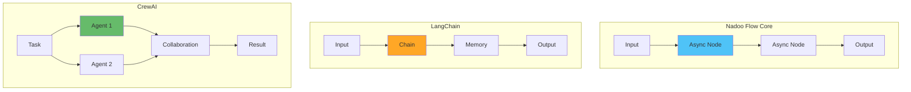

## Overview

This guide provides an objective comparison of Nadoo AI with other AI workflow frameworks. We focus on factual differences in design philosophy, architecture, and use cases to help you make an informed decision.

## What Makes Nadoo Different

<CardGroup cols={2}>
  <Card title="Nadoo Flow Core" icon="bolt">
    **Design Philosophy**: Minimalist, async-first Python framework

    **Focus**: Production-ready workflows with minimal overhead
  </Card>
  <Card title="Nadoo Builder" icon="pen-ruler">
    **Status**: Enterprise preview for secure, on-premise deployments

    **Focus**: Air-gapped environments and data sovereignty
  </Card>
</CardGroup>

## Feature Comparison Matrix

| Feature | Nadoo Flow Core | LangChain | CrewAI | AutoGen |
|---------|----------------|-----------|---------|---------|
| **Language** | Python 3.11+ | Python 3.8+ | Python 3.10+ | Python 3.8+ |
| **Core Focus** | Async workflows | LLM chains | Role-based agents | Conversational agents |
| **Async Support** | Native throughout | Added via AsyncChain | Limited | Native |
| **Streaming** | Built-in | Supported | Limited | Supported |
| **Dependencies** | ~10 core packages | 100+ packages | ~30 packages | ~40 packages |
| **Maturity** | Early (v0.1.0 beta) | Mature | Growing | Mature |
| **License** | MIT | MIT | MIT | Apache 2.0 |
| **Primary Use** | Production APIs | Prototyping/Research | Multi-agent systems | Agent communication |

## Detailed Comparisons

### vs LangChain

<Tabs>
  <Tab title="Nadoo Flow Core">
    **Philosophy**: Minimal, composable, async-first

    ```python
    from nadoo_flow import LLMNode, FunctionNode

    workflow = (
        FunctionNode(lambda x: {"text": x["input"]})
        | LLMNode(model="gpt-4")
        | FunctionNode(lambda x: {"result": x["content"]})
    )

    result = await workflow.execute({"input": "Hello"})
    ```

    **When to Choose**:
    - Building production APIs with strict performance requirements
    - Need full control over execution flow
    - Prefer minimal dependencies for security/compliance
    - Want async-native architecture

    **Trade-offs**:
    - Early stage project (v0.1.0 beta)
    - Smaller ecosystem than mature frameworks
    - Fewer pre-built integrations
    - Community still growing
  </Tab>
  <Tab title="LangChain">
    **Philosophy**: Comprehensive, batteries-included

    ```python
    from langchain.chains import LLMChain
    from langchain.llms import OpenAI
    from langchain.prompts import PromptTemplate

    prompt = PromptTemplate(
        template="Process: {input}",
        input_variables=["input"]
    )
    chain = LLMChain(llm=OpenAI(), prompt=prompt)
    result = chain.run(input="Hello")
    ```

    **When to Choose**:
    - Rapid prototyping and experimentation
    - Need extensive pre-built components
    - Want mature, battle-tested framework
    - Large community and resources important

    **Trade-offs**:
    - Many dependencies can complicate deployment
    - Async support added later, not core design
    - Abstraction layers can make debugging harder
    - May have more overhead than needed for simple cases
  </Tab>
</Tabs>

### vs CrewAI

<Tabs>
  <Tab title="Nadoo Flow Core">
    **Focus**: General-purpose workflow orchestration

    ```python
    from nadoo_flow import ParallelNode, LLMNode

    # Parallel task execution
    workflow = ParallelNode([
        LLMNode(model="gpt-4", name="analyzer"),
        LLMNode(model="gpt-4", name="summarizer"),
        LLMNode(model="gpt-4", name="translator")
    ])

    results = await workflow.execute({"text": data})
    ```

    **Best For**:
    - Custom workflows
    - Performance-critical apps
    - Flexible architectures
    - Integration projects
  </Tab>
  <Tab title="CrewAI">
    **Focus**: Role-based multi-agent collaboration

    ```python
    from crewai import Agent, Task, Crew

    researcher = Agent(
        role="Researcher",
        goal="Research topics",
        backstory="Expert researcher"
    )

    crew = Crew(agents=[researcher], tasks=[task])
    result = crew.kickoff()
    ```

    **Best For**:
    - Multi-agent scenarios
    - Role-based delegation
    - Simulated team workflows
    - Research projects
  </Tab>
</Tabs>

### vs AutoGen

<Tabs>
  <Tab title="Nadoo Flow Core">
    **Approach**: Explicit workflow definition

    ```python
    from nadoo_flow import ChainableNode

    class CustomAgent(ChainableNode):
        async def execute(self, data):
            # Custom logic
            return {"result": "processed"}

    workflow = CustomAgent() | LLMNode()
    result = await workflow.execute(input_data)
    ```

    **Characteristics**:
    - Predictable execution
    - Clear data flow
    - Easy debugging
    - Full control
  </Tab>
  <Tab title="AutoGen">
    **Approach**: Conversational agent framework

    ```python
    from autogen import AssistantAgent, UserProxyAgent

    assistant = AssistantAgent("assistant")
    user_proxy = UserProxyAgent("user")

    user_proxy.initiate_chat(
        assistant,
        message="Solve this task"
    )
    ```

    **Characteristics**:
    - Autonomous agents
    - Conversational interactions
    - Emergent behavior
    - Less predictable
  </Tab>
</Tabs>

### vs n8n

<Tabs>
  <Tab title="Nadoo Builder">
    **Positioning**: AI-first workflow platform

    **Visual Editor**:
    - Node-based design
    - LLM-native components
    - AI workflow templates
    - Code export to Flow Core

    **Target Users**:
    - AI/ML developers
    - Data scientists
    - Technical teams
    - Enterprises
  </Tab>
  <Tab title="n8n">
    **Positioning**: General automation platform

    **Visual Editor**:
    - Node-based automation
    - 300+ integrations
    - Business process focus
    - No native code export

    **Target Users**:
    - Business users
    - IT teams
    - Marketers
    - Operations teams
  </Tab>
</Tabs>

## Architecture Comparison

### Execution Models



## Design Philosophy Differences

<Note>
  Each framework was built with different priorities. Understanding these helps choose the right tool.
</Note>

### Dependency Footprint

**Nadoo Flow Core**:
- ~10 core dependencies (Pydantic, httpx, etc.)
- Philosophy: Include only what's necessary
- Trade-off: Fewer built-in integrations

**LangChain**:
- 100+ dependencies with full installation
- Philosophy: Batteries-included approach
- Trade-off: Larger installation, more complexity

**CrewAI/AutoGen**:
- 30-40 dependencies
- Philosophy: Focused on specific use cases
- Trade-off: Middle ground approach

### Async Architecture

**Native Async (Nadoo, AutoGen)**:
- Built with `async/await` from the ground up
- Efficient for I/O-bound operations (API calls, DB queries)
- Better resource utilization in production

**Added Async (LangChain)**:
- Started synchronous, added async later
- Both sync and async APIs available
- More flexible but potentially inconsistent patterns

### Real-World Considerations

Performance depends heavily on:
- Network latency to LLM providers
- Complexity of your workflows
- Server infrastructure
- Caching strategies

The framework overhead is typically negligible compared to LLM API call latency (100-1000ms+).

## When to Choose Each Framework

### Choose Nadoo Flow Core if you:
- Need minimal dependencies for security/compliance reasons
- Are building production APIs with performance requirements
- Want full async support from the ground up
- Prefer simplicity and predictability over extensive features
- Are comfortable building custom integrations

**Not ideal if**:
- You need extensive pre-built integrations immediately
- You're just prototyping and want rapid experimentation
- You require mature multi-agent frameworks today

### Choose LangChain if you:
- Need quick prototyping with many pre-built components
- Want a mature, battle-tested framework
- Require extensive integrations (vector DBs, document loaders, etc.)
- Prefer a large community and abundant tutorials
- Don't mind additional dependencies

**Not ideal if**:
- You need minimal dependencies
- You require native async throughout
- You want simple, predictable APIs

### Choose CrewAI if you:
- Specifically need role-based multi-agent systems
- Want agent collaboration patterns out of the box
- Are building team-based agent scenarios

**Not ideal if**:
- You need general-purpose workflows
- You require extensive async support

### Choose AutoGen if you:
- Need conversational agent frameworks
- Want autonomous agent communication
- Are building research-oriented agent systems

**Not ideal if**:
- You need simple, predictable workflows
- You want minimal abstractions

## Honest Assessment

### Nadoo's Current State (2025 Q4)

**Strengths**:
- Clean, minimal design
- Async-first architecture
- Low dependency count
- Easy to understand and debug

**Limitations**:
- Early stage (v0.1.0 beta)
- Small community compared to LangChain
- Fewer pre-built integrations
- Less third-party content (tutorials, examples)
- Still proving itself in production

**Our Commitment**:
- We're not trying to replace LangChain for everything
- We focus on production APIs and secure deployments
- We prioritize stability over rapid feature addition
- We value honest comparisons over marketing claims

## Migration Paths

### From LangChain

```python
# LangChain
from langchain.chains import LLMChain
chain = LLMChain(llm=llm, prompt=prompt)
result = chain.run(input="test")

# Nadoo Flow Core
from nadoo_flow import LLMNode
node = LLMNode(model="gpt-4")
result = await node.execute({"prompt": "test"})
```

### From CrewAI

```python
# CrewAI
agent = Agent(role="Researcher", goal="Research")
task = Task(description="Research X")
crew = Crew(agents=[agent], tasks=[task])

# Nadoo Flow Core
class ResearchAgent(ChainableNode):
    async def execute(self, data):
        # Research logic
        return {"research": results}

workflow = ResearchAgent() | LLMNode()
```

## Ecosystem and Community

### Maturity Levels (as of 2025 Q4)

**LangChain**:
- Most mature and widely adopted
- 80k+ GitHub stars
- Extensive tutorials and third-party content
- Multiple books and courses available
- Large Discord community

**AutoGen / CrewAI**:
- Established frameworks with growing communities
- 15k-25k GitHub stars
- Active development
- Good documentation
- Focused use cases

**Nadoo Flow Core**:
- Early stage (v0.1.0 beta)
- Small but growing community
- Active development
- Documentation in progress
- Focus on quality over quantity

### Integration Ecosystem

The size of the integration ecosystem often matters more than we'd like to admit:

**If you need**:
- Immediate access to 50+ vector databases → LangChain
- Extensive document loaders → LangChain
- Pre-built agent templates → CrewAI / AutoGen
- Custom integrations with full control → Nadoo Flow Core

**Our approach**:
- We provide clean APIs for building custom integrations
- We'll add common integrations based on user demand
- We prefer quality integrations over quantity
- Community contributions welcome

## Cost Considerations

### Open Source Costs

All frameworks are free to use, but consider:

**Development Time**:
- Nadoo: Lower learning curve
- LangChain: Steeper learning curve
- CrewAI: Medium complexity
- AutoGen: Higher complexity

**Infrastructure**:
- Nadoo: Lightweight, lower hosting costs
- Others: Higher memory/CPU requirements

**Maintenance**:
- Nadoo: Fewer dependencies, easier updates
- Others: More dependencies to manage

## Making the Right Choice

### Start with Your Constraints

**If you have**:
- **Tight security requirements** → Nadoo (minimal deps) or self-hosted options
- **Need to move fast** → LangChain (most pre-built components)
- **Multi-agent focus** → CrewAI or AutoGen
- **Production API constraints** → Nadoo or AutoGen (native async)

### Consider Your Team

**Your team is**:
- Experienced Python developers → Any framework works
- New to AI development → LangChain (more tutorials)
- Security-focused → Nadoo (fewer dependencies to audit)
- Research-oriented → LangChain or AutoGen

### Be Honest About Timeline

**You need**:
- Production system in 2 weeks → Use mature framework (LangChain)
- Prototype in 1 day → LangChain
- Long-term maintainable system → Consider Nadoo or build custom
- Multi-agent research → CrewAI or AutoGen

### The Real Question

**Don't ask**: "Which framework is best?"

**Ask instead**:
- What are my actual constraints?
- What's my timeline?
- What's my team's expertise?
- What's the long-term maintenance plan?

### Our Honest Recommendation

**For most people starting today**: Use LangChain. It has the most resources, tutorials, and community support.

**Consider Nadoo if**:
- You need minimal dependencies (security/compliance)
- You're building production APIs (async-native helps)
- You want to grow with a newer framework
- You value simplicity over extensive features

**We're not for everyone**, and that's okay. We'd rather you succeed with the right tool than use ours for the wrong reasons.

## Next Steps

<CardGroup cols={2}>
  <Card title="Get Started" icon="rocket" href="/getting-started">
    Start building with Nadoo
  </Card>
  <Card title="Migration Guide" icon="arrow-right-arrow-left" href="/resources/migration">
    Migrate from other frameworks
  </Card>
</CardGroup>
