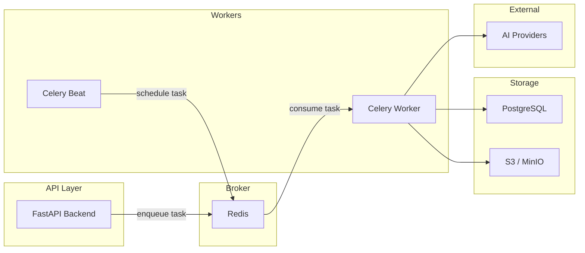

## Overview

Nadoo AI uses **Celery** for asynchronous background task processing. Document ingestion, embedding generation, graph extraction, and scheduled maintenance all run in Celery workers, keeping the API server responsive.

The production deployment runs three Celery-related containers:

| Container | Role |
|-----------|------|
| `nadoo-celery-prod` | Worker that processes tasks from all queues |
| `nadoo-celery-beat-prod` | Scheduler that dispatches periodic tasks |
| `nadoo-backend-prod` | API server that enqueues tasks |

## Architecture



## Task Queues

Celery is configured with seven queues to prioritize different workloads:

| Queue | Routing Key | Tasks |
|-------|------------|-------|
| `default` | `task.#` | General tasks, channel gateway delivery, scheduler jobs |
| `high_priority` | `high.#` | Web search (CRAG fallback) and time-sensitive operations |
| `low_priority` | `low.#` | Cleanup, audit log statistics |
| `documents` | `document.#` | Document processing, paragraph chunking, GraphRAG extraction |
| `exports` | `export.#` | Data exports |
| `emails` | `email.#` | Email delivery |
| `embeddings` | `embeddings` | Vector embedding generation |

### Task Routing

Tasks are routed to queues automatically by module path or custom task name:

```python
task_routes = {
    "src.tasks.document_tasks.*": {"queue": "documents"},
    "src.tasks.cleanup_tasks.*":  {"queue": "low_priority"},
    "graphrag.*":                 {"queue": "documents"},
    "audit.*":                    {"queue": "low_priority"},
    "web_search.*":               {"queue": "high_priority"},
    "channels.*":                 {"queue": "default"},
    "scheduler.*":                {"queue": "default"},
}
```

## Docker Configuration

### Worker

```yaml
celery:
  image: nadoo-backend:latest
  container_name: nadoo-celery-prod
  env_file:
    - ../packages/backend/.env
  environment:
    NADOO_DB_HOST: postgres
    NADOO_DB_PORT: 5432
    NADOO_REDIS_HOST: redis
    NADOO_REDIS_PORT: 6379
    NADOO_DEBUG: "false"
    ENVIRONMENT: production
  volumes:
    - backend_uploads:/app/uploads
    - backend_logs:/app/logs
  depends_on:
    postgres:
      condition: service_healthy
    redis:
      condition: service_healthy
  restart: on-failure:5
  command: >
    celery -A src.core.celery_app worker
    --loglevel=info
    --pool=threads
    -c 4
    -Q documents,default,embeddings,high_priority,low_priority
```

### Beat Scheduler

```yaml
celery-beat:
  image: nadoo-backend:latest
  container_name: nadoo-celery-beat-prod
  env_file:
    - ../packages/backend/.env
  environment:
    NADOO_DB_HOST: postgres
    NADOO_DB_PORT: 5432
    NADOO_REDIS_HOST: redis
    NADOO_REDIS_PORT: 6379
    NADOO_DEBUG: "false"
    ENVIRONMENT: production
  volumes:
    - backend_logs:/app/logs
  depends_on:
    postgres:
      condition: service_healthy
    redis:
      condition: service_healthy
  restart: on-failure:5
  command: celery -A src.core.celery_app beat --loglevel=info
```

<Warning>
  Always run exactly **one** Celery Beat instance. Running multiple Beat containers will cause duplicate periodic tasks. The RedBeat distributed lock (`nadoo:redbeat:lock`) helps prevent this but a single instance is the safest configuration.
</Warning>

## Worker Configuration

### Pool Type

The production configuration uses `--pool=threads` instead of the default prefork pool:

```bash
celery -A src.core.celery_app worker --pool=threads -c 4
```

This avoids fork-related crashes with PyTorch and sentence-transformers (SIGSEGV issues) and works well for I/O-bound tasks like API calls to AI providers, document uploads, and embedding requests.

### Key Settings

| Setting | Value | Purpose |
|---------|-------|---------|
| `task_time_limit` | `1800` (30 min) | Hard kill for stuck tasks |
| `task_soft_time_limit` | `1500` (25 min) | Raises `SoftTimeLimitExceeded` for graceful cleanup |
| `worker_prefetch_multiplier` | `4` | Number of tasks prefetched per worker thread |
| `worker_max_tasks_per_child` | `1000` | Recycle worker threads after 1000 tasks to prevent memory leaks |
| `task_acks_late` | `true` | Acknowledge tasks only after completion (prevents loss on crash) |
| `task_reject_on_worker_lost` | `true` | Requeue tasks if the worker process is killed |
| `task_default_retry_delay` | `60` | Wait 60 seconds before retrying a failed task |
| `task_max_retries` | `3` | Maximum retry attempts per task |

### Broker Reliability

```python
broker_connection_retry_on_startup = True
broker_connection_retry = True
broker_connection_max_retries = 10
broker_transport_options = {
    "visibility_timeout": 3600,
    "socket_keepalive": True,
    "retry_on_timeout": True,
}
```

The `visibility_timeout` of 3600 seconds (1 hour) must exceed `task_time_limit` (1800 seconds). If a task is not acknowledged within this window, Redis makes it visible to other workers.

## Periodic Tasks (Beat Schedule)

Celery Beat dispatches these tasks on a cron schedule:

| Task | Schedule | Queue | Purpose |
|------|----------|-------|---------|
| `audit.cleanup_expired_logs` | Daily at 02:00 UTC | `low_priority` | Remove expired audit log entries |
| `audit.get_statistics` | Hourly | `low_priority` | Compute audit log statistics |
| `cleanup.recover_orphaned_documents` | Every 10 minutes | `low_priority` | Re-process documents stuck > 30 min |
| `cleanup.cleanup_vlm_temp_files` | Daily at 03:00 UTC | `low_priority` | Delete VLM temp files older than 24 hours |
| `channels.process_delivery_retries` | Every 30 seconds | `default` | Retry failed channel message deliveries |
| `channels.health_check` | Every 5 minutes | `default` | Check channel connector health |
| `channels.sync_webhooks` | Every 6 hours | `default` | Re-register channel webhooks |

## Scaling Workers

### Horizontal Scaling

Run multiple worker containers for higher throughput. Assign each worker to specific queues to isolate workloads:

```bash
# Worker 1: Document-heavy tasks
celery -A src.core.celery_app worker --pool=threads -c 4 -Q documents,embeddings -n worker-docs@%h

# Worker 2: High-priority and general tasks
celery -A src.core.celery_app worker --pool=threads -c 4 -Q high_priority,default -n worker-general@%h

# Worker 3: Low-priority maintenance
celery -A src.core.celery_app worker --pool=threads -c 2 -Q low_priority -n worker-maint@%h
```

<Tip>
  Use the `-n` flag to give each worker a unique name. This is required when running multiple workers on the same host to avoid name collisions.
</Tip>

### Adjusting Concurrency

Increase `-c` (concurrency) based on available CPU and memory:

```bash
# High-throughput server (8+ cores, 32 GB RAM)
celery -A src.core.celery_app worker --pool=threads -c 16 -Q documents,default,embeddings,high_priority,low_priority
```

## Monitoring with Flower

[Flower](https://flower.readthedocs.io/) provides a real-time web dashboard for Celery workers.

```bash
# Install Flower
pip install flower

# Start the dashboard
celery -A src.core.celery_app flower --port=5555

# Or run as a Docker container
docker run -d --name flower \
  --network nadoo-prod-network \
  -p 5555:5555 \
  mher/flower:latest \
  celery flower --broker=redis://redis:6379/0 --port=5555
```

Access the Flower UI at `http://localhost:5555`. It displays:

- Active, processed, and failed task counts
- Worker status and resource usage
- Task execution time distributions
- Queue lengths and throughput

<Warning>
  Flower exposes detailed internal state. In production, protect it with authentication or restrict access to internal networks only.
</Warning>

## Troubleshooting

<AccordionGroup>
  <Accordion title="Worker crashes with SIGSEGV" icon="skull">
    This is typically caused by forking with PyTorch or sentence-transformers loaded. Ensure you are using `--pool=threads` instead of the default `--pool=prefork`:

    ```bash
    celery -A src.core.celery_app worker --pool=threads -c 4
    ```
  </Accordion>
  <Accordion title="Tasks stuck in PENDING state" icon="hourglass">
    Check that the worker is consuming from the correct queue:

    ```bash
    # List active queues on the worker
    celery -A src.core.celery_app inspect active_queues

    # Verify task routing
    celery -A src.core.celery_app inspect registered
    ```

    If the task queue is not listed, restart the worker with the `-Q` flag including the missing queue name.
  </Accordion>
  <Accordion title="Duplicate periodic tasks" icon="clone">
    Running more than one Celery Beat instance causes duplicate task dispatching. Verify only one Beat container is active:

    ```bash
    docker ps | grep celery-beat
    ```

    RedBeat uses a distributed lock in Redis at `nadoo:redbeat:lock`. If a stale lock exists after an unclean shutdown, clear it:

    ```bash
    docker exec nadoo-redis redis-cli DEL nadoo:redbeat:lock
    ```
  </Accordion>
  <Accordion title="Tasks lost after Redis restart" icon="database">
    Enable AOF persistence on Redis (already configured in production Docker Compose):

    ```
    redis-server --appendonly yes --appendfsync everysec
    ```

    Combined with `task_acks_late=True`, unfinished tasks are requeued automatically when Redis recovers.
  </Accordion>
</AccordionGroup>
