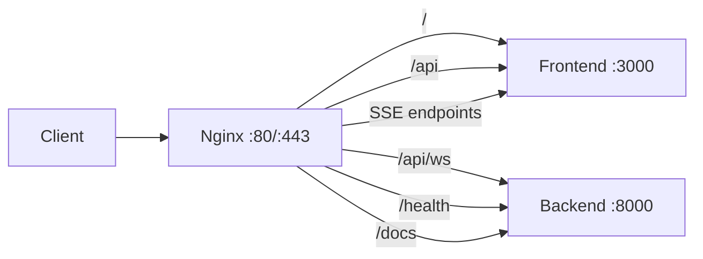

## Overview

In production, **Nginx** sits in front of all Nadoo AI services as a reverse proxy. It handles TLS termination, WebSocket upgrades, SSE streaming, rate limiting, and routes traffic to the correct backend or frontend service.



## Docker Configuration

The production Docker Compose runs Nginx with Let's Encrypt certificates:

```yaml
nginx:
  image: nginx:alpine
  container_name: nadoo-nginx-prod
  ports:
    - "80:80"
    - "443:443"
  volumes:
    - ./docker/nginx/nginx.conf:/etc/nginx/nginx.conf:ro
    - ./docker/nginx/conf.d:/etc/nginx/conf.d:ro
    - certbot_certs:/etc/letsencrypt:ro
    - certbot_webroot:/var/www/certbot
    - nginx_logs:/var/log/nginx
  depends_on:
    backend:
      condition: service_healthy
    frontend:
      condition: service_healthy
  restart: on-failure:5
  healthcheck:
    test: ["CMD", "wget", "--quiet", "--tries=1", "--spider", "http://127.0.0.1/health"]
    interval: 30s
    timeout: 10s
    retries: 3
```

## Full Nginx Configuration

Below is the production `nginx.conf` used by Nadoo AI. It handles HTTP-to-HTTPS redirect, WebSocket proxy, SSE streaming, rate limiting, and security headers.

<Steps>
  <Step title="HTTP Server (Port 80)">
    The HTTP server handles Let's Encrypt ACME challenges and redirects all other traffic to HTTPS:

    ```nginx
    server {
        listen 80;
        server_name _;

        # Let's Encrypt ACME challenge
        location /.well-known/acme-challenge/ {
            root /var/www/certbot;
            try_files $uri =404;
        }

        # Health check (no redirect for internal monitoring)
        location /health {
            proxy_pass http://backend/health;
            proxy_set_header Host $host;
            proxy_set_header X-Real-IP $remote_addr;
            proxy_set_header X-Forwarded-For $proxy_add_x_forwarded_for;
            proxy_set_header X-Forwarded-Proto $scheme;
            access_log off;
        }

        # Redirect everything else to HTTPS
        location / {
            return 301 https://$host$request_uri;
        }
    }
    ```
  </Step>
  <Step title="HTTPS Server (Port 443)">
    The HTTPS server terminates TLS and proxies to internal services. The key sections are covered below.

    **Upstream definitions:**

    ```nginx
    upstream backend {
        server nadoo-backend-prod:8000;
        keepalive 32;
    }

    upstream frontend {
        server nadoo-frontend-prod:3000;
        keepalive 32;
    }
    ```

    **Global settings:**

    ```nginx
    client_max_body_size 100M;
    proxy_read_timeout 300s;
    proxy_connect_timeout 75s;
    ```
  </Step>
  <Step title="WebSocket Proxy">
    WebSocket connections for real-time chat must be proxied with the `Upgrade` and `Connection` headers. This location block **must** appear before the general `/api` block:

    ```nginx
    location /api/ws {
        proxy_pass http://backend/api/ws;
        proxy_http_version 1.1;
        proxy_set_header Upgrade $http_upgrade;
        proxy_set_header Connection "upgrade";
        proxy_set_header Host $host;
        proxy_set_header X-Real-IP $remote_addr;
        proxy_set_header X-Forwarded-For $proxy_add_x_forwarded_for;
        proxy_set_header X-Forwarded-Proto $scheme;

        # Keep WebSocket alive for 24 hours
        proxy_read_timeout 86400s;
        proxy_send_timeout 86400s;
    }
    ```

    <Warning>
      Nginx ordering matters. Place the `/api/ws` block before `/api` to prevent WebSocket requests from matching the general API proxy.
    </Warning>
  </Step>
  <Step title="SSE Streaming Proxy">
    Server-Sent Events (SSE) for chat completions require all buffering to be disabled so tokens stream to the client immediately:

    ```nginx
    location ~ ^/api/v1/chat/.*/chat/completions$ {
        limit_req zone=api_limit burst=10 nodelay;

        proxy_pass http://frontend;
        proxy_http_version 1.1;

        # Disable ALL buffering for SSE
        proxy_buffering off;
        proxy_cache off;
        proxy_request_buffering off;
        proxy_set_header X-Accel-Buffering "no";

        # Disable gzip (gzip buffers data)
        gzip off;

        # SSE headers
        proxy_set_header Connection "";
        proxy_set_header Cache-Control "no-cache";

        proxy_set_header Host $host;
        proxy_set_header X-Real-IP $remote_addr;
        proxy_set_header X-Forwarded-For $proxy_add_x_forwarded_for;
        proxy_set_header X-Forwarded-Proto $scheme;

        # Streaming timeouts
        proxy_connect_timeout 60s;
        proxy_send_timeout 300s;
        proxy_read_timeout 300s;

        chunked_transfer_encoding on;
    }
    ```

    The same configuration applies to the `/sse/` path prefix for App Router SSE endpoints.
  </Step>
</Steps>

## SSL/TLS Setup

### Let's Encrypt with Certbot

The production Docker Compose includes a Certbot container for automated certificate management:

```yaml
certbot:
  image: certbot/certbot:latest
  container_name: nadoo-certbot-prod
  volumes:
    - certbot_certs:/etc/letsencrypt
    - certbot_webroot:/var/www/certbot
  entrypoint: /bin/sh -c "trap exit TERM; while :; do certbot renew --webroot --webroot-path=/var/www/certbot --quiet; sleep 12h & wait $${!}; done;"
```

**Initial certificate issuance:**

```bash
# 1. Start Nginx with the ACME-only config first
docker-compose -f infrastructure/docker-compose.prod.yml up -d nginx

# 2. Request a certificate
docker-compose -f infrastructure/docker-compose.prod.yml run --rm certbot \
  certonly --webroot --webroot-path=/var/www/certbot \
  -d yourdomain.com -d www.yourdomain.com \
  --email admin@yourdomain.com --agree-tos --no-eff-email

# 3. Update nginx.conf with your domain (replace DOMAIN_PLACEHOLDER)
# 4. Restart Nginx with the full SSL config
docker-compose -f infrastructure/docker-compose.prod.yml restart nginx
```

### TLS Configuration

The production Nginx config enforces modern TLS:

```nginx
ssl_protocols TLSv1.2 TLSv1.3;
ssl_prefer_server_ciphers on;
ssl_ciphers 'ECDHE-ECDSA-AES128-GCM-SHA256:ECDHE-RSA-AES128-GCM-SHA256:ECDHE-ECDSA-AES256-GCM-SHA384:ECDHE-RSA-AES256-GCM-SHA384';
ssl_session_cache shared:SSL:10m;
ssl_session_timeout 10m;

# OCSP Stapling
ssl_stapling on;
ssl_stapling_verify on;
resolver 8.8.8.8 8.8.4.4 valid=300s;
```

### Security Headers

```nginx
add_header Strict-Transport-Security "max-age=31536000; includeSubDomains" always;
add_header X-Frame-Options "SAMEORIGIN" always;
add_header X-Content-Type-Options "nosniff" always;
add_header X-XSS-Protection "1; mode=block" always;
```

<Warning>
  The `Strict-Transport-Security` header with `max-age=31536000` tells browsers to always use HTTPS for the next year. Only enable this after verifying your TLS setup is correct -- removing it requires waiting for the max-age to expire.
</Warning>

## Rate Limiting

Three rate limiting zones protect different endpoint categories:

| Zone | Rate | Burst | Endpoints |
|------|------|-------|-----------|
| `auth_limit` | 1 req/sec | 5 | `/api/v1/auth/*`, `/api/v1/login/*`, `/api/v1/register/*`, `/api/v1/oauth/*` |
| `api_limit` | 10 req/sec | 20 | `/api/*`, SSE endpoints |
| `general_limit` | 100 req/sec | 50 | `/` (frontend pages, static assets) |

```nginx
# Rate limiting zone definitions
limit_req_zone $binary_remote_addr zone=api_limit:10m rate=10r/s;
limit_req_zone $binary_remote_addr zone=general_limit:10m rate=100r/s;
limit_req_zone $binary_remote_addr zone=auth_limit:10m rate=1r/s;

# Connection limiting - max 20 concurrent connections per IP
limit_conn_zone $binary_remote_addr zone=conn_limit:10m;
limit_conn conn_limit 20;

# Return 429 Too Many Requests (not the default 503)
limit_req_status 429;
limit_conn_status 429;
```

<Tip>
  The `auth_limit` zone at 1 request per second with a burst of 5 provides effective brute-force protection for login and registration endpoints without impacting normal usage.
</Tip>

## Security Blocks

The production config blocks common attack vectors and vulnerability scanners:

```nginx
# Block sensitive file extensions
location ~* \.(git|env|bak|sql|log|ini|conf|config|yml|yaml|toml)$ {
    deny all;
    return 404;
}

# Block hidden files and directories
location ~ /\. {
    deny all;
    return 404;
}

# Block CMS and PHP scanners
location ~* (wp-admin|wp-login|wp-content|wordpress|phpMyAdmin|phpmyadmin|\.php$) {
    deny all;
    return 404;
}
```

## Troubleshooting

<AccordionGroup>
  <Accordion title="WebSocket connection drops immediately" icon="plug">
    Ensure the `/api/ws` location block appears **before** the `/api` block in your Nginx config. Nginx uses first-match for prefix locations, and a generic `/api` match will not include the WebSocket upgrade headers.

    Verify with:

    ```bash
    docker exec nadoo-nginx-prod nginx -T | grep -A5 "location /api/ws"
    ```
  </Accordion>
  <Accordion title="SSE responses arrive in chunks instead of streaming" icon="bars-staggered">
    Confirm that `proxy_buffering off` and `gzip off` are set for the SSE location blocks. Also check that no upstream proxy (e.g., a CDN or load balancer) is buffering responses.

    Test SSE streaming directly:

    ```bash
    curl -N -H "Accept: text/event-stream" https://yourdomain.com/sse/chat/test
    ```
  </Accordion>
  <Accordion title="502 Bad Gateway" icon="circle-exclamation">
    This means Nginx cannot reach the upstream service. Check that the backend and frontend containers are healthy:

    ```bash
    docker-compose -f infrastructure/docker-compose.prod.yml ps
    docker logs nadoo-backend-prod --tail 50
    docker logs nadoo-frontend-prod --tail 50
    ```

    Verify the upstream hostnames in `nginx.conf` match the Docker Compose service names.
  </Accordion>
  <Accordion title="413 Request Entity Too Large" icon="file-arrow-up">
    Increase `client_max_body_size` in the Nginx config. The default is `100M` for file uploads:

    ```nginx
    client_max_body_size 200M;
    ```

    Also check that the backend's `NADOO_MAX_UPLOAD_SIZE` matches or exceeds this limit.
  </Accordion>
</AccordionGroup>
