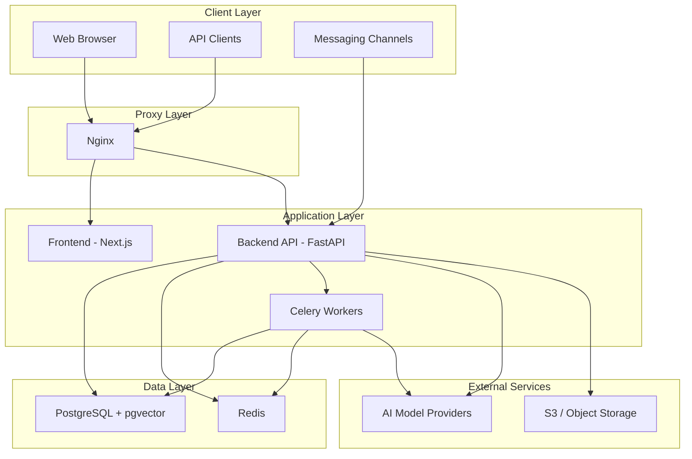

## Overview

Nadoo AI is designed to run on your own infrastructure. Whether you need a local development environment, a team demo, or a production deployment, there is a Docker Compose configuration ready for your scenario.

## Deployment Options

| Environment | Docker Compose File | Exposed Ports | Use Case |
|------------|-------------------|---------------|----------|
| **Local** | `docker-compose.local.yml` | 5432, 6379 | Backend dependencies only (Postgres + Redis). Run backend and frontend natively on your machine. |
| **Dev** | `docker-compose.dev.yml` | 15432, 16379, 18000, 13000 | Full stack with hot-reload. All services run in Docker with mapped ports for debugging. |
| **Demo** | `docker-compose.demo.yml` | 80, 443, 3000, 8000 | All-in-one demo deployment. Pre-configured for quick evaluation. |
| **Production** | `docker-compose.all.yml` | 30000+ range | Multi-service production deployment with Nginx, Celery workers, and monitoring. |

<CardGroup cols={2}>
  <Card
    title="Local Development"
    icon="laptop-code"
    href="/self-hosting/docker-compose-local"
  >
    The fastest way to start developing. Runs only Postgres and Redis in Docker while you develop the backend and frontend locally.
  </Card>
  <Card
    title="Environment Variables"
    icon="key"
    href="/self-hosting/environment-variables"
  >
    Complete reference for all environment variables used by Nadoo AI services.
  </Card>
</CardGroup>

## System Requirements

### Minimum Requirements

| Component | Requirement |
|-----------|------------|
| **Docker** | Docker Engine 20.10+ and Docker Compose v2+ |
| **Node.js** | 22.0 or later (for frontend development) |
| **Python** | 3.11 or later (for backend development) |
| **RAM** | 4 GB minimum (8 GB recommended) |
| **Disk** | 10 GB free space |

### Production Requirements

| Component | Requirement |
|-----------|------------|
| **CPU** | 4+ cores |
| **RAM** | 16 GB+ |
| **Disk** | 50 GB+ SSD |
| **OS** | Linux (Ubuntu 22.04 LTS recommended) |

## Infrastructure Components

Nadoo AI consists of the following services:

### Core Services

| Service | Technology | Purpose |
|---------|-----------|---------|
| **Backend API** | FastAPI (Python 3.11+) | REST API server handling all platform logic |
| **Frontend** | Next.js (Node.js 22+) | Web application UI |
| **Celery Workers** | Celery + Redis | Asynchronous task processing (document ingestion, batch operations) |

### Data Stores

| Service | Technology | Purpose |
|---------|-----------|---------|
| **PostgreSQL** | PostgreSQL 15+ with pgvector | Primary database with vector search for embeddings |
| **Redis** | Redis 7+ | Caching, session storage, Celery message broker, and rate limiting |

### Infrastructure

| Service | Technology | Purpose |
|---------|-----------|---------|
| **Nginx** | Nginx | Reverse proxy, TLS termination, static file serving (production) |

## Architecture Diagram



## Quick Start

The fastest way to get started is with the local development setup:

```bash
# Clone the repository
git clone https://github.com/nadoo-ai/nadoo-ai.git
cd nadoo-ai

# Start Postgres and Redis
docker-compose -f infrastructure/docker-compose.local.yml up -d

# Start the backend
cd packages/backend
pip install -r requirements.txt
alembic upgrade head
uvicorn src.main:app --reload --port 8000

# In another terminal, start the frontend
cd packages/frontend
npm install
npm run dev
```

See the [Local Development Setup](/self-hosting/docker-compose-local) guide for detailed instructions.

<Note>
  For production deployments, we recommend using `docker-compose.all.yml` with proper TLS certificates, secret management, and monitoring. See the production deployment guide for details.
</Note>
