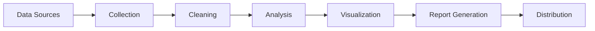
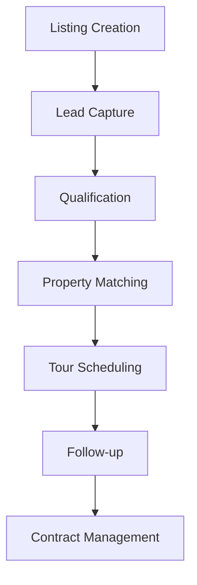

## Industry Applications

Nadoo AI powers intelligent automation across various industries and use cases.

## Customer Support Automation

### Intelligent Support Agents

Transform your customer service with AI-powered agents that:

<CardGroup cols={2}>
  <Card title="24/7 Availability" icon="clock">
    Instant responses at any time, reducing wait times from hours to seconds
  </Card>
  <Card title="Multi-Channel Support" icon="comments">
    Unified support across email, chat, social media, and phone
  </Card>
  <Card title="Context Awareness" icon="brain">
    Remembers conversation history and customer preferences
  </Card>
  <Card title="Smart Escalation" icon="arrow-up">
    Automatically escalates complex issues to human agents
  </Card>
</CardGroup>

**Real Example:**
```python
# Customer support workflow
support_flow = (
    IntentClassifierNode()
    | KnowledgeBaseSearchNode()
    | ResponseGeneratorNode()
    | HumanEscalationNode(threshold=0.7)
)
```

### Results from Our Customers

- **70% reduction** in average response time
- **85% first-contact resolution** rate
- **40% decrease** in support costs
- **4.8/5 customer satisfaction** score

## Document Processing

### Automated Document Workflows

Process thousands of documents with intelligent extraction:

<Steps>
  <Step title="Ingestion">
    Accept PDFs, emails, images, and structured documents
  </Step>
  <Step title="Extraction">
    Extract key data using OCR and NLP
  </Step>
  <Step title="Validation">
    Verify data accuracy and completeness
  </Step>
  <Step title="Integration">
    Push data to CRM, ERP, or databases
  </Step>
</Steps>

### Use Cases

<Tabs>
  <Tab title="Invoice Processing">
    - Extract vendor details, amounts, dates
    - Match with purchase orders
    - Route for approval
    - Update accounting systems
  </Tab>
  <Tab title="Contract Analysis">
    - Extract key terms and conditions
    - Identify risks and obligations
    - Compare with templates
    - Flag non-standard clauses
  </Tab>
  <Tab title="Resume Screening">
    - Parse candidate information
    - Match skills with requirements
    - Rank applicants
    - Schedule interviews
  </Tab>
</Tabs>

## Data Analysis & Reporting

### Automated Analytics Pipelines

Turn raw data into actionable insights:



### Capabilities

| Feature | Description | Benefit |
|---------|-------------|---------|
| **Real-time Processing** | Stream processing for live data | Instant insights |
| **Predictive Analytics** | ML models for forecasting | Proactive decisions |
| **Anomaly Detection** | Identify unusual patterns | Risk mitigation |
| **Custom Reports** | Tailored to stakeholder needs | Relevant insights |

## DevOps Automation

### Intelligent CI/CD Pipelines

Automate your development workflow with AI-enhanced operations:

<AccordionGroup>
  <Accordion title="Code Review Automation">
    - Automated code quality checks
    - Security vulnerability scanning
    - Performance impact analysis
    - Suggest improvements
  </Accordion>
  <Accordion title="Deployment Orchestration">
    - Intelligent rollout strategies
    - Automatic rollback on failures
    - Resource optimization
    - Multi-environment management
  </Accordion>
  <Accordion title="Incident Response">
    - Automated root cause analysis
    - Intelligent alerting
    - Auto-remediation for known issues
    - Runbook automation
  </Accordion>
  <Accordion title="Infrastructure Management">
    - Auto-scaling based on predictions
    - Cost optimization recommendations
    - Resource allocation
    - Capacity planning
  </Accordion>
</AccordionGroup>

## Sales & Marketing Automation

### Lead Generation & Nurturing

Automate your sales funnel with intelligent workflows:

```python
# Lead scoring workflow
lead_workflow = (
    DataEnrichmentNode()
    | LeadScoringNode()
    | SegmentationNode()
    | PersonalizationNode()
    | CampaignTriggerNode()
)
```

### Marketing Use Cases

<CardGroup cols={2}>
  <Card title="Content Generation" icon="pen">
    Create personalized content at scale
  </Card>
  <Card title="Email Campaigns" icon="envelope">
    Automated, targeted email sequences
  </Card>
  <Card title="Social Media" icon="share">
    Schedule and optimize social posts
  </Card>
  <Card title="Lead Scoring" icon="chart-line">
    Identify high-value prospects
  </Card>
</CardGroup>

## Healthcare Applications

### Medical Workflow Automation

<Warning>
  Healthcare implementations require compliance with HIPAA and other regulations.
</Warning>

### Applications

1. **Patient Intake**: Automated form processing and validation
2. **Appointment Scheduling**: Intelligent scheduling with preference matching
3. **Medical Records**: Extraction and categorization of medical data
4. **Insurance Claims**: Automated claim processing and validation
5. **Clinical Decision Support**: Evidence-based recommendations

## Financial Services

### Banking & Finance Automation

<Tabs>
  <Tab title="Loan Processing">
    ```python
    loan_workflow = (
        ApplicationValidationNode()
        | CreditCheckNode()
        | RiskAssessmentNode()
        | ApprovalDecisionNode()
        | DocumentGenerationNode()
    )
    ```
  </Tab>
  <Tab title="Fraud Detection">
    ```python
    fraud_workflow = (
        TransactionMonitorNode()
        | AnomalyDetectionNode()
        | RiskScoringNode()
        | AlertGenerationNode()
        | CaseManagementNode()
    )
    ```
  </Tab>
  <Tab title="Compliance">
    ```python
    compliance_workflow = (
        DataCollectionNode()
        | RegulationCheckNode()
        | ReportGenerationNode()
        | AuditTrailNode()
    )
    ```
  </Tab>
</Tabs>

## E-commerce Optimization

### Personalization Engine

Create unique shopping experiences:

- **Product Recommendations**: AI-driven suggestions
- **Dynamic Pricing**: Real-time price optimization
- **Inventory Management**: Demand forecasting
- **Customer Service**: Automated support and returns

### Results

<CardGroup cols={4}>
  <Card title="30%" icon="arrow-up">
    Increase in conversion
  </Card>
  <Card title="25%" icon="shopping-cart">
    Higher cart value
  </Card>
  <Card title="50%" icon="undo">
    Reduced returns
  </Card>
  <Card title="4.5/5" icon="star">
    Customer rating
  </Card>
</CardGroup>

## Education & Training

### Learning Automation

- **Personalized Learning Paths**: Adaptive curriculum
- **Automated Grading**: Essay and assignment evaluation
- **Student Support**: 24/7 tutoring assistance
- **Content Creation**: Generate practice problems

## Real Estate

### Property Management Automation



## Success Metrics

### Typical Results Across Industries

| Metric | Before Nadoo | After Nadoo | Improvement |
|--------|--------------|-------------|-------------|
| **Processing Time** | 48 hours | 5 minutes | 99% faster |
| **Error Rate** | 15% | 0.5% | 97% reduction |
| **Cost per Transaction** | $50 | $5 | 90% savings |
| **Customer Satisfaction** | 3.2/5 | 4.7/5 | 47% increase |
| **Employee Productivity** | 100 tasks/day | 500 tasks/day | 5x increase |

## Implementation Timeline

<Steps>
  <Step title="Week 1-2: Discovery">
    Identify processes and requirements
  </Step>
  <Step title="Week 3-4: Design">
    Create workflow architecture
  </Step>
  <Step title="Week 5-6: Development">
    Build and configure workflows
  </Step>
  <Step title="Week 7-8: Testing">
    Validate and optimize
  </Step>
  <Step title="Week 9-10: Deployment">
    Roll out to production
  </Step>
</Steps>

## Get Started

<CardGroup cols={2}>
  <Card title="Request Demo" icon="video" href="mailto:sales@nadoo.ai">
    See Nadoo AI in action for your use case
  </Card>
  <Card title="Start Building" icon="hammer" href="/getting-started">
    Begin with our quickstart guide
  </Card>
</CardGroup>