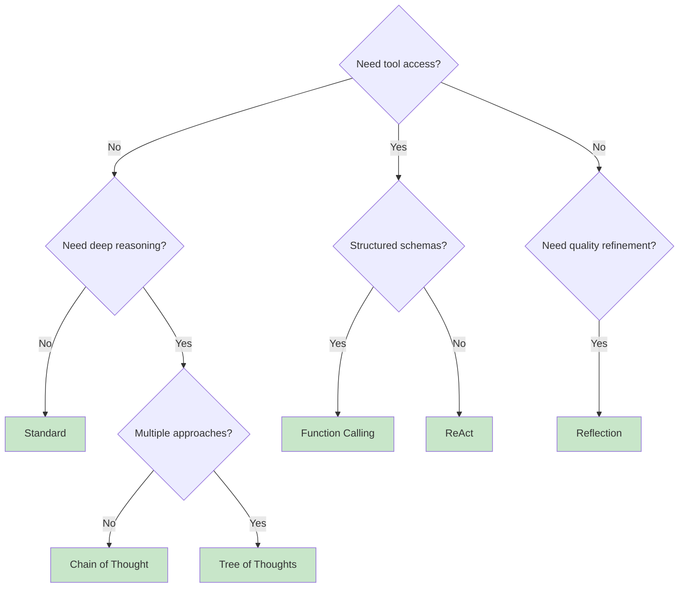

## Overview

The **AI Agent Node** is the most important node in the Nadoo AI workflow engine. It is the primary interface for invoking large language models and orchestrating complex reasoning patterns. Built on the **Agent 2.0 architecture**, it supports six distinct execution modes that cover everything from simple Q&A to multi-step tool use and self-reflective generation.

Every AI Agent Node is configured with a model, a system prompt, and an execution mode. The mode determines how the node interacts with the LLM -- whether it makes a single call, chains multiple reasoning steps, loops with tools, or evaluates parallel reasoning paths.

## Agent 2.0 Execution Modes

<Tabs>
  <Tab title="Standard">
    ### Standard Mode

    The simplest mode. The node sends the user's message (plus conversation history and system prompt) to the LLM and returns the response directly. No loops, no tool calls, no extra reasoning steps.

    **Best for:** Simple Q&A, content generation, translation, summarization.

    **Configuration:**

    ```json
    {
      "agent_mode": "standard",
      "model": "gpt-4o",
      "system_prompt": "You are a helpful assistant.",
      "temperature": 0.7,
      "max_tokens": 4096
    }
    ```

    **How it works:**

    1. Assemble the prompt (system + history + user message)
    2. Call the LLM
    3. Return the response
  </Tab>
  <Tab title="Chain of Thought">
    ### Chain of Thought Mode

    Forces the LLM to break problems into explicit reasoning steps before arriving at a final answer. This significantly improves accuracy on math, logic, and multi-step tasks.

    **Best for:** Mathematical reasoning, logical deduction, decision making, complex analysis.

    **Strategies:**

    | Strategy | Description |
    |---|---|
    | `step_by_step` | Solve the problem one step at a time |
    | `question_breakdown` | Decompose into sub-questions, answer each, then synthesize |
    | `pros_cons` | List pros and cons before making a decision |
    | `custom` | Use a custom reasoning template you provide |

    **Configuration:**

    ```json
    {
      "agent_mode": "chain_of_thought",
      "model": "gpt-4o",
      "system_prompt": "You are a math tutor.",
      "cot_config": {
        "strategy": "step_by_step",
        "max_steps": 10,
        "show_reasoning": true
      }
    }
    ```

    **How it works:**

    1. Inject reasoning instructions into the prompt based on the chosen strategy
    2. LLM generates step-by-step reasoning
    3. Extract the final answer from the reasoning chain
    4. Optionally expose the reasoning trace to the user
  </Tab>
  <Tab title="ReAct">
    ### ReAct Mode

    Implements the **Reasoning + Acting** loop. The LLM reasons about the problem, decides which tool to call, observes the result, and repeats until it has enough information to answer.

    **Best for:** Research tasks, multi-step problem solving, tasks requiring real-time data.

    **Configuration:**

    ```json
    {
      "agent_mode": "react",
      "model": "gpt-4o",
      "system_prompt": "You are a research assistant with access to search and calculator tools.",
      "react_config": {
        "max_iterations": 5,
        "tools": ["web_search", "calculator", "knowledge_search"],
        "early_stop": true
      }
    }
    ```

    **How it works:**

    1. **Thought** -- The LLM reasons about what to do next
    2. **Action** -- The LLM selects a tool and provides arguments
    3. **Observation** -- The tool executes and returns results
    4. Repeat steps 1-3 until the LLM decides it has a final answer
    5. Return the final answer
  </Tab>
  <Tab title="Function Calling">
    ### Function Calling Mode

    Uses the LLM's native function calling (tool use) API for structured, type-safe tool execution. Unlike ReAct, the tool selection is handled by the model's built-in function calling mechanism rather than prompt-based reasoning.

    **Best for:** API integrations, database queries, structured data extraction, any task requiring reliable tool invocation.

    **Configuration:**

    ```json
    {
      "agent_mode": "function_calling",
      "model": "gpt-4o",
      "system_prompt": "You help users query their database.",
      "function_calling_config": {
        "tools": ["sql_query", "create_chart", "send_email"],
        "parallel_tool_calls": true,
        "strict_mode": true,
        "max_iterations": 3
      }
    }
    ```

    **How it works:**

    1. Send the message along with tool definitions (JSON schemas) to the LLM
    2. The LLM returns one or more function calls with structured arguments
    3. Execute the requested functions
    4. Feed results back to the LLM
    5. Repeat until the LLM returns a text response (no more tool calls)

    <Info>
      When `parallel_tool_calls` is enabled, the LLM can request multiple tool invocations in a single turn, and they execute concurrently.
    </Info>
  </Tab>
  <Tab title="Reflection">
    ### Reflection Mode

    The LLM generates a response, then **critiques its own output** and iteratively improves it. This produces higher-quality results for tasks where self-review matters.

    **Best for:** Content creation, code review, quality assurance, writing tasks requiring polish.

    **Configuration:**

    ```json
    {
      "agent_mode": "reflection",
      "model": "gpt-4o",
      "system_prompt": "You are an expert technical writer.",
      "reflection_config": {
        "max_reflections": 3,
        "quality_threshold": 0.85,
        "criteria": [
          "accuracy",
          "clarity",
          "completeness",
          "tone"
        ]
      }
    }
    ```

    **How it works:**

    1. Generate an initial response
    2. Evaluate the response against the configured criteria
    3. If the quality score is below `quality_threshold`, generate a critique
    4. Revise the response based on the critique
    5. Repeat until the threshold is met or `max_reflections` is reached
    6. Return the final refined response
  </Tab>
  <Tab title="Tree of Thoughts">
    ### Tree of Thoughts Mode

    Explores **multiple reasoning paths in parallel**, evaluates each, and selects the best one. This is the most sophisticated mode, useful when there are multiple valid approaches to a problem.

    **Best for:** Creative writing, strategic planning, complex problem solving with multiple valid approaches.

    **Configuration:**

    ```json
    {
      "agent_mode": "tree_of_thoughts",
      "model": "gpt-4o",
      "system_prompt": "You are a strategic planning advisor.",
      "tot_config": {
        "num_thoughts": 3,
        "depth": 2,
        "evaluation_strategy": "score",
        "pruning_threshold": 0.3
      }
    }
    ```

    **How it works:**

    1. Generate `num_thoughts` independent reasoning paths at the first level
    2. Evaluate and score each path
    3. Prune paths below `pruning_threshold`
    4. For surviving paths, generate the next level of reasoning (up to `depth` levels)
    5. Select the highest-scoring complete path
    6. Return the result from the winning path
  </Tab>
</Tabs>

## Context Window Management

Long conversations can exceed a model's context window. The AI Agent Node provides three strategies for handling this:

| Strategy | Behavior |
|---|---|
| `truncate` | Remove the oldest messages until the conversation fits within the context window |
| `summarize` | Use the LLM to summarize older messages, replacing them with a condensed version |
| `error` | Fail with an error if the context window is exceeded (useful for debugging) |

```json
{
  "context_window": {
    "strategy": "summarize",
    "max_tokens": 120000,
    "reserve_for_output": 4096
  }
}
```

## Memory Integration

Enable conversational memory so the AI Agent retains context across multiple turns within a session.

```json
{
  "memory": {
    "enabled": true,
    "message_window": 20,
    "include_system_prompt": true
  }
}
```

- **message_window** -- Number of recent messages to include in each LLM call
- **include_system_prompt** -- Whether to prepend the system prompt to every call

## Model Settings

Fine-tune the LLM's behavior with these parameters:

| Parameter | Type | Default | Description |
|---|---|---|---|
| `temperature` | float | 0.7 | Controls randomness (0 = deterministic, 2 = very random) |
| `max_tokens` | int | 4096 | Maximum number of tokens in the response |
| `top_p` | float | 1.0 | Nucleus sampling threshold |
| `frequency_penalty` | float | 0.0 | Penalize tokens that appear frequently (range -2.0 to 2.0) |
| `presence_penalty` | float | 0.0 | Penalize tokens that have appeared at all (range -2.0 to 2.0) |
| `stop_sequences` | string[] | [] | Sequences that cause the model to stop generating |

## Selecting the Right Mode

Not sure which mode to use? Start here:



For a detailed comparison and guidance, see the [AI Agent Strategies](/workflow/strategies/overview) page.

## Next Steps

<CardGroup cols={2}>
  <Card title="AI Agent Strategies" icon="lightbulb" href="/workflow/strategies/overview">
    In-depth guide to each execution mode with examples
  </Card>
  <Card title="Knowledge Base" icon="book" href="/knowledge/overview">
    Connect a knowledge base for RAG workflows
  </Card>
  <Card title="Visual Editor" icon="pen-ruler" href="/workflow/visual-editor">
    Build workflows using the drag-and-drop editor
  </Card>
  <Card title="Workflow Engine" icon="diagram-project" href="/workflow/overview">
    Learn about the overall execution model
  </Card>
</CardGroup>
