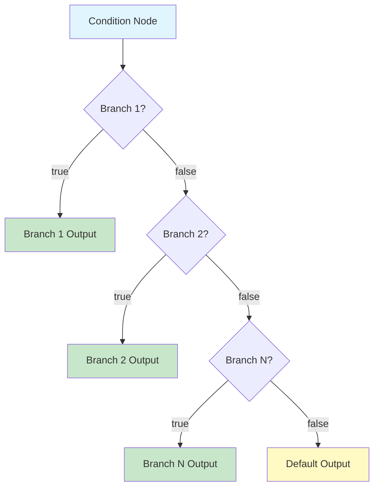
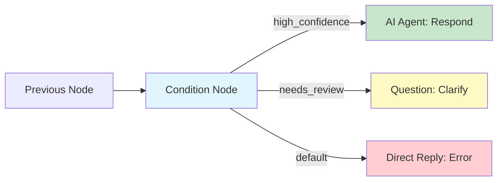

## Overview

The **Condition Node** evaluates expressions against workflow context variables and routes execution to different branches based on the results. It is the primary mechanism for adding **if/else logic** to your workflows, enabling dynamic behavior that adapts to user input, LLM output, or any other runtime data.

Each Condition Node supports multiple branches with independent evaluation rules, plus a default fallback branch for cases where no condition matches.

## Configuration

```json
{
  "type": "condition-node",
  "config": {
    "branches": [
      {
        "name": "high_confidence",
        "conditions": [
          {
            "variable": "{{confidence_score}}",
            "operator": "gte",
            "value": 0.8
          }
        ]
      },
      {
        "name": "needs_review",
        "conditions": [
          {
            "variable": "{{confidence_score}}",
            "operator": "gte",
            "value": 0.5
          },
          {
            "variable": "{{confidence_score}}",
            "operator": "lt",
            "value": 0.8
          }
        ]
      }
    ],
    "default_output": "fallback"
  }
}
```

| Parameter | Type | Description |
|---|---|---|
| `branches` | ConditionNodeBranch[] | Ordered list of branches to evaluate |
| `branches[].name` | string | Branch identifier, used as the output handle name |
| `branches[].conditions` | array | List of conditions that must ALL be true for this branch (AND logic) |
| `default_output` | string | Name of the default branch when no conditions match |

## Branch Evaluation

Branches are evaluated **in order**, top to bottom. The first branch whose conditions all evaluate to `true` is selected, and execution continues along that branch's output edge. If no branch matches, the `default_output` branch is used.

### Evaluation Order



<Warning>
  Because evaluation is ordered, place more specific conditions before general ones. A broad condition early in the list will prevent narrower conditions below it from ever being reached.
</Warning>

## Comparison Operators

The Condition Node supports a comprehensive set of comparison operators:

### Value Comparisons

| Operator | Description | Example |
|---|---|---|
| `eq` | Equal to | `{{status}} eq "active"` |
| `neq` | Not equal to | `{{status}} neq "deleted"` |
| `gt` | Greater than | `{{score}} gt 90` |
| `gte` | Greater than or equal to | `{{score}} gte 80` |
| `lt` | Less than | `{{count}} lt 10` |
| `lte` | Less than or equal to | `{{count}} lte 100` |

### String Operators

| Operator | Description | Example |
|---|---|---|
| `contains` | String contains substring | `{{message}} contains "urgent"` |
| `not_contains` | String does not contain substring | `{{message}} not_contains "spam"` |
| `starts_with` | String starts with prefix | `{{email}} starts_with "admin"` |
| `ends_with` | String ends with suffix | `{{file}} ends_with ".pdf"` |
| `regex` | Matches regular expression | `{{input}} regex "^[0-9]{3}-[0-9]{4}$"` |

### Existence Operators

| Operator | Description | Example |
|---|---|---|
| `is_empty` | Value is null, undefined, or empty string | `{{notes}} is_empty` |
| `is_not_empty` | Value exists and is non-empty | `{{user_id}} is_not_empty` |
| `in` | Value is in a list | `{{lang}} in ["en", "ko", "ja"]` |
| `not_in` | Value is not in a list | `{{role}} not_in ["banned", "suspended"]` |

## Multiple Conditions (AND Logic)

When a branch has multiple conditions, **all** conditions must be true for the branch to match. This provides AND logic within a single branch.

```json
{
  "name": "premium_active",
  "conditions": [
    {
      "variable": "{{plan}}",
      "operator": "eq",
      "value": "premium"
    },
    {
      "variable": "{{status}}",
      "operator": "eq",
      "value": "active"
    },
    {
      "variable": "{{days_remaining}}",
      "operator": "gt",
      "value": 0
    }
  ]
}
```

This branch matches only when the user's plan is "premium" AND status is "active" AND they have remaining days.

<Info>
  For **OR logic**, create separate branches for each alternative condition. Since branches are evaluated independently, any matching branch will be selected.
</Info>

## Custom Expressions

For complex conditions that cannot be expressed with simple operators, use the `expression` type to write custom evaluation logic:

```json
{
  "name": "complex_check",
  "conditions": [
    {
      "type": "expression",
      "expression": "len({{search_results}}) > 0 and {{confidence_score}} >= 0.7"
    }
  ]
}
```

Custom expressions support basic arithmetic, string operations, list operations (`len`, `in`), and boolean combinators (`and`, `or`, `not`).

## Output Handles

Each branch in the Condition Node creates a **separate output handle** in the visual editor. You connect different downstream nodes to each handle to define the execution path for each condition.



In the visual editor, the output handles appear as labeled connection points on the right side of the node. Drag edges from each handle to the appropriate downstream node.

## Example: Language Router

Route user messages to different AI Agent nodes based on detected language:

```json
{
  "type": "condition-node",
  "config": {
    "branches": [
      {
        "name": "korean",
        "conditions": [
          {
            "variable": "{{detected_language}}",
            "operator": "eq",
            "value": "ko"
          }
        ]
      },
      {
        "name": "japanese",
        "conditions": [
          {
            "variable": "{{detected_language}}",
            "operator": "eq",
            "value": "ja"
          }
        ]
      },
      {
        "name": "english",
        "conditions": [
          {
            "variable": "{{detected_language}}",
            "operator": "in",
            "value": ["en", "en-US", "en-GB"]
          }
        ]
      }
    ],
    "default_output": "english"
  }
}
```

## Best Practices

<AccordionGroup>
  <Accordion title="Always configure a default branch">
    Even if you think all cases are covered, include a `default_output` branch. Unexpected values or edge cases will route to the default instead of causing a workflow failure.
  </Accordion>
  <Accordion title="Order branches from most specific to most general">
    Since branches are evaluated in order, put narrow conditions first. A catch-all condition at the top will shadow everything below it.
  </Accordion>
  <Accordion title="Use Variable Nodes to precompute complex values">
    Instead of writing complex expressions inside condition branches, use a Variable Node upstream to compute a simple boolean or category value, then branch on that value in the Condition Node.
  </Accordion>
  <Accordion title="Limit branch count for readability">
    Workflows with more than 5-6 branches on a single Condition Node become hard to follow. Consider chaining multiple Condition Nodes or using an Intent Classifier for many-way routing.
  </Accordion>
</AccordionGroup>

## Next Steps

<CardGroup cols={2}>
  <Card title="Intent Classifier" icon="bullseye" href="/workflow/nodes/intent-classifier">
    AI-powered routing for natural language intent detection
  </Card>
  <Card title="Start & End Nodes" icon="play" href="/workflow/nodes/start-end">
    Configure the entry and exit points of your workflow
  </Card>
  <Card title="Loop Node" icon="arrows-rotate" href="/workflow/nodes/loop">
    Iterate over collections with conditional exit
  </Card>
  <Card title="AI Agent Node" icon="robot" href="/workflow/nodes/ai-agent">
    Process branched inputs with LLM reasoning
  </Card>
</CardGroup>
