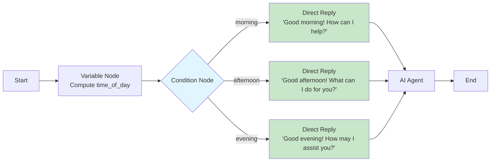

## Overview

The **Direct Reply Node** sends a response to the user without invoking a language model. It is designed for cases where the response content is known in advance -- greetings, error messages, confirmation notices, static instructions, or templated messages that incorporate workflow variables.

Because it bypasses the LLM entirely, the Direct Reply Node executes instantly with zero token cost, making it ideal for high-frequency, low-complexity responses.

## Configuration

```json
{
  "type": "direct-reply-node",
  "config": {
    "reply_mode": "text",
    "reply_type": "static",
    "reply_content": "Thank you for your message. A support agent will follow up within 24 hours.",
    "append_to_history": true
  }
}
```

| Parameter | Type | Default | Description |
|---|---|---|---|
| `reply_mode` | string | `"text"` | Response format: `"text"` or `"markdown"` |
| `reply_type` | string | `"static"` | Content source: `"static"` (literal text) or `"variable"` (from context) |
| `reply_content` | string | `""` | The response content or variable reference. Allows empty string. |
| `append_to_history` | boolean | `true` | Whether to add this reply to the conversation history |

### Reply Types

<Tabs>
  <Tab title="Static">
    ### Static Reply

    Returns a fixed string. Supports variable interpolation with `{{variable_name}}` syntax.

    ```json
    {
      "reply_type": "static",
      "reply_content": "Hello {{user_name}}, welcome to our support portal!"
    }
    ```

    Variables in the template are resolved from the workflow context at execution time.
  </Tab>
  <Tab title="Variable">
    ### Variable Reply

    Returns the value of a workflow context variable directly as the response.

    ```json
    {
      "reply_type": "variable",
      "reply_content": "{{formatted_report}}"
    }
    ```

    This is useful when an upstream node (e.g., a Python Code Node or Variable Node) has already computed the full response content.
  </Tab>
</Tabs>

### Reply Modes

| Mode | Description | Rendering |
|---|---|---|
| `text` | Plain text response | Displayed as-is, no formatting applied |
| `markdown` | Markdown-formatted response | Rendered with headings, lists, code blocks, links, etc. |

## Empty Reply Content

The `reply_content` field explicitly **allows empty strings**. This is useful in two scenarios:

1. **Silent acknowledgment** -- The node executes and appends to history without displaying visible output, useful for internal workflow tracking.
2. **Conditional paths** -- An empty reply on one branch paired with a substantive reply on another branch.

```json
{
  "reply_type": "static",
  "reply_content": "",
  "append_to_history": false
}
```

## Conversation History

When `append_to_history` is `true`, the reply is added to the conversation's message history as an assistant message. This means downstream AI Agent nodes will see this reply as part of the conversation context.

Set `append_to_history` to `false` when:
- The reply is a transient status message (e.g., "Processing your request...")
- The reply contains internal metadata not relevant to the LLM
- You want to avoid polluting the conversation context

## Use Cases

<CardGroup cols={2}>
  <Card title="Greeting Messages" icon="hand-wave">
    Welcome users with a consistent, branded message before routing to an AI agent.
  </Card>
  <Card title="Error Handling" icon="triangle-exclamation">
    Return friendly error messages on failed branches without consuming LLM tokens.
  </Card>
  <Card title="Confirmation Notices" icon="circle-check">
    Acknowledge user actions ("Your file has been uploaded successfully") instantly.
  </Card>
  <Card title="Fallback Responses" icon="life-ring">
    Provide a default response when no conditions match or the knowledge base returns no results.
  </Card>
</CardGroup>

## Example: Conditional Greeting

A workflow that greets the user differently based on the time of day:



## Example: Error Fallback

Use a Direct Reply Node as the default output of a Condition Node to handle missing search results:

```json
{
  "type": "direct-reply-node",
  "config": {
    "reply_mode": "markdown",
    "reply_type": "static",
    "reply_content": "I'm sorry, I couldn't find any relevant information for your question. Please try rephrasing or contact our support team at **support@example.com**.",
    "append_to_history": true
  }
}
```

## Best Practices

<AccordionGroup>
  <Accordion title="Prefer Direct Reply over AI Agent for static content">
    If the response text is known at design time, always use a Direct Reply Node instead of an AI Agent Node. It is faster, cheaper, and deterministic.
  </Accordion>
  <Accordion title="Use markdown mode for rich responses">
    When the reply includes links, lists, code snippets, or formatted text, set `reply_mode` to `"markdown"` for proper rendering in the chat interface.
  </Accordion>
  <Accordion title="Be intentional with conversation history">
    Only append to history when the reply adds meaningful context for future LLM calls. Transient messages like "Please wait..." should not be appended.
  </Accordion>
</AccordionGroup>

## Next Steps

<CardGroup cols={2}>
  <Card title="Start & End Nodes" icon="play" href="/workflow/nodes/start-end">
    Configure workflow entry and exit points
  </Card>
  <Card title="Condition Node" icon="code-branch" href="/workflow/nodes/condition">
    Branch logic to decide which reply to send
  </Card>
  <Card title="Form Node" icon="rectangle-list" href="/workflow/nodes/form">
    Collect structured input from users
  </Card>
  <Card title="AI Agent Node" icon="robot" href="/workflow/nodes/ai-agent">
    Use LLM-powered responses for dynamic content
  </Card>
</CardGroup>
