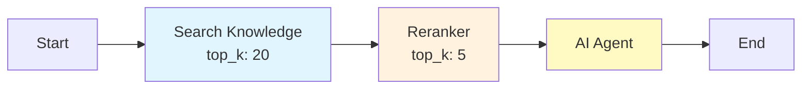

## Overview

The **Search Knowledge Node** performs retrieval-augmented generation (RAG) by searching against one or more knowledge bases. It takes a query expression, executes vector similarity search (optionally combined with BM25 keyword search), and returns the most relevant document chunks along with their scores and metadata.

This node is a core building block for any workflow that needs to ground LLM responses in your organization's documents and data.

## How It Works

<Steps>
  <Step title="Resolve Query">
    The node evaluates the `query` expression, which can reference workflow context variables such as the user's message or a transformed version of it.
  </Step>
  <Step title="Search Knowledge Bases">
    The query is sent to each configured knowledge base. Depending on the knowledge base configuration, this may be a dense vector search, a BM25 keyword search, or a hybrid combination of both.
  </Step>
  <Step title="Score and Filter">
    Results are ranked by relevance score. Chunks below the `score_threshold` are discarded, and only the top `top_k` results are retained.
  </Step>
  <Step title="Output Results">
    The retrieved chunks, along with their scores and source metadata, are written to the workflow context for downstream nodes to consume.
  </Step>
</Steps>

## Configuration

```json
{
  "type": "search-knowledge-node",
  "config": {
    "knowledge_base_ids": [
      "kb_01HX7A9B2C3D4E5F6G7H8J9K",
      "kb_01HX7B8C3D4E5F6G7H8J9K0L"
    ],
    "query": "{{user_message}}",
    "top_k": 5,
    "score_threshold": 0.7,
    "search_mode": "hybrid",
    "output_variable": "search_results"
  }
}
```

| Parameter | Type | Default | Description |
|---|---|---|---|
| `knowledge_base_ids` | string[] | -- | IDs of the knowledge bases to search (required) |
| `query` | string | -- | Query expression, supports variable references like `{{user_message}}` |
| `top_k` | number | `5` | Maximum number of chunks to return |
| `score_threshold` | number | `0.0` | Minimum relevance score (0.0 to 1.0) to include a chunk |
| `search_mode` | string | `"vector"` | Search strategy: `"vector"`, `"keyword"`, or `"hybrid"` |
| `output_variable` | string | `"search_results"` | Context variable name for the output |

### Search Modes

| Mode | Description | Best For |
|---|---|---|
| `vector` | Dense embedding similarity search using pgvector | Semantic queries where meaning matters more than exact terms |
| `keyword` | BM25 keyword-based search | Exact term matching, code identifiers, proper nouns |
| `hybrid` | Combines vector and keyword results with reciprocal rank fusion | General-purpose retrieval with the best balance of recall and precision |

<Info>
  **Hybrid search** is recommended for most use cases. It catches both semantic matches that keyword search would miss and exact matches that vector search might overlook.
</Info>

## Output Structure

The node writes an array of retrieved chunks to the workflow context:

```json
{
  "search_results": [
    {
      "content": "The refund policy allows returns within 30 days of purchase...",
      "score": 0.92,
      "metadata": {
        "source": "refund-policy.pdf",
        "page": 3,
        "knowledge_base_id": "kb_01HX7A9B2C3D4E5F6G7H8J9K",
        "chunk_index": 12
      }
    },
    {
      "content": "Exceptions to the return policy include digital products...",
      "score": 0.85,
      "metadata": {
        "source": "refund-policy.pdf",
        "page": 4,
        "knowledge_base_id": "kb_01HX7A9B2C3D4E5F6G7H8J9K",
        "chunk_index": 15
      }
    }
  ]
}
```

| Field | Description |
|---|---|
| `content` | The text content of the retrieved chunk |
| `score` | Relevance score between 0.0 and 1.0 |
| `metadata.source` | Original document filename |
| `metadata.page` | Page number in the source document (if applicable) |
| `metadata.knowledge_base_id` | Which knowledge base the chunk came from |
| `metadata.chunk_index` | Position of the chunk within the document |

## Integration with Reranker Node

For improved retrieval quality, chain the Search Knowledge Node with a **Reranker Node**. The reranker uses a cross-encoder model to re-score the initial results, often surfacing more relevant chunks that vector search alone might rank lower.



**Recommended pattern:**
1. Retrieve a larger initial set (`top_k: 20`) from the Search Knowledge Node
2. Pass the results through the Reranker Node to select the best 5
3. Feed the reranked results to the AI Agent Node as context

```json
{
  "type": "reranker-node",
  "config": {
    "input_variable": "search_results",
    "top_k": 5,
    "model": "cross-encoder",
    "output_variable": "reranked_results"
  }
}
```

## Searching Multiple Knowledge Bases

When multiple `knowledge_base_ids` are specified, the node searches all of them and merges the results into a single ranked list. This is useful when your content spans multiple knowledge bases (e.g., product docs + support tickets + internal wiki).

Results from different knowledge bases are interleaved by score, so the most relevant chunks appear first regardless of their source.

## Example: Customer Support RAG

A complete RAG workflow for answering customer questions:

```json
{
  "nodes": [
    {
      "id": "start",
      "type": "start-node"
    },
    {
      "id": "search",
      "type": "search-knowledge-node",
      "config": {
        "knowledge_base_ids": ["kb_product_docs", "kb_faq"],
        "query": "{{user_message}}",
        "top_k": 10,
        "score_threshold": 0.6,
        "search_mode": "hybrid"
      }
    },
    {
      "id": "rerank",
      "type": "reranker-node",
      "config": {
        "input_variable": "search_results",
        "top_k": 3
      }
    },
    {
      "id": "agent",
      "type": "ai-agent-node",
      "config": {
        "agent_mode": "standard",
        "model": "gpt-4o",
        "system_prompt": "Answer the user's question based on the provided context. If the context does not contain relevant information, say so."
      }
    },
    {
      "id": "end",
      "type": "end-node"
    }
  ]
}
```

## Best Practices

<AccordionGroup>
  <Accordion title="Set an appropriate score threshold">
    A `score_threshold` of 0.6-0.7 works well for most use cases. Too low (below 0.5) may include irrelevant results that confuse the LLM. Too high (above 0.9) may filter out useful results.
  </Accordion>
  <Accordion title="Use hybrid search by default">
    Unless you have a specific reason to use pure vector or keyword search, `hybrid` mode provides the best recall across different query types.
  </Accordion>
  <Accordion title="Over-retrieve, then rerank">
    Retrieve more results than you need (`top_k: 15-20`) and use a Reranker Node to select the best subset. This two-stage approach significantly improves retrieval quality.
  </Accordion>
  <Accordion title="Transform the query when needed">
    For complex user messages, use a Variable Node or AI Agent Node upstream to extract or rephrase the search query before passing it to the Search Knowledge Node.
  </Accordion>
</AccordionGroup>

## Next Steps

<CardGroup cols={2}>
  <Card title="Knowledge Base" icon="book" href="/knowledge/overview">
    Set up and manage knowledge bases for your workflows
  </Card>
  <Card title="Document Extract" icon="file-lines" href="/workflow/nodes/document-extract">
    Process uploaded documents within workflows
  </Card>
  <Card title="Database Node" icon="database" href="/workflow/nodes/database">
    Query structured data directly from your workflows
  </Card>
  <Card title="AI Agent Node" icon="robot" href="/workflow/nodes/ai-agent">
    Use retrieved knowledge as context for LLM responses
  </Card>
</CardGroup>
