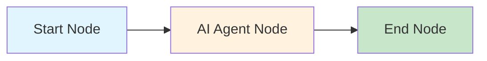

## Introduction

The Nadoo AI Workflow Engine is a **LangGraph-based visual workflow system** that lets you build AI agent pipelines as directed graphs. Each workflow is a graph where **nodes** process inputs, retrieve information, make decisions, and generate responses, connected by **edges** that define the execution flow.

Whether you are building a simple chatbot or a multi-step RAG pipeline with tool use, the workflow engine provides the runtime, streaming, and observability you need to go from prototype to production.

## Node Categories

Nadoo AI ships with 18+ built-in node types organized into five categories.

<CardGroup cols={2}>
  <Card title="Input / Output" icon="arrow-right-arrow-left">
    Nodes that receive user input and deliver final responses.

    - **Start Node** -- Entry point for every workflow
    - **End Node** -- Terminal node that finalizes output
    - **Question Node** -- Prompt the user for additional information
    - **Form Node** -- Collect structured data via form fields
    - **Direct Reply Node** -- Return an immediate static or templated response
  </Card>
  <Card title="AI / LLM" icon="brain">
    Nodes that invoke language models and multimodal AI.

    - **AI Agent Node** -- Core LLM interaction with 6 execution modes
    - **Image Generate** -- Create images from text prompts
    - **Image Understand** -- Analyze and describe images
    - **TTS (Text-to-Speech)** -- Convert text to audio
    - **STT (Speech-to-Text)** -- Transcribe audio to text
  </Card>
  <Card title="Knowledge & Retrieval" icon="book-open">
    Nodes for RAG, search, and data access.

    - **Search Knowledge Node** -- Vector / hybrid search over knowledge bases
    - **Reranker Node** -- Re-score and reorder retrieved documents
    - **Document Extract Node** -- Parse and extract content from files
    - **Database Node** -- Execute SQL queries against relational databases
    - **Database Semantic RAG Node** -- Natural-language-to-SQL with retrieval
  </Card>
  <Card title="Logic & Control" icon="code-branch">
    Nodes for branching, variables, and sub-workflows.

    - **Condition Node** -- If/else branching based on expressions
    - **Variable Node** -- Set, transform, or compute variables
    - **Application Node** -- Invoke another Nadoo application as a sub-workflow
  </Card>
  <Card title="Integration" icon="plug">
    Nodes for external tools, code, and MCP servers.

    - **Tool Node** -- Call a registered tool by name
    - **Tool Lib Node** -- Access shared tool libraries
    - **Python Node** -- Execute arbitrary Python code
    - **MCP Node** -- Connect to Model Context Protocol servers
  </Card>
</CardGroup>

## Execution Model

Every workflow execution is governed by two layers of context:

| Context | Scope | Purpose |
|---|---|---|
| **WorkflowContext** | Global (entire run) | Holds the conversation history, global variables, streaming channel, and execution metadata |
| **NodeContext** | Local (single node) | Contains node-specific inputs, configuration, and intermediate results |

Data flows between nodes through the global `WorkflowContext`. Each node reads its inputs from the context, performs its operation, and writes its outputs back for downstream nodes to consume.

### Node Lifecycle

Every node passes through a consistent lifecycle during execution:

<Steps>
  <Step title="Pre-execute">
    Validate inputs, resolve variable references, and prepare the node's runtime configuration.
  </Step>
  <Step title="Execute">
    Run the node's core logic -- call an LLM, query a knowledge base, evaluate a condition, etc.
  </Step>
  <Step title="Post-execute">
    Process outputs, update the workflow context with results, and record metrics.
  </Step>
  <Step title="Resolution">
    Determine which downstream edge(s) to follow based on the node's output and any branching conditions.
  </Step>
</Steps>

### Node Status States

During execution, each node transitions through the following statuses:

| Status | Description |
|---|---|
| `PENDING` | Node is queued and waiting to execute |
| `RUNNING` | Node is currently executing |
| `SUCCESS` | Node completed successfully |
| `FAILED` | Node encountered an error |
| `SKIPPED` | Node was bypassed (e.g., condition evaluated to false) |
| `INTERRUPTED` | Node was stopped by user intervention or timeout |

## SSE Streaming

The workflow engine streams execution events to the client in real time via **Server-Sent Events (SSE)**. This enables live progress indicators, token-by-token LLM output, and detailed debugging.

There are **19 event types** covering the full execution lifecycle:

<Tabs>
  <Tab title="Workflow Events">
    - `workflow_started` -- Execution begins
    - `workflow_finished` -- Execution completed successfully
    - `workflow_failed` -- Execution terminated with an error
    - `workflow_interrupted` -- Execution stopped by user
  </Tab>
  <Tab title="Node Events">
    - `node_started` -- A node begins execution
    - `node_finished` -- A node completes
    - `node_failed` -- A node errors out
    - `node_skipped` -- A node is bypassed
  </Tab>
  <Tab title="LLM Events">
    - `llm_token` -- A single token from the LLM stream
    - `llm_thinking` -- Model reasoning / chain-of-thought output
    - `llm_tool_call` -- Model requests a tool invocation
    - `llm_tool_result` -- Tool returns its result
    - `llm_finished` -- LLM generation complete
  </Tab>
  <Tab title="Data Events">
    - `variable_updated` -- A workflow variable changed
    - `knowledge_retrieved` -- Documents fetched from knowledge base
    - `form_requested` -- A form is presented to the user
    - `question_asked` -- A question is posed to the user
    - `message` -- General informational message
    - `error` -- Error detail event
  </Tab>
</Tabs>

## Example: Minimal Workflow

A simple question-answering workflow requires only three nodes:

1. **Start Node** receives the user's message.
2. **AI Agent Node** sends the message to an LLM and streams the response.
3. **End Node** delivers the final answer.

## Next Steps

<CardGroup cols={2}>
  <Card title="Visual Editor" icon="pen-ruler" href="/workflow/visual-editor">
    Learn how to build workflows with the drag-and-drop editor
  </Card>
  <Card title="AI Agent Node" icon="robot" href="/workflow/nodes/ai-agent">
    Deep dive into the most important node type
  </Card>
  <Card title="AI Agent Strategies" icon="lightbulb" href="/workflow/strategies/overview">
    Explore the 6 execution modes for LLM reasoning
  </Card>
  <Card title="Knowledge Base" icon="book" href="/knowledge/overview">
    Set up RAG pipelines for your workflows
  </Card>
</CardGroup>
