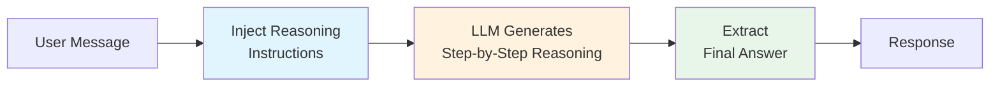
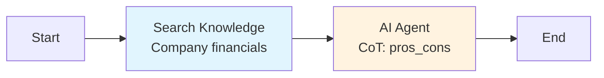

## Overview

**Chain of Thought (CoT)** mode forces the LLM to break problems into explicit reasoning steps before arriving at a final answer. Instead of generating a response in a single pass, the model produces a structured reasoning trace -- showing its work step by step -- and then synthesizes a final answer from that trace.

CoT significantly improves accuracy on tasks involving math, logical reasoning, multi-factor decisions, and complex analysis. It requires **no additional LLM calls** beyond Standard mode (the reasoning happens within a single generation), making it a free accuracy upgrade for many use cases.

## How It Works



<Steps>
  <Step title="Inject Reasoning Instructions">
    Based on the selected strategy, reasoning instructions are injected into the prompt. For example, "Let's think step by step" for the `step_by_step` strategy.
  </Step>
  <Step title="Generate Reasoning Trace">
    The LLM generates a detailed reasoning trace, with each step emitted as a `cot_step` SSE event. The reasoning is visible to the client in real time.
  </Step>
  <Step title="Extract Final Answer">
    The final answer is extracted from the end of the reasoning trace and returned as the node's output.
  </Step>
</Steps>

## Configuration

```json
{
  "type": "ai-agent-node",
  "config": {
    "agent_mode": "chain_of_thought",
    "model": "gpt-4o",
    "system_prompt": "You are a math tutor. Always show your work.",
    "cot_config": {
      "strategy": "step_by_step",
      "max_steps": 10,
      "show_reasoning": true
    },
    "temperature": 0.3,
    "max_tokens": 8192
  }
}
```

| Parameter | Type | Default | Description |
|---|---|---|---|
| `agent_mode` | string | -- | Must be `"chain_of_thought"` |
| `cot_config.strategy` | string | `"step_by_step"` | Reasoning strategy (see below) |
| `cot_config.max_steps` | number | `5` | Maximum number of reasoning steps |
| `cot_config.show_reasoning` | boolean | `true` | Whether to include the reasoning trace in the response |

## Strategies

CoT mode offers four reasoning strategies, each suited to different problem types.

<Tabs>
  <Tab title="Step by Step">
    ### step_by_step

    The most general strategy. The model solves the problem one logical step at a time, building toward the answer incrementally.

    **Prompt injection:** "Let's solve this step by step. For each step, clearly state what you are doing and why."

    **Best for:** Math problems, algorithmic reasoning, sequential processes.

    ```json
    {
      "cot_config": {
        "strategy": "step_by_step",
        "max_steps": 10
      }
    }
    ```

    **Example output:**

    ```
    Step 1: Identify the known values.
    - Principal: $10,000
    - Annual rate: 5%
    - Time: 3 years

    Step 2: Apply the compound interest formula.
    A = P(1 + r)^t = 10000(1 + 0.05)^3

    Step 3: Calculate.
    A = 10000 × 1.157625 = $11,576.25

    Step 4: Find the interest earned.
    Interest = $11,576.25 - $10,000 = $1,576.25

    Final Answer: The compound interest earned over 3 years is $1,576.25.
    ```
  </Tab>
  <Tab title="Question Breakdown">
    ### question_breakdown

    Decomposes a complex question into smaller sub-questions, answers each independently, and synthesizes the results into a comprehensive answer.

    **Prompt injection:** "Break this question into smaller sub-questions. Answer each sub-question, then combine the answers into a final response."

    **Best for:** Multi-part questions, research queries, analysis requiring multiple perspectives.

    ```json
    {
      "cot_config": {
        "strategy": "question_breakdown",
        "max_steps": 8
      }
    }
    ```

    **Example output:**

    ```
    Sub-question 1: What is the current market size for AI agents?
    Answer: The global AI agent market is estimated at $X billion in 2026...

    Sub-question 2: What are the key growth drivers?
    Answer: Key drivers include enterprise automation, LLM advancements...

    Sub-question 3: What are the main challenges?
    Answer: Challenges include hallucination, reliability, cost...

    Synthesis: The AI agent market is experiencing rapid growth ($X billion)
    driven by enterprise automation and LLM improvements, though challenges
    around reliability and cost remain significant barriers to adoption.
    ```
  </Tab>
  <Tab title="Pros and Cons">
    ### pros_cons

    Evaluates options by listing pros and cons for each before making a recommendation. Ideal for decision-making scenarios.

    **Prompt injection:** "For each option, list the pros and cons. Then weigh them and provide a recommendation."

    **Best for:** Comparisons, decision making, evaluating trade-offs.

    ```json
    {
      "cot_config": {
        "strategy": "pros_cons",
        "max_steps": 6
      }
    }
    ```

    **Example output:**

    ```
    Option A: PostgreSQL
    Pros:
    - Open source, no licensing cost
    - Strong JSON support with pgvector
    - Mature ecosystem
    Cons:
    - Requires more operational expertise
    - Horizontal scaling is complex

    Option B: MongoDB
    Pros:
    - Native document storage
    - Easy horizontal scaling
    - Flexible schema
    Cons:
    - Limited transaction support
    - Vector search is newer, less mature

    Recommendation: For an AI application requiring vector search and
    relational data, PostgreSQL with pgvector offers the best combination
    of capabilities with lower operational cost.
    ```
  </Tab>
  <Tab title="Custom">
    ### custom

    Use your own reasoning template. You provide a custom prompt template that tells the model exactly how to structure its reasoning.

    **Best for:** Domain-specific reasoning patterns, specialized analysis frameworks.

    ```json
    {
      "cot_config": {
        "strategy": "custom",
        "custom_template": "Analyze this using the SWOT framework:\n1. Strengths\n2. Weaknesses\n3. Opportunities\n4. Threats\n\nThen provide your recommendation based on the analysis."
      }
    }
    ```

    The `custom_template` is injected into the prompt alongside the user's message and system prompt. It replaces the default reasoning instructions.
  </Tab>
</Tabs>

## SSE Events

Chain of Thought mode emits these events during execution:

| Event | When | Payload |
|---|---|---|
| `node_started` | Node begins | `{ node_id, node_type }` |
| `cot_step` | Each reasoning step is generated | `{ step_number, content, node_id }` |
| `llm_token` | Each token is generated | `{ token, node_id }` |
| `llm_finished` | Generation completes | `{ node_id, total_tokens }` |
| `node_finished` | Node completes | `{ node_id, status }` |

The `cot_step` event is unique to Chain of Thought mode. Clients can use it to display the reasoning trace progressively as the model works through the problem.

## Showing vs. Hiding Reasoning

The `show_reasoning` parameter controls whether the reasoning trace is included in the final response:

| Value | Behavior | Use Case |
|---|---|---|
| `true` | Full reasoning trace + final answer | Educational tools, debugging, transparency |
| `false` | Final answer only (reasoning is still generated but not shown) | Production assistants where users want just the answer |

<Info>
  Even with `show_reasoning: false`, the reasoning trace is still available in the node's execution metadata for debugging and logging. It simply is not included in the user-facing response.
</Info>

## Performance Characteristics

| Metric | Chain of Thought |
|---|---|
| LLM calls per execution | 1 (same as Standard) |
| Additional latency | Moderate (longer generation due to reasoning steps) |
| Token usage | 1.5-3x Standard (reasoning trace adds tokens) |
| Quality improvement | Significant for reasoning tasks |

The key insight is that CoT uses the **same number of API calls** as Standard mode. The extra cost comes only from the additional tokens generated for the reasoning trace. This makes it the most cost-effective way to improve accuracy.

## Example: Financial Analysis Workflow



```json
{
  "agent_mode": "chain_of_thought",
  "model": "gpt-4o",
  "system_prompt": "You are a financial analyst. When asked to evaluate an investment, analyze the financials thoroughly and provide a clear recommendation.",
  "cot_config": {
    "strategy": "pros_cons",
    "max_steps": 8,
    "show_reasoning": true
  },
  "temperature": 0.3
}
```

## When to Use Chain of Thought

| Scenario | Recommendation |
|---|---|
| Simple factual Q&A | Use Standard -- CoT adds unnecessary verbosity |
| Math and calculations | Use CoT (`step_by_step`) -- significant accuracy improvement |
| Multi-factor decisions | Use CoT (`pros_cons`) -- structured evaluation |
| Complex research questions | Use CoT (`question_breakdown`) -- systematic coverage |
| Creative writing | Use Standard or Reflection -- CoT reasoning is less useful for creative tasks |

## Best Practices

<AccordionGroup>
  <Accordion title="Match strategy to problem type">
    Use `step_by_step` for sequential/mathematical problems, `question_breakdown` for multi-part questions, `pros_cons` for comparisons, and `custom` for domain-specific frameworks.
  </Accordion>
  <Accordion title="Increase max_tokens for CoT">
    The reasoning trace consumes tokens. Set `max_tokens` to 2-3x what you would use in Standard mode to ensure the model has space for both reasoning and the final answer.
  </Accordion>
  <Accordion title="Use lower temperature">
    CoT works best with lower temperature (0.1-0.4) to keep the reasoning focused and consistent. Higher temperatures can cause the model to meander in its reasoning.
  </Accordion>
  <Accordion title="Set appropriate max_steps">
    The `max_steps` parameter prevents excessively long reasoning chains. For most tasks, 5-10 steps is sufficient. Very complex problems may benefit from 15-20 steps.
  </Accordion>
</AccordionGroup>

## Next Steps

<CardGroup cols={2}>
  <Card title="Standard Mode" icon="bolt" href="/workflow/strategies/standard">
    The baseline mode for comparison
  </Card>
  <Card title="ReAct Mode" icon="arrows-spin" href="/workflow/strategies/react">
    Add tool use to your reasoning chains
  </Card>
  <Card title="Reflection Mode" icon="rotate" href="/workflow/strategies/reflection">
    Self-critique for quality improvement
  </Card>
  <Card title="Strategies Overview" icon="lightbulb" href="/workflow/strategies/overview">
    Compare all 6 execution modes
  </Card>
</CardGroup>
