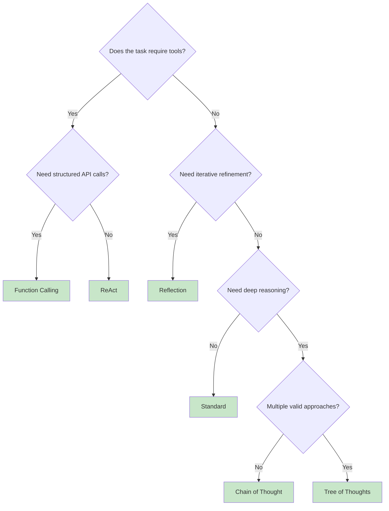
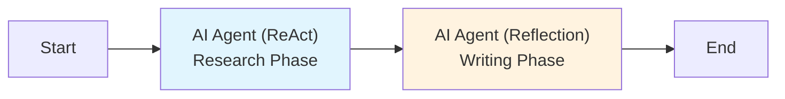

## Overview

The Nadoo AI Agent Node supports **six execution modes** (strategies) that determine how the LLM reasons, uses tools, and refines its output. Choosing the right mode for your task is one of the most impactful decisions you make when building a workflow.

This page helps you understand when to use each mode, how they compare, and how to configure them.

## Quick Comparison

| Mode | Reasoning | Tool Use | Best For | Complexity |
|---|---|---|---|---|
| **Standard** | Single pass | None | Simple Q&A, translation, summarization | Low |
| **Chain of Thought** | Multi-step | None | Math, logic, analysis | Medium |
| **ReAct** | Iterative | Prompt-based | Research, multi-step tasks | Medium-High |
| **Function Calling** | Iterative | Native API | API integration, structured data | Medium |
| **Reflection** | Self-critique loop | None | Content quality, code review | Medium |
| **Tree of Thoughts** | Parallel paths | None | Creative tasks, strategic planning | High |

## Detailed Strategies

<Tabs>
  <Tab title="Standard">
    ## Standard Mode

    The simplest and fastest mode. The LLM receives the prompt and produces a single response with no intermediate reasoning steps or tool calls.

    ### When to Use

    - Simple question answering
    - Content generation (blog posts, emails, summaries)
    - Translation and reformatting
    - Classification and labeling
    - Any task where a single LLM call is sufficient

    ### Configuration

    ```json
    {
      "agent_mode": "standard",
      "model": "gpt-4o",
      "system_prompt": "You are a helpful assistant.",
      "temperature": 0.7,
      "max_tokens": 4096
    }
    ```

    ### Execution Flow

    ```mermaid
    graph LR
        A[User Message] --> B[LLM Call]
        B --> C[Response]

        style B fill:#fff3e0
    ```

    ### Example Use Case

    **Customer greeting bot:** The user says hello, and the agent responds with a friendly greeting and a list of things it can help with. No tools or complex reasoning needed.
  </Tab>
  <Tab title="Chain of Thought">
    ## Chain of Thought Mode

    Forces the LLM to show its reasoning before answering. The model breaks the problem into explicit steps, works through each one, and then produces a final answer.

    ### When to Use

    - Mathematical calculations and word problems
    - Logical reasoning and deduction
    - Decision making with multiple factors
    - Complex analysis requiring step-by-step breakdown

    ### Strategies

    | Strategy | Description | Example Prompt Injection |
    |---|---|---|
    | `step_by_step` | Solve one step at a time | "Let's think step by step..." |
    | `question_breakdown` | Decompose into sub-questions | "Break this into sub-questions..." |
    | `pros_cons` | Evaluate options before deciding | "List the pros and cons..." |
    | `custom` | Your own reasoning template | User-provided template |

    ### Configuration

    ```json
    {
      "agent_mode": "chain_of_thought",
      "model": "gpt-4o",
      "system_prompt": "You are a math tutor. Always show your work.",
      "cot_config": {
        "strategy": "step_by_step",
        "max_steps": 10,
        "show_reasoning": true
      }
    }
    ```

    ### Execution Flow

    ```mermaid
    graph LR
        A[User Message] --> B[Inject Reasoning Instructions]
        B --> C[LLM Generates Steps]
        C --> D[Extract Final Answer]
        D --> E[Response]

        style C fill:#fff3e0
    ```

    ### Example Use Case

    **Financial analysis bot:** A user asks "Should I refinance my mortgage?" The agent breaks this into sub-questions (current rate vs. new rate, closing costs, break-even timeline), works through each calculation, and provides a reasoned recommendation.
  </Tab>
  <Tab title="ReAct">
    ## ReAct Mode

    Implements the **Reasoning + Acting** loop. The LLM thinks about what it needs to do, selects a tool to gather information, observes the result, and repeats until it can provide a final answer.

    ### When to Use

    - Research tasks requiring multiple data sources
    - Multi-step problem solving with real-time data
    - Tasks where the agent needs to adapt its approach based on intermediate results
    - Exploratory queries where the path to the answer is not predetermined

    ### Configuration

    ```json
    {
      "agent_mode": "react",
      "model": "gpt-4o",
      "system_prompt": "You are a research assistant.",
      "react_config": {
        "max_iterations": 5,
        "tools": ["web_search", "calculator", "knowledge_search"],
        "early_stop": true
      }
    }
    ```

    ### Execution Flow

    ```mermaid
    graph TD
        A[User Message] --> B[Thought: What do I need?]
        B --> C[Action: Select Tool]
        C --> D[Execute Tool]
        D --> E[Observation: Tool Result]
        E --> F{Have enough info?}
        F -->|No| B
        F -->|Yes| G[Final Answer]

        style B fill:#e1f5fe
        style C fill:#fff3e0
        style D fill:#fff9c4
        style E fill:#e8f5e9
    ```

    ### Example Use Case

    **Travel research agent:** A user asks "What's the best time to visit Japan for cherry blossoms, and how much would flights cost from New York?" The agent searches for cherry blossom season dates, then searches for flight prices for those dates, and synthesizes the results into a recommendation.
  </Tab>
  <Tab title="Function Calling">
    ## Function Calling Mode

    Uses the LLM's **native function calling API** for structured, type-safe tool execution. The model receives JSON schemas describing available tools and returns structured calls that are executed by the runtime.

    ### When to Use

    - API integrations requiring structured parameters
    - Database queries and data manipulation
    - Any task where tools must be called with exact, validated arguments
    - Workflows that benefit from parallel tool execution

    ### How It Differs from ReAct

    | Aspect | ReAct | Function Calling |
    |---|---|---|
    | Tool selection | Prompt-based (text parsing) | Native API (structured JSON) |
    | Argument format | Free-text, parsed by the runtime | JSON schema-validated |
    | Parallel calls | One tool at a time | Multiple tools in a single turn |
    | Reliability | Depends on prompt adherence | Higher (model-native feature) |

    ### Configuration

    ```json
    {
      "agent_mode": "function_calling",
      "model": "gpt-4o",
      "system_prompt": "You help users manage their tasks.",
      "function_calling_config": {
        "tools": ["create_task", "list_tasks", "update_task", "delete_task"],
        "parallel_tool_calls": true,
        "strict_mode": true,
        "max_iterations": 3
      }
    }
    ```

    ### Execution Flow

    ```mermaid
    graph TD
        A[User Message + Tool Schemas] --> B[LLM Returns Tool Calls]
        B --> C[Execute Tools in Parallel]
        C --> D[Feed Results to LLM]
        D --> E{More tool calls?}
        E -->|Yes| B
        E -->|No| F[Final Text Response]

        style B fill:#fff3e0
        style C fill:#fff9c4
    ```

    ### Example Use Case

    **Project management agent:** A user says "Create a task for the homepage redesign, assign it to Sarah, and set the deadline to next Friday." The agent calls `create_task` with structured arguments `{"title": "Homepage redesign", "assignee": "Sarah", "deadline": "2026-03-13"}`.
  </Tab>
  <Tab title="Reflection">
    ## Reflection Mode

    The LLM generates a response, then **evaluates and critiques its own output** against a set of criteria, and iteratively improves it. This produces noticeably higher quality for tasks where the first draft is rarely good enough.

    ### When to Use

    - Content creation requiring polish (articles, documentation, marketing copy)
    - Code review and improvement
    - Quality assurance where multiple criteria must be met
    - Any task where iterative refinement adds value

    ### Configuration

    ```json
    {
      "agent_mode": "reflection",
      "model": "gpt-4o",
      "system_prompt": "You are an expert technical writer.",
      "reflection_config": {
        "max_reflections": 3,
        "quality_threshold": 0.85,
        "criteria": [
          "accuracy",
          "clarity",
          "completeness",
          "tone"
        ]
      }
    }
    ```

    ### Execution Flow

    ```mermaid
    graph TD
        A[User Message] --> B[Generate Initial Response]
        B --> C[Evaluate Against Criteria]
        C --> D{Score >= Threshold?}
        D -->|No| E[Generate Critique]
        E --> F[Revise Response]
        F --> C
        D -->|Yes| G[Return Final Response]

        style B fill:#fff3e0
        style C fill:#e1f5fe
        style E fill:#ffcdd2
        style F fill:#fff3e0
    ```

    ### Example Use Case

    **Documentation writer:** A user asks the agent to write API documentation for an endpoint. The agent drafts the docs, then evaluates them for accuracy (does the description match the schema?), clarity (is it easy to understand?), completeness (are all parameters documented?), and tone (is it professional?). It revises weak areas until all criteria pass.
  </Tab>
  <Tab title="Tree of Thoughts">
    ## Tree of Thoughts Mode

    Explores **multiple reasoning paths simultaneously**, evaluates each path, prunes unpromising ones, and selects the best result. This is the most computationally expensive mode but produces the best outcomes for problems with multiple valid approaches.

    ### When to Use

    - Creative writing where multiple angles should be explored
    - Strategic planning with competing options
    - Complex problem solving where the optimal approach is not obvious
    - Brainstorming and ideation at scale

    ### Configuration

    ```json
    {
      "agent_mode": "tree_of_thoughts",
      "model": "gpt-4o",
      "system_prompt": "You are a strategic planning advisor.",
      "tot_config": {
        "num_thoughts": 3,
        "depth": 2,
        "evaluation_strategy": "score",
        "pruning_threshold": 0.3
      }
    }
    ```

    ### Configuration Parameters

    | Parameter | Description |
    |---|---|
    | `num_thoughts` | Number of parallel reasoning paths to generate at each level |
    | `depth` | Number of levels to explore in the reasoning tree |
    | `evaluation_strategy` | How to score paths: `score` (numeric rating) or `vote` (pairwise comparison) |
    | `pruning_threshold` | Paths scoring below this fraction of the max score are discarded |

    ### Execution Flow

    ```mermaid
    graph TD
        A[User Message] --> B1[Thought A]
        A --> B2[Thought B]
        A --> B3[Thought C]
        B1 --> C1[Evaluate A]
        B2 --> C2[Evaluate B]
        B3 --> C3[Evaluate C]
        C1 --> D{Prune & Expand}
        C2 --> D
        C3 --> D
        D --> E1[Thought A.1]
        D --> E2[Thought B.1]
        E1 --> F1[Evaluate A.1]
        E2 --> F2[Evaluate B.1]
        F1 --> G[Select Best Path]
        F2 --> G
        G --> H[Final Response]

        style B1 fill:#e1f5fe
        style B2 fill:#e1f5fe
        style B3 fill:#e1f5fe
        style E1 fill:#fff3e0
        style E2 fill:#fff3e0
    ```

    ### Example Use Case

    **Marketing strategy agent:** A user asks "How should we launch our new product?" The agent generates three initial strategies (influencer campaign, content marketing, paid ads), evaluates each on feasibility, cost, and expected ROI, prunes the weakest, then expands the surviving strategies with detailed execution plans before selecting the best overall approach.
  </Tab>
</Tabs>

## Choosing the Right Strategy

Use this decision framework to select the best mode for your task:



### Rules of Thumb

<Info>
  **Start simple.** Begin with Standard mode and upgrade only when you see a clear need. Each additional capability adds latency and token cost.
</Info>

1. **Standard** is the default. Use it unless you have a specific reason to use something else.
2. **Chain of Thought** is free (no extra API calls) and meaningfully improves accuracy on reasoning tasks. Add it early.
3. **Function Calling** is preferred over ReAct when your LLM supports it, because the structured API is more reliable.
4. **ReAct** is best when you need the model to decide its own tool-use strategy dynamically.
5. **Reflection** shines for content quality but doubles or triples token usage. Use it for high-value outputs.
6. **Tree of Thoughts** is the most expensive mode. Reserve it for tasks where exploring multiple approaches yields meaningfully better results.

## Combining Strategies with Workflows

Because each AI Agent Node is independently configured, you can use **different strategies in different nodes** within the same workflow:



In this example:
- The first AI Agent uses **ReAct** to research a topic using search tools
- The second AI Agent uses **Reflection** to write a polished report based on the research

This composability is one of the key strengths of the Nadoo workflow engine.

## Next Steps

<CardGroup cols={2}>
  <Card title="AI Agent Node" icon="robot" href="/workflow/nodes/ai-agent">
    Full configuration reference for all 6 modes
  </Card>
  <Card title="Workflow Engine" icon="diagram-project" href="/workflow/overview">
    Understand the execution model and node lifecycle
  </Card>
  <Card title="Visual Editor" icon="pen-ruler" href="/workflow/visual-editor">
    Build workflows with different strategies in the editor
  </Card>
  <Card title="Knowledge Base" icon="book" href="/knowledge/overview">
    Pair strategies with RAG for grounded responses
  </Card>
</CardGroup>
