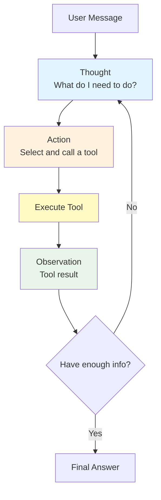
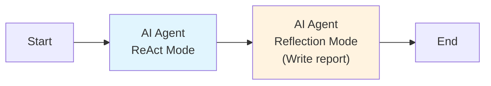

## Overview

**ReAct (Reasoning + Acting)** mode implements an iterative loop where the LLM alternates between reasoning about the problem and taking actions (tool calls) to gather information. After each action, the model observes the result and decides whether to take another action or produce a final answer.

This mode is essential for tasks that require real-time data, multi-step research, or adaptive problem solving where the agent must decide its own strategy based on intermediate results.

## How It Works



<Steps>
  <Step title="Thought">
    The LLM reasons about the current state of the problem. What information is missing? What should it do next? This reasoning is emitted as an `agent_iteration` SSE event.
  </Step>
  <Step title="Action">
    Based on its reasoning, the LLM selects a tool and specifies the arguments. The tool selection is communicated via an `agent_tool_call` SSE event.
  </Step>
  <Step title="Observation">
    The tool executes and returns its result. The result is fed back to the LLM as an observation, emitted as an `agent_tool_result` SSE event.
  </Step>
  <Step title="Iterate or Finish">
    The LLM decides whether it has enough information to answer. If not, it returns to the Thought step. If yes, it produces the final answer.
  </Step>
</Steps>

## Configuration

```json
{
  "type": "ai-agent-node",
  "config": {
    "agent_mode": "react",
    "model": "gpt-4o",
    "system_prompt": "You are a research assistant with access to search and calculation tools. Use them to find accurate, up-to-date information.",
    "react_config": {
      "max_iterations": 5,
      "tools": ["web_search", "calculator", "knowledge_search"],
      "early_stop": true
    },
    "temperature": 0.3,
    "max_tokens": 4096
  }
}
```

| Parameter | Type | Default | Description |
|---|---|---|---|
| `agent_mode` | string | -- | Must be `"react"` |
| `react_config.max_iterations` | number | `10` | Maximum Think-Act-Observe cycles before forced termination |
| `react_config.tools` | string[] | `[]` | List of tool names the agent can use |
| `react_config.early_stop` | boolean | `true` | Allow the agent to stop before `max_iterations` when it has enough info |

## The Think-Act-Observe Loop

Each iteration of the ReAct loop follows a strict format that the LLM is trained to produce:

```
Thought: I need to find the current population of South Korea to answer
this question. Let me search for this information.

Action: web_search
Action Input: {"query": "South Korea population 2026"}

Observation: According to the latest census data, South Korea's population
in 2026 is approximately 51.7 million people...

Thought: Now I have the population data. The user also asked about GDP
per capita, so I need to find that as well.

Action: web_search
Action Input: {"query": "South Korea GDP per capita 2026"}

Observation: South Korea's GDP per capita in 2026 is estimated at
$38,400 USD...

Thought: I now have both pieces of information. I can provide a
comprehensive answer.

Final Answer: South Korea has a population of approximately 51.7 million
and a GDP per capita of $38,400 USD in 2026...
```

## Tools

The `tools` array specifies which tools the agent can use during execution. Tools must be registered in the platform and can include:

| Tool Type | Examples | Description |
|---|---|---|
| Built-in tools | `web_search`, `calculator` | Platform-provided utilities |
| Knowledge search | `knowledge_search` | Search against Nadoo knowledge bases |
| Custom plugins | `my_plugin_tool` | Tools from installed plugins |
| MCP tools | `mcp_server_tool` | Tools from connected MCP servers |

Each tool is described to the LLM with a name, description, and parameter schema. The LLM uses these descriptions to decide which tool to call and what arguments to provide.

```json
{
  "tools": [
    {
      "name": "web_search",
      "description": "Search the web for current information",
      "parameters": {
        "query": {"type": "string", "description": "Search query"}
      }
    },
    {
      "name": "calculator",
      "description": "Perform mathematical calculations",
      "parameters": {
        "expression": {"type": "string", "description": "Math expression to evaluate"}
      }
    }
  ]
}
```

## SSE Events

ReAct mode emits rich streaming events that enable detailed progress tracking:

| Event | When | Payload |
|---|---|---|
| `node_started` | Node begins | `{ node_id }` |
| `agent_iteration` | Each Think step | `{ iteration, thought, node_id }` |
| `agent_tool_call` | Agent selects a tool | `{ tool_name, arguments, iteration, node_id }` |
| `agent_tool_result` | Tool returns result | `{ tool_name, result, iteration, node_id }` |
| `llm_token` | Each token generated | `{ token, node_id }` |
| `llm_finished` | Final answer generated | `{ node_id, total_tokens }` |
| `node_finished` | Node completes | `{ node_id, status, iterations_used }` |

Clients can use these events to display the agent's reasoning process in real time, showing each thought, tool call, and observation as it happens.

## Max Iterations and Early Stop

### max_iterations

The `max_iterations` parameter is a safety limit. When reached:

1. The agent is forced to produce a final answer with whatever information it has gathered
2. The response may include a note that it could not fully complete the research
3. The `node_finished` event includes `iterations_used` for monitoring

### early_stop

When `early_stop` is `true` (default), the agent can terminate the loop at any iteration by producing a "Final Answer" instead of another tool call. This is the normal completion path.

When `early_stop` is `false`, the agent always runs for exactly `max_iterations` cycles. This is rarely needed but can be useful when you want to ensure thorough research regardless of early confidence.

## Example: Research Workflow

A workflow that researches a topic and generates a report:



```json
{
  "agent_mode": "react",
  "model": "gpt-4o",
  "system_prompt": "You are a research analyst. When given a topic, use your tools to gather comprehensive, current information. Search for multiple perspectives and data points.",
  "react_config": {
    "max_iterations": 8,
    "tools": ["web_search", "knowledge_search", "calculator"],
    "early_stop": true
  }
}
```

The ReAct agent gathers information using multiple tool calls, and the downstream Reflection agent writes a polished report based on the research.

## Example: Multi-Source Data Gathering

```
User: What is the environmental impact of electric vehicles compared to
gasoline cars?

Thought 1: I need to research several aspects -- manufacturing impact,
operational emissions, battery lifecycle, and overall lifecycle analysis.
Let me start with lifecycle emissions data.

Action: web_search
Input: {"query": "electric vehicle vs gasoline car lifecycle emissions 2025 study"}

Observation: A 2025 study by the International Council on Clean
Transportation found that EVs produce 50-70% fewer lifecycle emissions...

Thought 2: Good, I have lifecycle data. Now I need information about
battery manufacturing impact specifically.

Action: web_search
Input: {"query": "electric vehicle battery manufacturing environmental impact"}

Observation: Battery manufacturing accounts for approximately 30-40% of
an EV's total manufacturing emissions...

Thought 3: I should also check our internal knowledge base for any
company-specific EV reports.

Action: knowledge_search
Input: {"query": "electric vehicle environmental analysis"}

Observation: [2 results found] Internal report: "EV Sustainability
Metrics Q4 2025"...

Thought 4: I have comprehensive data from multiple sources. I can now
provide a thorough comparison.

Final Answer: [Comprehensive comparison with citations...]
```

## ReAct vs. Function Calling

| Aspect | ReAct | Function Calling |
|---|---|---|
| Tool selection | Prompt-based (text reasoning) | Native API (structured JSON) |
| Reasoning visibility | Explicit thoughts in output | Implicit (model's internal reasoning) |
| Parallel tool calls | One at a time | Multiple per turn |
| Reliability | Depends on prompt adherence | Higher (model-native) |
| Flexibility | Can reason about tool strategy | Follows structured schemas |
| Best for | Exploratory, multi-step research | Structured API calls, data ops |

<Info>
  Use **Function Calling** when your tools have well-defined schemas and you need reliable, structured invocation. Use **ReAct** when you want the agent to reason explicitly about its tool-use strategy and adapt dynamically.
</Info>

## Performance Characteristics

| Metric | ReAct Mode |
|---|---|
| LLM calls per execution | 2-10+ (one per iteration + final answer) |
| Latency | High (multiple round-trips + tool execution time) |
| Token usage | High (accumulates context across iterations) |
| Quality ceiling | Very high for research and multi-step tasks |

## Best Practices

<AccordionGroup>
  <Accordion title="Provide clear tool descriptions">
    The agent selects tools based on their descriptions. Write detailed, unambiguous descriptions that clearly explain what each tool does and when to use it.
  </Accordion>
  <Accordion title="Set conservative max_iterations">
    Start with 3-5 iterations and increase only if needed. Each iteration adds latency and cost. Most tasks can be solved in 3-5 rounds.
  </Accordion>
  <Accordion title="Use a capable model">
    ReAct requires the model to reason about tool use and interpret results. Use a strong model (GPT-4o, Claude Sonnet 4) for best results. Smaller models may struggle with the reasoning format.
  </Accordion>
  <Accordion title="Include a knowledge_search tool for RAG">
    If your workflow has knowledge bases, include `knowledge_search` as a tool so the agent can retrieve information dynamically based on its reasoning.
  </Accordion>
  <Accordion title="Monitor iteration counts">
    Track how many iterations your ReAct agents typically use. If they consistently hit `max_iterations`, the task may be too complex or the tools may need better descriptions.
  </Accordion>
</AccordionGroup>

## Next Steps

<CardGroup cols={2}>
  <Card title="Standard Mode" icon="bolt" href="/workflow/strategies/standard">
    The simplest mode for comparison
  </Card>
  <Card title="Chain of Thought" icon="list-ol" href="/workflow/strategies/chain-of-thought">
    Step-by-step reasoning without tools
  </Card>
  <Card title="Reflection Mode" icon="rotate" href="/workflow/strategies/reflection">
    Self-critique for quality improvement
  </Card>
  <Card title="Tree of Thoughts" icon="network-wired" href="/workflow/strategies/tree-of-thoughts">
    Parallel exploration of multiple reasoning paths
  </Card>
</CardGroup>
