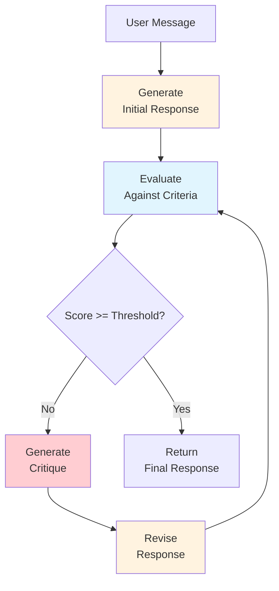
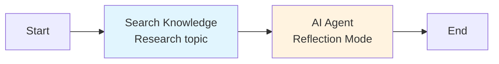

## Overview

**Reflection Mode** implements a self-critique loop where the LLM generates a response, evaluates it against configurable quality criteria, and iteratively revises it until it meets a quality threshold or reaches the maximum number of reflection cycles.

This mode is designed for tasks where the first draft is rarely good enough -- content creation, code generation, technical writing, and any output that benefits from systematic review and revision.

## How It Works



<Steps>
  <Step title="Generate">
    The LLM produces an initial response based on the system prompt and user message.
  </Step>
  <Step title="Reflect">
    The response is evaluated against each configured criterion (accuracy, completeness, clarity, etc.). The LLM assigns a score and identifies specific weaknesses.
  </Step>
  <Step title="Decide">
    If the overall quality score meets or exceeds `quality_threshold`, the response is accepted. Otherwise, the cycle continues.
  </Step>
  <Step title="Revise">
    The LLM generates a targeted critique highlighting what needs improvement, then produces a revised response that addresses the identified issues.
  </Step>
  <Step title="Repeat">
    Steps 2-4 repeat until the quality threshold is met or `max_reflections` is reached.
  </Step>
</Steps>

## Configuration

```json
{
  "type": "ai-agent-node",
  "config": {
    "agent_mode": "reflection",
    "model": "gpt-4o",
    "system_prompt": "You are an expert technical writer. Write clear, accurate, and comprehensive documentation.",
    "reflection_config": {
      "max_reflections": 3,
      "quality_threshold": 0.8,
      "criteria": [
        "accuracy",
        "completeness",
        "clarity"
      ]
    },
    "temperature": 0.5,
    "max_tokens": 8192
  }
}
```

| Parameter | Type | Default | Description |
|---|---|---|---|
| `agent_mode` | string | -- | Must be `"reflection"` |
| `reflection_config.max_reflections` | number | `3` | Maximum reflection-revision cycles |
| `reflection_config.quality_threshold` | float | `0.8` | Score (0.0-1.0) required to accept the response |
| `reflection_config.criteria` | string[] | `["accuracy", "completeness", "clarity"]` | Evaluation criteria for self-critique |

## Evaluation Criteria

The `criteria` array defines what the LLM evaluates during each reflection cycle. Each criterion is scored from 0.0 to 1.0, and the overall quality score is the average across all criteria.

### Built-in Criteria

| Criterion | What It Evaluates |
|---|---|
| `accuracy` | Are the facts, data, and claims correct? |
| `completeness` | Does the response fully address the user's question? |
| `clarity` | Is the response easy to understand and well-organized? |
| `conciseness` | Is the response free of unnecessary repetition or filler? |
| `tone` | Does the tone match the intended audience and context? |
| `formatting` | Is the output properly formatted (headings, lists, code blocks)? |
| `relevance` | Does every part of the response relate to the question? |

### Custom Criteria

You can include custom criteria strings alongside the built-in ones. The LLM will interpret them and incorporate them into its evaluation:

```json
{
  "criteria": [
    "accuracy",
    "completeness",
    "Uses professional but approachable tone",
    "Includes at least one concrete example for each concept",
    "All code samples are syntactically correct and runnable"
  ]
}
```

## Quality Threshold

The `quality_threshold` parameter controls when the reflection loop terminates:

| Threshold | Behavior |
|---|---|
| `0.6` | Lenient -- accepts responses after minimal revision |
| `0.8` | Balanced -- good default for most use cases |
| `0.9` | Strict -- pushes for near-perfect output, may use all reflection cycles |
| `1.0` | Maximum -- will always use all `max_reflections` (score of 1.0 is very hard to achieve) |

<Info>
  Setting `quality_threshold` too high (above 0.9) may cause the agent to use all reflection cycles without meaningful improvement in later iterations. A threshold of 0.8 typically strikes the right balance between quality and efficiency.
</Info>

## SSE Events

Reflection mode emits these events during execution:

| Event | When | Payload |
|---|---|---|
| `node_started` | Node begins | `{ node_id }` |
| `llm_token` | Each token generated | `{ token, node_id }` |
| `agent_reflection` | Each reflection cycle | `{ cycle, scores, critique, overall_score, node_id }` |
| `llm_finished` | Final response generated | `{ node_id, total_tokens }` |
| `node_finished` | Node completes | `{ node_id, status, reflections_used }` |

The `agent_reflection` event is unique to Reflection mode. It provides real-time visibility into the self-critique process:

```json
{
  "event": "agent_reflection",
  "data": {
    "cycle": 1,
    "scores": {
      "accuracy": 0.9,
      "completeness": 0.6,
      "clarity": 0.8
    },
    "overall_score": 0.77,
    "critique": "The response covers the basic concepts but lacks detail on error handling and edge cases. The introduction could be more concise.",
    "node_id": "agent_1"
  }
}
```

## The Reflection Cycle in Detail

### Cycle 1: Initial Generation + First Reflection

```
[Generation]
Here is the API documentation for the /users endpoint...

[Reflection - Cycle 1]
Scores: accuracy=0.9, completeness=0.6, clarity=0.8
Overall: 0.77 (below threshold 0.8)

Critique: The documentation is accurate but incomplete. Missing:
- Error response codes and examples
- Rate limiting information
- Authentication requirements
The introduction is also longer than necessary.
```

### Cycle 2: Revision + Second Reflection

```
[Revision based on critique]
Here is the revised API documentation with error codes,
rate limits, and auth requirements...

[Reflection - Cycle 2]
Scores: accuracy=0.9, completeness=0.85, clarity=0.85
Overall: 0.87 (meets threshold 0.8)

Response accepted.
```

## Example: Content Creation Workflow

A workflow that generates polished blog posts:



```json
{
  "agent_mode": "reflection",
  "model": "gpt-4o",
  "system_prompt": "You are a senior content writer. Write engaging, well-structured blog posts with clear headings, practical examples, and a compelling introduction.",
  "reflection_config": {
    "max_reflections": 3,
    "quality_threshold": 0.85,
    "criteria": [
      "accuracy",
      "completeness",
      "clarity",
      "Engaging and conversational tone",
      "Includes practical examples and actionable advice",
      "Strong opening hook and clear conclusion"
    ]
  },
  "temperature": 0.7,
  "max_tokens": 8192
}
```

## Example: Code Review Workflow

Use Reflection mode to review and improve generated code:

```json
{
  "agent_mode": "reflection",
  "model": "gpt-4o",
  "system_prompt": "You are a senior software engineer. Generate clean, well-documented, production-ready code.",
  "reflection_config": {
    "max_reflections": 2,
    "quality_threshold": 0.85,
    "criteria": [
      "Code is syntactically correct and runnable",
      "Proper error handling for all edge cases",
      "Clear variable names and comments",
      "Follows best practices for the language",
      "Includes input validation"
    ]
  },
  "temperature": 0.2
}
```

## Performance Characteristics

| Metric | Reflection Mode |
|---|---|
| LLM calls per execution | 2-7 (generation + 1-3 reflect/revise pairs) |
| Latency | Moderate-High (multiple generation rounds) |
| Token usage | 2-4x Standard (each reflection cycle is an additional generation) |
| Quality improvement | High for content and writing tasks |

### Cost-Quality Tradeoff

```
Standard:     1 LLM call  ───── ████████░░ Quality
Reflection×1: 3 LLM calls ───── █████████░ Quality
Reflection×2: 5 LLM calls ───── ██████████ Quality
Reflection×3: 7 LLM calls ───── ██████████ Quality (diminishing returns)
```

Most quality improvement happens in the first 1-2 reflection cycles. The third cycle typically yields marginal gains. Setting `max_reflections: 2` is often the sweet spot for cost-effectiveness.

## Best Practices

<AccordionGroup>
  <Accordion title="Use specific, measurable criteria">
    Vague criteria like "good quality" produce vague evaluations. Use specific criteria: "All dates are in ISO 8601 format" is better than "dates are formatted correctly."
  </Accordion>
  <Accordion title="Start with 2 max_reflections">
    Two reflection cycles are usually sufficient. The first cycle catches major issues, and the second refines details. Add a third only if you consistently see improvement in cycle 3.
  </Accordion>
  <Accordion title="Set quality_threshold to 0.8">
    This is the recommended starting point. Adjust based on observed output quality -- if the first generation consistently scores above 0.8, you do not need Reflection mode for that task.
  </Accordion>
  <Accordion title="Pair with Research Nodes for grounded content">
    Reflection mode improves the form of the response (clarity, completeness, tone), but it cannot fix missing information. Use Search Knowledge or ReAct upstream to gather the facts, then use Reflection to polish the output.
  </Accordion>
  <Accordion title="Monitor reflection events for optimization">
    Track the `agent_reflection` events to see which criteria consistently score low. This can inform system prompt improvements that reduce the need for reflection.
  </Accordion>
</AccordionGroup>

## Next Steps

<CardGroup cols={2}>
  <Card title="Standard Mode" icon="bolt" href="/workflow/strategies/standard">
    The baseline mode without self-critique
  </Card>
  <Card title="Chain of Thought" icon="list-ol" href="/workflow/strategies/chain-of-thought">
    Step-by-step reasoning for accuracy
  </Card>
  <Card title="Tree of Thoughts" icon="network-wired" href="/workflow/strategies/tree-of-thoughts">
    Parallel reasoning path exploration
  </Card>
  <Card title="Strategies Overview" icon="lightbulb" href="/workflow/strategies/overview">
    Compare all 6 execution modes
  </Card>
</CardGroup>
